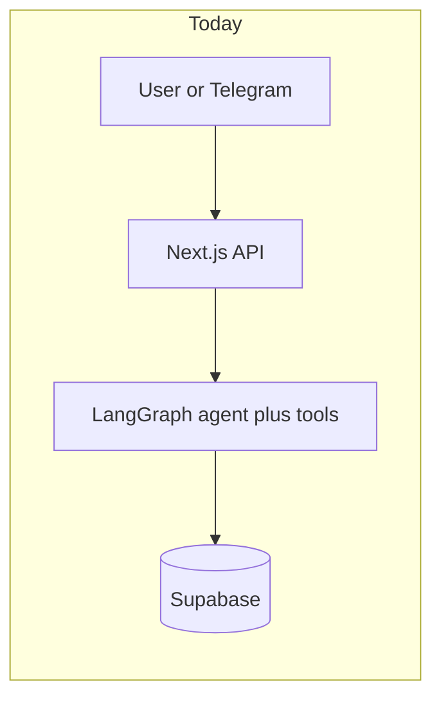
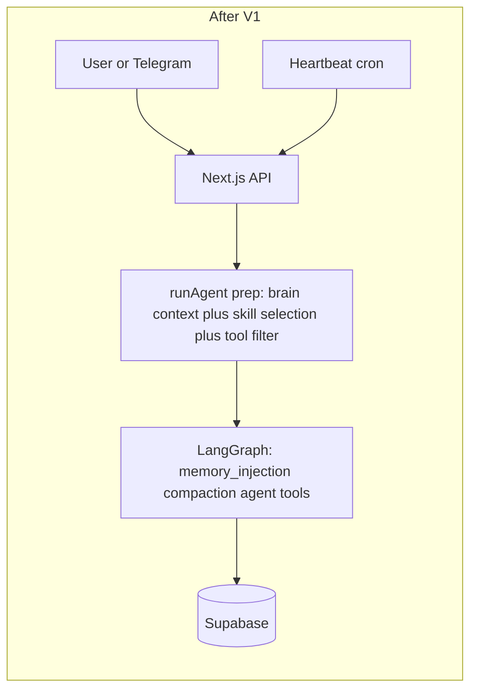

# Business Brain evolution roadmap

Canonical roadmap for evolving the assistant (Skills, Heartbeat, Business Brain) on the existing stack. A Cursor plan export may also exist under `.cursor/plans/`.

*This document is both a **business narrative** (why and what) and a **technical delivery plan** (how, where in the code). The same assistant your team uses today on web and Telegram stays in place: we extend it.*

---

## Implementation backlog (summary)

| Phase | Focus |
|-------|--------|
| **V1-A** | Skill **directory** model (`SKILL.md` + optional `references/`, `assets/`); Anthropic-style frontmatter (name regex, `description` with “what + when”, body ≤ 5k tokens); composite `includes` opt-in; `scope` (business / personal / shared) |
| **V1-B** | **Pre-graph skill selection in `runAgent`** (no new graph node); inject playbook into `effectiveSystemPrompt`; pre-filter `lcTools` before `bindTools`; `none` path is first-class; BigQuery atomic tool + `company-data` skill |
| **V1-C** | `business_brain` JSONB with **named slots** (identity / voice / context / operating_rules / heartbeat / bigquery); Heartbeat config (`enabled`, `interval_minutes` default 30, optional `model_id`); per-account checklist markdown; bundled default for lazy seeding |
| **V1-D** | Add `'heartbeat'` to `agent_sessions.channel` CHECK; `heartbeat_runs` table; `POST /api/cron/heartbeat`; `runAgent({ channel: 'heartbeat' })` with cheap LLM (`HEARTBEAT_MODEL_ID`, e.g. MiniMax) and read-only allowlist; per-tick session row; no memory flush |
| **V1-E** | Settings: skill toggles (`user_skill_settings`), Heartbeat UI, digest history |
| **V2** | `account_skills` versioning, draft/active, admin UI + test harness |
| **V3** | `organizations` + memberships + RLS; optional router/subagents |

---

## V1 design decisions (locked-in defaults)

These are decisions taken after a final repo + best-practices review. Each has a one-line rationale; deviating later is fine, but V1-A starts under these defaults.

| Decision | Default for V1 | Why |
|----------|---------------|-----|
| **Skill selection placement** | **Pre-graph**, inside `runAgent`, alongside the existing `effectiveSystemPrompt` build. **No new LangGraph node.** | `runAgent` already calls `buildLangChainTools` and `model.bindTools(lcTools)` **before** the graph compiles ([`packages/agent/src/graph.ts`](../packages/agent/src/graph.ts) ~L502). Filtering tools post-bind is invasive; selecting pre-graph keeps the change small, lets us pre-filter `lcTools`, and pre-append the playbook into the initial `SystemMessage`. The `agent ↔ tools` loop stays untouched. |
| **Channel as canonical dispatch** | Add `'heartbeat'` to `agent_sessions.channel` CHECK; gate memory injection / flush / model selection on `state.channel`, not on `autoApproveTools`. | `autoApproveTools` should mean only “skip HITL because user pre-approved at scheduling time” — overloading it for cron-vs-interactive logic is fragile. The DB already has a `channel` column; reuse it. |
| **Skill contract** | Anthropic Skills convention: directory `skills/global/<slug>/`, frontmatter (`name`, `description`, optional `scope`, `allowed_tools`, `includes`), body **≤ 500 lines / ≤ 5k tokens**, optional `references/` and `assets/`. | Aligns with [Anthropic Skills overview](https://platform.claude.com/docs/en/agents-and-tools/agent-skills/overview) and [best practices](https://agentskills.io/skill-creation/best-practices). Keeps room for progressive disclosure later (extra `.md` files the agent can read on demand) without changing the contract. |
| **Scripts in skills** | **Not supported in V1.** Optional `scripts/` directory is reserved for **V2+** when we have a sandbox. | Anthropic loads only script *output* into context via a code-execution sandbox we don’t have today. Allowing executable code from skill folders in V1 is a security risk and out of scope. |
| **Composite skills (`includes`)** | Supported but **opt-in**; default authoring style is one **coherent** SKILL.md per task. | Anthropic explicitly warns against narrow skills that compose into bigger ones (overhead + conflicting instructions). `morning-operations`-style aggregation stays valid as the exception, not the rule. |
| **Selector model** | Same family as the compaction model (Haiku via OpenRouter); env override `SKILL_SELECTOR_MODEL_ID` if needed. | Avoids adding a third model dependency in V1. Selection only sees `name + description`, so a small model is enough. |
| **Heartbeat model** | Cheap LLM via env `HEARTBEAT_MODEL_ID` (default a MiniMax-class slug); independent from selector and compaction models. | Low marginal cost is the whole point of cheap-model heartbeat. |
| **Heartbeat session lifecycle** | **One `agent_sessions` row per tick** with `channel='heartbeat'`. Mirrors how cron creates per-task sessions. | Clean audit trail; trivial to query latest run; no lifetime management. |
| **Heartbeat output** | Always written to `heartbeat_runs.payload`. **Telegram digest is optional** (only sent if user has Telegram linked). UI shows the same data from `heartbeat_runs`. | Many users won’t have Telegram; UI must be self-sufficient. |
| **Default checklist seeding** | **Lazy on “Enable Heartbeat”** in Settings (copy `heartbeat/default-checklist.md` content into the user’s `business_brain.heartbeat.checklist_markdown`). No blanket migration. | Opt-in, no migration churn, easy to re-seed via “Reset to default”. |
| **BigQuery auth** | **Single platform service account** (env-mounted credentials) **+ per-account `business_brain.bigquery.{ project_id, dataset_allowlist }`**. Read-only role; `bigquery_run_query` validates SQL is `SELECT`. | Simplest viable V1. If your security model needs per-customer SA isolation, switch to “per-account SA JSON in `user_integrations`” without changing tool surface. The skill stays the same. |
| **Skills toggles UI** | All global skills **enabled by default** in V1; toggles in Settings (`user_skill_settings`) ship in **V1-E**. | Lets V1-A → V1-D land without UI dependency; toggles arrive while the engine is in production. |

If any of these defaults conflict with constraints we haven’t surfaced (security review, GCP topology, model availability, etc.), call them out before V1-A starts so we update this section.

---

## Clarifications — Heartbeat vs tasks, BigQuery, UI, skills toggles, composite skills

### 1) Heartbeat is not only “briefings”: checklist (e.g. HEARTBEAT.md) and relation to `schedule_task`

**Yes — we intend Heartbeat to be a general periodic runner** guided by a **checklist** (same *role* as OpenClaw’s **`HEARTBEAT.md`**), not a single hard-coded “morning briefing” feature.

- **Checklist content:** Markdown describing **what to review each tick** for **that account**: e.g. (a) summarize calendar for today, (b) flag stale leads *if* data available, (c) unanswered messages, (d) operational digest. **“Daily briefing” is one item among many.** See **“Where the Heartbeat checklist lives”** below: in this product the **live** checklist is **per user in Supabase**, not a single shared workspace file.
- **How it runs (V1):** Typically **one `runAgent` invocation per account per tick** with the **full checklist** injected into the system context (plus org context), so the model can work through items within the same run (multi-step tool use inside the existing agent loop). If a future item needs isolation, you can split into multiple runs—product decision later.

**How this differs from `schedule_task` / `scheduled_tasks` (complementary, not duplicate):**

| | **User `schedule_task`** | **Heartbeat** |
|--|--------------------------|---------------|
| **Who owns it** | User (or assistant with user confirmation when scheduling) | **Product/system** policy + checklist file |
| **What is stored** | A **stored prompt** per row in `scheduled_tasks` | **Per-account checklist** (markdown) **+ schedule flags** in **`profiles`/JSONB**; **run logs** in `heartbeat_runs` |
| **Purpose** | “Run **this exact instruction** at this time” (e.g. fetch HN every Monday) | “Every day at 8:00, work through the **standard review checklist** for this business” |
| **Safety default** | User already confirmed scheduling; inner run may use `autoApproveTools` | V1 remains **draft / read-heavy**; strict tool allowlist; **no** auto-contact clients or silent writes |
| **Infrastructure** | `POST /api/cron/scheduled-tasks` | `POST /api/cron/heartbeat` (same **secret + cron** pattern; different handler and tables) |

They are **complementary:** scheduled tasks are great for **user-initiated automations**; Heartbeat is for **consistent operational rhythm** from a shared playbook. Both may call `runAgent`; they should not share one row type, or you lose clear semantics and auditing.

#### Where the Heartbeat checklist should live (multi-user product)

OpenClaw’s **`HEARTBEAT.md` in the agent workspace** fits a **single-tenant or per-machine** setup. This product is **multi-user**: each `profiles` row is a separate customer, so **one file in the repo cannot be their per-account checklist at runtime**.

**Recommendation (V1):**

| Layer | Role |
|-------|------|
| **Supabase (source of truth)** | Each account stores its own checklist as **markdown text**, e.g. `profiles.heartbeat_checklist` **or** `business_brain->heartbeat->checklist_markdown` (pick one shape and document it). RLS already scopes by `user_id`. |
| **Bundled default (optional, not shared state)** | A **`heartbeat/default-checklist.md`** (or similar) **in the repo** is only a **template**: used to **seed** the DB on first “Enable Heartbeat” / “Reset to default”, or copied in a migration for new profiles. At **run time**, the cron handler **always reads checklist + schedule flags from the DB** for that `user_id`. |
| **UI** | Settings screen edits the **same** field the cron uses—no drift between “file on disk” and production data. |

**Why DB-first:** personalization per agency, auditing, no deploy to change one copy’s checklist, matches how **`scheduled_tasks`** already store **per-user** prompts.

The name **“HEARTBEAT.md”** remains useful as a **format/concept** (markdown checklist), not as “the literal single file all users share.”

---

### 2) BigQuery: atomic tools vs multi-step “company data” skill

**Your mental model matches ours.**

- **Tools (atomic):** Keep the **catalog small** — e.g. one primary **`bigquery_run_query`** (and only add helpers like listing datasets/tables if truly needed). Tools are dumb, safe-boundary execution units.
- **Skills (playbooks):** A **“company data” / “answer with warehouse”** skill holds the **procedure**: when to prefer BigQuery vs other sources, how to validate SQL, how to present results, guardrails, multi-step flows (explore schema → run query → summarize).  
- **Simple user request:** The same skill is selected; the model may issue **one** BigQuery tool call and answer. **Complex request:** Same skill; model uses **several** tool rounds (BigQuery + calendar + `get_user_preferences`, etc.) as allowed by **`allowed_tools` on that skill**.  
You do **not** need separate “micro-skills” for every query shape—**one data skill** with a rich procedure is enough for V1; split later only if selection quality suffers.

**Ordering:** BigQuery is a **priority early skill** (together with minimal OAuth/service account integration in `user_integrations` or env—implementation detail to design with your GCP setup).

---

### 3) Web UI — configure and visualize

**Yes, it should land in the product—not only in the database.**

Suggested **staged** UI:

| When | What |
|------|------|
| **V1-C** | Extend **Settings** with **Business Brain** fields (org context, tone, markets) — already in plan. |
| **V1-D / V1-E** | **Heartbeat:** toggle on/off, **time window** (or cron expression), **checklist markdown** editor. **History:** list recent **`heartbeat_runs`** (date, status, short summary) — detail view or modal. |
| **With Skills toggles** | See (4) below. |

Pure **Supabase dashboard** editing is acceptable only for **pilot/dev**; the plan assumes **settings in `apps/web`** for operators.

---

### 4) Skills selected and enabled in the UI like tools?

**Recommended: mirror the tools pattern for consistency and safety.**

- **Registry:** All **global** skills ship in the repo; metadata is always known server-side.
- **Per account:** Add **`user_skill_settings`** (or equivalent)—`user_id`, `skill_id`, `enabled`, optional `config_json`—analogous to [`user_tool_settings`](../packages/db/supabase/migrations/00001_initial_schema.sql).  
- **Enforcement:** At skill-selection and tool-build time, only **enabled** skills are candidates; intersect with tool allowlist as today.  
- **V1 nuance:** Implementation can ship **all global skills enabled by default** (no UI) for speed, then add **toggles in Settings** in the same release train once stable—plan lists **V1-E** for UI.

---

### 5) Composite skills (integrate atomic skills)

**Yes — plan explicitly supports composite playbooks.**

- **Atomic skill:** One focused procedure + `allowed_tools` subset (e.g. “BigQuery query discipline”).  
- **Composite skill:** Aggregates multiple atomic playbooks **without** a second agent. Options (can combine):  
  - **Frontmatter `includes: [slug-a, slug-b]`** — loader merges bodies **in order** and **unions** `allowed_tools` (with dedupe and a **max token** cap); **detect cycles** in metadata.  
  - **Single markdown file** with sections that *reference* named procedures (purely textual, no automatic include).  
- **Runtime:** Still **one skill selection** → one injected context block (expanded composite); the **primary agent** and **one tool loop** orchestrate steps—**not** “skill A calls skill B” as separate LangGraph nodes in V1.

---

### 6) “Global” vs user-specific (company) skills

**Yes — that is exactly how we use the terms.**

| Kind | Meaning in this roadmap | Where it lives (typical) |
|------|-------------------------|---------------------------|
| **Global (standard / system)** | Playbooks **shipped with the product**, same catalog for every deployment—maintained by you (engineering), versioned in **Git** (`skills/global/.../SKILL.md`). Every account *can* use them subject to **toggles** and **tool** access. | Repo files; metadata loaded at startup |
| **Account / company skills** | Playbooks **specific to one business** (`user_id` ≈ company today). **V2+:** stored in Supabase (`account_skills` or equivalent), draft/active, edited in UI. **V1:** only global repo skills + **toggles** per account; company-specific text can temporarily live in `business_brain` prose or custom sections until DB skills ship. |

So: **“global” = standard system skills**; **“user-specific / company-specific” = that organization’s custom playbooks**, which in V1 are limited (Brain fields + optional markdown in profile) and expand in **V2** with full CRUD and versioning.

---

### 7) No-skill / direct-tool path is first-class

**Yes — when no skill applies, none is loaded and the agent simply uses the user’s already-enabled tools, including atomic BigQuery, calendar, files, etc.**

- **Selection contract:** the pre-graph `selectSkillForTurn(...)` step returns **one of**: `{ active: SkillId(s) }` **or** `{ active: none }`. `none` is the **default** when nothing matches with confidence.
- **Effect on context:** On `none`, **no playbook block is appended**. The first `SystemMessage` keeps `[MEMORIA…]` (if any) + base `effectiveSystemPrompt` only. Token budget is preserved.
- **Effect on tools:** On `none`, **`buildLangChainTools` does NOT narrow** the toolset; it uses today’s rules (user-enabled ∩ integrations ∩ env). So a one-shot `bigquery_run_query`, `calendar_list_events`, `read_file`, etc. work without a skill.
- **When to prefer a skill vs no-skill:**
  - **Skill** when the request needs **multi-step procedure**, **guardrails**, **specific output shape**, or **discipline** the model would not consistently apply (e.g. SQL validation, report structure).
  - **No skill** for **single-tool** lookups (one BigQuery query, one calendar list), pure conversation, simple Q&A, format tweaks.
- **Heartbeat:** Same rule — heartbeat may **opt out of selection** entirely (the checklist is the procedure) or hard-pin a single `heartbeat` skill.

**Implementation note for V1-B (B4):** the “intersect with `allowed_tools`” rule applies **only when a skill is active**. The `none` branch is a **pass-through** to current behavior.

---

### 8) Skills cover **business AND personal** life

**Real estate professionals (and similar roles) need help with both their work and their personal life.** The system already supports the personal layer (calendar, scheduled tasks, memory, files), so Skills must be designed for **both** from day one — not only “company” playbooks.

- **Scope field on each skill:** `SKILL.md` frontmatter adds **`scope: business | personal | shared`** (default `shared`). It is **descriptive** (filtering, UI grouping, analytics) — it does **not** route or hard-gate selection by itself; the selector reads `description` as today.
- **Balanced default catalog (V1-B):** ship a mix, e.g.
  - **Business:** `company-data` (BigQuery), `lead-follow-up-draft`, `listing-summary`, `client-meeting-prep`.
  - **Personal:** `personal-day-briefing`, `errand-planner`, `family-reminders`, `travel-prep`.
  - **Shared:** `daily-briefing` (mixes both buckets), `summarize-thread`, `compose-message`.
- **Per-account toggles (V1-E):** Settings groups skills by **scope**; users can disable e.g. all `personal` if they only want a work assistant, or vice versa.
- **Heartbeat default checklist:** seed example mixes both — e.g. *“2 client follow-ups due, today’s calendar (work + personal), errands due, expense receipts to file”*. Users edit freely.
- **Memory:** the existing long-term memory pipeline already extracts personal facts (preferences, family, contacts) into `memories` — no change required; personal skills consume that data the same way business skills do.
- **Framing:** “Business Brain” is the **umbrella** for everything the user needs from their assistant — including personal life. The brand stays; the scope is wider than the agency entity.

**Doc-wide convention:** prefer “**user / account**” when describing whose data flows through the system; reserve “**business / agency / company**” for sections that are explicitly about the professional/business slice.

---

## For business readers — why this matters

**Where we are today:** You have a capable **personal/work assistant** — chat on the web, optional Telegram, connection to calendar and other tools, human confirmation for sensitive actions, and memory of durable preferences. Each **login account** is separate, with its own settings. For many real estate businesses, **one account = one agency** is enough for a first release.

**Where we want to go:** Each user should have an AI **Business Brain** (umbrella for **work + personal**): structured context, **repeatable playbooks (Skills)** spanning **business and personal life**—including **data warehouse** workflows—plus a **scheduled checklist (Heartbeat)** that reviews what matters (briefings are **one part** of that list), all without rebuilding the product.

**Why not start from scratch:** The stack already handles security, separation, tools, approvals, and scheduling. This roadmap is **evolution**.

**What changes (high level):**

- **User/account context** on the profile (org or personal info, voice, markets, operating notes).
- **Skills** — global first, per-account toggles; **composite** playbooks supported; **business + personal** scopes.
- **Atomic BigQuery tools** + a **company-data skill** for one-shot and multi-step analyses; **simple requests bypass skills** and call tools directly.
- **Heartbeat** checklist **stored per account in Supabase** (markdown, same *idea* as OpenClaw’s HEARTBEAT.md); covers **work and personal** review items; **separate** from user **`schedule_task`** but similar cron plumbing.
- **Settings UI** for Brain fields, Heartbeat, skill toggles (grouped by scope), and run history (staged).

**What stays the same in V1:** Same chat and Telegram, same primary agent, HITL, per-account isolation until V3 shared workspace.

**Stakeholder one-liner:** *Each user gets an AI assistant that knows how they work and live—business and personal playbooks, warehouse data, and a scheduled review—without silent risky actions in v1.*

---

## Glossary (one line each)

| Term | In plain language |
|------|-------------------|
| **Business Brain** | Umbrella for everything one user needs from their assistant — **work and personal**: context + playbooks + memory + periodic checklist. The brand stays even when the content is personal. |
| **Skill** | A named playbook (optional **composite**); loaded **on demand**; limits which **tools** apply when active. Has a **`scope`** (business / personal / shared). |
| **Skill scope** | Descriptive label on each `SKILL.md`: `business`, `personal`, or `shared`. Used for **filtering and UI grouping**, not as a hard router. |
| **No-skill turn** | A turn where the pre-graph selection step returns **`none`**: no playbook is appended, the agent uses today’s tool rules. Best for one-shot tool uses (single BigQuery query, calendar lookup, chitchat). |
| **Heartbeat** | **System** schedule that runs through **this account’s checklist** (markdown in DB); outputs digests; **not** the same as user `schedule_task`. |
| **Heartbeat checklist (concept)** | Same role as OpenClaw’s **`HEARTBEAT.md`**: periodic review items (briefing, leads, inbox, …); **here it is per-user data in Supabase**, not one workspace file for all. |
| **Global skill** | **Standard** playbook shipped in the repo for all customers (with per-account enable/disable). |
| **Account / company skill** | **Custom** playbook for one business; **V2+** in DB; V1 = Brain text + global skills only. |
| **LangGraph** | Existing orchestration for the agent loop; **its topology stays unchanged in V1**. We add a pre-graph step in `runAgent` for skill selection. |
| **Pre-graph** | Code that runs in `runAgent` **before** the LangGraph compiles (system-prompt build, tool listing, model binding). V1 puts skill selection here. |
| **Tool** | Atomic capability (e.g. **one BigQuery execute**); small catalog, composed by skills. |
| **Account (V1)** | **`profiles.id`** = one login ≈ one agency until shared workspace exists. |

---

## How this sits on the current system (integration picture)

**Today:** User or Telegram → **Next.js** → **LangGraph** (memory, compaction, agent, tools) → **Supabase** + APIs.

**After roadmap:** Same path, plus a **pre-graph skill selection step inside `runAgent`** (alongside the existing system-prompt build) that picks a playbook, appends it to `effectiveSystemPrompt`, and pre-filters `lcTools` before `bindTools`. The graph topology itself does **not** change. A **parallel** Heartbeat cron path runs `runAgent({ channel: 'heartbeat' })` against each due account → `heartbeat_runs` (+ UI).





**Inside `runAgent` (V1):** the LangGraph topology is **unchanged from today**. The new logic is a **pre-graph step** before `bindTools`:

```mermaid
flowchart TB
  enter[runAgent called] --> ctxLoad[Load profile plus business_brain]
  ctxLoad --> skillSel["Skill selection (cheap LLM or none)"]
  skillSel --> sysBuild[Append playbook to effectiveSystemPrompt]
  skillSel --> toolFilter[Filter lcTools by allowed_tools]
  sysBuild --> bind[model.bindTools]
  toolFilter --> bind
  bind --> graph[LangGraph compile and invoke]

  subgraph graphBox [LangGraph topology unchanged]
    direction TB
    s[__start__] --> mem[memory_injection]
    mem --> comp[compaction]
    comp --> ag[agent]
    ag -->|has_tool_calls| tl[tools]
    ag -->|no_tools| e[__end__]
    tl --> comp
  end

  graph --> graphBox
```

| Step / Node | Role |
|-------------|------|
| **Pre-graph: brain context load** | Read `profiles.business_brain` (V1-C) into a structured block appended to `effectiveSystemPrompt`. |
| **Pre-graph: skill selection** | Cheap LLM (or heuristic) returns `{ skillId }` or `none`, scoped to skills enabled for this account. **Skipped on resume**; optional skip on `channel='heartbeat'`. |
| **Pre-graph: playbook injection** | If a skill is active, append its body to `effectiveSystemPrompt` (between base prompt and addendums). On `none`, no append. |
| **Pre-graph: tool filter** | If a skill is active, intersect `allowed_tools` with the existing `isToolAvailable()` rules in [`packages/agent/src/tools/adapters.ts`](../packages/agent/src/tools/adapters.ts). On `none`, pass through. |
| `memory_injection` | Long-term memory retrieval into first `SystemMessage` (skipped for `channel ∈ { cron, heartbeat }` and on resume). |
| `compaction` | Short-term window: micro-compact + optional LLM summary. |
| `agent` | Main LLM call(s). |
| `tools` | Execute tool calls; return to `compaction`. |

---

## Terminology — multi-user vs shared workspace

The application is **already multi-user**. V1 continues **one profile = one business account**. **Shared workspace** (V3) adds org membership and shared resources.

---

## V1 — product scope

| In scope for V1 | Deferred |
|-----------------|----------|
| **Skills** — **global** (standard) + per-account toggles; **scopes**: business / personal / shared; **company custom** skills in **V2** | DB-authored custom skills in V2 |
| **No-skill turns** — direct tool use (e.g. one BigQuery query) without a playbook | Forcing a skill on every turn |
| **BigQuery** minimal tool(s) + **company-data** skill | Extra warehouse connectors beyond BQ |
| **Per-account Heartbeat checklist** in **Supabase** + `heartbeat_runs`; cron route | Heartbeat actions without approval (later) |
| **Distinct from** `scheduled_tasks` | Merging Heartbeat rows into `scheduled_tasks` |
| `business_brain` JSONB; staged **Settings UI** | Full org table + RBAC (V3) |
| Optional **`user_skill_settings`** (or all-on until UI lands) | Router / subagents (V3) |

**Flow:** Message or heartbeat tick → user/account context → **checklist or user message** → skill metadata → **select skill or `none`** (respect enabled toggles) → if active: resolve composite + inject playbook + narrow tools; if `none`: pass-through → agent → tools.

---

## V1 — phased implementation (for engineering)

Work **V1-A → V1-D**; **V1-E** UI can trail slightly.

### V1-A — Skill files, registry, **composite**

**Outcome:** Playbooks as **directories** (Anthropic Skills convention); **metadata-first**; **lazy** bodies; **`includes`** merges with cycle checks and token cap.

#### Directory layout

```
skills/global/<slug>/
├── SKILL.md           # required: frontmatter + body, body <= 500 lines / <= 5k tokens
├── references/        # optional: extra .md the agent reads on demand (V1: read via existing read_file tool, requires file tools enabled)
│   └── *.md
├── assets/            # optional: templates, schemas (read-only context)
│   └── *
└── scripts/           # RESERVED for V2+ (no sandbox in V1; folder ignored if present)
```

`<slug>` matches the frontmatter `name` (validated at parse time).

#### Frontmatter contract (matches Anthropic Skills)

| Field | Required | Constraint |
|-------|----------|-----------|
| `name` | yes | ≤ 64 chars, regex `^[a-z0-9][a-z0-9-]*$`, must equal directory `<slug>`, must not contain `anthropic` or `claude` |
| `description` | yes | non-empty, ≤ 1024 chars; **must include both what the skill does and when to use it** (this is what the selector keys on) |
| `scope` | no | one of `business` \| `personal` \| `shared` (default `shared`); descriptive, not a router |
| `allowed_tools` | no | array of tool ids from [`packages/agent/src/tools/catalog.ts`](../packages/agent/src/tools/catalog.ts); intersected with user/integration rules at bind time |
| `includes` | no | array of skill names to merge before this body (composite); cycles rejected; combined body still capped |
| `guardrails` | no | free-form notes copied into the playbook header (e.g. “SELECT only”, “HITL for sends”) |

| Step | Action |
|------|--------|
| A1 | Define and document the frontmatter spec above; write a `validateSkillFrontmatter()` that enforces every constraint |
| A2 | Parser + **composite resolver** (ordered merge, union `allowed_tools`, cycle detection, total body ≤ 5k tokens cap) |
| A3 | Scan `skills/global/**/SKILL.md` at module load → in-memory registry: `{ slug → { metadata, bodyLoader: () => Promise<string> } }`; **bodies stay unloaded until selected** |
| A4 | Tests: parse OK, invalid name regex rejected, `description` length, missing fields, **invalid scope rejected**, circular includes, body-too-large rejected |

#### Skill authoring patterns to apply (from [Anthropic best practices](https://agentskills.io/skill-creation/best-practices))

Document these as guidance for whoever writes the first global skills (not delivery items, just authoring conventions baked into the templates / examples):

- **Description = what + when**, e.g. *“Answer business questions backed by warehouse data. Use when the user asks for counts, trends, KPIs, or anything that needs SQL.”*
- **Gotchas section** with project-specific facts the model would otherwise get wrong (e.g. *“`leads.deleted_at IS NULL` filter is mandatory”*).
- **Templates** for output shape (markdown report skeleton, table layout).
- **Plan-validate-execute** for fragile flows — perfect fit for `company-data`: *(1) read schema, (2) draft SQL, (3) validate against schema, (4) execute, (5) summarize.*
- **Defaults, not menus** — pick one tool/library per skill; mention alternatives only as escape hatches.
- **Match specificity to fragility** — be prescriptive on destructive/financial steps, looser on style.

### V1-B — `runAgent` integration + **BigQuery**

**Outcome:** Chat uses skills via a **pre-graph selection step** in `runAgent`; **company data** path uses one BQ tool inside the `company-data` skill; **no LangGraph topology change**.

| Step | Action |
|------|--------|
| B1 | New module `packages/agent/src/skills/select.ts` exporting `selectSkillForTurn({ userId, message, registry, channel, db })` returning `{ skillId } \| { skillId: 'none' }`. **Inputs to the side model:** the latest `HumanMessage`, the **metadata-only** registry filtered by `user_skill_settings` (when the table exists), and `channel`. **Output:** `none` whenever confidence is low — that is the **default**. |
| B2 | Wire into [`packages/agent/src/graph.ts`](../packages/agent/src/graph.ts) **`runAgent`** between `effectiveSystemPrompt` build and `buildLangChainTools` / `bindTools`. Skip on `resumeDecision`. Optionally skip on `channel === 'heartbeat'` (heartbeat ships its own checklist as the procedure). |
| B3 | If a skill is active, lazy-load its body (and resolve `includes`), append a delimited block (`\n\n---\n\n## Playbook activo: <name>\n…`) to `effectiveSystemPrompt` **before** the existing `appendXyzRules()` chain. On `none`, no append. |
| B4 | Extend [`packages/agent/src/tools/adapters.ts`](../packages/agent/src/tools/adapters.ts) `isToolAvailable()` so that **when a skill is active** an extra check `allowed_tools.includes(toolId)` is added; **on `none`** it falls through to today’s rules unchanged. The intersect happens **at build time** — the bound model only ever sees the narrowed set. |
| B5 | **Catalog:** `bigquery_run_query(sql, project_id?, location?, max_results?)` in [`packages/agent/src/tools/catalog.ts`](../packages/agent/src/tools/catalog.ts) with `risk: 'low'` (read-only) + `requires_integration: 'google_bigquery'` (or env-only via `BIGQUERY_PROJECT_ID`/`GOOGLE_APPLICATION_CREDENTIALS`). Validate SQL is a single `SELECT` (or `WITH … SELECT`) and reject DDL/DML. New `packages/agent/src/tools/bigquery-adapter.ts`. |
| B6 | **Skill:** `skills/global/company-data/SKILL.md` with plan-validate-execute body (read schema → draft SQL → validate → run → format). `allowed_tools: [bigquery_run_query, get_user_preferences]`. |
| B7 | Tests: select returns `none` for greetings; selects `company-data` for *“conteo de leads de marzo”*; tool list narrows when active; tool list **does not narrow** on `none`; resume bypasses selection. |
| **B+1** | **Progressive disclosure** for skills: new tool `read_skill_reference(name)` reads a single `.md` from `skills/global/<active>/references/`. Slug-validated, path-traversal-safe, soft size cap (`MAX_REFERENCE_BYTES`). Active-skill name flows from `runAgent` to the tool via a new `ToolContext.activeSkillName` field. |
| **B+2** | **`bigquery_run_query` parameterized queries**: tool now accepts `params: Record<string, string \| number \| boolean>` mapped to BigQuery `queryParameters` (`STRING` / `INT64` / `FLOAT64` / `BOOL`). Skills MUST parameterize values from user input or business context (`organization_id`, dates, etc.) instead of inlining them. |
| **B+3** | **`company-data` skill rewritten** as a thin orchestrator (~9 KB, ~2k tokens) plus 10 `references/` files: `schema.md`, `glossary.md`, `joins.md`, `conventions.md`, and `fewshots-{users,properties,leads,appointments,deals,messages}.md`. Each fewshots file is split into **Basic patterns** (the 80%) and **Advanced analyses** (period comparisons, funnel decay, attribution, lead-time, response rate). |
| **B+4** | Mini-unblock for QA: `bigquery_run_query` and `read_skill_reference` added to Settings TOOL_IDS so the user can flip them on; `runAgent` logs `[skills] active=<id>` per turn. |

#### Progressive-disclosure rationale

The Ungga BigQuery domain knowledge (DDL of 7 `_light` views, join hints, vocabulary, ~25 few-shots) is ~13–15k tokens of curated material — well over the 5k-token skill body cap. Rather than splitting this into many narrow skills (which Anthropic explicitly discourages), `company-data` follows the Anthropic-recommended **progressive-disclosure** pattern: a small SKILL.md acts as an **index + procedure**, and the agent loads exactly the references it needs per question via `read_skill_reference`. Average turn now consumes only the SKILL.md (~2k tokens) plus 1–3 reference files (~3–5k tokens each), instead of carrying everything every turn.

#### Tenant filter — design (matures in V1-C)

The skill's body delegates the *“is this OBLIGATORIO or ADMIN UNGGA mode?”* decision to a `[Contexto de tenant]` block injected by `runAgent`. In V1-B the block is **not yet emitted** (no Business Brain table) so the skill defaults to **OBLIGATORIO with a placeholder** — calls fail closed if `organization_id` is unknown. V1-C wires the actual injector once `profiles.business_brain` and `profiles.is_ungga_admin` exist (see below).

**Global set (initial — mixed business + personal + shared):**

- **Business** (`scope: business`): `company-data` (BQ), `lead-follow-up-draft`, `listing-summary`, `client-meeting-prep`.
- **Personal** (`scope: personal`): `personal-day-briefing`, `errand-planner`, `family-reminders`, `travel-prep`.
- **Shared** (`scope: shared`): `daily-briefing` (mixes work + personal), `generate-report`, `summarize-thread`, `compose-message`, `basic-business-insights`.
- Optional **composite** e.g. `morning-operations` = `daily-briefing` + `company-data` snapshot + `personal-day-briefing` highlights.

Exact slugs and bodies are designed at implementation time; the goal here is a **balanced default** so a new user gets value on **both** life slices from day one.

### V1-C — Business Brain + **Heartbeat checklist in DB**

**Outcome:** Each account has **its own** structured brain + checklist + schedule flags; optional **seed** from a bundled default template file (one-time copy into DB, not live shared file).

#### `business_brain` JSONB schema (named slots, not free-form text)

Following OpenClaw’s spirit (`AGENTS.md`, `IDENTITY.md`, `USER.md`, `TOOLS.md`) consolidated into one JSON column so the UI can render structured fields and the system prompt can include each slot intentionally:

```json
{
  "identity": { "agent_name": "Lobi", "voice": "concise, friendly, business-aware" },
  "context": { "kind": "agency|personal|mixed", "markets": ["MX-CDMX"], "notes": "…" },
  "operating_rules": "…free text…",
  "heartbeat": {
    "enabled": false,
    "interval_minutes": 30,
    "model_id": null,
    "checklist_markdown": "# Heartbeat checklist\n- …",
    "last_run_at": null
  },
  "bigquery": {
    "organization_id": null,
    "project_id": null,
    "location": null,
    "dataset_allowlist": []
  }
}
```

The slot list is fixed (typed in TS); unknown top-level keys are dropped at write time. Free-form prose is allowed **inside** each slot.

> **`bigquery.organization_id`** is the canonical tenant identifier — same column used in Ungga's BigQuery `users_light` view. **Domain schema knowledge stays in the repo** (under `skills/global/company-data/references/`) because it is shared product knowledge; only the per-account *binding* (which `organization_id`, optional dataset allowlist) lives in `business_brain`.

#### Cross-tenant access — `profiles.is_ungga_admin`

Ungga staff (you) need to query data **across** all tenants for support and product analytics; agencies should only see their own. The model decides which mode to use from a small *“tenant context”* block injected by `runAgent` into the system prompt:

- `is_ungga_admin = false` (default): block reads *“MODO OBLIGATORIO. Toda consulta DEBE filtrar por `organization_id = '<id>'`. Pásalo via `params`.”*
- `is_ungga_admin = true`: block reads *“MODO ADMIN UNGGA. El filtro es opt-in. Aplícalo solo si el usuario nombra una inmobiliaria. Si el usuario solo da un nombre, resuélvelo a `organization_id` por LIKE en `org_name` y CONFIRMA antes de ejecutar la métrica.”*

The skill's body and references read the block on every turn; if the block is missing, the skill defaults to OBLIGATORIO and refuses cross-tenant queries — fail-closed.

| Step | Action |
|------|--------|
| C1 | Migration: `alter table profiles add column business_brain jsonb default '{}'::jsonb not null, add column is_ungga_admin boolean default false not null;` (idempotent shape via `coalesce` in TS reads). RLS already covers `profiles`. |
| C2 | TS schema (Zod) for `business_brain` with the slots above; helper `getBusinessBrain(db, userId)` that fills missing slots with defaults; helper `isUnggaAdmin(db, userId)` |
| C3 | Bundled **`heartbeat/default-checklist.md`** in repo for **lazy seeding** when user clicks **Enable Heartbeat** / **Reset to default** (no broad migration write) |
| C4 | System-prompt assembly: a new `appendBusinessBrainBlock()` helper **plus** `appendTenantContextBlock()` helper inserted into the existing chain in `runAgent` (before skill playbook), gated to non-empty content. The tenant block branches on `is_ungga_admin` and emits the OBLIGATORIO / ADMIN UNGGA wording above. |
| C5 | Settings UI (V1-E hands off here): edit identity/voice/context/operating_rules/heartbeat fields, plus checklist markdown editor + enable + interval; **`organization_id` and `dataset_allowlist`** under a "BigQuery binding" subsection (read-only display of `is_ungga_admin`, only writable via SQL by Ungga staff). |

### V1-D — Heartbeat cron (**DB-backed checklist**)

**Outcome:** Periodic run **per `user_id`** using **that row’s checklist**; auditable; **cost-conscious** (small model + configurable interval); safe tools; no memory flush spam.

**Scheduling:** Existing pg_cron + pg_net pattern (see [`packages/db/supabase/migrations/00007_pg_cron_scheduled_tasks.sql`](../packages/db/supabase/migrations/00007_pg_cron_scheduled_tasks.sql)) hits `POST /api/cron/heartbeat` every 1–5 minutes. The handler selects profiles where **`business_brain.heartbeat.enabled`** is true and **`now() >= coalesce(last_run_at, '-infinity') + interval_minutes`**. Interval and on/off are **per account**; default **30 minutes**.

| Step | Action |
|------|--------|
| D1 | Migration: extend `agent_sessions.channel` CHECK to include `'heartbeat'`; new table `heartbeat_runs (id, user_id, session_id, started_at, finished_at, status, payload jsonb)` with RLS policy `auth.uid() = user_id` |
| D2 | New API: `apps/web/src/app/api/cron/heartbeat/route.ts` (parallels `api/cron/scheduled-tasks/route.ts`); same `CRON_SECRET` header check |
| D3 | Eligibility query: profiles where `heartbeat.enabled` + `due` by interval; cap concurrency per call |
| D4 | For each due user: load `business_brain` (full JSON) + checklist; create a fresh `agent_sessions` row with `channel='heartbeat'`; build a synthetic `HumanMessage` from the checklist (prefixed *“Heartbeat tick: review the items below…”*) |
| D5 | Call `runAgent({ channel: 'heartbeat', autoApproveTools: false, … })`. Inside `runAgent`: model factory uses `HEARTBEAT_MODEL_ID` env (default a MiniMax-class OpenRouter slug) + lower temperature + capped `max_tokens` |
| D6 | Skill selection: **skipped** for `channel === 'heartbeat'` in V1 (the checklist *is* the procedure). When/if a dedicated `heartbeat` skill is authored later, switch to a hard pin instead of LLM selection |
| D7 | Tool gate: `isToolAvailable()` adds a hard allowlist for `channel === 'heartbeat'` covering only **read-only** tools (e.g. `get_user_preferences`, `calendar_list_events`, `github_list_*`, `bigquery_run_query`, `read_file`); **never** `bash`, `write_file`, `*_create_*`, `schedule_task`, message sends |
| D8 | Persist final assistant text + tool-call summary into `heartbeat_runs.payload`; if user has Telegram linked, send a digest via existing Telegram bot path (best-effort) |
| D9 | `memory_injection` and `flushSessionMemory` both gate on `channel`: skip for `cron` and `heartbeat` |
| D10 | Update `last_run_at` on success and on hard failure (so a broken account doesn’t spin); record errors in `heartbeat_runs.status='error'` + `payload.error` |

**Cost note:** With a **30-minute** default, each user runs at most **~48** model calls/day from Heartbeat alone if always on—hence **small model + tight max tokens** matters as much as interval. Users who turn Heartbeat **off** incur **zero** Heartbeat LLM cost.

### V1-E — **UI visibility** (same release train or immediately after)

- **Skills:** toggles like tools (`user_skill_settings` + [`apps/web/src/app/settings/settings-form.tsx`](../apps/web/src/app/settings/settings-form.tsx)). **Group skills by `scope`** in the UI: **Business**, **Personal**, **Shared**, so users can quickly enable/disable a whole bucket.
- **Heartbeat:** **on/off**, **interval** (minutes, default 30), optional **model override**, **textarea/markdown** checklist editor (default seed mixes **work + personal** items), **history** from `heartbeat_runs`.

---

## V1 — milestones

| Milestone | Phases | Business signal |
|-----------|--------|-----------------|
| **M1** | V1-A | Playbooks + **composites** load reliably |
| **M2** | V1-B | Chat + **BigQuery-backed** answers via skill |
| **M3** | V1-C | Org context + Heartbeat prefs in UI/DB |
| **M4** | V1-D | **Checklist-driven** runs logged; not just “briefing” |
| **M5** | V1-E | Users **see and toggle** skills and Heartbeat |

---

## V2 — Custom skills lifecycle

DB `account_skills`, draft/active, test harness, UI editor.

---

## V3 — Shared workspace, roles, routing

`organizations`, memberships, optional router/subagents; shared skills and integrations.

---

## V4+ — Governance

Inbox for proposed actions; memory promotion with approval.

---

## Memory, compaction, and Skills — context window (verified)

This section is grounded in the **current** implementation so the Skills layer lands in the **right place** in the message list and respects existing long/short-term behavior.

### How memory works today

| Piece | Behavior | Code / docs |
|-------|----------|-------------|
| **Long-term retrieval** | At the start of a turn, `memory_injection` embeds the **latest user message**, queries `match_memories` in Supabase, and **prepends** a bounded block `[MEMORIA DEL USUARIO …]` to the **first** `SystemMessage` (same message `id`, swap via `messagesStateReducer` so compaction keeps it). Separator after the block: `\n\n---\n\n`. | [`packages/agent/src/nodes/memory_injection_node.ts`](../packages/agent/src/nodes/memory_injection_node.ts) |
| **When injection is skipped** | **Cron-style runs** (`autoApproveTools === true`): no injection (avoids irrelevant retrieval + cost). **HITL resume**: no re-injection. No/empty human message: skip. | Same file, guards |
| **Short-term / window** | `compaction` runs **after** memory injection: micro-compact of old tool results, optional LLM summary above ~80% of configured window; **preserves** the initial `SystemMessage` pattern and recent ops. | [`packages/agent/src/nodes/compaction_node.ts`](../packages/agent/src/nodes/compaction_node.ts), [`docs/memory/short_memory_plan.md`](memory/short_memory_plan.md) |
| **Long-term write** | `flushSessionMemory` runs **outside** the graph (web/Telegram after `runAgent`), gated by topic-shift / idle / catch-up — **not** on cron runs today. | [`packages/agent/src/memory_flush.ts`](../packages/agent/src/memory_flush.ts), [`apps/web/src/lib/memory/trigger.ts`](../apps/web/src/lib/memory/trigger.ts) |

**Current graph order:** `__start__` → `memory_injection` → `compaction` → `agent` ↔ `tools` → `compaction` → … ([`packages/agent/src/graph.ts`](../packages/agent/src/graph.ts)).

### Where Skills attach (target)

**Selection happens pre-graph, inside `runAgent`.** The LangGraph topology is **unchanged**:

```
runAgent(input):
  ┌─ load profile, business_brain
  ├─ build effectiveSystemPrompt (today: addendum chain)
  ├─ NEW: selectSkillForTurn(...) -> skillId | 'none'      ← skill selection
  ├─ NEW: if active, append playbook to effectiveSystemPrompt  ← playbook injection
  ├─ buildLangChainTools(...)
  ├─ NEW: if active, intersect lcTools with allowed_tools  ← tool filter
  ├─ model.bindTools(lcTools)
  └─ graph.invoke(...)   // memory_injection -> compaction -> agent <-> tools
```

#### Why **pre-graph** instead of a `skill_selection` node

The earlier draft of this plan put `skill_selection` between `compaction` and `agent` as a graph node. After re-reading [`packages/agent/src/graph.ts`](../packages/agent/src/graph.ts), pre-graph is the better fit for V1:

1. **Tool binding happens once, before the graph compiles.** The current code does `model.bindTools(lcTools)` after `buildLangChainTools(...)` and **before** any node runs. To narrow tools per turn from inside a node, we’d have to either re-bind on every entry to `agent` (invasive) or split tool binding inside `agent` (also invasive). Pre-graph selection sidesteps both: filtering happens **before** `bindTools`, the model is bound to the right set, and the graph stays clean.
2. **System-prompt assembly is already pre-graph.** `effectiveSystemPrompt` is built in `runAgent` with a chain of `appendXyzRules()` calls and seeded as the initial `SystemMessage`. Appending a resolved playbook there is a one-line addition, not a new node.
3. **`memory_injection` and `compaction` keep their roles.** They operate on **runtime turn state** (the latest user message, recent tool results). Skill selection operates on **turn metadata** (which playbook applies). Mixing both into the graph just to be symmetric isn’t worth the cost.
4. **Selection is cheap and doesn’t need to be checkpointed.** A short LLM call with metadata-only context returns `{ skillId | none }`. There’s no reason for it to hold its own state node.

In short: *the playbook becomes part of the initial `SystemMessage` and the bound tool list is already narrowed; from the graph’s perspective nothing changed.*

#### Logical prompt stacking inside the first `SystemMessage`

After `memory_injection` and any active skill, the first `SystemMessage` is roughly:

```
[MEMORIA DEL USUARIO …]   ← from memory_injection node, prepended at turn start
---
<base systemPrompt>        ← from profile + agent_name
<userProfileBlock>         ← email/phone if present
<dateContext>
<ambiguityAddendum>
<appendXyzRules() chain>   ← existing tool-aware addendums
---
## Brain                   ← NEW (V1-C): business_brain non-empty slots
…
---
## Playbook activo: <name> ← NEW (V1-B): when a skill is active; absent on `none`
…
```

The `[MEMORIA …]` block is added by the `memory_injection` node by **swapping the first `SystemMessage` in place** (same `id`). The Brain + Playbook blocks are part of `effectiveSystemPrompt` from the start, so compaction’s “keep first system” logic continues to apply and there’s no duplication.

#### Token budget

`compaction_node` estimates tokens from all message content; the **resolved skill body cap is 5k tokens** (single SKILL.md), and composites resolve under the same cap. Sum of `memory block + base prompt + brain block + playbook` must stay below the compaction threshold with margin — enforced at parse time (skill body cap) and at brain-write time (truncate slot text).

### Heartbeat / cron and memory

- Both `cron` (scheduled tasks) and `heartbeat` skip `memory_injection` — the guard moves from `state.autoApproveTools` to `state.channel === 'cron' || state.channel === 'heartbeat'` to make intent explicit.
- Heartbeat sessions never call `flushSessionMemory` (same policy as cron).
- **Skill selection** itself is **skipped for `channel === 'heartbeat'`** in V1 (the checklist is the procedure); on `cron` it runs normally so a one-off scheduled prompt can still benefit from the right playbook.

### Checklist for implementers

- [ ] Skill selection lives in `runAgent`, not as a graph node.
- [ ] On `none` selection: no playbook append, no tool narrowing, behavior identical to today.
- [ ] Skill text and brain blocks land in `effectiveSystemPrompt` **before** the existing `appendXyzRules()` chain, so addendums still apply on top.
- [ ] `name`/`description`/`scope` are parsed and validated; invalid values rejected at parse time.
- [ ] `agent_sessions.channel` CHECK includes `'heartbeat'`; memory injection / flush gate on `channel`, not `autoApproveTools`.
- [ ] Tests: with memories + active skill + tool loop, compaction still keeps the playbook visible; no-skill turn (*“dame el conteo de leads de marzo”*) triggers `bigquery_run_query` directly with no playbook injected; heartbeat tick uses cheap model and only read-only tools.

---

## Reference — current stack

| Layer | Role |
|-------|------|
| **Next.js** | UI, APIs, **two cron entrypoints** (scheduled-tasks vs heartbeat) |
| **`packages/agent`** | LangGraph (unchanged topology) + **pre-graph skill selection** in `runAgent` + tools |
| **Supabase** | `profiles` (+ **`business_brain` JSONB** with `heartbeat`/`bigquery`/etc. slots), **`user_tool_settings`**, future **`user_skill_settings`**, **`scheduled_tasks`**, **`heartbeat_runs`**, **`agent_sessions.channel` extended with `'heartbeat'`** |

**Graph:** `memory_injection` → `compaction` → `agent` ↔ `tools` (**unchanged**). Skill selection runs **pre-graph** inside `runAgent` (see [V1 design decisions](#v1-design-decisions-locked-in-defaults)).

---

## Gap summary

| Topic | Today | Target |
|-------|--------|--------|
| Periodic automation | User **`schedule_task`** | + **Heartbeat checklist** (system-owned, mixes work + personal items) |
| Data warehouse | No BQ | **Atomic BQ tool + data skill** (skill optional; one-shot SQL via direct tool call also supported) |
| Playbooks | Prompt + code addendums | **Skills + composites** with **`scope`** (business / personal / shared); **no-skill turns** stay first-class |
| UI | Tools toggles | + **Skills toggles grouped by scope**, Heartbeat, history |

---

## Where code changes land

| Topic | Location |
|-------|----------|
| Skill registry, parser, composite resolver | new `packages/agent/src/skills/` (`registry.ts`, `parse.ts`, `select.ts`); skill files in `skills/global/<slug>/SKILL.md` (+ optional `references/`, `assets/`) |
| Skill selection wiring | [`packages/agent/src/graph.ts`](../packages/agent/src/graph.ts) `runAgent`, **between `effectiveSystemPrompt` build and `buildLangChainTools`** — no graph topology change |
| Tool gate (skill-aware + heartbeat allowlist) | [`packages/agent/src/tools/adapters.ts`](../packages/agent/src/tools/adapters.ts) `isToolAvailable()` |
| Tools / BQ | [`packages/agent/src/tools/catalog.ts`](../packages/agent/src/tools/catalog.ts), `adapters.ts`, new `bigquery-adapter.ts` |
| Brain block in system prompt | new `appendBusinessBrainBlock()` in `runAgent` (or sibling helper) before the existing addendum chain |
| Heartbeat checklist + brain | **Supabase** `profiles.business_brain` JSONB per `user_id`; bundled `heartbeat/default-checklist.md` in repo used **only** for lazy seeding on Enable |
| Heartbeat cron + cheap model | `apps/web/src/app/api/cron/heartbeat/route.ts` (parallels `api/cron/scheduled-tasks/route.ts`); model factory in [`packages/agent/src/model.ts`](../packages/agent/src/model.ts) takes a `channel` and returns the right model (`HEARTBEAT_MODEL_ID` env for heartbeat, `SKILL_SELECTOR_MODEL_ID` for selection) |
| Channel dispatch | extend `GraphState` to carry `channel`; replace `state.autoApproveTools` checks with `state.channel`-based checks for memory injection / flush gates |
| DB migrations | `agent_sessions.channel` CHECK update, `heartbeat_runs`, `user_skill_settings`, `profiles.business_brain jsonb` |
| UI | `apps/web/src/app/settings/settings-form.tsx` (new sections for Brain, Skills toggles, Heartbeat); `apps/web/src/app/heartbeat/` (history view) |

---

## Risks

- **Checklist too long:** Cap sections; prioritize items; split runs only if needed.
- **Heartbeat cost:** Default **30 min** interval × many users adds up — use a **cheap model** (`HEARTBEAT_MODEL_ID`), cap output tokens, and respect `enabled=false`.
- **Composite token overflow:** Strict merge caps; summarize included skills if over budget.
- **BQ security:** Read-only service account, dataset allowlist (`business_brain.bigquery.dataset_allowlist`), enforce single-statement `SELECT`/`WITH` only at the tool layer, HITL for any future non-SELECT.
- **Over-skilling simple tasks:** Forcing a skill on every turn wastes tokens and can hurt quality; selector must allow **`none`** and the runtime must **not narrow tools** in that case.
- **Scope misuse:** `scope` is a **label**, not a permission boundary; gate features by `user_skill_settings` + tool/integration policies, never by scope alone.
- **`autoApproveTools` overload:** Continuing to overload it for cron-vs-interactive logic ages badly. V1 moves cron / heartbeat dispatch onto `agent_sessions.channel`; `autoApproveTools` reverts to its narrow original meaning.
- **Skill description quality:** Selection accuracy is bounded by `description` quality — bad descriptions lead to wrong skills loaded. Authoring template enforces *what + when* per [Anthropic best practices](https://agentskills.io/skill-creation/best-practices), and we evaluate selection quality manually before V1-E lands.
- **Skill body bloat:** A 5k-token cap is hard to enforce visually; parser rejects oversized bodies at build time, and progressive disclosure (move detail to `references/*.md`) is the recommended fix — not raising the cap.
- **`scripts/` in skills:** Anthropic runs them in a sandbox; we don’t have one. The folder is **ignored** in V1 (and reserved for V2+) so a future skill author cannot smuggle executable code in.

---

## Related docs

- [architecture.md](architecture.md) — current system architecture
- [memory/long_term_memory_plan.md](memory/long_term_memory_plan.md) — long-term memory (note: frontmatter todos there may be stale; code + migrations are source of truth)
