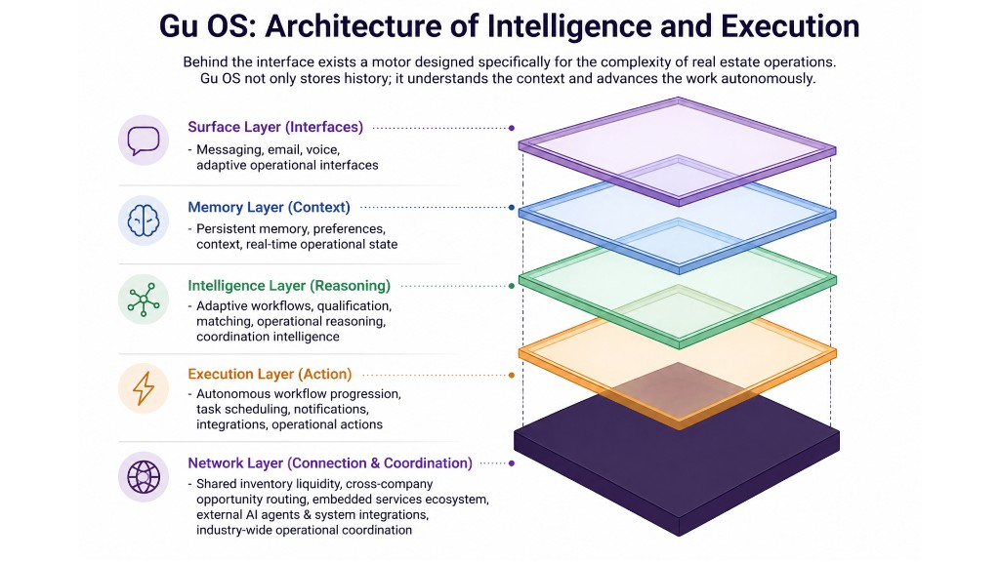

# Gu OS — Vista de arquitectura para negocio y producto

Este documento acompaña el diagrama de capas usado en presentaciones de negocio/producto. No reemplaza al manual narrativo de Gu OS ni al manual técnico; sirve para explicar, en lenguaje ejecutivo, cómo se relacionan las capacidades del producto con lo que ya existe en Ungga y con la evolución de Gu OS.

Imagen de referencia: [`gu-os-business-architecture-stack.png`](../assets/gu-os-business-architecture-stack.png)



---

## 1. Lectura general

El diagrama está **alineado en general** con el modelo que venimos documentando para Gu OS, siempre que se entienda como una **vista de producto**, no como el modelo técnico exacto ni como el modelo canónico de Brain Layer.

La idea principal es correcta: Gu OS no es solo un chat. Es una capa de inteligencia y ejecución que se apoya en contexto, memoria, workflows, herramientas y una base operativa inmobiliaria que Ungga ya viene construyendo desde hace tiempo.

Una forma breve de expresarlo:

> Gu OS turns operational context into governed execution across real estate workflows.

La palabra importante aquí es **governed**: el sistema debe avanzar trabajo con permisos, trazabilidad, políticas y aprobación humana cuando corresponde. No se trata de autonomía teatral ni de un agente que “hace todo solo” sin control.

La segunda idea importante es que las capas forman un ciclo, no sólo una pila:

```text
operación y eventos
  → contexto e inteligencia
  → decisión y ejecución gobernada
  → resultado y evidencia
  → evaluación y aprendizaje
  → siguiente ciclo
```

Gu OS busca que una inmobiliaria sea progresivamente **consultable**: que usuarios y agentes autorizados puedan reconstruir qué está ocurriendo, qué se decidió y por qué, qué se prometió, quién responde por el resultado y qué evidencia lo sustenta. Hoy esa capacidad proviene parcialmente de datos operativos, casos y eventos; la futura Brain Layer amplía cognición y retrieval. No significa grabar todo, exponer información privada ni reemplazar los sistemas de verdad existentes.

---

## 2. Mapeo de capas

| Capa del diagrama | Cómo se entiende en Gu OS / Ungga |
|-------------------|-----------------------------------|
| **Surface Layer (Interfaces)** | Canales de interacción: web chat, Telegram, email/voz futuro, cron, interfaces operativas y experiencias adaptativas. Es la superficie donde el usuario o el sistema inicia trabajo. |
| **Memory Layer (Context)** | Contexto reciente, memoria personal, preferencias, Business Brain, estado de workflow y futura memoria operacional. No significa que todo el negocio viva como “memoria del agente”. |
| **Intelligence Layer (Reasoning)** | Routing de skills, calificación, matching, razonamiento operativo, coordinación de información y futura cognición apoyada por Brain Layer. Aquí vive la parte que decide qué procedimiento aplicar y cómo interpretar el contexto. |
| **Execution Layer (Action)** | LangGraph workflows, herramientas, HITL, tareas programadas, Heartbeat, notificaciones, integraciones y progresión de workflows. Es donde el sistema deja de solo responder y empieza a mover trabajo. |
| **Network Layer (Connection & Coordination)** | La base histórica y estratégica de Ungga: atención a prospectos, inventario, matchmaking, routing de oportunidades, coordinación entre agentes/organizaciones y ecosistema inmobiliario. Esta capa no es “solo infraestructura”; es parte del moat operativo. |

---

## 3. Por qué la capa base tiene sentido

La capa inferior del diagrama representa algo distinto a una base de datos o a un runtime técnico. Representa la **red operativa inmobiliaria** sobre la que Gu OS puede razonar y ejecutar.

Esto es importante porque Gu OS no nace en abstracto. Se apoya en capacidades que Ungga ya ha venido construyendo y evolucionando:

- atención y seguimiento a prospectos;
- datos de leads, propiedades, deals y mensajes;
- lógica de matching entre demanda e inventario;
- coordinación entre actores del mercado;
- flujos comerciales y operativos propios del real estate.

En esa lectura, la Network Layer comunica bien una tesis de producto: mientras muchos agentes empiezan como chatbots genéricos, Gu OS puede convertirse en una capa de inteligencia y ejecución sobre una operación inmobiliaria real.

---

## 4. Matices que conviene explicar junto al diagrama

### 4.1 “Autonomous” debe leerse con gobierno

El diagrama menciona que Gu OS “advances the work autonomously”. La frase sirve para una presentación, pero conviene explicarla con precisión: autonomía en Gu OS no debe significar acciones sin control.

La interpretación correcta es:

- el sistema puede avanzar trabajo cuando tiene contexto suficiente;
- usa herramientas y workflows acotados;
- deja trazas de lo que consultó o ejecutó;
- respeta permisos, políticas y aislamiento de datos;
- pide aprobación humana para acciones sensibles.

En otras palabras: **autonomía gobernada**, no autonomía ilimitada.

### 4.2 Guardrails y confianza no aparecen en el dibujo, pero son parte central

Para no sobrecargar el diagrama, no se muestran todos los mecanismos de seguridad. Aun así, la explicación debe dejar claro que Gu OS está diseñado alrededor de:

- HITL para acciones sensibles;
- políticas de aprobación por herramienta;
- RLS y separación por usuario/tenant;
- auditoría de tool calls;
- checkpoints y reanudación controlada;
- diferenciación entre lectura, escritura y acciones riesgosas.

Esto es producto, no solo ingeniería. En un sistema operativo para negocios reales, la confianza es parte de la propuesta de valor.

### 4.3 La Network Layer es ventaja de Ungga, no una promesa genérica

La capa de red debe explicarse como el lugar donde vive la experiencia acumulada de Ungga en operación inmobiliaria: inventario, prospectos, relaciones, matching, routing, campañas, portales, seguimiento y coordinación.

No es necesario cambiar el texto del diagrama si se volvería demasiado largo. Basta con que el documento y la narrativa verbal aclaren que esta capa representa una ventaja específica del producto, no una abstracción genérica.

### 4.4 Memory Layer no reemplaza los datos operativos

Este punto evita una confusión importante. La Memory Layer no significa que leads, propiedades, deals, mensajes o inventario deban copiarse como “memoria del agente”.

La separación saludable es:

- **Datos operativos / Network Layer / Warehouse:** hechos transaccionales, inventario, leads, deals, actividad comercial, relaciones de mercado.
- **Memory Layer:** contexto, preferencias, continuidad, estado de conversación, Business Brain y memoria útil para que el agente trabaje mejor.
- **Brain Layer futura:** memoria operacional/cognitiva del negocio: entidades, timeline, relaciones, señales y candidatos de playbook, siempre con gobierno y evidencia.

Así se evita mezclar CRM, memoria personal, contexto de conversación y conocimiento operacional en una sola caja.

---

## 5. Relación con el mapa operativo de Gu OS

Este diagrama y el mapa operativo de Gu OS no compiten; explican niveles distintos.

| Documento / asset | Qué explica |
|-------------------|-------------|
| [`gu-os-business-architecture-stack.png`](../assets/gu-os-business-architecture-stack.png) | Vista de negocio/producto: capacidades apiladas que convierten operación inmobiliaria en inteligencia y ejecución. |
| [`gu-os-operational-stack-aligned.png`](../assets/gu-os-operational-stack-aligned.png) | Vista operativa: canales, runtime, contexto, skills, tools, rhythm/Heartbeat y Brain Layer futura. |
| [`gu-os-understanding.md`](gu-os-understanding.md) | Guía narrativa para entender memoria, skills, tools, Heartbeat, tareas programadas y Brain Layer. |
| [`gu-os-glossary-commercial.md`](gu-os-glossary-commercial.md) | Glosario de una página para ventas, alianzas y demos (sin jerga técnica). |
| [`architecture-manual.md`](architecture-manual.md) | Manual técnico integrador con rutas, tablas, estado actual y roadmap. |

La forma correcta de usarlos juntos:

- el **diagrama de negocio/producto** abre la conversación estratégica;
- el **mapa operativo** aterriza cómo se arma Gu OS por dentro;
- la **guía de entendimiento** explica cada pieza sin asumir conocimiento técnico;
- el **manual técnico** documenta implementación, límites actuales y evolución prevista.

