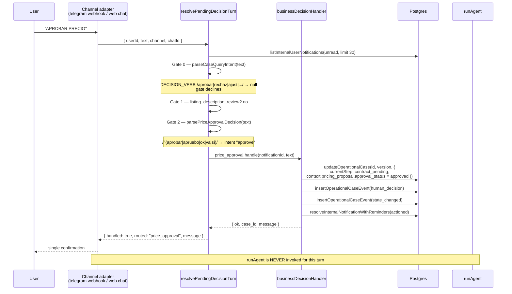
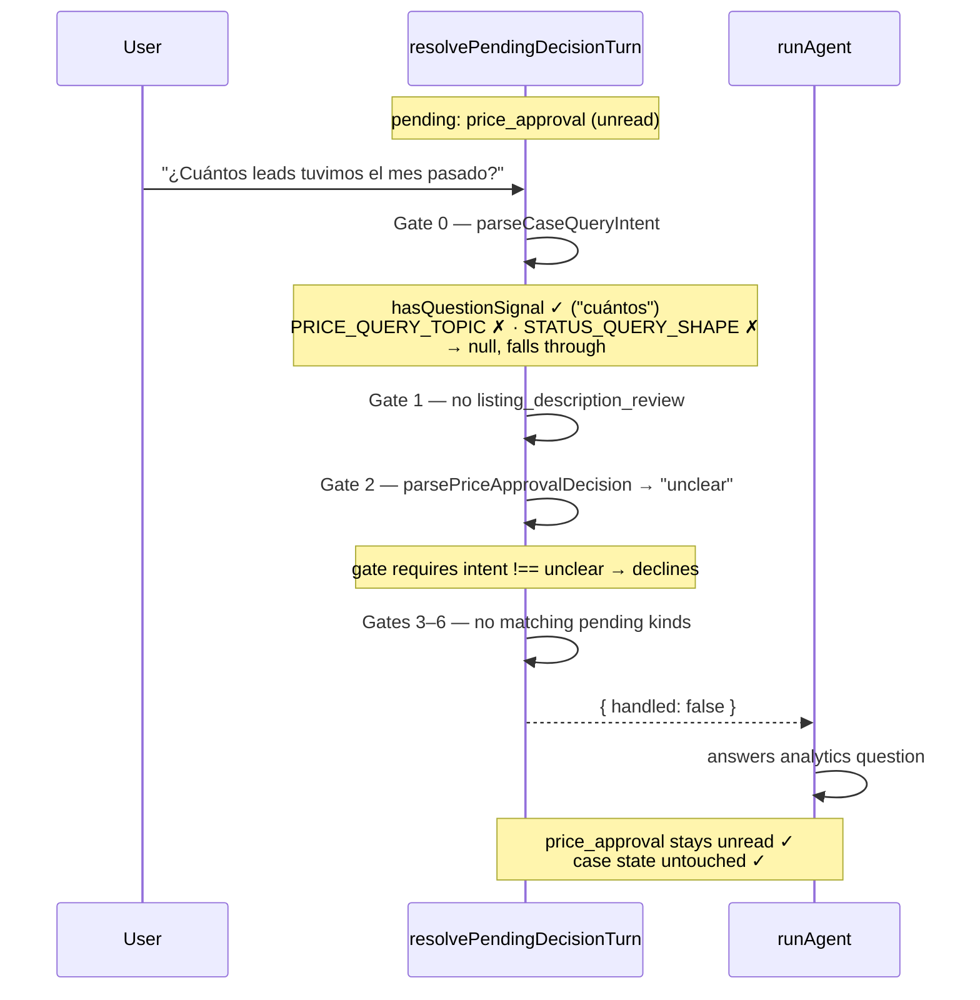
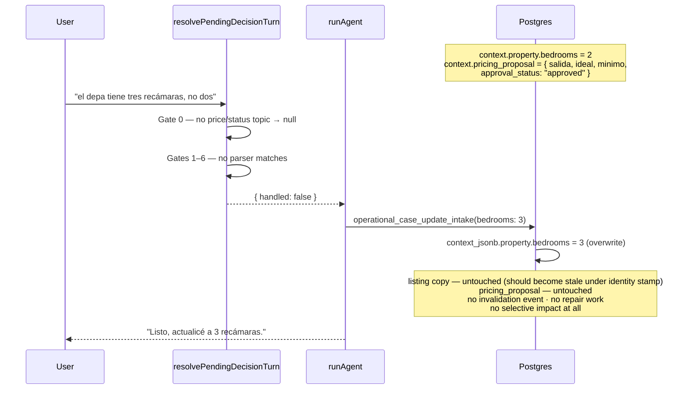
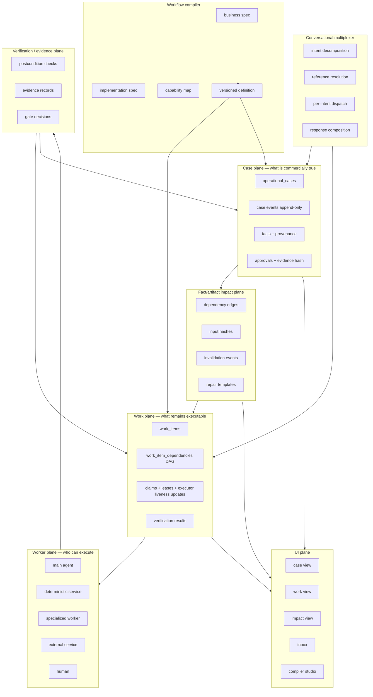
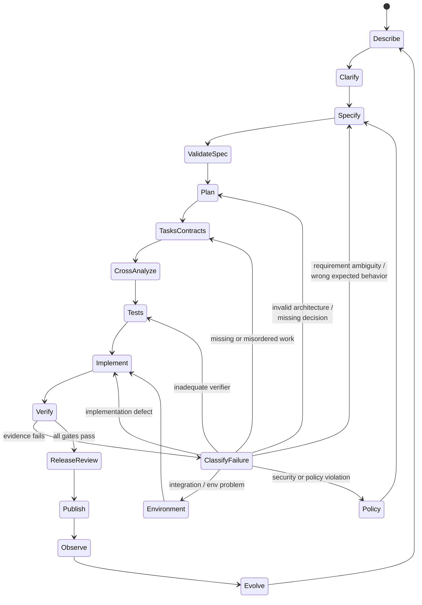

# Gu OS — Flexible Governed Workflows, Work Graphs, Workers, and Natural-Language Workflow Compilation

**Analysis-first architectural review.** No production code, migration, schema, or UI was modified to produce this document.

| | |
|---|---|
| Repository | `10x-builders-agent` (Gu OS) |
| Branch | `main` |
| Commit | `1c1fed4b0584c4474ce76a811068d0356ac9c186` |
| Commit date | 2026-07-23 16:09:55 -0600 |
| Previously analyzed commit | `b465151de72e59a82470f6171aaf395013e5778c` |
| Delta | 26 commits, 109 files, +9,858 / −1,673 |
| Comparative repository | `NousResearch/hermes-agent` (patterns only) |

### Evidence classification used throughout

- **[A] Documented intent** — README, architecture docs, ADRs, code comments, product manuals.
- **[B] Code-verified implementation** — source, schema, migrations, exact control flow.
- **[C] Runtime-verified behavior** — executed in a controlled environment.
- **[D] Architectural inference** — reasonable but not directly proven.
- **[E] Unknown / unverified.**

**[C] evidence in this report is limited and explicitly marked.** On 2026-07-26 the production parsers and both LLM fallbacks of the pending-decision layer were executed directly with real inputs (`parsePriceApprovalDecision`, `parseCaseQueryIntent`, `looksLikeSideQuestionNotData`, `extractContractCommercialReply`, and `classifyPendingDecisionUnclear` against the live OpenRouter classifier model). Those runs upgrade the Scenario B/D parser claims and the contract-data side-question claim to [C], and one of them **corrected** an earlier [B]-level overstatement (§3.4). No full turn was executed end to end — no database writes, no channel adapters, no case ticks — so router-level and agent-level behavior remains [B] control-flow tracing, and LLM-dependent outcomes observed once are marked [C, single-run] rather than treated as distributions.

### Reading guide

The mandated 15-section structure is preserved exactly. Two topics from the prompt that do not map onto a numbered section are folded in explicitly and signposted: **alternatives comparison** appears as §6.9, and **security and governance** as §6.10 with follow-through in §7.6, §9.5, and §13.

**Terminology:** “Heartbeat” in Gu OS product language means the proactive periodic agent capability. This plan never uses that word for worker claim liveness — see the glossary/ADR note after §8.2 (`last_liveness_at`, lease renewal, stale-claim recovery).

---

## 1. Executive conclusion

Gu OS does not have a workflow engine in the full sense. It has a **durable case store in which the workflow definition chooses who executes each step, but an LLM proposes what happens next** — wrapped in an unusually strong deterministic *decision* layer, hardcoded per-case-type transition guards, and an unusually strong *test* layer. That sentence is the whole analysis compressed; everything below is the evidence for it and what follows from it.

The distinction matters because the repository reads, at first glance, as though a workflow engine exists. There is a `operational_flow_jsonb` column holding an ordered step→skill→tool structure for every case type. There is a `current_step`, a status machine, an append-only event log, optimistic locking with leases, and a cron runner. Those are the parts of an engine, and — a correction against an earlier draft of this analysis — the flow definition is *not* inert at runtime. On every case-bound turn the runtime reads it to force the step's bound skill (`packages/agent/src/graph.ts` L1194–1206), to compute the intake-completion successor step (`operational-cases-adapters.ts` L4043–4047), and to decide whether tenant BigQuery context is injected (`graph.ts` L380–398). The flow **selects the executor at each step**. What no component does is use it as the **transition authority**: which step comes after the current one, post-intake, is proposed by the model calling `operational_case_update_state` after reading SKILL.md prose, and validated against guards that are hardcoded per case type (`PROPERTY_OPTIONING_STEP_ORDER` and the step-specific gates in `operational-cases-adapters.ts` L3713–3760) rather than derived from the flow. The flow's own `step_decision` branch metadata is explicitly documented as not read for branching (`packages/types/src/index.ts`), and the flow is not injected into the model's prompt (`buildOperationalCaseContextBlock`, `graph.ts` L258–343, includes step, context, and events — not the step list). The migration comment calling the column a "UI/readiness/test-runner contract" (`00025_operational_case_flow.sql` L6–14) understates what the code now does with it, which is itself evidence of how the declared and executed models drift. [B, High]

This is not a criticism of the design as it stands. Gu OS is a single-workflow product at pilot scale, and an LLM-driven step selector backed by durable state and post-hoc invariant enforcement is a legitimate, cheap way to get there. The criticism is narrower and specific: **the architecture has no place to put the three things the roadmap now requires** — concurrent executable work, corrections that invalidate downstream results, and workflows that a user can define without a database migration. Each of those needs a substrate that does not currently exist, and none of them can be prompt-engineered into existence.

### 1.1 What should be kept

Four assets are genuinely differentiating and must survive any evolution intact.

**The deterministic business-decision router.** `apps/web/src/lib/business-decisions/pending-decision-router.ts` (786 lines, new since the last analysis) is the single best piece of architecture in the repository. It runs *before* the agent, gives pending HITL notifications first claim on a free-text turn, and resolves price approvals, contract data, titularidad, listing-description reviews, and comparables decisions through hand-written parsers rather than model judgment. Approvals are code paths, not prompts. This is exactly the right instinct and it is the reason Gu OS is safer than a general agent framework at the moment of commitment. [B, High]

**The append-only event log with hard database enforcement.** `operational_case_events` blocks `UPDATE` and `DELETE` with triggers that raise, not with policy that can be bypassed (`packages/db/supabase/migrations/00019_operational_cases.sql`). Auditability is structural.

**Optimistic locking with lease semantics.** `markCaseProcessing` performs a compare-and-swap on `version` while pushing `next_action_at` into the future, so a crashed worker's case becomes reclaimable when the lease expires without any reaper process (`packages/db/src/queries/operational-cases.ts`). It is simpler than the `SELECT … FOR UPDATE SKIP LOCKED` the architecture doc describes, and for this workload it is *better* — it survives process death for free.

**The deterministic test culture.** 167 TypeScript files in `apps/web/src/lib/operational-cases/`, of which **74 are self-tests** — 44% of the module by file count. The largest single file in the module is the controlled-tick test harness (`run-settings-test-case-tick.ts`, 104 KB), larger than the runtime invariants file it exercises. Whatever else is true, this team can verify changes cheaply, which is the precondition for attempting anything in §13.

### 1.2 What should be complemented

**A work plane beneath the case plane.** The case answers "what is commercially true." Nothing currently answers "what executable work remains, what blocks what, and who can run it." Today those questions are answered by a single string, `current_step`, which forces the flow to be linear and single-threaded. Grepping the entire `packages/` tree for `depends_on`, `work_item`, or `blocked_by` returns three unrelated hits — one about skill-composition dependency resolution, one about a BigQuery library, and one string literal. There is no work graph anywhere. [B, High]

**A fact/artifact impact model.** Provenance exists but stops at the document boundary. `operational_case_documents` carries `source`, `source_metadata_jsonb`, `status ∈ {received, superseded, rejected}`, `extraction_status`, `extraction_model`, and `extracted_at` (`migrations/00037_operational_case_documents.sql` L10–37) — genuinely good document-level lineage, including supersession. But there is no edge from a document or a normalized fact to the artifacts derived from it. The price approval is written as three keys inside `context_jsonb.pricing_proposal` (`business-decisions/price-approval.ts` L176–200). When a fact that an approval or artifact *actually* depended on changes — e.g. construction area for a valuation-backed approval, or bedroom count for a listing description — nothing can find those dependents, because nothing records the dependency. The system must not invent universal domain edges from field names alone.

**Intent decomposition in the conversational layer.** The router is a first-match-wins chain: every gate returns `handled: true` and short-circuits, and the return type carries exactly one `message` and no residual text. There is no representation for "this turn contained two intents." §3.5 and §4.1 trace the consequence in detail.

**A workflow authoring surface.** Of 63 migrations, roughly 25 exist solely to edit the `property_optioning` flow — reordering tools, rewording copy, splitting an intake field, adding a geocode step. Changing a step label is currently a schema migration and a deploy. [B, High]

### 1.3 What should not be built yet

**Temporal, or any external durable-workflow engine.** The volume is nowhere near the threshold (§6.9 sets concrete numbers). Postgres plus the existing cron loop has one to two orders of magnitude of headroom.

**A general multi-agent system.** Only one specialized worker currently clears an evidence-based bar, and it clears it on verification-independence grounds rather than parallelism (§9.2).

**The natural-language workflow compiler as a user-facing feature.** The compiler's output must be a *versioned* workflow definition whose transitions the runtime actually enforces. Today the definition governs executor selection but not transitions — those live in SKILL.md prose and hardcoded guard tables — so a compiled definition would control which skill runs but not what the workflow *does*. Compilation is Phase 4 of §13 for a structural reason, not a scheduling one.

**Kanban as a broker-facing surface.** §11.3 argues it should ship operator-facing first. Brokers think in cases, not tickets, and exposing task status next to case state is precisely the confusion the prompt warns against.

### 1.4 Top three architectural decisions

**Decision 1 — Make the workflow definition the transition authority before making it authorable.** The runtime already reads `operational_flow_jsonb` to select the skill per step and the intake successor (Finding 1, corrected form); the highest-leverage change is to extend that authority to transitions — legal next steps, branch conditions, and gates derived from the definition (versioned, renamed, normalized) instead of from hardcoded per-case-type tables like `PROPERTY_OPTIONING_STEP_ORDER`. This closes the three-way divergence between SKILL.md prose, hardcoded guards, and the declared flow, and it is the prerequisite for versioning, for the compiler, and for a second case type that does not require its own 67 KB of guard code. Everything else in this report depends on it, and the fact that executor selection is already flow-driven means this is an extension of an existing pattern, not a new one.

**Decision 2 — Add a work plane as new tables, not as an extension of `operational_cases`.** Work items have a different cardinality (many per case), a different lifecycle (retry, claim, block, verify), a different owner (an executor, not a business state), and a different audience (operator, not broker). Overloading `current_step` or `context_jsonb` to carry them would deepen exactly the coupling that makes the current system hard to change. §7.2 gives the schema; §6.9 compares this against the five alternatives.

**Decision 3 — Bind approvals to the evidence they were granted against.** Every approval should record a hash of its input facts. This is a small change with disproportionate reach: it makes staleness computable rather than inferable, it makes Scenario C2 mechanically decidable (and C1’s non-cascade equally mechanical: unchanged evidence hash ⇒ approval stays current), it converts the HITL layer from "was this approved?" to "was this approved against what is still true?", and it costs one column plus a hashing function. Today an approval is a status string in a JSON blob with no link to its basis, which is also why the current code approves a price the user never actually named (§4.1, Finding 3).

---

## 2. Repository snapshot and evidence limitations

### 2.1 Snapshot

The working tree is clean apart from one untracked PDF (the Claude Code paper) added for this analysis. The repository is **26 commits ahead** of the previously analyzed `b465151`, and the delta is material to this review rather than incidental.

The most consequential change since the last analysis is the appearance of an entire module that did not previously exist: `apps/web/src/lib/business-decisions/`. It contains `pending-decision-router.ts` (786 lines, new), `case-query.ts` (178, new), `pending-decision-unclear-classifier.ts` (174, new), and revisions to `listing-description-review.ts` and `publish-destination-approval.ts`. The commit messages describe the intent directly: *"Answer read-only price/status queries deterministically in the decision router"* (a60aa5a), *"Release sticky HITL unclear turns to the agent via a low-risk LLM second opinion"* (50adca8), *"Share pending-decision HITL router between Telegram webhook and web chat"* (0bae971).

This matters for the central questions. The prior analysis predates this module, so any statement it makes about side-question handling during HITL gates is stale. Gu OS has, in the last three weeks, **partially solved Scenario A** — and the shape of that partial solution is the clearest available evidence about where the architecture's ceiling actually is. §3.4 and §4.1 treat it as the primary exhibit.

The remaining commits cluster on publication-pipeline hardening (Ungga CLI, EasyBroker, media upload races, closure invariants) and on centralizing OpenRouter model roles in `packages/agent/src/model.ts`. Neither changes the structural picture.

### 2.2 What was verified, and how

Direct source inspection covered the operational-case migrations (`00019`, `00025`, `00037`, and the ~25 `property_optioning_*` flow migrations), the case query layer (`packages/db/src/queries/operational-cases.ts`), the cron runner (`apps/web/src/app/api/cron/operational-cases/route.ts`, 1,399 lines), the channel-agnostic conversational core (`conversational-case-orchestrator.ts`), the conversation classifier (`operational-conversation-classifier.ts`), the full pending-decision router and its parsers, the property identity signature (`property-identity-signature.ts`), and the post-agent invariants (`property-optioning-post-agent-invariants.ts`, 67 KB). Repository-wide greps established the *absence* of work-item, dependency, and subagent constructs.

That direct inspection was cross-checked against four independent parallel traces of the same codebase — the case engine, the conversational layer, the skills/tools/runtime surface, and the domain-data/UI surface — run as separate agents with no shared context. Where this report and those traces disagreed, the disagreement is recorded rather than smoothed over: Findings 11 through 15 originate from the traces, and Finding 14 in particular qualifies a claim made earlier in this document about RLS.

Hermes was used strictly as a comparative pattern source. Its Kanban user guide was fetched from the public repository; the code-verified Hermes audit supplied as source material was treated as authoritative for implementation claims. **No Hermes source was read directly**, so every Hermes statement here is [A] relative to that audit, not [B]. Where the audit and this report agree, that agreement is not independent confirmation.

### 2.3 Evidence limitations

Six limitations bound the confidence of what follows, and they are stated rather than hedged.

**Runtime verification is partial.** The pure parsers and both LLM fallbacks of the pending-decision layer were executed directly (see the evidence preamble), which upgraded the mixed-intent and side-question claims to [C] and corrected one overstatement. Everything above the function level — the router walking its gates against a real notification set, channel adapters, case ticks, agent turns — remains control-flow tracing: it establishes what the code *will* do but not what the model *does* do at the points where a model is in the loop, and single-run LLM observations are not distributions.

**Model-mediated behavior is not statically analyzable.** Wherever a step transition depends on the agent choosing to call `operational_case_update_state`, no amount of code reading determines the outcome distribution. Claims about model-mediated paths are marked [D] and given Medium confidence at best.

**Production data was not inspected.** Case volumes, step-duration distributions, retry frequencies, and correction rates are unknown. §6.9's thresholds for adopting heavier infrastructure are therefore stated as *thresholds to measure against*, not as findings.

**Prompt content was read but not evaluated.** SKILL.md files define much of the effective behavior. They were read for structure, not assessed for whether they reliably elicit the intended tool calls.

**Two files exceed comfortable review depth.** `run-settings-test-case-tick.ts` (104 KB) and `publication-runner.ts` (86 KB) were sampled at their interfaces and at specific call sites, not read end to end.

**Duplicate migration numbers exist.** `00036`, `00044`, and `00045` each appear twice with different suffixes. Whether the migration runner orders these deterministically was not verified; if it sorts lexicographically the ordering is stable but non-obvious, and if it sorts numerically the tie-break is undefined. This is flagged as [E] and as an operational risk worth ten minutes of somebody's time, independent of anything else in this report.

### 2.4 Methodological references

The prompt requires the methodological references to be consulted as primary sources rather than from memory; this subsection records what was used and how it bears on the design.

**GitHub Spec Kit** (official docs, last updated 2026-07-16; repository current as of this analysis). The shipped lifecycle is `constitution → specify → clarify → plan → tasks → analyze → implement`, delivered as `/speckit.*` commands, with `checklist` ("unit tests for English") validating requirement quality and `analyze` performing cross-artifact consistency checks after `tasks` and before `implement`. Two facts matter for §10. First, Spec Kit now ships a **`/speckit.converge`** command that assesses the codebase against spec/plan/tasks and appends remaining work as new tasks — which is to say, the loop-engineering correction this analysis proposes (§10.1) is already partially present in the reference tool, though `converge` routes all divergence back to `tasks` rather than classifying the failure to its owning artifact. Second, Spec Kit has generalized beyond software ("never locked to SDD, or even to software"; extensions, presets, workflows), which supports treating the workflow compiler of §6.7 as an instance of the same artifact-chain pattern rather than a novel invention. [A]

**"Dive into Claude Code: The Design Space of Today's and Future AI Agent Systems"** (arXiv 2604.14228v2, Jul 2026; read from the local copy in `docs/external-docs/`). Three of its source-grounded findings are load-bearing for this report. First, the habituation result: Anthropic found users approve **93% of permission prompts**, and responded not with more warnings but with *defined boundaries* — sandboxing and auto-mode classifiers within which the agent works freely — instead of per-action approvals that stop being reviewed. That is the empirical case for §10.5's risk-justified gates and §11.6's differentiated inbox, and a direct warning about Gu OS's current undifferentiated pending list. Second, the verification separation: the paper documents Anthropic's guidance that "agents tend to respond by confidently praising the work," motivating separation of generation from evaluation — the primary-source version of §6.6's rule that agent assertions are claims, not evidence, and of §9.2's argument that the valuation verifier must not see the reasoning it checks. Third, the design axis the paper draws — Claude Code invests in *deterministic infrastructure* (context, routing, recovery) rather than *decision scaffolding* (planners, state graphs), betting on model improvement — locates Gu OS precisely: Gu OS makes the opposite bet (dense deterministic scaffolding around cheap models), and this report's proposal deepens that bet deliberately, because governed multi-tenant business workflows are the deployment context where the paper's own comparison shows scaffolding wins. The paper also confirms, from its independent Hermes analysis, the characterization used in §6.9(8): Hermes is a single-process, multi-surface assistant whose per-action approvals render across surfaces — a work system, not a workflow-definition system. [A]

**Loop engineering / evidence-gated lifecycle control.** No single canonical document exists; the operative sources are the Spec Kit `converge`/`analyze`/`checklist` semantics above, the Claude Code paper's gather-context → act → verify loop with "ground truth from the environment" at each step, and the prompt's own corrected lifecycle, which §10 adopts and extends with failure classification and named terminal states. Where §10 goes beyond all published sources — per-classification iteration limits, evidence freshness bound to artifact hashes — it is marked as proposal, not as established practice. [A/D]

---

## 3. Current-state reconstruction

### 3.1 The three-layer picture

Gu OS's runtime splits into three layers that are easy to conflate and worth separating precisely, because the deterministic boundary falls in a different place in each.

The **durable state layer** is fully deterministic. `operational_cases` holds one row per case with `status`, `current_step`, `next_action_at`, `due_at`, `context_jsonb`, and `version`. Every write goes through `updateOperationalCase(db, id, expectedVersion, patch)`, which returns `null` on version mismatch rather than throwing or overwriting. Events append to `operational_case_events` and cannot be modified. Concurrency is controlled by `markCaseProcessing`, which atomically bumps `version` and pushes `next_action_at` forward by a lease (5 minutes by default; 5 in the publication runner, 1 in the test runner). Nothing about this layer is model-mediated. [B, High]

The **decision layer** is also fully deterministic, and is newer. When a free-text turn arrives on either channel, `resolvePendingDecisionTurn` runs first. It loads up to 30 unread internal notifications and walks seven gates in fixed priority order. Gates that match execute a hand-written handler that performs the state transition in code — `price_approval` moves `price_proposal_pending → contract_pending` directly (`price-approval.ts` L185–200), with no model involvement in the transition. [B, High]

The **progression layer** is a deterministic frame around a model-mediated core, and locating the seam precisely matters. The deterministic frame: when the runner picks up a due case, it reads `operational_flow_jsonb` to force the current step's bound skill (falling back to `default_skill_slug`), and the intake→first-operational-step transition is computed in code from the flow and activation policy, with `operational_case_update_state` denied to the model during intake. The model-mediated core: for every transition after intake, the runtime loads the bound SKILL.md, injects a `[Caso operacional]` context block (step, context JSON, last 15 events — not the flow), and the model decides whether to call `operational_case_update_state` and with what target step. That proposal is then checked against hardcoded guards — step regression via `PROPERTY_OPTIONING_STEP_ORDER`, the awaiting-documents external-response gate, protected publication keys, the completion pairing rule — and afterwards `applyPropertyOptioningPostAgentInvariants` corrects specific known failure modes. The guards are per-case-type code, not derived from the flow definition. [B, High]

So the honest formulation of the deterministic boundary is: **state persistence and human decisions are deterministic; step progression is model-proposed and invariant-corrected.** The invariants are a safety net over a model decision, not a state machine. The prompt asks not to use the phrase "deterministic workflow" without identifying the boundary — the boundary is the `operational_case_update_state` tool call, and everything upstream of it is prose.

### 3.2 Normal case tick

```mermaid
sequenceDiagram
    participant Cron as pg_cron / scheduler
    participant Route as POST /api/cron/operational-cases
    participant DB as Postgres
    participant Agent as runAgent (LangGraph)
    participant Inv as post-agent invariants

    Cron->>Route: POST (Bearer CRON_SECRET)
    Route->>DB: processNotificationReminders()
    Route->>DB: getDueOperationalCases(limit 100)
    Note over Route,DB: status in (active, waiting_internal,<br/>waiting_external) AND next_action_at <= now()
    Route->>Route: filter cron-suppressed (settings-test / E2E lab)
    loop concurrency = OPERATIONAL_CASES_CONCURRENCY (default 5, max 20)
        Route->>DB: markCaseProcessing(id, version)
        alt version mismatch
            DB-->>Route: null
            Route->>Route: skip (another worker won)
        else lock acquired
            DB-->>Route: case (version+1, next_action_at = now + lease)
            Route->>DB: get/create agent_session (channel = case_runner)
            Route->>Agent: runAgent(caseId)
            Note over Agent: skill forced from flow step<br/>(step_skills, else default_skill_slug);<br/>MODEL proposes next step from SKILL.md prose;<br/>hardcoded guards validate the proposal
            Agent->>DB: operational_case_update_state(...)  [if it chooses to]
            Agent->>DB: insertOperationalCaseEvent(...)
            Agent-->>Route: result
            Route->>Inv: applyPropertyOptioningPostAgentInvariants(case)
            Inv->>DB: consolidate extractions, detect conflicts,<br/>auto-remediate (circuit breaker), notify
        end
    end
    Route-->>Cron: { processed, results, notification_reminders }
```

Three properties of this loop deserve emphasis. The lease is the *only* executor-liveness mechanism — there is no mid-execution liveness update, so a case whose agent invocation hangs is unavailable for exactly the lease duration and then silently retried, with no record that the previous attempt was abandoned. There is no attempt counter on the case, so unbounded retry is possible for any failure mode the invariants do not specifically recognize. And the batch is capped at 100 with concurrency 5, which is a sensible throttle but means a backlog drains at a fixed rate regardless of urgency, since `getDueOperationalCases` has no priority ordering. [B, High]

### 3.3 Pending business decision



The critical structural fact is the last note. A claimed turn does not reach the agent at all. That is what makes approvals safe, and it is also what makes mixed-intent messages lossy — the two properties are the same property.

### 3.4 Unrelated side question



Scenario A produces the desired outcome, but by *fallthrough*, not by decomposition. Nothing in the system represents "this message is a side question during a pending approval"; the message simply fails to match any gate and lands on the agent by default. The distinction is not academic, because the same fallthrough is fragile in a way that is invisible from the outcome:

If the pending notification had been `contract_data_review` instead of `price_approval`, Gate 3 would apply — and Gate 3 **claims any pending text by default** (`pending-decision-router.ts` L545–600). Here the layers matter, and controlled execution on 2026-07-26 pinned down each one. The deterministic escape, `looksLikeSideQuestionNotData`, requires an interrogative shape *and* no email, *no digits at all*, and no boolean-near-contract-keyword pattern (`case-query.ts` L65–80): executed, it returns `true` for "¿cuántos leads tuvimos en marzo?" (escapes with zero model calls) and `false` for "¿Cuántos leads tuvimos en 2026?" (the year trips the digit rule). [C] But the digits case does not dead-end. The gate then runs the hybrid extractor, which returned `intent: unclear` with an empty patch for the leads question, and the LLM second opinion (`maybeReleaseUnclearToAgent`) classified it `release_to_agent` with high confidence — so the turn is released and the agent answers, at the cost of two model calls and a dependency on model judgment at exactly the boundary the deterministic router exists to protect. [C, single-run]

An earlier draft of this analysis claimed the digits case "would be answered with a contract-data clarification"; execution showed that is wrong under the current fallback chain, and the correction is recorded rather than silently absorbed. The accurate criticism is narrower: side-question handling during a sticky gate is **tiered by luck of phrasing** — deterministic and free for "marzo", two LLM calls and fail-closed-on-error for "2026" — and in ordinary operation the question works for a third, unrelated reason: no `contract_data_review` is pending at all, so no gate is in play and the turn reaches the agent directly. Three different mechanisms produce the same happy outcome, which is why the behavior feels reliable in use while being architecturally three separate paths, one of which (the second opinion) fails *closed* to a clarification loop when the classifier errs or the API fails.

So Scenario A's success is a property of *which* gate happens to be pending and *which* fallback catches the turn, not of intent decomposition. One more observation follows: Gate 0 recognizes exactly two topics, `price` and `status` (`CaseQueryIntent = "price" | "status"`) — executed, it returns `null` for every leads-question variant and correctly recognizes "¿cuál fue el precio ideal?" → `price`, "¿cómo va el caso?" → `status` [C] — so the deterministic side-question capability is a whitelist of two, not a general facility.

### 3.5 Correction to an earlier fact



The failure is not “bedrooms should always invalidate the valuation” — under Gu OS’s valuation methodology (location, area, zone comparables, $/m²) bedroom count often should *not* touch valuation or a price approval. The failure is that **there is no edge from a fact to the artifacts that actually depend on it**, so the runtime can neither invalidate the right things (listing description, publication fields) nor deliberately leave the right things alone (comparables, valuation). The prompt’s original Scenario C assumed a bedrooms→valuation chain; §6.5 and §12.5 correct that to selective, methodology-declared impact.

The building blocks for detecting change do exist and are better than one would expect. `property-identity-signature.ts` builds a `PropertyIdentitySnapshot` over type, operation, zone, areas, **bedrooms**, bathrooms, parking — and serializes it to a stable signature string designed for change detection. Document supersession is modeled. Extraction consolidation applies source scoring that prefers official documents over conversational claims (`property-optioning-post-agent-invariants.ts`).

What is missing is the consumer *on the runtime path*. The signature is not inert — artifacts such as `listing_description_draft` and `photo_analysis` are stamped with a `property_identity_signature`, and the tool-readiness lab compares stamped signatures against the current one to emit a `stale_artifacts` warning (`apps/web/src/app/api/tool-readiness/run-tool/route.ts`). A parallel mechanism compares `photo_analysis.source_paths` against current `raw_photos` (`photo-analysis-staleness.ts`). Both are real staleness detectors. Both are **warnings in a testing surface, not persisted invalidation on the production path**, and neither touches approvals.

So the accurate statement is narrower and more useful than "no staleness detection exists": Gu OS has already built staleness detection twice, for two artifact types, and has not connected either to case state. Approvals live at `context_jsonb.pricing_proposal.approval_status`, a string inside a blob with no evidence hash. There is no revocation/suspension path for an already-approved price — the reject handler only applies to a proposal that has not yet been approved. A correction and an initial data entry are the same write. [B, High]

### 3.6 Mixed-intent message

```mermaid
sequenceDiagram
    participant User
    participant R as resolvePendingDecisionTurn
    participant H as price_approval handler
    participant DB as Postgres

    User->>R: "Aprobar $4.8 millones, cambia las recámaras<br/>de dos a tres, y dime los leads del mes pasado"
    R->>R: Gate 0 — DECISION_VERB matches "aprobar" → null
    R->>R: Gate 2 — parsePriceApprovalDecision(text)
    Note over R: /^(aprobar|...)/ anchored at start → MATCHES<br/>early return { intent: "approve" }<br/>"cambia" never evaluated (unreachable after return)
    R->>H: handle(price_approval)
    H->>DB: approve EXISTING proposal unchanged
    Note over H,DB: parsed.intent === "approve" carries no patch;<br/>the "$4.8 millones" the user stated is never<br/>compared to context.pricing_proposal
    H->>DB: currentStep → contract_pending
    R-->>User: "Listo, procesé tu decisión de precio."
    Note over User,DB: intent 2 (bedrooms) — DISCARDED, no record<br/>intent 3 (leads) — DISCARDED, no record<br/>return type has one `message`, no residual text
```

Scenario D executes one of three intents and silently discards two. Scenario B — approve plus one side question — fails identically, since it is the same control path. The loss is structural rather than a parser weakness: `PendingDecisionTurn` is a discriminated union whose handled branch carries a single `message` and no field for unconsumed input, so even a parser that *recognized* the extra intents would have nowhere to put them. [B, High]

### 3.7 The ten current-state questions, answered directly

The prompt asks ten questions about the engine and requires precise answers. They are collected here so the answers are checkable one by one rather than distributed across the narrative.

**1. Is step routing deterministic, model-mediated, or hybrid?** Hybrid, with the seam located exactly: *which skill executes* at a step is deterministic (flow-driven, `graph.ts` L1194–1206); the *intake → first operational step* transition is deterministic (`operational-cases-adapters.ts` L4043–4047, with `operational_case_update_state` denied during intake); every *post-intake transition* is model-proposed via `operational_case_update_state` and code-validated against hardcoded guards; *human-decision transitions* (price, contract, titularidad, listing, comparables) are deterministic handlers. [B, High]

**2. Which transitions are enforced by code?** Intake completion; `price_proposal_pending → contract_pending` on approval (`price-approval.ts` L185–200); the analogous decision-handler transitions for contract, titularidad, listing description, and comparables expansion; comparables persist → `price_proposal_pending` advance; the publication runner's `package_ready → published` with paired `status = completed`; cron suppression of test cases → `paused`. [B, High]

**3. Which transitions rely on the model calling a state-update tool correctly?** All remaining step advancement — notably `awaiting_documents → documents_received` (guarded to require an `external_response` event), entry into `comparables_in_progress`, `contract_pending → photos_requested`, `photos_requested → package_ready` — plus most `status` choices such as `waiting_external`. The guards constrain illegal targets; nothing compels the model to advance at all, which is why the cron applies a defensive `next_action_at + 5min` when a tick ends with no movement. [B, High]

**4. Which postconditions are machine-verified?** A hand-written, per-case-type set: document-extraction consolidation with a remediation circuit breaker, comparables advance conditions, contract handling, the published/completed closure invariant, address-conflict detection (`property-optioning-post-agent-invariants.ts`, 67 KB), plus write-time guards (step regression, protected publication keys, completion pairing). There is no general postcondition mechanism; each check is bespoke code keyed on hardcoded step names. [B, High]

**5. Can a case branch, or only move linearly?** It branches *exclusively*, never in parallel: `context_jsonb.document_request_target` selects internal vs external document collection, and comparables outcomes select between advance and a decision request — but the case occupies one `current_step` at all times, and the flow's declared `step_decision` branch metadata is not what implements any of this (Finding 11). [B, High]

**6. Can it hold several executable activities simultaneously?** No. One `current_step` string per case; the publication runner needs multi-destination behavior inside `package_ready` and achieves it by serializing its own sub-state machine (`MAX_MACHINE_STEPS = 6`) within `context_jsonb`. That workaround is the strongest internal evidence that the need is real. [B, High]

**7. Can a correction invalidate prior results or approvals?** No. Corrections overwrite `context_jsonb` in place; the two existing staleness detectors run only in the tool-readiness lab; approvals carry no link to the facts they were granted against; and there is no revocation path for an already-approved price. [B, High — §3.5]

**8. Can a case be repaired without moving the whole case backward?** Only for specifically anticipated failures: extraction auto-remediation retries within its circuit breaker, and publication sub-statuses can be repaired within the step. For anything else the unit of repair is the case position itself, and backward movement is blocked by the step-order guard — so the honest answer is that unanticipated repair generally requires operator intervention in the database or context. [B, Medium-High]

**9. How are workflow-definition versions associated with active cases?** They are not. `operational_case_types` has no version column; cases FK the live type row and see edits immediately. [B, High — Finding 5]

**10. What happens if a case type changes while cases are active?** The change applies to every in-flight case on its next read: skill binding, intake schema, labels, and flow-derived behavior all shift underneath the case, with no record on the case that the definition changed. The ~25 `property_optioning_*` flow migrations each did exactly this to production cases. [B, High]

### 3.8 The remaining conversational scenarios

Four scenarios from the prompt's §2.2 list are not covered by the A–D traces above. Findings here draw on the dedicated routing trace (verified against the modules read directly for §3.3–3.6) and are [B] unless noted.

**One message referring to two active cases.** Handled, and reasonably well — this is the strongest part of the current multiplexer. When bindings map a turn to several candidate cases, routing sets the binding to `clarification_needed`, stores the original message in `pending_message_jsonb`, and presents numbered options (`conversational-routing-orchestrator.ts` L426–456). The reply is parsed deterministically (`parseClarificationSelection`: yes/no/index/new-case, L132–174); a valid index restores the stored message and re-processes it against the chosen case; an invalid index re-prompts without state change. The limitation is the same single-claim shape as everything else: the message is ultimately applied to *one* chosen case — a turn that genuinely carries instructions for two cases ("approve the price on the Providencia one and mark the Chapalita photos received") cannot be split. [B, High]

**An ambiguous reference such as "that apartment."** There is no entity-level reference resolution anywhere in the pipeline. Resolution is by *binding and recency* — which cases have pending conversation bindings on this channel/chat, which case was most recently active — not by matching the referent's properties. When bindings make the referent unambiguous, the right thing happens for the wrong reason; when two candidate cases exist, the clarification flow above catches it; when the referent is a case with no pending binding, the turn falls to the agent, whose resolution is prompt-mediated and unverifiable statically. [B on mechanism, D on outcome, Medium]

**A correction received through an external participant.** The owner's Telegram chat maps to a case via `external_contact_jsonb.chat_id`; text and documents are ingested (`ingestCaseDocument`, source `external_telegram`), an `external_response` event is appended, and `next_action_at` is set to now so the case wakes (`packages/db/src/queries/operational-cases.ts` L548–557). Extraction consolidation then applies source scoring on merge. So the *transport* and *provenance* of an external correction are handled — but the correction has the same downstream behavior as an internal one: overwrite, no invalidation, no approval suspension. One asymmetry worth flagging: `property_data_review` decisions from the external chat are handled in a Telegram-only gate that has no web equivalent (`pending-decision-router.ts` L25–26 documents the exclusion), so external-participant corrections are structurally a single-channel feature. [B, High]

**A document arriving while the user asks an unrelated question.** On Telegram these travel as separate update types, which saves the current design: media is bound and ingested case-first (media-first resolution before text routing), and accompanying or subsequent text runs through the normal gate chain independently, so a document upload plus an unrelated question generally both land correctly. The failure surface is captions and same-message text, which follow the single-claim path and inherit its mixed-intent loss. [B on the media-first mechanism, D on combined-turn outcomes, Medium]

---

## 4. Verified limitations

### 4.1 [B] Code-verified

**Finding 1 — The declared workflow selects executors but does not govern transitions.** This finding was corrected during review and is stated in its verified form. `operational_flow_jsonb` *is* consumed at runtime, at three points: per-step skill binding — when the current step's `step_skills` names exactly one skill, that skill is forced (`graph.ts` L1194–1206, `resolveStepBoundSkillSlugForTest` L366–378); the intake-completion successor step (`operationalCaseIntakeSuccessStep`, `operational-cases-adapters.ts` L3702–3711 — activation-policy override, else first non-intake flow step, else a hardcoded `"awaiting_documents"` default); and the per-step tenant-BigQuery decision (`graph.ts` L380–398). It also drives readiness checks, the settings UI, the test runner, and step labels in notifications.

What it does not do is govern the transition topology. Post-intake step advancement is proposed by the model via `operational_case_update_state` and validated against per-case-type hardcoded guards — `PROPERTY_OPTIONING_STEP_ORDER` (L3729+), the awaiting-documents gate (L3713–3727), publication key protection, completion pairing — none of which are derived from the flow. The flow's `step_decision` branch metadata is explicitly documented as not read for branching (Finding 11), and the flow is not shown to the model. So the transition topology lives in three places — SKILL.md prose (what the model follows), hardcoded guards (what code enforces), and the flow JSON (what the UI, tests, and readiness lab display) — and no check verifies the three agree. The two consequential fallbacks are also worth noting: if a step names zero or several skills the binding falls back to `default_skill_slug`, and the intake successor silently defaults to `"awaiting_documents"`, a property-optioning step name, for any case type whose flow is empty. *Counterevidence:* the readiness lab compares the declared flow against the tool surface, catching a subset of drift; the intake transition is genuinely flow-driven, so the pattern of a definition-driven engine already exists in embryo. *Confidence: High.* The implication for §1.4 Decision 1 is unchanged but cheaper than first assessed: the runtime already reads the flow for *who executes*; the change is extending its authority to *what comes next*, replacing the hardcoded guard tables rather than introducing flow consumption from scratch.

**Finding 2 — Mixed-intent messages lose intents silently.** Traced in §3.6 and confirmed by execution: the production parser returned `{"intent":"approve"}` — nothing else — for both the Scenario B string ("Aprobar $4.8 millones. Además, ¿cuántos leads tuvimos el mes pasado?") and the Scenario D string with three intents. [C] The first matching gate claims the turn; remaining intents are neither executed nor recorded nor surfaced to the user. *Counterevidence:* none found. There is no residual-text path in either channel adapter. *Confidence: High.*

**Finding 3 — Price approval is not bound to the amount the human stated.** `parsePriceApprovalDecision` returns `{ intent: "approve" }` with no patch when the text begins with an approval verb (`price-approval.ts` L54–56) — confirmed by executing the parser against "Aprobar $4.8 millones…", which returned exactly `{"intent":"approve"}` with the stated amount discarded [C] — and the handler then approves `context.pricing_proposal` exactly as it stands (L176–181). If the proposal is $5.2M and the broker replies "Aprobar $4.8 millones," the system records approval of $5.2M and advances to contract preparation. The stated figure is discarded without a mismatch check. *Counterevidence:* in the common path the broker replies to a message that just quoted the proposal, so the values usually agree; the `adjust` branch does extract named amounts (`salida=`, `ideal=`, `minimo=`), so explicit patches work correctly. But no code compares a bare approval's mentioned amount against the proposal. *Confidence: High.* This is the most serious governance defect found, because it is a silent failure at the exact point the HITL layer exists to protect, and it is cheap to fix: extract any currency figure from an approve-intent message and require a match or a clarification.

**Finding 4 — No work-item layer exists.** Repository-wide search for `depends_on`, `dependency`, `blocked_by`, and `work_item` across `packages/` yields only skill-composition dependency resolution (`packages/agent/src/skills/resolve.ts`), a comment about a BigQuery library, and one status string literal. A case holds exactly one `current_step` string. Concurrent executable work cannot be represented. *Counterevidence:* the publication runner achieves limited concurrency by managing its own sub-state inside `context_jsonb`, which demonstrates the need and the current workaround. *Confidence: High.*

**Finding 5 — No workflow-definition versioning.** `operational_case_types` has no version column, and `operational_cases` carries no reference to a definition version. Active cases read whatever the case type says right now. Editing a case type mutates the flow for every in-flight case immediately. The ~25 `property_optioning_*` migrations are therefore each a live mutation of running workflows. *Counterevidence:* in practice flow edits have been additive or copy-only, limiting observed harm. *Confidence: High.* This directly answers central questions 9 and 10: definition versions are not associated with cases at all, and a case-type change applies retroactively to active cases with no migration path and no record that the definition changed underneath them.

**Finding 6 — The conversation classifier returns exactly one route and one intent.** `OperationalConversationClassificationSchema` is a single-valued object, not an array. Multi-intent is unrepresentable at the classifier boundary as well as at the router boundary. *Confidence: High.*

**Finding 7 — Conversational case routing is hardcoded to one case type.** `conversational-case-orchestrator.ts` declares `const PROPERTY_OPTIONING_CASE_TYPE = "property_optioning"` and uses it as the sole routing target. A second case type would not be reachable by conversation without editing this module. *Counterevidence:* `lead_follow_up` exists as a case type with its own flow, so the data model is multi-type even though the conversational entry point is not. *Confidence: High.*

**Finding 8 — Approvals have no evidence binding.** Approval state is a string inside `context_jsonb`. No hash, no input snapshot, no fact references. Nothing can determine whether an approval's basis still holds. *Confidence: High.*

**Finding 9 — No executor liveness updates and no attempt counter on cases.** Executor liveness is lease-expiry only; there is no mid-execution liveness signal and no `attempt_count` or `max_attempts` on `operational_cases`. A case that fails the same way every tick retries indefinitely unless a specific invariant recognizes it. *Counterevidence:* `property-optioning-post-agent-invariants.ts` implements a real circuit breaker for document-extraction remediation (`MAX_EXTRACTION_REMEDIATION_ATTEMPTS`), showing the pattern is understood — but it is per-failure-mode and hand-written, not general. *Confidence: High.* (This finding is about claim/lease liveness on case ticks — not about the Gu OS Heartbeat proactive-execution feature; see Terminology note after §8.2.)

**Finding 10 — Domain logic and engine logic are not separated.** `applyPropertyOptioningPostAgentInvariants` is 67 KB of `property_optioning`-specific rules keyed on hardcoded step names, invoked directly from the generic cron runner. A second case type requires either a parallel 67 KB module or a refactor of the runner. *Confidence: High.*

**Finding 11 — Branch metadata is declared in the flow JSON and explicitly not read.** Migrations `00059` and `00060` add a `step_decision` object to flow steps carrying `branches`, each with a `value`, an `expected_status`, and `primary_tool_ids` — a genuine declarative branch model for internal-vs-external document collection and for the comparables outcome. The type definition states the position directly: *"El agent graph NO la lee para ramificar"* (`packages/types/src/index.ts`). Branching happens in deterministic handlers reading `context_jsonb`, in parallel with a declared model that describes the same branches. This is Finding 1 in its sharpest form — the declaration is not merely unused, it is documented as unused while remaining maintained. *Confidence: High.*

**Finding 12 — `status = 'failed'` has no deterministic writer.** The value is permitted by the CHECK constraint and mirrored in TypeScript, but no code path sets it: a repository-wide multiline search for `updateOperationalCase` patches containing `status: "failed"` returns nothing, and the many `"failed"` literals in the codebase are publication sub-statuses, notification statuses, and function return values. Cron failures log an `error` event and back `next_action_at` off by 10 minutes; tool and publication failures record sub-status inside `context_jsonb` or `publication_operations`. The only route to a failed case is the model electing to pass `status: "failed"` through `operational_case_update_state`, whose schema permits all six values — that is, terminal failure exists only as a model choice, never as an engine judgment. *Counterevidence:* `paused` is used as a de-facto stop for several conditions, so the outcome is reachable by a different name. *Confidence: High.*

**Finding 13 — Events are audit, not a source of truth.** The migration comment says the history allows reconstructing how a case reached its state, but no reducer or replay function exists. The mutable `operational_cases` row is authoritative, and events are consumed for the timeline UI and as prompt context (the last 15 are injected into the agent's case block). This answers the prompt's "reconstruction from events" item: it is documented intent [A] with no implementation [B]. *Confidence: High.*

**Finding 14 — RLS is not the enforcement point at runtime.** Policies are correctly written on every table, but `createServerClient()` uses `SUPABASE_SERVICE_ROLE_KEY`, which bypasses RLS, and every API route and cron worker uses it. Tenant isolation at runtime is therefore enforced by application code passing the right `user_id` into queries; RLS is the backstop for direct client access, not the active guard. The pattern is visible in the pending-decision router, which re-checks `opCase.user_id === params.userId` by hand after loading a case — correct, and necessary precisely because the database is not checking. *Counterevidence:* the hand-checks appear consistently where cases are loaded by id, so the practice is disciplined rather than absent. *Confidence: High.* This materially qualifies the "RLS-based hard tenant boundary" asset in §1.1: the boundary is real but application-enforced, and every new table in §7 inherits that obligation rather than getting isolation for free.

**Finding 15 — Scheduled tasks auto-approve medium- and high-risk tools.** The scheduled-task runner invokes the agent with `autoApproveTools: true`, which bypasses HITL for inner tool calls at any risk level. The operational-case cron does the opposite and correctly keeps `autoApproveTools: false`, auto-approving only low-risk case bookkeeping through a narrow policy. The asymmetry is deliberate and documented, but it means a scheduled task can reach `calendar_delete_event`, `telegram_send_message_to_contact`, or `easybroker_publish_listing` with no human gate. *Confidence: High.* This belongs in the §10.5 HITL policy rather than in the work-plane design, and it is the second-most urgent hardening item after Finding 3.

### 4.2 [D] Architectural inference

**Inference 1 — Step progression reliability is unmeasured and unmeasurable from code.** Because progression depends on the model choosing to call `operational_case_update_state` with the right target, its failure rate is an empirical property of prompt, model, and context. The existence of a 67 KB invariants file, a circuit breaker, and 74 self-tests is strong circumstantial evidence that the failure rate is non-trivial and that the team has been absorbing it through downstream correction. *Confidence: Medium.*

**Inference 2 — The `context_jsonb` blob is accumulating schema by convention.** Keys such as `pricing_proposal`, `property_title`, `e2e_controlled`, `controlled_test_status`, and `created_from` are read across many modules with ad-hoc `isRecord` guards and no shared type. This is workable at one case type and becomes a correctness hazard at several. *Confidence: Medium-High.*

**Inference 3 — The test harness has partially forked the runtime.** `run-settings-test-case-tick.ts` at 104 KB is larger than the runtime invariants it exercises, which suggests it reimplements rather than drives the production tick. If so, tests can pass against harness behavior that has drifted from production. *Confidence: Medium* — this was sampled at its interface, not read end to end, and deserves direct confirmation before being relied on.

**Inference 4 — Sequential gate ordering encodes undocumented business priority.** That `listing_description_review` outranks `price_approval`, which outranks `contract_data_review`, is a business decision expressed only as source order in one function. *Confidence: High* on the observation, *Medium* on whether the order was deliberate.

### 4.3 [E] Unknown

Production case volume, correction frequency, and step-duration distribution are unknown, and §6.9's thresholds cannot be evaluated without them. The migration runner's behavior on duplicate numeric prefixes (`00036`, `00044`, `00045`) is unverified. Whether SKILL.md prose and `operational_flow_jsonb` currently agree for `property_optioning` was not diffed. Actual model behavior at every model-mediated decision point is unknown absent runtime evidence.

---

## 5. Mechanism taxonomy

The purpose of a mechanism taxonomy is not classification for its own sake — it is to make the *selection* decision cheap and reviewable, so that neither a human nor the compiler in §6.7 reaches for an operational case when a tool call would do, or for a tool call when the work genuinely spans days and actors.

The discriminating question at each boundary is narrow and I state it explicitly at each level, because the common failure mode is choosing a mechanism by how important the work feels rather than by its execution shape.

### 5.1 The nine levels

| # | Mechanism | Typical duration | One turn? | Actors | External waits | Approvals | Parallelism | Persistence |
|---|---|---|---|---|---|---|---|---|
| 0 | Direct answer | seconds | yes | 1 | no | no | no | chat transcript |
| 1 | Atomic tool call | seconds | yes | 1 | no | maybe | no | `tool_calls` row |
| 2 | Simple skill | seconds–minutes | usually | 1 | no | maybe | no | transcript + tool calls |
| 3 | Composite skill | minutes | sometimes | 1 | rare | often | within-turn only | transcript + tool calls |
| 4 | Scheduled task / checklist | hours–days | no | 1 | no | rare | across ticks | `scheduled_tasks` |
| 5 | Operational case | days–weeks | no | 2–5 | yes | yes | **not representable today** | `operational_cases` + events |
| 6 | Case + durable work graph | days–weeks | no | 2–10 | yes | yes | **yes** | case + work items |
| 7 | Specialized worker / verifier | seconds–hours | no | +1 executor | maybe | no | yes | work item + worker run |
| 8 | New integration / generated code | days | no | human + agent | n/a | mandatory | n/a | repo + release record |

### 5.2 Where the boundaries actually fall

**0 → 1.** Does the answer require reading or changing state outside the model's context? If yes, it is a tool call. Gu OS handles this boundary well; the tool catalog is explicit and permissioned.

**1 → 2 → 3.** Does the work require *sequencing* several tool calls under a domain policy? A skill is a prompt-level composition, and Gu OS's skills are markdown with a resolved dependency graph (`packages/agent/src/skills/resolve.ts` handles missing-dependency and cycle detection at the *skill composition* level — worth noting because it proves the team already has cycle-rejection machinery, just not for runtime work). The current surface is 29 global skills and 48 tools in `TOOL_CATALOG`, with per-skill `allowed_tools` narrowing and per-channel gating on top. The 2→3 boundary is soft and does not carry much architectural weight; `property-optioning-coach` is the only true composite, including seven sub-skills.

One runtime constraint bounds levels 2 and 3 and is worth stating because it is easy to assume otherwise: tool calls within a turn execute **sequentially** in a loop, capped at `MAX_TOOL_ITERATIONS = 10`, and there is no subagent spawning. Whatever concurrency the product needs cannot come from the agent loop; it has to come from the work plane.

**3 → 4.** Does the work need to survive the end of the turn? This is the first hard boundary: it is the transition from context-resident to durable. Gu OS has `scheduled_tasks` with retry and skill policy.

**4 → 5.** Does the work have *business state that outlives any single activity*, and does it involve parties who are not the user? This is the boundary Gu OS's operational cases occupy, and the product's core insight is that real-estate optioning genuinely lives here. A scheduled task has a next run; a case has a commercial truth.

**5 → 6.** This is the boundary the current architecture cannot cross, and the discriminator is precise: **can two units of work be executable at the same time, or must the case be at exactly one place at once?** Property optioning fails this test today. While the case sits in `comparables_in_progress`, the contract template could legitimately be pre-filled and the photo session could be scheduled — neither depends on the price. `current_step` being a single string makes those unrepresentable, so they are serialized for no business reason. Recoverability differs too: at level 5 the recovery unit is the whole case (move `current_step` backward and re-run), while at level 6 it is a single work item, which is what makes §3.5's "repair without rewinding unaffected work" achievable at all.

**6 → 7.** A specialized worker is justified only when a work item needs something the main agent cannot give it — a different model or modality, an isolated context, a different tool permission set, independent verification, or failure isolation. §9 applies these criteria; the short answer is that exactly one candidate currently clears the bar.

**7 → 8.** Generated code and new credentialed integrations are categorically different: they are untrusted release candidates requiring human promotion, not runtime artifacts. §6.10 and §10 treat them as such.

### 5.3 UI representation, validation, and code-generation implications

Levels 0–3 have no persistent representation beyond the transcript, and their validation is the agent's own tool-call correctness plus whatever approval policy the tool carries. Nothing needs to change here.

Levels 4–5 appear in the pending inbox and the case list respectively. Their validation today is post-hoc: `applyPropertyOptioningPostAgentInvariants` inspects state after the fact. Under the target architecture these gain declared postconditions checked before a transition commits, which is the difference between correcting a bad state and preventing it.

Level 6 is the one that introduces a genuinely new surface — the work view of §11.3 — and the one that introduces a genuinely new validation obligation: the work graph must be acyclic, every state must be reachable, and every terminal work item must map to a case-level outcome. These are mechanically checkable, which is why they belong in the automated-gate list of §10.

Level 7 requires a worker registry and a capability-matching rule, and its validation is the verification contract attached to the work item rather than trust in the worker's self-report. Level 8 requires the full isolated development path of §6.10 and is the only level where human approval is unconditional.

### 5.4 Does existing guidance cover this?

Partially, and the gap is exactly at the 5→6 boundary. `docs/operational-cases/future-considerations.md` gives real guidance on when subagents are justified and when a durable engine like Temporal should be evaluated, which covers the 6→7 and the infrastructure questions thoughtfully. `docs/operational-cases/operational-case-reusable-patterns.md` catalogues runtime and test patterns with stable IDs — an unusually mature practice that should be extended rather than replaced.

What no document addresses is the choice between "one case with a linear step pointer" and "one case with a set of concurrent work items," because that choice has not existed. The taxonomy above should be added to the docs as the selection rule, and the pattern catalogue extended with work-plane patterns as they are implemented.

---

## 6. Target conceptual architecture

The organizing principle is separation by *question answered*, not by technology. Each plane owns one question, and the failure mode the current architecture exhibits — a 67 KB domain-invariants file called from a generic cron runner — is precisely what happens when planes are not separated.



### 6.1 Case plane

Owns business truth and changes least. It keeps everything from §1.1: the case row, the append-only event log, optimistic locking. Three additions. Facts become first-class rather than arbitrary `context_jsonb` keys, with a value, a source, a confidence, and a timestamp, so that a correction is distinguishable from an initial entry. Approvals become rows rather than JSON keys, each carrying a hash of the facts it was granted against. And the case gains `workflow_definition_version`, pinning it to the definition it started under.

The case plane must **not** learn about work items beyond a summary. If `operational_cases` starts carrying execution detail, the separation has already failed.

### 6.2 Work plane

Owns executable work. Work items reference a case, declare a required capability rather than a specific executor, carry claim/lease/executor-liveness/attempt state, and relate to each other through an explicit dependency edge table forming a DAG. Statuses are generic and deliberately *different* from case statuses — this is the prompt's "do not equate a case state with a task status" rule made structural. A case is `active`; a work item is `ready`. A case is `waiting_external`; a work item is `blocked`. Using the same vocabulary for both would guarantee the confusion.

On the prompt's question of whether the generic status set should differ from Hermes's: `triage` should be dropped. Hermes needs it because work arrives from arbitrary sources; Gu OS work items are emitted by a compiled workflow definition and are born classified. `archived` should also be dropped in favor of a retention policy on `done`/`cancelled`, since a separate status invites querying mistakes. The remaining seven — `todo`, `ready`, `running`, `blocked`, `review`, `done`, `cancelled` — are right, with `ready` computed from dependency satisfaction rather than set by hand.

### 6.3 Worker plane

Owns execution capability. A work item requests a capability; the runtime selects an allowed executor. The five executor kinds are genuinely different and must not be collapsed: the **main agent** (full context, full tool surface, conversational), a **deterministic service** (no model, pure function — most publication reconciliation belongs here), a **specialized worker** (isolated context, possibly different model or modality, restricted tools), an **external service** (webhook or API, work item parks in `blocked` awaiting a wake-up), and a **human** (work item enters `review`, appears in the inbox).

The prompt's instruction not to equate worker with subagent is worth restating as a design constraint: in this model, "subagent" is one *execution mode* of one *executor kind*. Most of the value of the worker plane comes from the deterministic-service and human kinds, which involve no additional agents at all.

### 6.4 Conversational multiplexer

Owns turn interpretation, and this is the largest behavioral change. The current pipeline asks "which single gate claims this turn?" The target asks "what intents does this turn contain, and where does each go?" Four stages: decompose into zero or more intents; resolve each intent's referent (which case, which fact, which pending decision — "that apartment" resolves here, against conversation bindings and recency); dispatch each intent independently to its handler; compose one coherent response from the results.

Two constraints keep this from becoming a regression. Decomposition must be **conservative** — when the decomposer is not confident a turn is multi-intent, it degrades to today's single-claim behavior, so the worst case is current behavior rather than a new failure mode. And unconsumed intents must be **recorded even when they cannot be executed**, so that the silent loss of §3.6 becomes a visible "I did X; I did not act on Y" rather than nothing at all. That second property is worth more than the first and is much cheaper: it requires only a residual field on the router's return type and a line in the composed response.

### 6.5 Fact/artifact impact plane

Owns the question "what becomes stale when a fact, instruction, or decision changes." It stores dependency edges from facts (and other inputs) to derived artifacts, the input hash each artifact was computed from, a validity status per artifact, invalidation events, and repair templates keyed by artifact type.

**Dependencies must reflect the actual business methodology of the workflow; the system must not infer universal domain dependencies merely from field names.** An earlier draft of this analysis (and the prompt’s Scenario C) assumed `property.bedrooms → comparable set → valuation → price recommendation → price approval`. That chain is wrong for Gu OS’s valuation method, which is driven primarily by location/zone, construction area, zone comparables, and value per m² — not bedroom count. Bedroom count *does* typically feed listing description, publication payload fields, commercial copy, and matching filters. The edges are therefore declared per workflow / methodology, for example:

```text
valuation            depends_on  location, construction_area, comparable_set, methodology
listing_description  depends_on  bedrooms, bathrooms, parking, amenities, location, …
listing_payload      depends_on  bedrooms, bathrooms, parking, area, listing_description, destination
price_approval       depends_on  evidence_hash(valuation inputs + recommendation)
```

The mechanism itself stays simple: when an input changes, recompute the input hash of every artifact whose *declared* edges include that input; where the hash differs, mark the artifact `stale`, emit an invalidation event, and instantiate the minimum repair template. Approvals whose evidence hash no longer matches move to `suspended` rather than `revoked`, because revocation is a business act and suspension is a mechanical one.

Status vocabulary for this plane (keep distinct):

| Status | Meaning |
|---|---|
| `current` | Valid against current inputs |
| `stale` | Was correct under prior inputs; must be regenerated or recomputed |
| `suspended` | Approval temporarily unusable because its evidence hash no longer matches |
| `invalid` | Never valid, or violates a rule |
| `superseded` | Replaced by a later version (facts and some artifacts) |

Crucially, artifacts whose input hash is unchanged stay `current`. That is what delivers selective impact — invalidate only affected downstream results; keep unaffected work valid — without special-case logic. The same plane handles **fact corrections**, **changed decisions/preferences** (e.g. “publish as precio a consultar”), and **scope/instruction changes** (e.g. “also publish to Ungga”) by treating each as an input-hash change or as new work, not as a universal cascade.

### 6.6 Verification / evidence plane

Owns the gap between "a worker says done" and "done." A work item declares a verification contract; on completion the plane executes it and records an evidence row. The work item advances to `done` only on passing evidence. This answers the prompt's question about who owns the truth when a worker reports success but postconditions fail: **the verification plane owns it, the work item returns to `blocked` with a `blocked_reason`, and the worker's self-report is downgraded to a claim.** Agent assertions are claims; evidence rows are evidence.

This generalizes what `applyPropertyOptioningPostAgentInvariants` already does by hand, and the migration path is to lift each existing invariant into a declared postcondition.

### 6.7 Workflow compiler

Owns turning natural language into a versioned definition. Its critical property is the separation the prompt requires: a **business specification** (objective, actors, entities, facts, states, events, transitions, invariants, approvals, timers, corrections, escalation, completion evidence) is preserved and versioned *even when Gu OS cannot implement it*, while an **implementation specification** (reused skills and tools, work templates, worker profiles, integrations, schemas, UI, tests, permissions, migrations, generated code) maps it onto actual capability and explicitly enumerates gaps.

Keeping an unimplementable business spec is the design decision that makes the compiler useful rather than frustrating: the gap list becomes the product backlog, expressed in the customer's own words, rather than a dead end.

### 6.8 UI plane

Treated as architecture, not polish, per the prompt. Detailed in §11. The one structural constraint worth stating here: the case view and the work view must never share a status vocabulary or a visual language, because the entire point of separating the planes is lost if the UI re-merges them.

### 6.9 Alternatives compared

Eight options, assessed against Gu OS's actual constraints — a small team, Supabase Postgres, Vercel-style serverless routes, one live workflow, and multi-tenancy via RLS.

**(1) Extend the current case engine only.** Lowest cost and zero migration. Fails on the requirement that motivates the work: concurrency and per-item repair cannot be expressed by a single `current_step` string without encoding a work list inside `context_jsonb`, which is the work plane with none of its guarantees. *Suitable only if concurrency and correction handling are dropped from scope.*

**(2) Add work-item tables and a Postgres queue.** Moderate cost, no new infrastructure, reuses the existing lease pattern and RLS model, observable through SQL the team already knows. Runtime guarantees are at-least-once with idempotency keys, which is sufficient. Migration is additive and can run behind a flag. **This is the recommended core.**

**(3) LangGraph subgraphs for all work.** Attractive because LangGraph is already the runtime, but the durability model is wrong: checkpointer state is conversation-scoped, not business-scoped, and a multi-day work item is not a graph execution. Would couple business durability to an agent-framework version. *Reject as the primary mechanism; keep LangGraph for in-turn reasoning.*

**(4) Ephemeral subagents only.** Addresses context isolation and nothing else. No durability, no dependencies, no retry across days. *Reject as an architecture; adopt as one execution mode under (2).*

**(5) Durable worker processes.** Long-running processes claiming work over time. Real benefits for reliable lease renewal, execution liveness, and long-running tasks, but requires hosting outside the current serverless model. *Defer until a work item genuinely exceeds serverless execution limits.*

**(6) External durable-workflow engine (Temporal or equivalent).** Strongest runtime guarantees and the worst fit today. It adds a second source of state truth alongside Postgres, a second operational surface, and a second multi-tenancy model to get right; the RLS story in particular becomes materially harder. The prompt asks for concrete thresholds rather than a reflexive rejection, so: **revisit when any two of these hold** — sustained throughput above roughly 10,000 work-item transitions per day; more than about 500 concurrently active cases; work items routinely exceeding 15 minutes of continuous execution; more than roughly 20 distinct workflow definitions in production; or a compliance requirement for guaranteed exactly-once external effects that idempotency keys cannot satisfy. None is close today, and current volume is unmeasured ([E]), which is itself a reason to instrument before deciding.

**(7) Hybrid: Gu domain case + internal work graph + optional workers.** This is (2) plus (4) plus a capability registry, and it is the recommendation. It preserves every asset in §1.1, adds the missing planes as additive tables, and keeps one source of state truth.

**(8) Reuse Hermes concepts without importing the runtime.** Not an alternative to (7) but a discipline applied to it. Hermes's genuinely portable ideas are idempotency keys on creation, lease-backed worker liveness (Hermes's docs call this a worker “heartbeat”; Gu OS deliberately does not — see Terminology note after §8.2), generic status vocabulary, explicit dependency edges, and scheduled dispatch via `scheduled_at`. Its Kanban-as-coordination-substrate and its multi-tenancy-as-soft-boundary are **not** portable: Gu OS's tenancy is a hard RLS boundary and must stay that way. Notably, Hermes's own `workflow_template_id` and `current_step_key` are reserved for a future v2 and not yet used for routing — Hermes has a durable *work* system, not a durable *workflow-definition* system, so on the specific axis of domain workflow semantics Gu OS is ahead, and copying Hermes wholesale would be a downgrade.

### 6.10 Security and governance

Tenant isolation is the property most at risk from this evolution, and Finding 14 explains why the risk is larger than it first appears. Because every server path uses the service-role client, RLS is a backstop rather than the active guard, and isolation depends on application code passing the correct `user_id` into every query. Each new table in §7 therefore adds a set of call sites that must get this right by hand. Two consequences for the design: every new table carries `user_id` with an RLS policy anyway (defence in depth, and it makes direct client reads safe if they ever happen), and the work-plane query helpers should take `userId` as a required parameter rather than an optional filter, so that omitting it is a type error rather than a silent full-table read.

Worker data scopes are new attack surface and the reason worker profiles carry `allowed_tools` and `allowed_data_scopes` as first-class fields rather than relying on the main agent's tool policy. A specialized worker that only needs to read documents for one case should not be able to reach BigQuery, and the enforcement point must be the runtime's executor selection, not the worker's prompt.

External participant content is the primary prompt-injection vector, and it is already present: owners send documents and free text through Telegram, and extraction feeds `context_jsonb`. Under the target architecture that content flows into *facts*, which flow into *derived artifacts*, which gate *approvals* — so an injection that corrupts a fact now has a longer blast radius. Two mitigations belong in the design rather than bolted on: facts derived from external participants carry a distinct source class that the source-scoring logic already models (`property-optioning-post-agent-invariants.ts` prefers official documents), and no external-sourced fact may satisfy an approval postcondition without a human in the loop.

Generated workflow definitions must be validated before publication — schema-valid, acyclic, all states reachable, every referenced tool and skill existing and permitted for the tenant, no capability requested that the tenant lacks. Generated *code* is categorically different and must never be executed from a runtime path. The isolated development path the prompt specifies is the right one and should be adopted literally: draft spec → capability map → gap proposal → isolated branch or worktree → tests → security checks → independent verification → human-controlled promotion. **No runtime self-modification of production Gu OS, under any circumstances.**

**Secrets.** The existing handling is sound and should simply be reused, not extended: per-tenant credentials live in `account_tool_secrets` (migration `00024`), encrypted AES-256-GCM with `ENCRYPTION_KEY` and never returned through public reads, with OAuth tokens handled the same way in `user_integrations.encrypted_tokens`. The new planes must not introduce a second secret store: worker profiles (§7.4) reference capabilities and tool allowlists, never credentials; workflow definitions must be rejected at validation time if they embed anything credential-shaped; and evidence records must be scrubbed of secret material before persistence, since they are long-lived and append-only. [B on current handling, D on the rules]

Versioning, active-case migration, and rollback are treated in §7.5. Retention and deletion need an explicit policy before the impact plane ships, because invalidation events and evidence records are exactly the kind of append-only audit data that grows without bound and contains personal data.

---

## 7. Data-model proposal

Tentative. Names and types are illustrative; the constraints and the reasoning behind them are the substance. All tables are additive — nothing below requires altering `operational_cases` or `operational_case_events` beyond adding nullable columns.

### 7.1 Workflow definitions

```sql
create table workflow_definitions (
  id uuid primary key default gen_random_uuid(),
  user_id uuid references profiles(id),        -- null = global
  case_type text not null,
  version integer not null,
  status text not null check (status in
    ('draft','validated','published','deprecated')),
  business_spec_jsonb jsonb not null default '{}',
  implementation_spec_jsonb jsonb not null default '{}',
  graph_jsonb jsonb not null default '{}',      -- executable: nodes + edges
  published_at timestamptz,
  published_by uuid references profiles(id),
  provenance_jsonb jsonb not null default '{}', -- compiler run, source text, approvals
  created_at timestamptz not null default now(),
  unique (user_id, case_type, version)
);
```

`graph_jsonb` is the executable artifact and the successor to `operational_flow_jsonb`. The rename is deliberate: the current column's own comment declares it non-runtime, and reusing the name would carry that ambiguity forward. The migration is a transformation of existing flow JSON into graph form plus a version-1 row per case type, which is mechanical.

`operational_cases` gains `workflow_definition_id uuid` and `workflow_definition_version integer`, both nullable during migration, backfilled to version 1, then made non-null. This answers central question 9 directly and makes question 10 tractable: a case type change creates version *n+1*; active cases keep executing *n*; new cases start on *n+1*; and migrating an active case is an explicit, audited, human-approved operation rather than an invisible side effect of a deploy.

### 7.2 Work items and dependencies

Claim-scoped fields belong on **attempts**, not on the work item. A work item may be processed by several executors across retries; putting `last_liveness_at` / `claim_expires_at` directly on `work_items` would overwrite Attempt 1's stale claim when Attempt 2 starts. An earlier draft of this plan stored those fields on `work_items` (including a `heartbeat_at` column — renamed and relocated here; see Terminology note after §8.2). The corrected shape:

```sql
create table work_items (
  id uuid primary key default gen_random_uuid(),
  case_id uuid not null references operational_cases(id) on delete cascade,
  user_id uuid not null references profiles(id) on delete cascade,
  workflow_definition_version integer not null,
  work_type text not null,
  status text not null default 'todo' check (status in
    ('todo','ready','running','blocked','review','done','cancelled')),
  priority integer not null default 100,
  required_capability text not null,
  assigned_worker_profile_id uuid references worker_profiles(id),
  not_before timestamptz,
  due_at timestamptz,
  -- Aggregate retry budget on the item; per-attempt claim/liveness lives below.
  attempt_count integer not null default 0,
  max_attempts integer not null default 3,
  current_attempt_id uuid,                 -- FK added after work_item_attempts exists
  blocked_reason text,
  input_contract_jsonb jsonb not null default '{}',
  output_contract_jsonb jsonb not null default '{}',
  verification_contract_jsonb jsonb not null default '{}',
  result_jsonb jsonb,
  idempotency_key text,
  version integer not null default 1,
  created_at timestamptz not null default now(),
  updated_at timestamptz not null default now(),
  unique (case_id, idempotency_key)
);

create table work_item_attempts (
  id uuid primary key default gen_random_uuid(),
  work_item_id uuid not null references work_items(id) on delete cascade,
  attempt_number integer not null,
  executor_kind text not null,             -- main_agent | deterministic_service | subagent | durable_worker | external | human
  executor_ref text,                       -- runner id, profile id, or external correlation id
  worker_profile_id uuid references worker_profiles(id),
  status text not null check (status in
    ('running','succeeded','failed','claim_expired','cancelled')),
  claimed_at timestamptz not null default now(),
  claim_expires_at timestamptz not null,
  -- Most recent liveness update from the executor processing this attempt.
  -- Unrelated to the Gu OS Heartbeat proactive-execution feature.
  last_liveness_at timestamptz,
  -- Optional: last time the executor reported meaningful progress (distinct from mere liveness).
  last_progress_at timestamptz,
  completed_at timestamptz,
  error_jsonb jsonb,
  evidence_jsonb jsonb,
  created_at timestamptz not null default now(),
  unique (work_item_id, attempt_number)
);

alter table work_items
  add constraint work_items_current_attempt_fk
  foreign key (current_attempt_id) references work_item_attempts(id);

create table work_item_dependencies (
  work_item_id uuid not null references work_items(id) on delete cascade,
  depends_on_id uuid not null references work_items(id) on delete cascade,
  dependency_kind text not null default 'finish_to_start',
  primary key (work_item_id, depends_on_id),
  check (work_item_id <> depends_on_id)
);

create table work_item_events (        -- append-only, mirrors case events
  id uuid primary key default gen_random_uuid(),
  work_item_id uuid not null references work_items(id) on delete cascade,
  attempt_id uuid references work_item_attempts(id),
  event_type text not null,            -- includes claim_expired, claim_renewed / lease_extended, liveness_updated
  actor text not null,
  payload_jsonb jsonb not null default '{}',
  created_at timestamptz not null default now()
);
```

**Field semantics (keep separate):** `last_liveness_at` records when the executor last demonstrated it was active. `claim_expires_at` records until when the claim remains valid. A liveness update *may* extend `claim_expires_at` (lease renewal); the extension is represented by the new `claim_expires_at` value plus an append-only `claim_renewed` / `lease_extended` event — not by renaming `last_liveness_at` to `lease_renewed_at`. `last_progress_at` is optional and only needed if the UI must distinguish “executor active” from “work is advancing.”

Indexes that matter: a partial index on `(status, not_before, priority)` where `status = 'ready'` for the dispatch query; `(case_id, status)` for the work view; `(claim_expires_at)` on `work_item_attempts` where `status = 'running'` for stale-claim recovery; `(depends_on_id)` for readiness propagation.

The self-reference check rejects trivial cycles; longer cycles are rejected at **definition compile time**, not insertion time, because the graph comes from a validated definition and a runtime cycle check on every insert is an unnecessary cost. This reuses the cycle-detection concept already present in `packages/agent/src/skills/resolve.ts`.

RLS on every table: `user_id = auth.uid()` for reads, service-role for writes, matching the existing pattern exactly. (Attempts inherit tenant scope through `work_items.user_id` join or a denormalized `user_id` column if join-based RLS is awkward — same choice as other child tables in the existing schema.)

On the prompt's question of whether case tables can be safely extended instead: they can be *extended*, but work items should not live in them. The cardinality is wrong (one case, many items), the lifecycle is wrong (cases do not retry), and the audience is wrong (§11). Adding two columns to `operational_cases` and creating four new tables (`work_items`, `work_item_attempts`, `work_item_dependencies`, `work_item_events`) is both smaller and cleaner than overloading `context_jsonb`.

### 7.3 Facts, artifacts, and impact

```sql
create table case_facts (
  id uuid primary key default gen_random_uuid(),
  case_id uuid not null references operational_cases(id) on delete cascade,
  user_id uuid not null references profiles(id) on delete cascade,
  fact_key text not null,                    -- 'property.bedrooms'
  value_jsonb jsonb not null,
  source_kind text not null check (source_kind in
    ('user','external_contact','document','integration','derived')),
  source_ref text,                           -- document id, message id, tool call id
  confidence numeric,
  superseded_by uuid references case_facts(id),
  recorded_at timestamptz not null default now()
);

create table case_artifacts (
  id uuid primary key default gen_random_uuid(),
  case_id uuid not null references operational_cases(id) on delete cascade,
  user_id uuid not null references profiles(id) on delete cascade,
  artifact_type text not null,               -- comparable_set, valuation, listing_copy
  content_jsonb jsonb not null,
  input_hash text not null,
  validity text not null default 'valid' check (validity in
    ('valid','stale','superseded','invalid')),
  produced_by_work_item_id uuid references work_items(id),
  created_at timestamptz not null default now()
);

create table artifact_inputs (               -- the dependency edges
  artifact_id uuid not null references case_artifacts(id) on delete cascade,
  input_kind text not null check (input_kind in ('fact','artifact')),
  input_id uuid not null,
  primary key (artifact_id, input_kind, input_id)
);

create table case_approvals (
  id uuid primary key default gen_random_uuid(),
  case_id uuid not null references operational_cases(id) on delete cascade,
  user_id uuid not null references profiles(id) on delete cascade,
  approval_kind text not null,               -- price, contract, publication
  decision text not null check (decision in
    ('approved','rejected','suspended','revoked')),
  decided_by uuid references profiles(id),
  decided_at timestamptz not null default now(),
  evidence_hash text not null,               -- hash of the facts/artifacts approved against
  evidence_snapshot_jsonb jsonb not null,
  superseded_by uuid references case_approvals(id),
  rationale text
);
```

`case_facts` is append-only with `superseded_by` rather than update-in-place, which delivers "preserve append-only correction history" and "never silently overwrite important facts" structurally rather than by convention. `input_hash` plus `artifact_inputs` makes staleness computable. `evidence_hash` on approvals is the §1.4 Decision 3 change and is what allows an approval to be suspended when its basis moves.

Note that `property-identity-signature.ts` already computes exactly the kind of stable hash `input_hash` requires, over exactly the fields that matter. That function is the seed of this plane, not a thing to be replaced.

### 7.4 Worker profiles

```sql
create table worker_profiles (
  id uuid primary key default gen_random_uuid(),
  user_id uuid references profiles(id),      -- null = global
  slug text not null,
  description text,
  capabilities text[] not null default '{}',
  execution_mode text not null check (execution_mode in
    ('main_agent','deterministic_service','ephemeral_subagent',
     'durable_worker','external_service','human')),
  allowed_tools text[] not null default '{}',
  allowed_data_scopes text[] not null default '{}',
  model_policy_jsonb jsonb not null default '{}',
  context_policy_jsonb jsonb not null default '{}',
  approval_policy_jsonb jsonb not null default '{}',
  timeout_seconds integer not null default 300,
  retry_policy_jsonb jsonb not null default '{}',
  verification_contract_jsonb jsonb not null default '{}',
  max_concurrency integer not null default 1,
  cost_ceiling_cents integer,
  unique (user_id, slug)
);
```

`allowed_tools` and `allowed_data_scopes` are enforced by the runtime at executor selection, which is the §6.10 requirement. `cost_ceiling_cents` exists because an unbounded retry loop over a model-backed worker is a financial incident, not merely a correctness one.

### 7.5 Versioning, migration, rollback

A published definition is immutable. Edits create a new version. Active cases pin to their version, so a bad publication cannot corrupt in-flight work — which is the single largest governance improvement in this proposal, given that today's ~25 flow migrations each mutated running cases.

Migrating an active case to a newer version is an explicit operation requiring a mapping from old step keys to new ones, human approval, and an audit event on both the case and the work items. Where no mapping exists, the case stays on its version until completion. Rollback is deprecating version *n+1* and re-publishing *n* as *n+2*, never mutating history.

### 7.6 Event model

Three append-only streams with the same enforcement the existing case events already use: case events (business truth), work item events (execution), and invalidation events (impact). Keeping them separate rather than unioning them preserves the plane separation in the audit trail and keeps the case timeline readable by a broker, which is a UI requirement (§11.2) as much as a data one.

---

## 8. Runtime orchestration proposal

### 8.1 Dispatch loop

The existing cron route generalizes rather than being replaced. Each tick advances three concerns in order.

First, **readiness propagation**: any work item in `todo` whose dependencies are all `done`, and whose `not_before` has passed, becomes `ready`. This is a set-based SQL update over the dependency table, not a per-item loop.

Second, **claiming**: for each ready item in priority order, attempt a claim. The claim reuses the existing compare-and-swap idea — insert a `work_item_attempts` row (`claimed_at`, `claim_expires_at = now() + lease`, `last_liveness_at = now()`, `executor_ref`), set the parent `work_items.status = 'running'`, `current_attempt_id`, `attempt_count = attempt_count + 1` where `id = ? and version = ?` — and skips on mismatch. This is `markCaseProcessing` generalized to work items and should share its implementation shape so the team is maintaining one concurrency pattern rather than two.

Third, **execution**: the runtime resolves `required_capability` to a worker profile, checks the profile's tool and data scopes, and dispatches. Deterministic services run inline; subagents run with an isolated context; human items move to `review` and appear in the inbox; external services park the item in `blocked` with a wake-up token. Long-running executors emit **worker liveness updates** against the open attempt (see §8.2).

### 8.2 Leases, executor liveness, and stale claims

The lease stays the primary exclusivity mechanism because it works without a reaper. Long-running executors additionally emit **worker liveness updates** on the open `work_item_attempts` row (`last_liveness_at`). A valid liveness update may also perform **lease renewal** by extending `claim_expires_at`; that extension is recorded as an append-only `claim_renewed` / `lease_extended` event. Liveness and lease renewal remain distinct fields and semantics — do not collapse them into a single `lease_renewed_at` timestamp.

**Stale-claim recovery:** when the current attempt has `status = 'running'` and `claim_expires_at < now()`, mark the attempt `claim_expired`, return the parent work item to `ready`, clear `current_attempt_id`, increment nothing (the attempt was already counted at claim time), and append a visible `claim_expired` event so the abandonment is not silent. This fixes Finding 9's invisibility problem directly.

When `attempt_count >= max_attempts`, the item moves to `blocked` with a `blocked_reason`, and the case is notified. It never silently disappears and never retries forever.

#### Terminology note (ADR-style) — Gu OS Heartbeat vs executor liveness

| Term | Meaning |
|---|---|
| **Gu OS Heartbeat** | Periodic *proactive* execution through which Gu reviews configured business signals, context, and checklists to identify or perform useful actions without waiting for a new user message. Product/user-facing term; inspired by OpenClaw. Reserved. |
| **Worker / executor liveness signal** | A low-level execution signal associated with a *claimed work-item attempt*, used to show that the executor remains active and to support lease renewal and stale-claim recovery. Infrastructure term only. |
| **Worker liveness update** | One emitted update that advances `last_liveness_at` (and may trigger lease renewal). |
| **Lease renewal** | Extending `claim_expires_at` on a still-valid claim. |
| **Stale claim** | A running claim whose `claim_expires_at` has passed. |
| **Stale-claim recovery / claim recovery** | Returning the work item to readiness after a stale claim, with a `claim_expired` event. |
| **Executor liveness** | The same idea when the executor may be main agent, deterministic service, subagent, durable worker, external service, or human. |

This worker-liveness mechanism is analogous to the worker heartbeat/liveness pattern used in Hermes and other distributed work systems. Gu OS deliberately does not use the term “heartbeat” for this mechanism because **Gu OS Heartbeat** is reserved for the product’s proactive periodic execution capability. The Hermes analogy is for developer understanding only — Hermes is not a runtime dependency, architectural authority, or user-facing product term.

UI copy must not say “worker heartbeat.” Prefer: Executor active · Last liveness update · Claim expires · Execution appears stalled · Claim expired · Work reassigned.

### 8.3 Idempotency and partial external effects

Every work item carries an `idempotency_key` unique per case, which makes item creation safe under retry — the Hermes pattern, and the right one. External effects need more, because a publication that half-succeeded is the realistic failure. The rule: any work item with external effects declares a **reconciliation query** in its verification contract, and on retry the runtime runs the reconciliation first. If the effect already exists remotely, the item completes without re-executing.

This is not hypothetical for Gu OS — `publication-reconcile.ts` and `publication-remote-snapshot.ts` already implement exactly this pattern for EasyBroker and Ungga. Generalizing them into the verification contract is a refactor of working code, not new invention, and it is a strong argument that the work plane is a good fit for this codebase rather than an imposition on it.

### 8.4 Fan-out, fan-in, and case advancement

Fan-out is several items depending on one predecessor; fan-in is one item depending on several. Both fall out of the dependency table with no special mechanism, which is the main reason to prefer explicit edges over a step pointer.

Case advancement is the subtle part, and it is where the plane separation earns its keep. **Work item completion never directly sets `current_step`.** Instead the definition declares, per case state, which work items must reach `done` for the case to advance. When an item completes, the runtime evaluates the case's advancement predicate; if satisfied, it advances the case through the existing `updateOperationalCase` optimistic-locking path and appends a case event. This keeps business truth changing only through business rules while allowing work to complete in any order the dependency graph permits.

### 8.5 Verification and the "done but wrong" case

On a worker reporting completion, the runtime executes the verification contract before accepting `done`. Passing evidence is recorded and the item advances. Failing evidence returns the item to `blocked` with the failure reason and the evidence attached, and increments nothing — a failed verification is not a failed attempt, it is a rejected claim, and conflating them would let a confidently-wrong worker exhaust retries.

### 8.6 Conversational multiplexing at runtime

The turn pipeline becomes: decompose → resolve referents → dispatch each intent → compose. The migration from today's chain is incremental and each step is independently shippable, which matters because this is the riskiest behavioral change in the proposal.

Step one, and the one worth doing regardless of everything else: extend `PendingDecisionTurn` with a `residual` field and have gates that claim a turn report the text they did not consume. Even with no decomposer at all, the composed response can then say "I recorded the price approval. I did not act on the rest of your message." Silent loss becomes visible loss for the cost of one field.

Step two: a conservative decomposer runs before the gate chain and splits a turn into candidate intents, with a confidence floor below which it emits a single intent and behaves exactly as today.

Step three: the gate chain runs per intent rather than per turn, and results are composed. Scenario B and D then work, and Scenario C's correction reaches the impact plane instead of overwriting a JSON key.

---

## 9. Worker strategy

### 9.1 The activation bar

The prompt's warning is the operative constraint: do not add workers to look multi-agent. A specialized worker is justified only by evidence of sustained parallelism, a need for context isolation, a materially different model or modality, a requirement for independent verification, a different tool permission set, long-running execution, or failure isolation. One criterion is usually not enough; two are.

### 9.2 Introduce now: one worker, and it is a verifier

**Valuation / comparables verifier.** Justified on two independent criteria. *Independent verification*: the agent that produced a price recommendation is the worst possible judge of whether the comparable set actually supports it, and this is the highest-stakes automated output in the product — it feeds a human approval that commits the broker commercially. *Context isolation*: verification should see the comparable set and the property facts, and specifically should **not** see the reasoning that produced the recommendation, because that reasoning is exactly what it is checking.

It is also the right pilot for a second reason: it is read-only. A verifier that can only emit a pass/fail with findings cannot damage anything, which makes it a low-risk way to prove the worker plane end to end.

### 9.3 Introduce now, but as deterministic services rather than agents

Two capabilities should become explicit workers without involving a model at all, which is the point of separating executor kinds from subagents.

**Publication reconciliation** already exists as deterministic code (`publication-reconcile.ts`, `publication-remote-snapshot.ts`, `publication-preflight.ts`). Registering it as a `deterministic_service` worker profile makes it dispatchable, retryable, and verifiable through the same machinery as everything else, at essentially zero cost.

**Document extraction consolidation** is currently embedded in the 67 KB invariants file. Lifting it into a worker with a declared output contract is the first step in decomposing Finding 10's coupling, and it happens to be the piece with the clearest input/output boundary.

### 9.4 Defer

**Document extraction itself** (the vision-model step) is a plausible specialized worker on modality grounds — it uses a different model — but it currently runs adequately inline and the circuit breaker already bounds its failure mode. Revisit when extraction volume justifies dedicated concurrency control.

**Independent case-completion verification** is conceptually attractive and premature: define what completion evidence means (§10) before building something to check it.

**Durable worker processes** wait on the hosting question in §6.9(5).

### 9.5 Governance for workers

Every worker profile declares its tool allowlist and data scopes, and the runtime enforces both at selection time rather than trusting the worker's prompt. Workers inherit the tenant boundary from the work item's `user_id` with no exception, and cross-tenant capability is not expressible in the model — there is no global worker with global data access, only global worker *profiles* executing within a tenant's scope. Cost ceilings are per profile. Every worker execution appends a work item event with the profile, model, tokens, and duration, so cost and behavior are attributable.

---

## 10. SDD and loop-engineering lifecycle

### 10.1 The correction the prompt asks for

Spec-driven development as usually presented is a chain: constitution → specify → plan → tasks → implement. The correction the prompt makes is that verification failure must not always route back to `Plan`. Routing every failure to the same place is what produces the pathological loop where an agent re-plans in response to a typo, or re-implements in response to a wrong requirement.

The lifecycle below is the prompt's, with the routing made explicit.



The classification step is the whole mechanism. Without it the loop is a retry; with it the loop is a repair, and repair targets the artifact that is actually wrong. Spec Kit's current release validates half of this correction: its `/speckit.converge` command already re-assesses the codebase against spec/plan/tasks and appends divergence as new work — but it routes all divergence to the *tasks* artifact. The lifecycle above differs in that the failure is classified to its owning artifact first, so a wrong requirement repairs the spec rather than accumulating tasks that implement the wrong thing more thoroughly (§2.4). [A/D]

### 10.2 Terminal states and iteration limits

Named terminal states prevent the loop from being infinite and make its stopping condition legible: `needs_clarification`, `spec_invalid`, `plan_invalid`, `implementation_failed`, `verification_failed`, `non_convergent`, `awaiting_human_decision`, `release_candidate`, `published`, `rejected`, `rolled_back`.

Concrete limits, stated as numbers because "iterate until it works" is not a policy: at most 3 clarification rounds before `needs_clarification`; at most 2 spec revisions per compilation before `spec_invalid`; at most 3 implement→verify cycles per failure classification before `non_convergent`; at most 5 total loop iterations regardless of classification. Hitting any limit produces a terminal state and a human notification with the accumulated evidence — not a silent give-up and not another attempt.

The `non_convergent` state deserves emphasis: repeated failure with *different* classifications each time is a stronger signal of a bad specification than repeated failure with the same classification, and should escalate faster.

### 10.3 Evidence requirements

The governing rule is the prompt's: **agent assertions are claims, not evidence.** A transition to `tested`, `reviewed`, `ready to publish`, or `done` requires a mechanically admissible evidence record — a test run with an exit code, a schema validation result, a diff, a reconciliation query result against the external system.

Evidence must also be *fresh*: an evidence record is bound to the artifact hash it was produced against, and an artifact change invalidates its evidence. This is the same input-hash mechanism as §6.5, applied to the development lifecycle rather than to case data, which is a pleasing economy — one staleness mechanism serves both.

### 10.4 Automatable gates

These require no human and should be wired as hard blocks: JSON-schema validation of the workflow definition; DAG acyclicity; state reachability (no unreachable state, no state with no exit); type checking and linting; unit, contract, and integration tests; deterministic transition tests over the compiled definition; tenant-boundary fixtures proving no cross-tenant read; replay of historical or synthetic cases against the new definition; simulated conversation scenarios including the four in §2.2 of the prompt; artifact input-hash consistency; capability reuse mapping showing every required capability resolves to an existing tool, skill, or worker.

Gu OS is unusually well positioned here because 74 self-tests and a pattern catalogue with stable IDs already exist. The readiness lab is most of a simulation harness already.

Two properties are **requirements** of these gates, not aspirations. First, gates must execute the *same runtime primitives as production* — the transition evaluator, the dispatcher, the guards, the verification contracts — never a lab-only reimplementation that imitates them; an automated test against a forked harness is weaker evidence than a manual run against the real engine, and Inference 3 already flags this fork risk in the current 104 KB tick harness. Second, every gate run is **pinned to a workflow-definition version and hash**, so its evidence record is fresh in the §10.3 sense: a change to the definition invalidates prior gate evidence automatically. "I manually executed it once and it worked" is exploration, not release evidence.

### 10.5 Justified HITL gates

The target is risk- and ambiguity-justified HITL, not minimal HITL. These require a person, with the threshold stated rather than left to judgment:

Unresolved business ambiguity **after 3 bounded clarification rounds**. Any legally or commercially meaningful policy choice — commission structure, exclusivity terms, price floors — with no threshold, because these are always human. Irreversible or high-impact external actions: publishing a listing, sending a contract to an owner, any external write that cannot be undone by a subsequent API call. Access to a new data scope for a tenant. Creation of a new credentialed integration. Any database migration affecting active cases. Any generated production code, unconditionally. Publication of a workflow definition for organization-wide use. `non_convergent` after the §10.2 limits. Any security-policy exception. Any destructive migration or rollback.

The list is deliberately short, and everything not on it should *not* gate on a person. The empirical justification is the habituation finding recorded in §2.4: once users approve 93% of prompts, per-action approval is no longer a control, it is a ritual — the protection has to come from the boundaries (validation, allowlists, evidence gates) rather than from the volume of questions asked. Gu OS's undifferentiated pending list is already on the habituation path; adding more gates without risk stratification would make governance weaker while appearing to make it stronger. [A/D]

Two additions specific to what this analysis found. **An approval whose evidence hash no longer matches** must return to a human rather than auto-re-approving against new facts — this is the mechanism that makes §3.5's suspended approvals resolvable. And **an approval message whose stated value conflicts with the proposal** must clarify rather than proceed, which is the direct fix for Finding 3.

A third follows from Finding 15 and is a policy question rather than a mechanism one: **unattended execution should be gated by tool risk, not by invocation source.** The current rule is source-based — a scheduled task auto-approves everything, an operational-case tick auto-approves a low-risk allowlist. The operational-case rule is the correct shape and should be generalized: any executor running without a human present gets an explicit allowlist, and high-risk external effects require either a human or a pre-registered standing authorization scoped to a case.

### 10.6 What this means for the compiler

The compiler is an instance of this lifecycle, not a separate process. A user describing a workflow in natural language enters at `Describe`; the business specification is the `Specify` artifact; validation is §10.4's automated gates; the implementation specification is `Plan`; work templates and worker profiles are `Tasks and Contracts`; simulated case replay is `Tests`; and publication is gated by §10.5. The compiler therefore needs no bespoke governance — it inherits it.

---

## 11. UI/UX proposal

UI is treated as architecture here because the plane separation of §6 is only real if the interface preserves it. A single screen that shows case status and task status in the same list would undo the distinction regardless of how clean the schema is.

### 11.1 Current surfaces

The app today has `/chat`, `/chat/pending` (the HITL inbox), `/operational-cases` (a 36 KB server-rendered page with filters and a create panel), `/memory`, and settings pages including `/settings/operational-case-types` (the readiness lab) and `/settings/tool-requests`. There is **no Kanban, no work view, and no dependency view** — a repository-wide search for `kanban` in `apps/` returns nothing. There is also no per-case detail route; case detail is rendered within the list page.

### 11.2 Case view — business truth

Extends the existing case page rather than replacing it. Shows case type and version, current business state, participants, pending decisions, **critical facts with provenance and an indication of which are contested**, **stale artifacts**, deadlines, the event timeline, and next expected outcomes.

The two additions in bold are what the impact plane makes possible and are the highest-value UI change in this proposal, because they surface the thing that is currently invisible: that a price recommendation is still displayed as authoritative after the facts underneath it moved.

Audience: broker-facing, primary surface. Vocabulary: business states only. A broker must never see the word `blocked` or `ready` on this screen.

### 11.3 Work view — execution

Columns `Todo`, `Ready`, `Running`, `Blocked`, `Review`, `Done`. Cards carry work type, the case they belong to, executor, due date, dependency count, retry state, verification status, and — when running — claim-oriented liveness cues using the §8.2 vocabulary (**Executor active**, **Last liveness update**, **Claim expires**, **Execution appears stalled**, **Claim expired**, **Work reassigned**). Never label these cues “heartbeat”; that word is reserved for Gu OS Heartbeat.

Two design rules matter more than the layout. Drag-and-drop is permitted **only** where a manual transition is legal, and a prohibited move must explain itself — "cannot move to Ready: depends on *Extract documents*, which is Blocked" — rather than snapping back silently. And the work view must be visually distinct from the case view, not a second tab with the same chrome, precisely so that the two status vocabularies are never mistaken for each other.

Audience: **operator/admin first, not broker.** Brokers think in cases and properties; giving them a ticket board exposes the implementation of a system whose value proposition is that they do not have to think about its implementation. Ship it behind a role flag, observe whether brokers ask for it, and only then consider a simplified per-case variant embedded in the case view.

There is a prerequisite here that is easy to miss: **no role model exists to gate it with.** The only distinction in the system is a `profiles.is_ungga_admin` boolean, used in the agent's tenant context and as a label on one settings section; navigation and page access are identical for everyone. Gating the work view therefore means introducing role-based UI differentiation for the first time, which is a small piece of work but a real one, and it should be scoped into Phase 2 rather than discovered during it.

### 11.4 Dependency view

Optional, node-and-edge, reachable from a single work item or a case. Shows dependencies, parallel branches, fan-in points, the critical path, and which dependencies are currently blocking. This is a debugging and explanation surface, valuable to operators and to support, and it should not be built until the work graph has enough edges to be worth drawing.

### 11.5 Corrections and impact view

Triggered when a fact changes. Shows old and new values with sources, affected artifacts, invalidated or suspended approvals, the repair work created, a proposed resolution, and a human override with a required rationale.

This is the screen that makes Scenario C1/C2 legible, and it is also the screen that makes the *system* trustworthy in a way the current one cannot be: today a correction produces a cheerful confirmation and an unchanged downstream. The honest UI shows what became `stale` or `suspended`, what stayed `current`, and the minimum repair work — not a blanket “everything after this fact is wrong.”

### 11.6 Inbox and approvals

The current `/chat/pending` unifies pending items, and the prompt's warning applies directly: do not present everything as an undifferentiated "approval." Five categories with distinct treatment — pending **business decisions** (price, contract, titularidad: high stakes, needs full context), **blocked work needing input** (operational, lower stakes), **high-risk tool approvals** (immediate, in-flight), **release approvals** (workflow publication, generated code), and **workflow clarification questions** (from the compiler, asynchronous).

Grouping and sorting should reflect that a price approval and a tool-permission prompt are not the same kind of ask, and the current single-list treatment is the main reason they feel the same.

### 11.7 Compiler studio

New surface for §6.7. Natural-language description input, clarification dialogue, generated summary with detected actors, stages, approvals, timers, and rules, a capability reuse view showing what maps to existing tools and skills and what does not, an editable draft, validation findings from §10.4, simulation results against synthetic cases, and publish/reject controls.

The capability-gap panel is the part with product value beyond workflow creation: it turns "Gu OS cannot do this yet" into a specific, customer-worded list.

### 11.8 Evolution of the readiness lab

The existing lab (`/settings/operational-case-types`, the tool-readiness runner, the N0–N5 levels, the controlled tick harness) is **architecturally transitional, not obsolete**. It is the cheapest path to the §10.4 gates precisely because it is already most of a simulation harness — but three things about its current form do expire, and pretending otherwise would leave it testing v1 semantics while v2 runs.

**What expires.** Its source of truth (the live `operational_case_types` row — it must consume *versioned* `workflow_definitions`, including drafts, so v3-draft can be tested while v2 runs in production); its manual-execution-centric mode (every check must also run headless and emit a §10.3 evidence record; the human click becomes a view over results, not the mechanism); its staleness detectors as lab-only warnings (they move to the production impact plane in Phase 3, and the lab keeps the *tests* of selective invalidation, not the detection itself); and its information architecture (a versioned definition with draft/publish/rollback states is a governed operational artifact, not a "setting" — the surface belongs under a `/workflows`-style route once definitions exist, with the case-type settings page retiring alongside live-editing of workflow structure).

**What is kept.** Fixtures, synthetic case data, tool invocations, skill-resolution checks, controlled-execution utilities, the self-tests, and the pattern catalogue. None of that investment is wasted; it is the seed corpus of the verification gates.

**Target shape, delivered incrementally.** Four concerns, not four upfront products: a **capability lab** (tools, skills, worker profiles, deterministic services tested in isolation — the direct successor of today's per-step testing, and useful forever as diagnostics); a **workflow verification studio** (the §10.4 static and behavioral gates over a pinned definition version, reporting per-gate results rather than a single undifferentiated "ready"); **scenario simulation and replay** (synthetic and historical cases, corrections mid-flight, failure injection, v1/v2 comparison — initially a tab of the verification studio, not a separate surface); and a **release and evidence view** ("why is this version permitted to publish": gates passed, simulation results, diff against the published version, approvals, rollback target — a tab of the definition object, not an app). The compiler studio of §11.7 is where the verification studio ultimately lives, since compilation and verification are the same lifecycle (§10.6).

**The one non-negotiable** is the §10.4 parity requirement: whatever the lab becomes, it must invoke the production transition engine, dispatcher, and verifiers — the current harness's possible fork from the runtime (Inference 3) must be confirmed and closed *before* the lab's results are treated as release evidence, not after.

---

## 12. Property-optioning-v2 pilot

### 12.1 Approach

Feature-flagged, parallel, brownfield. `property_optioning` v1 continues untouched; v2 runs as a separate workflow definition version behind a per-tenant flag. The prompt's instruction not to rewrite in place is right, and the reason is testability: with both running, the same synthetic case can be replayed through each and the outputs diffed, which is the only way to establish equivalence before adding behavior.

### 12.2 Equivalence criteria, defined before new behavior

For an identical input sequence, v2 must produce the same terminal case status, the same sequence of business states (allowing different *timing*), the same set of human decision points in the same order, the same external effects, and the same documents and artifacts by content. Differences in work-item granularity, internal ordering of independent work, and event count are expected and permitted.

Establishing equivalence first is what prevents the pilot from becoming a rewrite that is also a redesign, which is the standard way this kind of project fails.

### 12.3 Scope

**In:** the full v1 business lifecycle expressed as a workflow definition; work items for each executable unit; one parallel branch; the facts/artifacts/approvals tables for the price chain specifically; the valuation verifier worker (§9.2); publication reconciliation registered as a deterministic service; case, work, timeline, and impact views; the residual-intent field and conservative decomposition; replay against synthetic scenarios.

**Out:** the natural-language compiler; multi-case-type conversational routing; durable worker processes; the dependency graph view; generated code of any kind; migration of existing active v1 cases (v2 takes new cases only).

### 12.4 The parallel branch

The clearest candidate is **contract preparation and photo coordination running concurrently with comparables analysis**. Neither depends on the price. Today they are serialized behind `current_step`, and the serialization costs real calendar days on a workflow whose whole value is speed to listing. It is a genuine business improvement, not a demonstration of the mechanism, which is the right property for a pilot's first parallel branch.

### 12.5 Scenario acceptance criteria

**Scenario A — Side question while a business decision is pending (must not pass by fallthrough alone).**

- **A1 (price_approval pending):** User asks an unrelated analytics question (e.g. leads last month) while a price approval is unread. The question is answered; the approval stays unread; case state is unchanged; the turn is *classified and recorded* as a side question / released-to-agent intent (event, routing log, or residual metadata — not merely “no gate matched”).
- **A2 (sticky gate pending):** Same question while `contract_data_review` (or another claim-by-default gate) is pending. Same outcomes as A1 — answer + decision untouched — without depending on phrasing luck (digits in “2026”, month names, etc.). Escape must be a first-class side-question / release path, not a chain of extractor → second-opinion that fails closed into a clarification loop when the model errs.
- **Non-goals:** Gate 0 need not become a general NLP classifier; the bar is that sticky gates must not *own* turns that are not decision data. Whitelisting only `price`/`status` queries is insufficient if other clear side questions still get claimed.

**Scenario B — Decision + unrelated question in one turn (split effects; never silent loss).**

- **B1 (amounts agree or no amount stated):** “Aprobar. Además, ¿cuántos leads…?” (or “Aprobar $X” where $X matches the proposal). Price decision is applied to the **proposal on record**; the side question is answered; both effects persist independently; one coherent composed response. Unconsumed text is never dropped without acknowledgment.
- **B2 (amount mismatch — Finding 3):** “Aprobar $4.8M…” when the proposal is a different figure. System **clarifies and does not approve**; case does not advance; the side question may still be answered in the same composed turn *or* deferred with an explicit “I did not act on …” — either is acceptable, silent approval of the wrong amount is not.
- **Structural bar (Phase 0 / multiplexer):** Even before full decomposition ships, a gate that claims a turn must report residual unconsumed text. “Handled: true” with discarded siblings is a failed test.

**Scenario C (general criterion)** — For any correction, changed instruction, or changed decision, the system must identify affected downstream facts, artifacts, approvals, and work items from **declared** dependencies; invalidate or suspend only those whose inputs have changed; preserve unaffected outputs; and create the minimum required repair work. Dependencies reflect the workflow’s actual methodology — they are not inferred from field names alone.

**Scenario C1 — Selective impact from a non-valuation fact correction:** The user changes bedroom count from two to three. Gu records a new `case_facts` row with provenance and supersedes the prior value; recomputes input hashes. Artifacts that declare bedroom count as an input — e.g. listing description, publication fields, brochure/commercial copy, matching filters — are marked `stale` and appropriate repair work is created. The comparable set, valuation, price recommendation, and price approval remain `current` **unless** the configured valuation methodology explicitly declares bedroom count as an input (Gu OS’s current methodology does not). Contract-data work that does not depend on bedrooms stays valid. The impact view shows both affected and unaffected artifacts.

**Scenario C2 — Valuation-impacting correction:** The user corrects a valuation-relevant fact (e.g. construction area 185 m² not 165 m², or a different colonia/location). Gu records the correction; marks the affected comparable set, valuation, and price recommendation `stale`; moves any approval whose evidence hash no longer matches to `suspended`; creates revaluation and re-approval repair work. Unrelated artifacts (e.g. an already-valid contract-data package that does not depend on area/location) remain `current`. The impact view renders the selective cascade.

**Scenario D — Three intents, no silent discard.** “Aprobar [$amount], cambia las recámaras de dos a tres, y dime los leads…”. Each intent is either executed or explicitly reported as not acted on. Approval obeys B1/B2 amount rules. The bedroom correction obeys C1 selectivity (not a valuation cascade). The side question is answered or explicitly deferred. Partial success is a composed response (“I did X and Y; I did not act on Z because …”), never a single confirmation that implies the whole message was handled.

Each is a self-test in the existing harness style. A1/B2 are expressible against today’s router with Phase 0 hooks; A2, B1 full composition, C1/C2, and D need the multiplexer and impact plane.

### 12.6 Comparison and rollback

The comparison to produce at the end of the pilot: v1 versus v2 on calendar time to listing, number of human touches, number of silent-loss incidents, artifact staleness incidents caught versus missed, operator intervention frequency, and cost per case.

Added complexity is real and should be stated plainly: four new tables, a dispatch loop, a worker registry, and two new UI surfaces, against a system a small team already finds large. Migration risk is low because nothing migrates — v2 takes only new cases. Rollback is flipping the flag; in-flight v2 cases either complete on v2 or are completed manually, which is acceptable at pilot volume and should be an explicit operator runbook rather than an assumption.

---

## 13. Phased implementation plan

Phases exit on **evidence**, not on elapsed weeks. Earlier drafts of this plan expressed durations as single week ranges that mixed two clocks and inflated both. They are separated here:

| Clock | What it measures | Compressible with AI? |
|---|---|---|
| **Build effort** | Time to design, implement, and self-test the change with AI-assisted development against this codebase's existing harness | Yes — hours to ~1 week per phase for plumbing; Phase 4's product surface is the exception |
| **Calendar / observation** | Time the world must pass for production traffic, advisory validation, concurrency soak, real corrections, or human UX iteration to produce trustworthy exit evidence | No — except where **replay and simulation** (§10.4) substitute machine minutes for multi-day case calendars |

Observation windows **overlap** with the next phase's build: Phase 0 metrics can collect while Phase 1 is built; Phase 1 advisory runs while Phase 2 starts behind a flag. Summing the calendar columns therefore overstates elapsed wall time. The numbers below assume one focused builder (or a small pair) with AI assistance; they are planning envelopes, not commitments.

### Phase 0 — Instrument and fix

**Build effort:** 1–3 days. **Calendar / observation:** ~1–2 weeks of production metrics collection (can run in parallel with Phase 1 build).

**Objective:** establish the measurements §6.9 depends on, and fix the two defects that need no architecture.

Add the residual-intent field to `PendingDecisionTurn` and report unconsumed text in the composed response. Add the amount-mismatch check to price approval (Finding 3). Replace the scheduled-task runner's blanket `autoApproveTools: true` with a risk-scoped allowlist modelled on the operational-case cron policy (Finding 15). Instrument case volume, step durations, correction frequency, and retry counts. Resolve the duplicate migration numbers.

*Code areas:* `business-decisions/pending-decision-router.ts`, `price-approval.ts`, `api/cron/scheduled-tasks/route.ts`, channel adapters. *Migrations:* none. *UI:* none. *Tests:* extend existing self-tests. *Risks:* narrowing auto-approval will surface scheduled tasks that silently depended on it — expect a short period of tasks landing in the inbox that previously completed unattended, which is information rather than regression. *Exit evidence:* a mixed-intent message produces a response acknowledging the unhandled part; an approval naming a different amount than the proposal clarifies instead of approving; no high-risk tool executes from a scheduled task without an allowlist entry; a dashboard showing case volume and correction rate (the dashboard itself is hours of work; trustworthy rates need the observation window). *Rollback:* revert.

This phase is worth doing even if nothing else in this report is adopted. The two defect fixes and the residual field can ship in a day; do not wait for the metrics window to close before starting Phase 1.

### Phase 1 — Make the definition executable

**Build effort:** 2–5 days. **Calendar / observation:** ~several days to ~1 week of advisory-only validation on real cases before the evaluator becomes enforcing (replay of historical/synthetic cases compresses much of the rest).

**Objective:** close the dual-source-of-truth gap (§1.4 Decision 1).

Introduce `workflow_definitions` with `graph_jsonb`; transform existing `operational_flow_jsonb` into version 1; add `workflow_definition_id` and `_version` to `operational_cases`; make the runner consult the definition to determine legal transitions and validate the model's proposed step against it.

*Migrations:* new table, two nullable columns, backfill. *UI:* version display on case view; the readiness lab is re-anchored — every lab run pinned to a workflow-definition version (drafts included) and executed through the same transition evaluator the runtime now enforces, closing the harness-fork risk (Inference 3) as a Phase 1 deliverable rather than a hope. The lab's fuller decomposition into capability lab / verification studio / release evidence follows §11.8 across Phases 2–4; only the pin and the engine parity belong here. *Tests:* transition-legality tests; replay of historical cases. *Risks:* the definition may not match SKILL.md prose — expect to find real divergence and treat it as a finding, not a blocker. *Exit evidence:* every active case pinned to a version; an illegal transition rejected with an event; historical replay produces identical terminal states; one lab check demonstrably executing the production evaluator. *Rollback:* the validation is advisory-only behind a flag before it is enforcing.

### Phase 2 — Work plane

**Build effort:** ~3–7 days for schema, dispatch, and operator work view. **Calendar / observation:** concurrency soak under the v2 flag (days of real claim contention, not a single self-test); equivalence against v1 is largely compressible via replay (§12.2).

**Objective:** durable work items with dependencies, behind the v2 flag.

`work_items`, `work_item_attempts`, `work_item_dependencies`, `work_item_events`; readiness propagation, claiming, leases, executor liveness updates, stale-claim recovery, and attempt limits; the dispatch loop generalizing the existing cron route; the case advancement predicate.

*UI:* operator work view (liveness/claim copy per §8.2 / §11.3 — never “heartbeat”). *Tests:* DAG validation, claim contention, stale-claim recovery, fan-out/fan-in, advancement predicates. *Risks:* two dispatch paths coexisting during the flag period; concurrency bugs are the realistic failure and the reason claim logic should share `markCaseProcessing`'s shape rather than being written fresh. *Exit evidence:* a v2 case completes end to end with at least one parallel branch; equivalence (§12.2) holds against v1 on replay; no silent double-claim under soak. *Rollback:* flag off; v1 path untouched throughout.

### Phase 3 — Impact plane and workers

**Build effort:** ~3–7 days for facts/artifacts/approvals, selective invalidation, and the valuation verifier. **Calendar / observation:** enough *real* corrections to calibrate over- vs under-invalidation (cannot be fully replaced by synthetic C1/C2, though those are the release gate); synthetic scenarios still compress most functional proof.

**Objective:** corrections that invalidate correctly, and one justified worker.

`case_facts`, `case_artifacts`, `artifact_inputs`, `case_approvals` with evidence hashes; invalidation on fact change; repair work templates; `worker_profiles` with the valuation verifier and two deterministic services.

*UI:* impact view; stale-artifact indicators on the case view. *Tests:* Scenario C1 and C2 end to end; bedrooms-does-not-stale-valuation (under Gu methodology); area/location-does-stale-valuation; unaffected-work-stays-valid; approval suspension and human override. *Risks:* over-invalidation is the failure mode to watch — too-coarse or field-name-inferred edges will mark everything stale (including wrongly cascading bedrooms→valuation) and train operators to ignore the signal. Start with edges that are too narrow and methodology-explicit rather than too broad. *Exit evidence:* C1 leaves valuation/price approval `current` while listing artifacts go `stale`; C2 suspends the price approval and creates revaluation work; contract work that does not depend on the changed input stays valid. *Rollback:* flag off; facts remain as an additive audit trail with no consumer.

### Phase 4 — Multiplexer and compiler

**Build effort:** multiplexer ~2–5 days; compiler studio and lifecycle UI are the genuinely product-shaped work (days to a small number of weeks depending on authoring audience — §15). **Calendar / observation:** UX iteration with the intended author (§15); exploratory manual review remains useful here even after automated gates pass.

**Objective:** intent decomposition, then natural-language workflow creation.

Conservative decomposition with a confidence floor; per-intent dispatch; response composition. Then the compiler: business and implementation specifications, capability mapping, validation gates, simulation, versioned publication, compiler studio — which absorbs the verification-studio and release-evidence surfaces of §11.8, completing the readiness lab's migration out of `/settings` and retiring manual E2E as release proof (it remains as exploratory testing and diagnostics).

*Risks:* decomposition regression on turns that currently work — mitigated by the confidence floor degrading to present behavior. The compiler's risk is generating definitions that validate but are operationally wrong, which is what §10.4's simulation gate and §10.5's publication approval exist to catch. *Exit evidence:* Scenarios B and D pass; a non-engineer creates and publishes a simple workflow that runs correctly on a synthetic case. *Rollback:* per-feature flags.

---

## 14. Decision log

**KEEP** — the deterministic business-decision router and its hand-written parsers; the append-only event log with trigger enforcement; optimistic locking with lease-based liveness; the self-test culture and the pattern catalogue with stable IDs; document-level provenance including supersession, source scoring, and per-field `*_source` stamps on `property_data`; the two existing staleness detectors (`property_identity_signature`, photo-analysis source paths) as the seeds of the impact plane; the operational-case cron's narrow tool-approval policy; single-gateway model routing with env-overridable roles.

**HARDEN** — bind price approval to the amount the human actually stated (Finding 3, the most urgent single fix); narrow `autoApproveTools` on the scheduled-task runner so high-risk external actions cannot execute unattended (Finding 15, second-most urgent); make tenant scoping a required parameter rather than an optional filter in new query helpers (Finding 14); make abandoned leases visible via a `claim_expired` event instead of a silent retry; add attempt limits at the engine level rather than per failure mode; give cases a reachable terminal failure state or remove `failed` from the CHECK constraint (Finding 12); resolve duplicate migration numbers; add a shared typed accessor for `context_jsonb` keys before a second case type exists.

**COMPLEMENT** — a work plane as new tables; a fact/artifact impact plane with evidence-bound approvals; a worker registry with capability matching; intent decomposition in the conversational layer; a verification/evidence plane generalizing the existing invariants; operator-facing work and impact UI.

**REFACTOR** — lift `property-optioning-post-agent-invariants.ts` into declared postconditions on work items, decomposing the 67 KB domain/engine coupling; generalize `publication-reconcile.ts` into the verification contract mechanism; extract the hardcoded `PROPERTY_OPTIONING_CASE_TYPE` routing constant once a second conversational case type is real; confirm and then reduce the test harness's divergence from the runtime tick (Inference 3); re-anchor the readiness lab onto versioned definitions and production runtime primitives, decomposing it per §11.8 (keep fixtures, self-tests, and diagnostics; retire live workflow editing as a "setting" and manual E2E as release evidence).

**DEFER** — the natural-language compiler until definitions are executable; durable worker processes until a work item exceeds serverless limits; the dependency graph view until the graph has enough edges to justify it; broker-facing Kanban until operators have used it and brokers have asked; document-extraction-as-worker until volume justifies it.

**REJECT** — Temporal or equivalent at current volume, with the revisit thresholds in §6.9 recorded so the decision can be revisited on evidence rather than sentiment; LangGraph subgraphs as the durable work substrate; ephemeral subagents as an architecture; Hermes's soft multi-tenancy model; any runtime self-modification of production Gu OS; adding workers to appear multi-agent.

**VALIDATE FIRST** — whether `operational_flow_jsonb` and the SKILL.md prose currently agree for `property_optioning` (diff them; this is an hour of work and determines Phase 1's real size); the actual rate of model-mediated step-transition failure (Inference 1); whether the test harness has forked from the runtime (Inference 3); production case volume against §6.9's thresholds; whether brokers want a work view at all before it is built for them.

---

## 15. Open questions

Only the questions whose answers would change the design.

**How often do corrections actually occur, and to which facts?** The impact plane's cost is justified by correction frequency and by how far corrections propagate. If corrections are rare and almost always arrive before the price approval, a much smaller mechanism — invalidate everything downstream of the earliest changed fact, no edge table — would do. If they are common and arrive late, the full plane is warranted. This single measurement most affects Phase 3's scope.

**Is the parallel branch in §12.4 real, or is the serialization load-bearing?** The pilot's premise is that contract preparation and photo coordination genuinely do not depend on the price. If there is a domain reason they do — brokers not wanting to schedule photos before a price is agreed with the owner, for instance — the pilot needs a different branch, and the case for the work plane rests on repair granularity rather than concurrency.

**Who is the intended author of a compiled workflow?** A Gu OS operator, a brokerage administrator, or an individual broker? The answer changes the validation strictness, the approval gates, the UI, and whether cross-tenant workflow sharing needs to exist at all. §6.7 assumes an operator or administrator; a broker-authored workflow is a materially different governance problem.

**Should work items be visible to brokers in any form?** §11.3 argues operator-first, but that is a recommendation, not a finding. If brokers want visibility into why a case is stalled, an embedded per-case work summary is a smaller and better answer than a board — and it changes Phase 2's UI scope.

**What is the tolerance for the flag period's dual dispatch paths?** Phase 2 runs v1 and v2 concurrently, which doubles the surface where a concurrency bug can hide. If that is unacceptable, the alternative is a shorter, riskier cutover, and the pilot's equivalence criteria would need to be established through replay alone rather than through parallel operation.

**Does an approval whose evidence changed require re-approval, or re-derivation first?** §6.5 suspends the approval and creates repair work, implying the artifact is recomputed and then re-approved. The alternative — surfacing the change to the human immediately and letting them decide whether it matters — is faster and may be what brokers actually want. This is a product decision that determines whether repair work is automatic or human-triggered.

