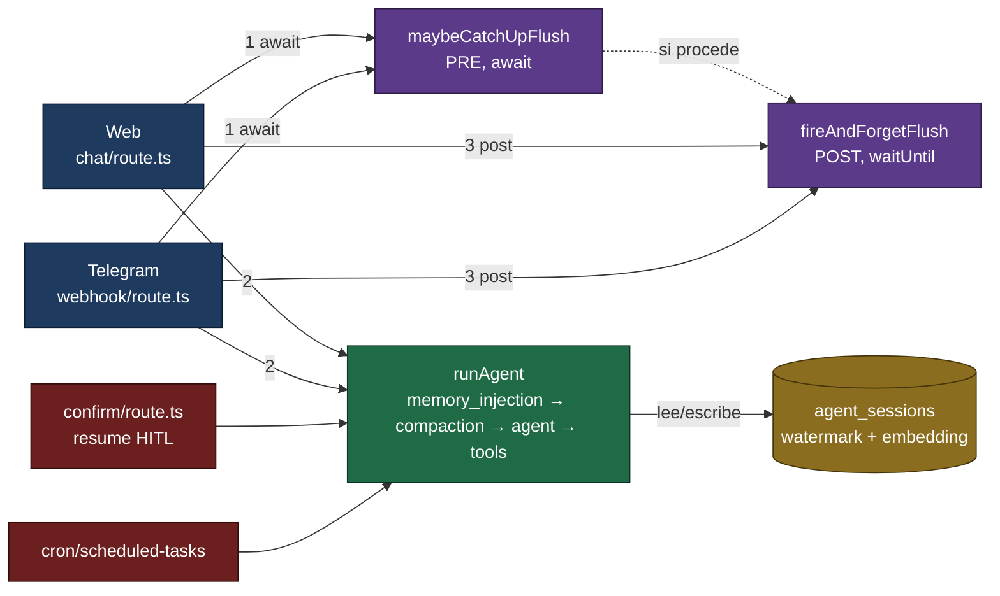
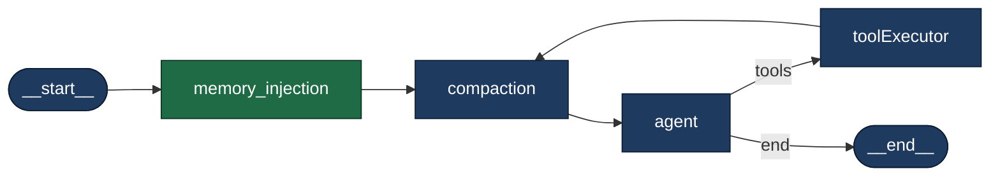
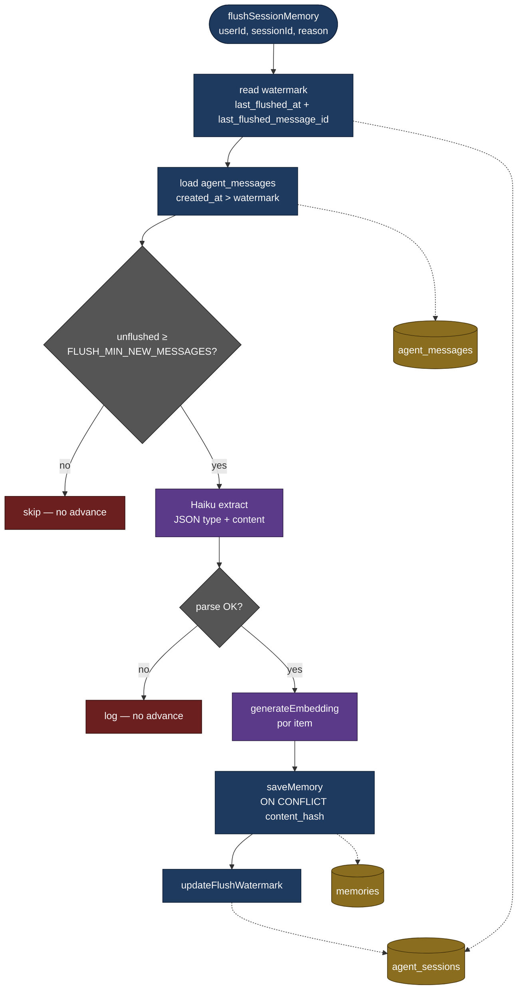

# Plan — Memoria de largo plazo

Este documento describe el **diseño y la implementación** de la memoria de largo plazo. El bloque siguiente es el **prompt original** usado para generar un primer borrador; se conserva por contexto, pero si entra en conflicto con las secciones posteriores, **prevalece lo documentado bajo *Diseño vigente***. Esa es la misma convención que usa `docs/memory/short_memory_plan.md`.

## Prompt original (referencia histórica)

**Objetivo**

Agregar memoria a largo plazo al agente: extracción de recuerdos al final de cada sesión e inyección de recuerdos relevantes al inicio de la siguiente. El sistema usa Supabase, donde ya existen tablas de mensajes y perfil de usuario.

**Insights clave**

- Dos procesos completamente separados: extracción (post-sesión, asíncrono) y recuperación (inicio de sesión, síncrono). No se mezclan.
- Tres tipos de memoria con clasificación explícita: `episodic` (qué hizo y cuándo), `semantic` (preferencias y conocimiento durable), `procedural` (cómo opera, sus rutinas).
- El prompt de extracción es conservador: solo extrae lo que seguirá siendo verdad en la próxima sesión. Nada trivial, nada de conversación de relleno. Si no hay nada relevante, no escribe nada.
- La recuperación es enfocada, no total: buscar por similitud semántica al input actual, retornar máximo 5–8 recuerdos. Inyectar todo el baúl sería Context Rot otra vez.
- Score de relevancia: cada recuerdo tiene un campo `retrieval_count`. Cada vez que se recupera, sube. Los recuerdos con score bajo se archivan eventualmente.
- Búsqueda con pgvector: Supabase tiene `pgvector` nativo. Embeddings al momento de guardar; búsqueda por cosine similarity.

**Lo que hay que construir (según el prompt original)**

1. Tabla `memories` en Supabase.
2. `memory_flush.ts` — extracción post-sesión con Haiku.
3. `memory_injection_node.ts` — nuevo nodo en el grafo.
4. Actualizar el grafo: `__start__ → memory_injection → compaction → agent → tools → compaction → ...`.

**Lo que NO se toca:** `compaction_node`, `agent_node`, `toolExecutorNode`, HITL, checkpointer, `iterationCount`.

## Notas de alineación con el código actual

Al validar el prompt contra `graph.ts`, `state.ts`, `compaction_node.ts`, `chat/route.ts` y `telegram/webhook/route.ts` se identificaron estas desviaciones; el **diseño vigente** las resuelve:

1. El `SystemMessage` efectivo del grafo se construye desde `effectiveSystemPrompt` (variable local en `runAgent`) **antes** de entrar al grafo. Escribir `state.systemPrompt` dentro de un nodo **no** altera el `SystemMessage` ya en `state.messages`. El nodo de inyección debe reescribir el **primer `SystemMessage`** en `state.messages` conservando su `id` (swap in-place vía `messagesStateReducer`), anteponiendo el bloque de memoria y preservando íntegro el contenido original del prompt.
2. `runAgent` entra con historia previa (hasta 12 mensajes de `getSessionMessages`) antes de la `HumanMessage` actual. El “input actual” es el **último** `HumanMessage` del estado, no el primero.
3. Compaction preserva el primer `SystemMessage` por `id`. Si el nodo **añadiera** un segundo `SystemMessage`, este quedaría fuera de `keepIds` y sería borrado con `RemoveMessage`. Por eso se reescribe el primero en vez de añadir uno nuevo.
4. Sesiones web/Telegram nunca se cierran explícitamente (no existe transición `status = 'closed'`). El patrón correcto es **flush perezoso con watermark**, no “al cerrar sesión”.
5. OpenRouter **sí** expone `/v1/embeddings`. Se usa `google/gemini-embedding-001` a 1536 dims (MRL) por su MTEB multilingual líder y su coste marginal en este volumen.
6. Cron (`autoApproveTools=true`) queda **excluido** de inyección y extracción: su sesión es determinista y compartida entre ejecuciones; contaminaría la memoria con hechos del sistema y rompería la decisión existente de arrancar sin historia (`graph.ts`, líneas 446–459).
7. Resume HITL (`resumeDecision` presente) **no** debe re-inyectar ni contar como nuevo turno: reutiliza el `checkpointThreadId` y retoma el grafo desde el interrupt. El nodo de inyección detecta ese caso y hace no-op.

---

# Diseño vigente

## Objetivo

Añadir memoria de largo plazo **sin tocar** `compaction_node`, `agent_node`, `toolExecutorNode`, HITL ni `getCheckpointer`. Dos procesos independientes colgados como:

- **Inyección**: un nodo nuevo al inicio del grafo (`memory_injection_node`).
- **Extracción**: un helper fuera del grafo (`flushSessionMemory`), disparado desde los endpoints de Web y Telegram, nunca desde el cron runner.

Clave del diseño: el **embedding del `userInput`** que necesita la inyección se **reutiliza** para detectar cambio de tema frente al embedding del turno anterior, que vive persistido en `agent_sessions`. Con eso obtenemos la señal principal de "cierre natural" sin una llamada LLM adicional.

## Arquitectura

Tres diagramas independientes para evitar la sopa visual: **(A) flujo por turno** (quién llama a qué), **(B) topología del grafo** (nodos dentro de `runAgent`) y **(C) flushSessionMemory** (pipeline de extracción).

### A. Flujo por turno — canal → runAgent → flush

Muestra el orden temporal dentro de un turno y cómo se conectan canales, helper de trigger, grafo y Supabase.



Tabla complementaria (quién hace qué por canal):

| Canal | Catch-up PRE | Inyección en runAgent | Flush POST |
|---|---|---|---|
| Web (`chat/route.ts`) | sí | sí | sí |
| Telegram mensajes (`webhook/route.ts`) | sí | sí | sí |
| Telegram callbacks (resume HITL) | no | no (guard resume) | no |
| `chat/confirm/route.ts` (resume HITL) | no | no (guard resume) | no |
| Cron (`autoApproveTools=true`) | no | no (guard cron) | no |

### B. Topología del grafo (dentro de `runAgent`)



El único nodo **nuevo** es `memory_injection` (verde). El resto se conserva intacto.

### C. Pipeline `flushSessionMemory`



APIs externas llamadas: `Haiku` (`anthropic/claude-3-5-haiku` vía OpenRouter, extracción) y `generateEmbedding` (`google/gemini-embedding-001` vía OpenRouter, 1536 dims).

## Triggers de extracción (flushSessionMemory)

**Default — POST fire-and-forget**, disparado tras `runAgent` en `chat/route.ts` y `telegram/webhook/route.ts` **solo si** `pendingConfirmation` es `null` (un turno con HITL pendiente no cerró todavía). Se dispara si **cualquiera** de estas señales se cumple:

| Señal | Fuente | Umbral inicial |
|---|---|---|
| Cambio de tema | `memory_injection_node` (cosine `last_user_input_embedding` ↔ `current`) | `< 0.55` |
| Cuenta | watermark vs `count(agent_messages)` | `≥ 15` mensajes sin flushear |
| Idle | watermark vs `NOW()` | `≥ 30 min` desde `last_flushed_at` |

Además se exige un mínimo de **3** mensajes sin flushear para no gastar Haiku en turnos triviales, incluso si hay shift.

**Excepción — PRE-await (catch-up)**: ejecutado **antes** de `runAgent` cuando:

- La sesión entrante tiene `last_message_at - last_flushed_at ≥ 20 min` (volvió tras un hueco), **o**
- El usuario cambió de canal y existe otra sesión del mismo `user_id` con mensajes sin flushear (watermark atrasado).

En ese caso se paga 1–3 s de latencia **una vez** (el primer turno tras el hueco) a cambio de que la inyección de ese mismo turno vea la memoria actualizada.

**Nunca**:

- En `chat/confirm/route.ts` (resume HITL del mismo turno). El flush se disparará cuando el turno realmente termine.
- En `cron/scheduled-tasks/route.ts`. Las sesiones `channel = 'cron'` no entran al pipeline de memoria.

## Constantes (ajustables por env)

| Constante | Default | Variable de entorno |
|---|---|---|
| `TOPIC_SHIFT_THRESHOLD` | `0.55` | `MEMORY_TOPIC_SHIFT_THRESHOLD` |
| `BACKSTOP_IDLE_MIN` | `30` | `MEMORY_BACKSTOP_IDLE_MIN` |
| `BACKSTOP_MAX_UNFLUSHED` | `15` | `MEMORY_BACKSTOP_MAX_UNFLUSHED` |
| `FLUSH_MIN_NEW_MESSAGES` | `3` | `MEMORY_FLUSH_MIN_NEW_MESSAGES` |
| `CATCHUP_IDLE_MIN` | `20` | `MEMORY_CATCHUP_IDLE_MIN` |
| `RETRIEVE_TOP_K` | `8` | `MEMORY_RETRIEVE_TOP_K` |
| `EMBEDDING_MODEL` | `google/gemini-embedding-001` | `MEMORY_EMBEDDING_MODEL` |
| `EMBEDDING_DIM` | `1536` | `MEMORY_EMBEDDING_DIM` |

> `FLUSH_MIN_NEW_MESSAGES` actúa como **piso de eficiencia**: aunque las señales shift/count/idle se disparen, no se lanza `flushSessionMemory` si hay menos de 3 filas en `agent_messages` con `created_at > last_flushed_at` (menos de 3 mensajes sin flushear desde el watermark). Sirve para evitar pagar una llamada a Haiku en turnos tan cortos (1 user + 1 assistant = 2) que no producen recuerdos útiles. Con ≥ 3 hay al menos un ida-y-vuelta completo más arranque → suficiente contexto para extraer.

## Archivos a crear

### 1. Migración SQL

`packages/db/supabase/migrations/00005_memories.sql`:

```sql
create extension if not exists vector;

-- ============================================================
-- memories
-- ============================================================
create table public.memories (
  id                uuid primary key default uuid_generate_v4(),
  user_id           uuid not null references public.profiles(id) on delete cascade,
  type              text not null check (type in ('episodic','semantic','procedural')),
  content           text not null,
  content_hash      text not null,
  embedding         vector(1536),
  embedding_model   text not null default 'google/gemini-embedding-001',
  embedding_dim     int  not null default 1536,
  retrieval_count   int  not null default 0,
  created_at        timestamptz not null default now(),
  last_retrieved_at timestamptz,
  unique (user_id, content_hash)
);

alter table public.memories enable row level security;

create policy "Users can manage own memories"
  on public.memories for all
  using (auth.uid() = user_id);

-- Índice vectorial. Se crea inmediatamente con lists bajo; para volumen real
-- conviene recalibrar (lists ≈ sqrt(rows)) o migrar a HNSW más adelante.
create index memories_embedding_ivfflat
  on public.memories
  using ivfflat (embedding vector_cosine_ops)
  with (lists = 100);

create index memories_user_created_idx
  on public.memories (user_id, created_at desc);

-- ============================================================
-- agent_sessions — watermark + topic-shift state
-- ============================================================
alter table public.agent_sessions
  add column if not exists last_message_at              timestamptz,
  add column if not exists last_flushed_at              timestamptz,
  add column if not exists last_flushed_message_id      uuid,
  add column if not exists last_user_input_embedding    vector(1536);

-- Trigger para mantener last_message_at al día al insertar en agent_messages.
create or replace function public.touch_session_last_message_at()
returns trigger as $$
begin
  update public.agent_sessions
     set last_message_at = new.created_at,
         updated_at      = now()
   where id = new.session_id;
  return new;
end;
$$ language plpgsql security definer;

drop trigger if exists on_agent_message_touch_session on public.agent_messages;
create trigger on_agent_message_touch_session
  after insert on public.agent_messages
  for each row execute procedure public.touch_session_last_message_at();

-- ============================================================
-- RPC: match_memories — búsqueda por cosine similarity
-- ============================================================
create or replace function public.match_memories(
  p_user_id      uuid,
  p_query_embedding vector(1536),
  p_match_count  int default 8
)
returns table (
  id              uuid,
  type            text,
  content         text,
  retrieval_count int,
  similarity      float
)
language sql
stable
security definer
as $$
  select m.id, m.type, m.content, m.retrieval_count,
         1 - (m.embedding <=> p_query_embedding) as similarity
    from public.memories m
   where m.user_id = p_user_id
     and m.embedding is not null
   order by m.embedding <=> p_query_embedding asc
   limit p_match_count;
$$;

-- Solo el propietario consulta; la función ya filtra por user_id. El servidor
-- pasa siempre el user_id resuelto; no se expone al cliente directamente.
revoke all on function public.match_memories(uuid, vector, int) from public;
grant execute on function public.match_memories(uuid, vector, int) to service_role;
```

> **Nota sobre RLS**: `memories` usa la misma política que las tablas existentes (`auth.uid() = user_id`). El servidor utiliza `createServerClient` (service role), que pasa el RLS; si algún día se consulta desde el cliente, la policy ya está lista.

### 2. `packages/db/src/queries/memories.ts`

Tres funciones, todas idempotentes:

- `saveMemory(db, { userId, type, content, embedding, embeddingModel, embeddingDim })` — inserta un renglón; `ON CONFLICT (user_id, content_hash) DO NOTHING`; el `content_hash` se calcula en TypeScript como `sha1(type + ':' + normalize(content))` con `normalize` = trim + lowercase + colapso de espacios.
- `searchMemories(db, { userId, embedding, limit })` — llama `db.rpc('match_memories', { p_user_id, p_query_embedding, p_match_count })`.
- `incrementRetrievalCount(db, ids)` — `UPDATE memories SET retrieval_count = retrieval_count + 1, last_retrieved_at = NOW() WHERE id = ANY(ids)`.

Exportar desde `packages/db/src/index.ts`.

### 3. Extender `packages/db/src/queries/sessions.ts`

Tres funciones nuevas:

- `getFlushState(db, sessionId)` → `{ lastFlushedAt, lastFlushedMessageId, lastMessageAt, lastUserInputEmbedding }`.
- `updateFlushWatermark(db, sessionId, { lastFlushedAt, lastFlushedMessageId })`.
- `updateLastUserInputEmbedding(db, sessionId, embedding: number[])`.

Exportar desde `packages/db/src/index.ts`.

### 4. `packages/agent/src/embeddings.ts`

Función única:

```ts
export async function generateEmbedding(text: string): Promise<number[]>
```

- `fetch` a `https://openrouter.ai/api/v1/embeddings` con `OPENROUTER_API_KEY`.
- Body: `{ model: MEMORY_EMBEDDING_MODEL, input: text, encoding_format: 'float' }`.
- Timeout duro (p. ej. 10 s) con `AbortController`.
- Retorna `response.data[0].embedding` recortado/validado a `EMBEDDING_DIM` elementos.
- Errores se propagan; el caller decide si degrada silenciosamente.

### 5. `packages/agent/src/nodes/memory_injection_node.ts`

Factory `createMemoryInjectionNode({ db, userId })` → nodo asíncrono de LangGraph.

Lógica:

1. **Guard cron**: si `state.autoApproveTools` → `return {}`.
2. **Guard resume HITL**: si el último mensaje no es un `HumanMessage` nuevo (detectable porque `state.messages` no trae input de este turno — es decir, no hay un `HumanMessage` posterior al último `SystemMessage` o a la última `ToolMessage`) → `return {}`.
3. Localizar el **último** `HumanMessage` en `state.messages`. Si no existe → `return {}`.
4. Llamar `generateEmbedding(userInput)` (una sola vez por turno).
5. Leer `last_user_input_embedding` y `last_flushed_at` vía `getFlushState`.
6. Calcular `topicShift`:
   - `topicShift = true` si hay `last_user_input_embedding` y `cosine(prev, current) < TOPIC_SHIFT_THRESHOLD`.
   - Si no hay previo (primera inyección), `topicShift = false`.
7. Ejecutar `searchMemories(db, { userId, embedding: current, limit: RETRIEVE_TOP_K })`.
8. Si hay resultados, construir bloque `[MEMORIA DEL USUARIO]` con líneas tipo `- (semantic) <content>`. Limitar a ≤ 1500 caracteres para no inflar contexto.
9. Reescribir **el primer `SystemMessage`** del `state.messages`:
   - Tomar su `id` y concatenar `memoryBlock + '\n\n---\n\n' + existingContent`.
   - Emitir un mensaje nuevo con el mismo `id` para que `messagesStateReducer` haga swap in-place.
10. `incrementRetrievalCount(db, ids)` (fire-and-forget dentro del nodo — no bloquea el turno si falla).
11. Persistir el embedding actual: `updateLastUserInputEmbedding(db, sessionId, current)`.
12. Retornar `Partial<GraphStateType>`:
    - `messages`: el reemplazo del `SystemMessage` (solo si hubo memoria que inyectar).
    - `memoryFlushPending: topicShift` (para que el caller sepa si debe disparar flush post).

### 6. `packages/agent/src/memory_flush.ts`

Función pura exportada:

```ts
export interface FlushInput {
  db: DbClient;
  userId: string;
  sessionId: string;
  reason: 'shift' | 'count' | 'idle' | 'catchup';
}
export async function flushSessionMemory(input: FlushInput): Promise<{
  extracted: number;
  skipped: boolean;
  reason: string;
}>
```

Pasos:

1. `getFlushState(db, sessionId)`.
2. Cargar mensajes desde `agent_messages` con `created_at > last_flushed_at` (o todos si `null`), ordenados asc, límite 200.
3. Si `messages.length < FLUSH_MIN_NEW_MESSAGES` → `{ skipped: true, reason: 'below_min' }`.
4. Serializar transcript (role + content, truncado por mensaje) y llamar a `createCompactionModel().invoke(...)` con el prompt conservador.
5. Prompt (es):
   > Extrae únicamente hechos que seguirán siendo verdad en la próxima conversación con este usuario. Clasifica cada uno como `episodic` / `semantic` / `procedural`. Devuelve un array JSON `[{ "type": "...", "content": "..." }]`. Si no hay nada digno de recordar, devuelve `[]`. No incluyas texto fuera del JSON.
6. Parsear respuesta; si falla → log y salir sin actualizar watermark (se reintenta al próximo disparo).
7. Para cada `{ type, content }`:
   - `embedding = generateEmbedding(content)`,
   - `content_hash = sha1(type + ':' + normalize(content))`,
   - `saveMemory(...)` con `ON CONFLICT DO NOTHING`.
8. `updateFlushWatermark(db, sessionId, { lastFlushedAt: NOW(), lastFlushedMessageId: lastId })`.

Errores de Haiku / embedding no detienen el caller; se propagan al log. El watermark **solo** avanza si hubo intento exitoso (o lista vacía válida), para garantizar catch-up idempotente.

### 7. Extender `packages/agent/src/state.ts`

Añadir:

```ts
memoryFlushPending: Annotation<boolean>({
  reducer: (_prev, next) => next,
  default: () => false,
}),
```

Justificación: el nodo de inyección detecta el shift con el embedding que ya pagó; el caller (`chat/route.ts`, `telegram/webhook/route.ts`) necesita saberlo para decidir si dispara el flush post-turno. No se mueve el flush dentro del grafo porque debe correr **después** de que `runAgent` devuelva y la respuesta ya fue enviada al usuario. El campo viaja en el snapshot final del checkpointer y se lee vía `app.getState(...)`.

### 8. Actualizar `packages/agent/src/graph.ts`

- Importar `createMemoryInjectionNode` y ampliar `AgentInput` opcionalmente con nada nuevo (el nodo toma `db` y `userId` del estado y del closure).
- Instanciar el nodo dentro de `runAgent`:

```ts
const memoryInjection = createMemoryInjectionNode({ db, userId });
```

- Reordenar el grafo:

```
__start__ → memory_injection → compaction → agent → (tools | __end__)
tools → compaction
```

- Inicializar `memoryFlushPending: false` en el graphInput del caso no-resume.
- Devolver `memoryFlushPending` dentro de `AgentOutput`:

```ts
export interface AgentOutput {
  response: string;
  toolCalls: string[];
  pendingConfirmation: PendingConfirmation | null;
  memoryFlushPending: boolean;
}
```

- Leer el valor desde el `snapshot` final del checkpointer, igual que se lee `messages`/`__interrupt__`.

### 9. Exportar desde `packages/agent/src/index.ts`

```ts
export { flushSessionMemory } from "./memory_flush";
export type { FlushInput } from "./memory_flush";
```

### 10. Helper compartido: `apps/web/src/lib/memory/trigger.ts`

Para evitar duplicar lógica entre `chat/route.ts` y `telegram/webhook/route.ts`:

```ts
export async function maybeCatchUpFlush(deps): Promise<void>
export function fireAndForgetFlush(deps, reason): void
```

- `maybeCatchUpFlush`: lee `getFlushState`, calcula si hay que awaitear un flush pre-runAgent (idle ≥ `CATCHUP_IDLE_MIN` o cambio de canal con watermark atrasado).
- `fireAndForgetFlush`: chequea condiciones post-turno (shift / count / idle) y dispara el flush en background. En entorno Vercel usa `waitUntil` (importado condicionalmente desde `next/server`); en Node largo usa `.catch(console.error)`.

### 11. Modificar `apps/web/src/app/api/chat/route.ts`

- Antes de `runAgent`: `await maybeCatchUpFlush({ db, userId: user.id, sessionId: session.id })`.
- Tras `runAgent` y **solo si** `result.pendingConfirmation === null`: `fireAndForgetFlush({ db, userId, sessionId, memoryFlushPending: result.memoryFlushPending }, 'post-turn')`.

### 12. Modificar `apps/web/src/app/api/telegram/webhook/route.ts`

Mismo patrón que el de Web:

- `maybeCatchUpFlush` antes del `runAgent` del flujo de mensajes (no en el de callback_query, que es resume HITL).
- `fireAndForgetFlush` tras `runAgent` si no hay `pendingConfirmation`.

### 13. NO modificar

- `apps/web/src/app/api/chat/confirm/route.ts`: es un resume HITL. El flush se dispara desde el endpoint que originó el turno, cuando ese turno realmente cierre.
- `apps/web/src/app/api/cron/scheduled-tasks/route.ts`: el cron no inyecta ni extrae memoria. Sesiones `channel = 'cron'` quedan fuera del pipeline.

## Nota de despliegue (serverless / Vercel)

El `fireAndForgetFlush` puede ser interrumpido si la función serverless termina al devolver la respuesta. Mitigaciones, en orden:

1. **Preferido**: `waitUntil(promise)` desde `next/server` (Edge) o `unstable_after` (Next.js 15+) — la plataforma espera a que el promise termine sin retrasar la respuesta al usuario.
2. **Alternativa**: mover el flush a una cola (Inngest, QStash, Supabase Edge Function + pg_cron).
3. **Fallback**: `.catch(console.error)` — funciona perfectamente en procesos Node largos (Docker, Railway, Fly). En serverless puede perder flushes sueltos, pero el **watermark** garantiza que el siguiente disparo (turno nuevo o catch-up) procese los mensajes que quedaron sin flushear.

## Qué NO se toca (intención original preservada)

No se reescribe ni altera la lógica de `compaction_node`, `agent_node`, `toolExecutorNode`, la maquinaria de `interrupt()` / HITL, ni `getCheckpointer`. La memoria larga cuelga como **procesos adicionales** (nodo al inicio del grafo + helper fuera del grafo) sin romper ese núcleo.

- `iterationCount` sigue siendo el guard de `MAX_TOOL_ITERATIONS` (ver `short_memory_plan.md`). Este plan no lo reinicia, ni lo lee, ni lo modifica.
- `compactionCount` tampoco se toca.
- El nodo de inyección reescribe **solo** el contenido del primer `SystemMessage` (por `id`); cualquier otro mensaje queda como está.
- El bloque `[MEMORIA DEL USUARIO]` pasa por `compaction_node` como parte del primer `SystemMessage`, que ya está en `keepIds`. Su tamaño está acotado (≤ 1500 chars) para no inflar la estimación de tokens que dispara la etapa 2 de compaction.

## Criterios de aceptación

- Inyección: en un turno normal, el primer `SystemMessage` visto por `agent_node` contiene el bloque `[MEMORIA DEL USUARIO]` cuando hay recuerdos relevantes, y su contenido original se preserva íntegro.
- Inyección en cron (`autoApproveTools=true`): no corre (no genera embedding, no toca DB, no modifica el `SystemMessage`).
- Inyección en resume HITL: no corre (no duplica embedding ni incrementa `retrieval_count`).
- Extracción: solo corre cuando hay ≥ `FLUSH_MIN_NEW_MESSAGES` sin flushear y al menos una señal (shift / count / idle). No corre si hay `pendingConfirmation`.
- Watermark: tras un flush exitoso, `last_flushed_at` y `last_flushed_message_id` avanzan; tras un fallo (parse o embedding), no avanzan.
- Dedup: dos turnos que describen el mismo hecho generan UN solo renglón en `memories` (por `UNIQUE (user_id, content_hash)`).
- Cruce de canales: un recuerdo extraído en sesión Web aparece en búsqueda de sesión Telegram del mismo `user_id` (y viceversa).
- Compaction: con inyección activa, las pruebas existentes de `compaction_node` siguen pasando (preservación del primer `SystemMessage`, `iterationCount`, etc.).

## Validación técnica

- `npm run type-check -w @agents/agent` y `npm run type-check -w @agents/db`.
- `npm run test:compaction-node -w @agents/agent` (no debe romperse por el bloque extra en el `SystemMessage`).
- Prueba manual: dos turnos con cambio claro de tema → primer turno sin bloque, segundo turno con bloque de memoria extraída del primero.
- Prueba manual: alternar Web ↔ Telegram con el mismo usuario → el segundo canal ve recuerdos generados en el primero.
- Prueba manual: una tarea cron con `autoApproveTools=true` no escribe filas en `memories` y no altera el `SystemMessage`.
