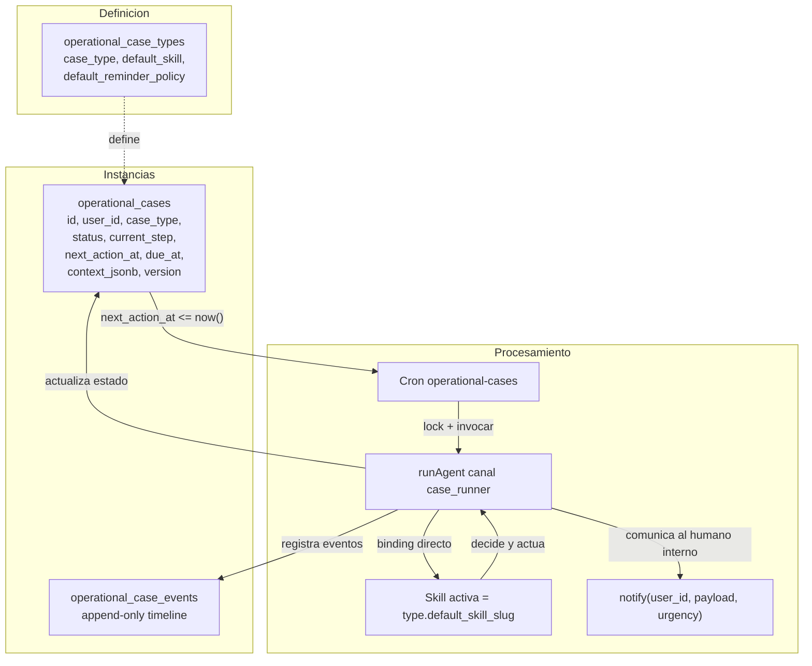
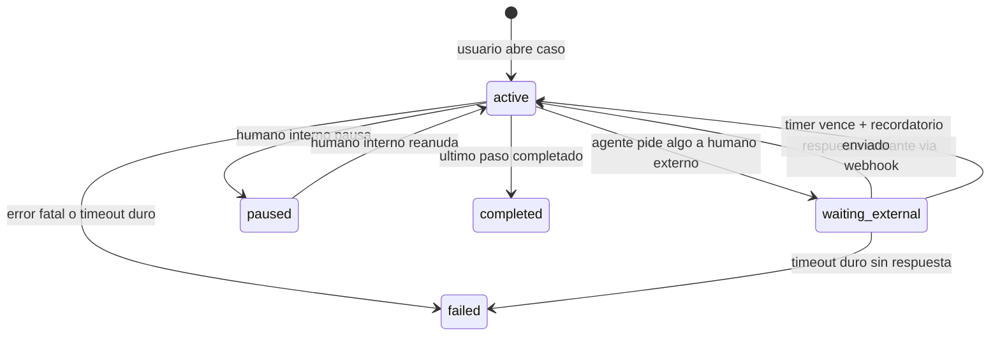
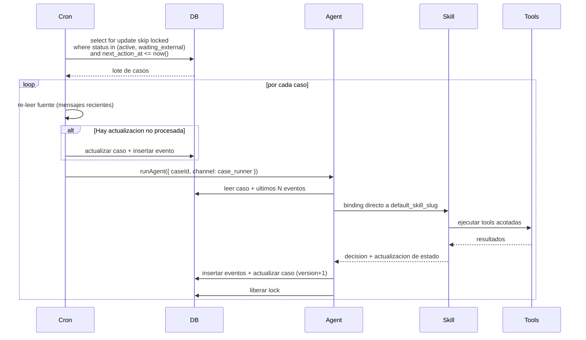
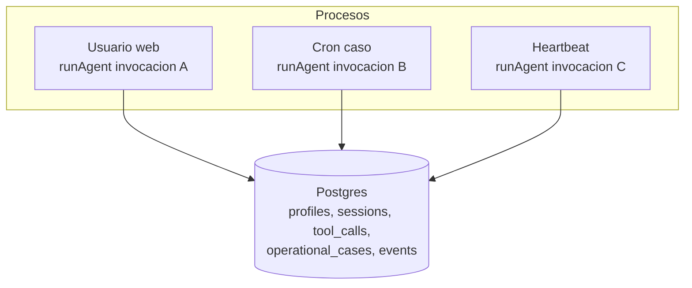
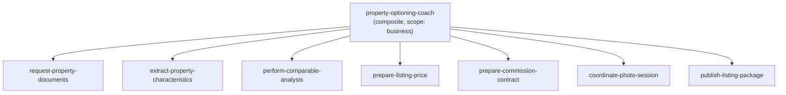
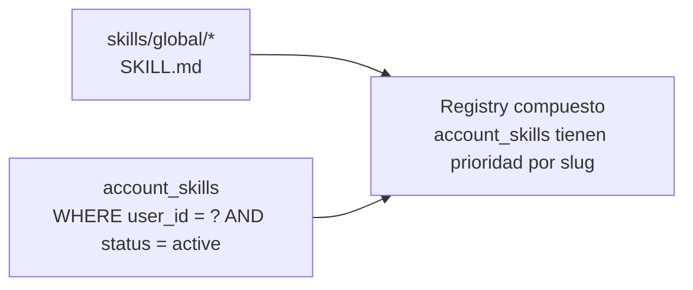

# Subsistema de Casos operacionales — Arquitectura

> Este documento sobrevive al plan. Describe **cómo funciona** el subsistema una vez implementado, separado del plan de ejecución y de las decisiones temporales.
>
> Plan asociado: [`plan.md`](plan.md). Consideraciones futuras: [`future-considerations.md`](future-considerations.md).

---

## 1. Por qué existe

El runtime actual de Gu OS (LangGraph + skills + tools + HITL + Heartbeat + scheduled tasks) cubre bien:

- conversaciones turn-by-turn,
- pausas cortas con HITL dentro de un turno,
- pulsos periódicos exception-first,
- tareas programadas one-shot/recurrentes con prompts.

No cubre bien procedimientos operativos **multi-día** que combinan: pasos secuenciales, esperas a humanos externos (dueño que no responde), recordatorios escalonados, deadlines, eventos asíncronos entrantes, reanudación, y memoria de "dónde voy" separada del thread de chat.

Ese es el hueco que llena el subsistema de casos operacionales.

---

## 2. Modelo conceptual

- **Tipo de caso (`operational_case_types`)** define el "qué procedimiento es" (`property_optioning`, `lead_qualification`, etc.) y a qué skill compuesta apunta por default.
- **Instancia (`operational_cases`)** es la unidad viva. Tiene estado, paso actual, deadline, contexto y versión para optimistic locking.
- **Eventos (`operational_case_events`)** son la historia append-only. Reconstrucción completa siempre disponible.

---

## 3. Ciclo de vida de un caso

Estados:

| Estado | Significado |
|---|---|
| `active` | El sistema (cron) procesará en `next_action_at`. |
| `waiting_external` | Esperando input externo (dueño, lead). El cron solo dispara recordatorios/escalación según `due_at` y reminder policy. |
| `paused` | El humano interno lo detuvo a propósito; el cron lo ignora. |
| `completed` | Todos los pasos completos. El caso es solo lectura/auditoría. |
| `failed` | Error fatal o se excedió un timeout duro sin recuperación posible. |

---

## 4. Procesamiento (cron + agente)

**Reglas duras del cron:**

- El cron es **determinístico**. No usa LLM. Solo decide "este caso vence" e invoca `runAgent` con `caseId`.
- El cron **siempre re-lee la fuente** antes de actuar para evitar recordatorios molestos sobre estado obsoleto.
- El cron toma **lock por caso** con `select ... for update skip locked`; nunca dos workers procesan el mismo caso a la vez.

**Reglas duras del agente (cuando se invoca con `caseId`):**

- Lee `operational_cases` + últimos N eventos antes de razonar.
- **Binding directo de skill**: salta el selector. La skill es `operational_case_types.default_skill_slug`.
- Cualquier escritura al caso usa `version` para optimistic locking; si choca, reintenta.
- Decisiones de juicio comercial (precio, contrato, publicación) **siempre HITL**.

### Detalle: límite de lote, cola en memoria y concurrencia (implementación actual)

La ruta `POST /api/cron/operational-cases` no procesa “solo los primeros N casos y descarta el resto”. Comportamiento real:

| Pieza | Comportamiento |
|---|---|
| **Lectura desde Postgres** | `getDueOperationalCases` trae un **lote acotado** de filas vencidas. El caller del cron pasa `limit` (p. ej. 100). La query en `packages/db` **caps** el valor a **máximo 200** por invocación. Si hay más casos vencidos que ese límite, el **sobrante sigue en base** con `next_action_at` en el pasado y se atenderá en **la siguiente ejecución** del cron (o en la misma si el primer lote ya avanzó y vació cola). |
| **Cola en esta invocación** | Todos los casos devueltos en ese lote entran en una **cola en memoria**. Varios **workers** (ver abajo) van sacando de la cola de uno en uno; **cada worker espera** a que termine `processCase` antes de tomar el siguiente. |
| **`OPERATIONAL_CASES_CONCURRENCY`** | Número de workers **en paralelo dentro de una misma** invocación HTTP del cron. Es **global** a esa corrida (no “por usuario”). El valor se **acota entre 1 y 20** en código. No aumenta cuántos casos se **leen** de Postgres; solo cuántos `runAgent` corren a la vez sobre el lote ya cargado. |
| **Lock por caso** | `markCaseProcessing` implementa un lease corto vía `version` + `next_action_at`. Si dos invocaciones del cron se solapan, un caso puede devolver `skipped` para la segunda; **no se pierde**: volverá a salir como vencido en otro tick. |

**Aclaración importante:** el límite de concurrencia **no** significa que los casos 6–50 “no se atienden” en esa corrida: se atienden **después** en la misma petición, en serie por worker, en orden de salida de la cola. Lo que **sí** puede quedar fuera es lo que **no entró en el lote** por el `limit` de la query (p. ej. >100 si el cron pide 100).

### Señales de degradación y cómo escalar con criterio

Cuando el volumen suba, vigilar:

| Señal | Qué suele indicar |
|---|---|
| **Cola de vencidos que no baja** (muchas filas con `next_action_at <= now()` por varios ticks) | El cron no alcanza a drenar: duración de cada `runAgent` muy alta, lote muy pequeño, o frecuencia del cron baja. |
| **Duración del request del cron** cerca del timeout del hosting | Demasiados casos por invocación o pasos demasiado pesados; riesgo de cortes a medias. |
| **Aumento de `skipped`** en logs | Solapamiento de schedulers o contención de `version`; revisar que no haya dos crons pegándole al mismo endpoint con la misma ventana. |
| **402 / rate limit** del proveedor LLM | Demasiada concurrencia o demasiados casos activos a la vez. |
| **Presión en pool de Postgres** | Muchas sesiones concurrentes de agente escribiendo en el mismo proyecto. |

**Palancas típicas (en orden de “menos riesgo” a “más invasivo”):**

1. **Aumentar la frecuencia del cron** (p. ej. cada 1–2 min en lugar de 5) para drenar el mismo límite de filas más veces por hora.
2. **Subir el `limit` del lote** en la llamada a `getDueOperationalCases` (respetando cap 200 en DB o subiendo ese cap de forma consciente) si el código y el timeout lo permiten.
3. **Subir `OPERATIONAL_CASES_CONCURRENCY` dentro del rango 1–20** solo si hay margen de costo LLM, límites de API y CPU/memoria del despliegue.
4. **Aligerar el trabajo por tick**: skills más cortas, menos tools por paso, o pasos que no invoquen al LLM cuando se pueda hacer con SQL determinista.
5. **Observabilidad**: métricas de “casos vencidos pendientes”, latencia p95 del cron, y ratio ok/skipped/error por tick.

Cuando ni con frecuencia + lote + concurrencia razonable se estabiliza la cola, **volver a leer** la sección de motor durable en [`future-considerations.md`](future-considerations.md) (Temporal/Inngest): no es el primer remedio, pero es el camino cuando el patrón cron+lote deja de ser mantenible.

---

## 5. Concurrencia con turnos del usuario

Los casos no compiten con turnos web/Telegram del usuario. Cada `runAgent` es invocación independiente con su propio thread:

- Si el usuario pregunta sobre un caso mientras el cron lo procesa, el `runAgent` del usuario lee el caso (lectura no bloquea), pero al escribir respeta el lock; si el caso está bloqueado, responde con la última versión visible y avisa "se está procesando".
- Costos LLM acotados con concurrencia limitada en cada cron (`OPERATIONAL_CASES_CONCURRENCY` similar a `HEARTBEAT_CONCURRENCY`).

---

## 6. Webhook de eventos externos

Una respuesta entrante de un humano externo (ej. el dueño manda foto del predial por Telegram) debe poder despertar el caso inmediatamente, sin esperar el siguiente tick del cron.

Patrón:

1. El webhook del canal (`/api/telegram/webhook`) detecta que el mensaje viene de un `chat_id` asociado a un caso `waiting_external`.
2. Inserta un evento `external_response` en `operational_case_events`.
3. Actualiza `operational_cases.next_action_at = now()` para que el siguiente tick del cron lo procese.
4. Opcional: dispara procesamiento inmediato si la concurrencia lo permite.

Esta asociación se mantiene en `operational_cases.external_contact_jsonb` (`{ channel, chat_id }`).

---

## 7. Notificación al humano interno

Capa nueva `notify(user_id, payload, urgency)`:

- Lee `user_notification_preferences.channels_priority_jsonb`.
- Decide canal según preferencia + presencia (sesión web reciente) + urgencia.
- Default actual: web si activo, Telegram si no.
- En el futuro: email, WhatsApp, push web.

Se usa siempre desde el agente o el cron cuando hay que avisarle algo al inmobiliario (recordatorio, aprobación pendiente, escalación, paquete listo).

---

## 8. Skills compuestas y atómicas

Una skill compuesta (`property-optioning-coach`) usa `includes` para combinar atómicas. Cada atómica es un SKILL.md con `allowed_tools` acotado; la composite hereda la unión.

Doctrina:

- La composite describe la **secuencia esperada** y los **gates HITL**.
- Las atómicas son reusables fuera del caso (ej. `request-property-documents` puede invocarse standalone).
- Promoción a `account_skills`: cuando una composite es específica de un cliente (ej. variante de Alebrixe), se mueve de `skills/global/` a `account_skills` de ese cliente.

---

## 9. Account skills V1: cómo se integra

El runtime de skills (`packages/agent/src/skills/runtime.ts`) compone el registry así:

- Si una `account_skill` y una global tienen el mismo slug, **gana la account**. Esto permite que un cliente customice una skill global sin perder la base.
- `includes` puede mezclar orígenes (una composite global puede incluir una atómica de cuenta y viceversa).
- Validación Zod idéntica para ambos orígenes.

---

## 10. Convenciones operativas

| Convención | Detalle |
|---|---|
| Canal `case_runner` | Nuevo valor agregado a `agent_sessions.channel_check`. Se usa en `runAgent({ channel: 'case_runner', caseId })`. |
| Sesión por caso | `getOrCreateSession(db, userId, 'case_runner', { caseId })`. Una sesión persistente por caso para auditoría unificada. |
| Idempotencia de eventos | Cuando el cron detecta una desincronización (ej. respuesta externa ya integrada), inserta un evento `state_changed` con `payload.reason: 'reconciled'`. |
| Bloqueo de tools fuera de allowlist | Igual que Heartbeat: el canal `case_runner` puede tener su propia allowlist conservadora si lo amerita. |
| Tracing | Cada turno del agente emite `AgentTurnEvent`; los eventos persistidos llevan `turn_id` correlacionado. |

---

## 11. Métricas y observabilidad mínimas

Para evitar casos zombie y degradación silenciosa:

- Casos abiertos por `case_type` y por edad (>7d, >30d, >90d).
- Tasa de completados vs fallidos por `case_type`.
- Tiempo promedio en cada `current_step`.
- Recordatorios enviados por caso (alertar si >3 sin respuesta).
- Locks no liberados (alertar si un caso está `for update` >5 min).

Implementación inicial: vistas SQL sobre `operational_cases` + `operational_case_events`. Dashboards visuales pueden venir después.
