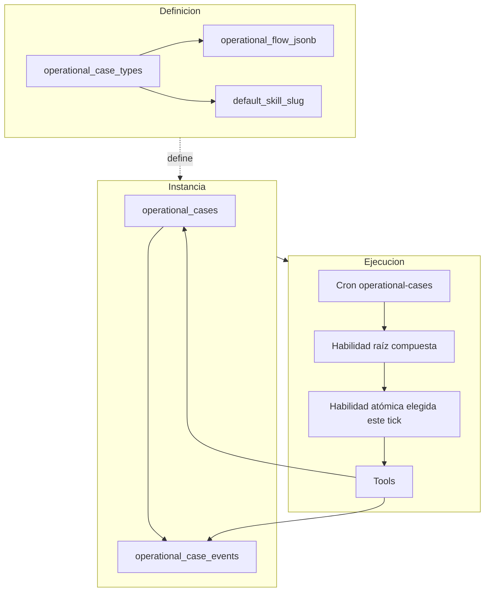
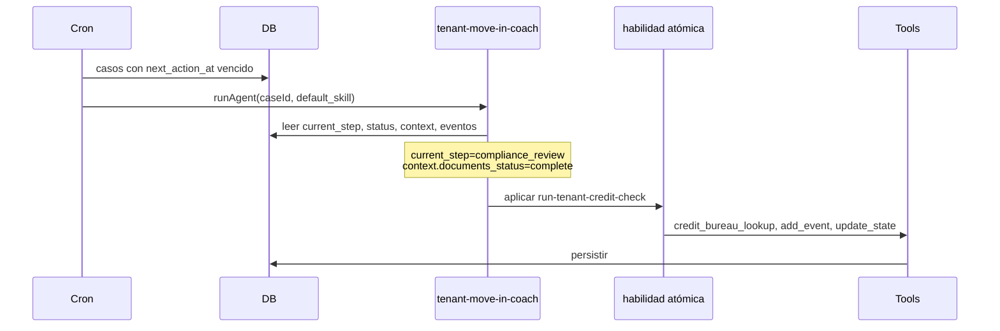

# Playbook de autoría — Casos de uso

> **Estado:** v1.1 — modelo de autoría + readiness. **N0–N3** y **N4 v1** (un tick, escenarios en código) implementados. **N5** caso E2E y **N4 v2** multi-tick siguen pendientes; ver [§12](#12-pendientes-de-implementación).
>
> **Documentos relacionados**
> - [`architecture.md`](architecture.md) — subsistema, cron, tablas, binding de habilidad raíz.
> - [`testing-framework.md`](testing-framework.md) — marco N0–N5 de pruebas en Preparación operativa.
> - [`operational-case-reusable-patterns.md`](operational-case-reusable-patterns.md) — catálogo de patrones reutilizables (IDs `PATTERN_*`, `n2_*`).
> - [`use-case-authoring-vision.md`](use-case-authoring-vision.md) — visión NL → propuesta implementable.
> - [`../skills-tools-architecture.md`](../skills-tools-architecture.md) — habilidades, tools, HITL.

---

## 1. Glosario (terminología UI + runtime)

| Término | Significado |
|---------|-------------|
| **Tipo de caso** | Fila en `operational_case_types`: `case_type`, `default_skill_slug`, `operational_flow_jsonb`, políticas, intake. |
| **Paso del flujo** | Entrada en `operational_flow_jsonb`: hito de negocio con `step_key`, `step_label`, habilidades y tools para UI/readiness. |
| **`step_key`** | Identificador estable del paso. Valores posibles de `current_step` en instancias de ese tipo de caso. |
| **`step_label`** | Etiqueta humana del paso en Preparación operativa («Solicitar documentos»). |
| **`current_step`** | En `operational_cases`: en qué **hito del procedimiento** está **esta instancia**. Coincide con un `step_key` del flow, no con el slug de una habilidad. |
| **`status`** | Modo operativo genérico del motor del caso (ver §3). |
| **`context_jsonb`** | Sub-progreso, flags y artefactos **dentro** del hito actual (qué ya se hizo, borradores, listas). |
| **`operational_case_events`** | Timeline append-only: `external_response`, `reminder_sent`, decisiones HITL, auditoría. |
| **Habilidad raíz** | Única habilidad **compuesta** por tipo de caso (`default_skill_slug`). La invoca el cron en `case_runner`. |
| **Habilidad atómica** | Habilidad sin `includes` en su frontmatter (puede usar muchas tools y lógica extensa). |
| **Habilidad del paso** | Habilidad atómica declarada en `step_skills[]` de un paso del flow (puede haber 0..n). |
| **`step_tools`** | Tools declaradas directamente en el paso (sin habilidad), típico en preparación/intake. |
| **Completar registro del caso** | Hito `intake` previo al flujo operativo numerado: datos mínimos y alta. En settings se valida con la tarjeta **Preparar caso de prueba** (N0), no como Paso 1. |
| **Superficie de tool** | Clasificación en [`tool-surface-classification.ts`](../../apps/web/src/lib/operational-cases/tool-surface-classification.ts): qué exige N1, qué es interna (N3/N4) o solo escenario (`scenario_only`). |

**Reglas de nomenclatura:**

```text
current_step  =  step_key del paso en el que está el caso (un valor durable)
status        =  modo del motor (active, waiting_external, …)
context       =  detalle para decidir qué hacer dentro del mismo current_step
```

**No** crear un `current_step` distinto por cada habilidad del mismo paso visible.

---

## 2. Tres capas del modelo



| Capa | Qué contiene | Quién la usa |
|------|--------------|--------------|
| **Definición** | Tipo de caso, flow, habilidad raíz, intake, activación | Autoría, migraciones, UI Casos de uso |
| **Instancia** | `current_step`, `status`, `context_jsonb`, deadlines, versión | Cron, agente, webhooks, UI del caso |
| **Ejecución** | Tick del cron → raíz → decisión → tools → persistencia | Runtime Gu OS |

**Importante:** `operational_flow_jsonb` **no** es el scheduler del cron. Sirve para **presentar**, **documentar** y **probar** el procedimiento. La orquestación en producción vive en el `SKILL.md` de la **habilidad raíz** (mapa `current_step` → qué hacer).

Comentario en migración `00025_operational_case_flow.sql`:

> *Estructura UI/operacional paso → skill → tool para readiness, prueba controlada y activación. El runtime sigue usando `default_skill_slug` + SKILL.md.*

---

## 3. `current_step` vs `status` vs `context_jsonb`

Son **tres campos distintos** en `operational_cases`. No son sinónimos.

### 3.1 `status` — modo operativo del motor

Valores típicos (`00019` + `00036`):

| `status` | Significado |
|----------|-------------|
| `active` | El cron puede procesar en `next_action_at`; el agente actúa. |
| `waiting_external` | Esperando humano externo (propietario, lead). Recordatorios/escalación según política. |
| `waiting_internal` | Esperando asesor (aprobación, input). |
| `paused` | Pausado por operador; cron ignora. |
| `completed` | Procedimiento cerrado con éxito. |
| `failed` | Error fatal o timeout duro. |

### 3.2 `current_step` — hito del procedimiento

Identificador de **etapa de negocio** del `case_type`. En `property_optioning` coincide con `step_key` del flow:

```text
intake
awaiting_documents
documents_received
comparables_in_progress
price_proposal_pending
contract_pending
photos_scheduled
package_ready
```

**No** es:

- el nombre de una habilidad (`request-property-documents`);
- un sub-estado inventado solo para UI («envié_recordatorio_2»);
- el índice «Paso 2» de la pantalla.

### 3.3 `context_jsonb` — sub-progreso dentro del hito

Ejemplos:

```json
{
  "compliance": {
    "documents_status": "complete",
    "credit_status": "running",
    "references_status": "pending"
  },
  "property_data": { },
  "documents_received": []
}
```

La habilidad raíz usa `context` + eventos para elegir **qué habilidad atómica** aplicar **sin cambiar** `current_step` hasta cerrar el objetivo del paso.

### 3.4 Combinación (ejemplo real `property_optioning`)

| Momento | `current_step` | `status` | Lectura |
|---------|----------------|----------|---------|
| Recién creado, falta intake | `intake` | `active` | Capturando datos mínimos |
| Mensaje enviado al dueño | `awaiting_documents` | `waiting_external` | Mismo paso; ahora esperamos |
| Recordatorio 48h | `awaiting_documents` | `waiting_external` | Mismo paso; misma habilidad, otra rama |
| Escritura clave recibida | `documents_received` | `active` | **Cambió el hito** — nuevo paso |
| Precio propuesto, espera asesor | `price_proposal_pending` | `waiting_internal` | Hito de precio; espera interna |

---

## 4. Habilidad raíz vs habilidades del paso

### 4.1 Una habilidad raíz compuesta por tipo de caso

```text
operational_case_types.default_skill_slug = property-optioning-coach
```

- El cron **siempre** invoca esa habilidad (`channel: case_runner`, binding directo).
- **No** invoca por paso una habilidad distinta desde el scheduler.
- **No** debe haber dos habilidades compuestas «raíz» para el mismo `case_type`.

### 4.2 Habilidades atómicas incluidas y declaradas en el flow

La raíz declara `includes:` con las habilidades atómicas que puede necesitar. El flow declara `step_skills[]` para UI, readiness y contratos de prueba.

| Artefacto | Rol |
|-----------|-----|
| `includes` en SKILL.md raíz | Qué habilidades puede cargar/usar el runtime |
| `step_skills[]` en flow | Qué habilidades se muestran y prueban en cada paso visible |
| Mapa en SKILL.md raíz | `current_step` → qué lógica/habilidad aplicar |

### 4.3 Decisión en cada tick (no cola del array)

```text
NO:  step_skills[0] → step_skills[1] → step_skills[2] automáticamente

SÍ:  leer current_step + status + context_jsonb + eventos
     → elegir UNA línea de comportamiento (habilidad atómica o rama inline)
     → tools → actualizar caso
```

Si un paso declara **cuatro** habilidades en `step_skills[]`, la raíz puede usar cualquiera según el estado; el orden del array **no** es orden de ejecución.

### 4.4 ¿Habilidad compuesta dentro de un paso?

**Patrón recomendado:** solo la raíz es compuesta; las del paso son **atómicas**.

**Excepción posible (evitar por defecto):** una habilidad compuesta «ligera» en un paso si encapsula un subflujo reutilizable en varios case types. No debe competir con la raíz por avanzar `current_step` del caso completo.

---

## 5. Criterios para definir pasos (`step_key`)

### 5.1 Crear un **nuevo** paso cuando cambia el objetivo **durable**

- artefacto principal esperado del hito;
- responsable dominante (externo vs interno vs sistema);
- tipo de espera / SLA / `due_at`;
- aprobación HITL de naturaleza distinta;
- integración o riesgo dominante distinto.

### 5.2 Mantener el **mismo** paso cuando son variantes de la misma intención

- primer mensaje, recordatorio, escalación (`awaiting_documents`);
- reintentos de la misma tool;
- ramas que no cambian el artefacto ni el responsable del hito.

### 5.3 Señal de que un paso tiene demasiadas habilidades

Si dentro del **mismo** `step_key` necesitas elegir entre habilidades con objetivos muy distintos **y** estados de espera distintos, evalúa **partir en dos `step_key`**:

```text
Mal aglomerado (ejemplo):
  current_step = documents_received
  skills: extract, validate-completeness, ask-human-review, request-missing-fields

Mejor (ejemplo):
  documents_received        → extraer y normalizar
  characteristics_review    → HITL asesor
  characteristics_ready     → listo para comparables
```

### 5.4 Paso sin habilidad (`step_tools` only)

Válido para **intake** u homólogos: el hito es captura/creación; la raíz ejecuta tools declaradas en `step_tools` sin `step_skills[]`.

---

## 6. Dónde vive cada especificación

| Qué | Dónde | Notas |
|-----|--------|-------|
| Qué habilidad invoca el cron | `operational_case_types.default_skill_slug` | Una por `case_type` |
| Orquestación por `current_step` | `SKILL.md` de la habilidad raíz | Mapa, guardrails, transiciones |
| Habilidades atómicas reutilizables | `skills/global/<slug>/SKILL.md` | Sin `includes` |
| Pasos, habilidades, tools, contratos N3 | `operational_flow_jsonb` | UI + `run-skill` |
| Contratos N4 paso (futuro) | `step_test_contract` en flow (propuesto) | Ver §12 |
| Estado vivo | `operational_cases` + `operational_case_events` | `version` optimistic lock |
| Política recordatorios | `default_reminder_policy` / por caso | Cron determinístico + skill |

---

## 7. Patrón al crear un nuevo caso de uso

Orden recomendado (negocio → técnica):

1. **Resultado de negocio final** — qué significa «caso completado».
2. **Actores** — asesor interno, contacto externo, integraciones (Telegram, EasyBroker, …).
3. **Esperas y deadlines** — ¿quién puede bloquear días? ¿recordatorios?
4. **Artefactos acumulados** — documentos, datos estructurados, borradores, publicaciones.
5. **Pasos (`step_key`)** — hitos con entrada/salida claras (§5).
6. **Habilidad raíz compuesta** (`*-coach`) con `includes` de todas las atómicas necesarias.
7. **Habilidades atómicas por paso** — preferir **una** si basta; varias solo con razón (§9).
8. **Tools por habilidad** — `allowed_tools`, riesgo, HITL.
9. **`operational_flow_jsonb`** — alineado 1:1 con `step_key` y skills/tools.
10. **Contratos de prueba** — `test_contract` por habilidad (N3); escenarios N4 en [`step-test-scenario-registry.ts`](../../apps/web/src/lib/operational-cases/step-test-scenario-registry.ts). Asignar IDs del [catálogo de patrones](operational-case-reusable-patterns.md).
11. **Caso de prueba aislado** — N0; batería N1–N4 según [`testing-framework.md`](testing-framework.md) y checklist del catálogo §8.
12. **Activación** — checklist UI; N5 (caso E2E) cuando exista automatización o piloto manual documentado.

---

## 8. Ejemplo detallado: `tenant_move_in` (ficticio)

Caso de uso inventado para ilustrar **varias habilidades en un mismo paso** sin multiplicar `current_step`.

### 8.1 Definición del tipo

```yaml
case_type: tenant_move_in
default_skill_slug: tenant-move-in-coach   # única compuesta; invoca el cron
```

**`tenant-move-in-coach` (compuesta) — `includes`:**

```text
collect-tenant-intake          # lógica intake (o inline en raíz)
request-tenant-documents
run-tenant-credit-check
verify-tenant-references
prepare-lease-package
schedule-move-in-handover
```

### 8.2 `operational_flow_jsonb` (preparación + pasos operativos)

| Sección UI | `step_key` | `step_label` | `step_skills[]` (atómicas) | `step_tools` |
|------------|------------|--------------|----------------------------|--------------|
| Registro (runtime) | `intake` | Completar registro del caso | — | `operational_case_create` (escenario), `operational_case_update_state` (interna; sin `notify_user` en `step_tools`) |
| Paso 1 | `compliance_review` | Revisión de cumplimiento | `request-tenant-documents`, `run-tenant-credit-check`, `verify-tenant-references` | — |
| Paso 2 | `lease_and_handover` | Contrato y entrega | `prepare-lease-package`, `schedule-move-in-handover` | — |

**Readiness:** `allowed_tools` en SKILL.md define runtime; **N1** aplica solo a tools *readiness-visible* (integración/acción/notificación). Tools de plataforma (`operational_case_update_state`, `operational_case_add_event`, `operational_case_persist_*`) van en `allowed_tools` pero se validan en detalle técnico N3/N4, no bloquean N3/N4 por N1 pendiente.

### 8.3 Fragmento JSON del paso 2 (autoría)

```json
{
  "step_key": "compliance_review",
  "step_label": "Revisión de cumplimiento",
  "step_description": "Documentos del inquilino, buró de crédito y referencias antes de contrato.",
  "step_skills": [
    {
      "skill_slug": "request-tenant-documents",
      "skill_label": "Solicitud de documentos",
      "skill_tools": [
        { "tool_id": "telegram_send_message_to_contact" },
        { "tool_id": "operational_case_list_documents" }
      ],
      "test_contract": {
        "expected_tool_calls": ["telegram_send_message_to_contact", "operational_case_list_documents"],
        "expected_internal_tool_calls": ["operational_case_add_event", "operational_case_update_state"],
        "expected_events": ["reminder_sent"],
        "tool_coverage_policy": "expected_only"
      }
    },
    {
      "skill_slug": "run-tenant-credit-check",
      "skill_label": "Consulta de crédito",
      "skill_tools": [
        { "tool_id": "credit_bureau_lookup" }
      ],
      "test_contract": {
        "expected_context_keys": ["credit_report"],
        "tool_coverage_policy": "expected_only"
      }
    },
    {
      "skill_slug": "verify-tenant-references",
      "skill_label": "Verificación de referencias",
      "skill_tools": [
        { "tool_id": "telegram_send_message_to_contact" },
        { "tool_id": "notify_user" }
      ]
    }
  ],
  "step_tools": []
}
```

### 8.4 Timeline — paso 2 con varias habilidades

**Estado inicial tras intake:**

```text
current_step:  compliance_review
status:        active
context_jsonb: {
  "compliance": {
    "documents_status": "pending",
    "credit_status": "not_started",
    "references_status": "pending"
  }
}
```

| Tick | Condición | Habilidad que aplica la raíz | `current_step` después | `status` después |
|------|-----------|------------------------------|------------------------|------------------|
| A | Sin mensaje inicial | `request-tenant-documents` (primer contacto) | `compliance_review` | `waiting_external` |
| B | Sin respuesta 48h | `request-tenant-documents` (recordatorio) | `compliance_review` | `waiting_external` |
| C | `documents_status: complete` | `run-tenant-credit-check` | `compliance_review` | `active` |
| D | `credit_status: pass`, referencias pendientes | `verify-tenant-references` | `compliance_review` | `waiting_external` o `active` |
| E | Todo compliance OK | raíz → `update_state` | `lease_and_handover` | `active` |

En los ticks A–D **`current_step` no cambia`** aunque cambie la habilidad atómica.

### 8.5 Diagrama de un tick



### 8.6 Pruebas de readiness para este ejemplo

`tenant_move_in` es **ficticio** (no existe como `case_type` en el repo); sirve como guía de autoría. Cuando se implemente, el patrón de prueba sería:

| Nivel | Qué harías |
|-------|------------|
| N1/N2 | Por tool (Telegram A/B/C, crédito, etc.) |
| **N3** | **Una prueba por habilidad** (`request-tenant-documents`, `run-tenant-credit-check`, `verify-tenant-references`) con `test_contract` y contexto sembrado por escenario |
| **N4** | **Una o más pruebas del paso** `compliance_review` vía `POST /api/tool-readiness/run-step`: habilidad raíz (`tenant-move-in-coach`), semilla/expectativa/mensaje en `step-test-scenario-registry.ts` (p. ej. `current_step=lease_and_handover` o flags en `context.compliance`). Mismo mecanismo que hoy en `property_optioning` — registrar escenario completo en el registry |
| **N5** | Caso completo intake → entrega — *pendiente automatización* |

**Hoy en código (referencia real):** solo `property_optioning` → `awaiting_documents` tiene escenario N4; el ejemplo multi-habilidad ilustra **por qué** conviene N4 además de varios N3.

---

## 9. Referencia real: `property_optioning`

| Aspecto | Valor en el sistema actual |
|---------|----------------------------|
| Habilidad raíz | `property-optioning-coach` (compuesta) |
| Habilidades atómicas | `request-property-documents`, `extract-property-characteristics`, … (vía `includes`) |
| Alineación paso | `step_key` del flow = valores de `current_step` |
| Paso 1 `intake` | Solo `step_tools`; sin `step_skills` |
| Paso 2 `awaiting_documents` | Una habilidad atómica; ramas (inicial, recordatorio, escalar) = **misma** `current_step`, distinto `status`/eventos |
| Cron | Siempre `property-optioning-coach`; nunca bind directo a sub-habilidad |

**N4 en optioning con una habilidad por paso:** aunque el flow declare una sola atómica, N4 valida la **raíz** (`property-optioning-coach`) y ramas del hito; N3 solo fuerza la atómica. Pasos 2–4 del piloto registran escenarios N4. Prerequisito: N1 de todas las tools *readiness-visible* del paso (igual que N3).

---

## 10. Marco de pruebas (N0–N5)

Resumen; detalle en [`testing-framework.md`](testing-framework.md).

| Nivel | Nombre | Qué valida | Implementado hoy |
|-------|--------|------------|------------------|
| **N0** | Preparación | Credenciales, activos, caso aislado | Sí |
| **N1** | Tool individual | Una tool, un contrato | Sí |
| **N2** | Escenario A/B/C | Secuencia causal en una tarjeta | Sí |
| **N3** | **Habilidad** (en contexto de paso) | Un tick, habilidad atómica forzada; contrato del escenario | Sí (`run-skill`) |
| **N4** | **Paso** (hito) | Habilidad raíz; cierre del `step_key` o rama correcta | **Sí (v1)** — `run-step` + «Probar paso» si hay escenario en `step-test-scenario-registry.ts` |
| **N5** | **Caso** (tipo completo) | Multi-paso E2E del `case_type` | Parcial / manual |

**Regla de producto:**

```text
Tools del paso (N1)        →  Todas probadas antes de N3 y N4 (UI + API)
1 habilidad en el paso     →  N3 de esa habilidad + N4 si hay escenario de hito (piloto optioning: sí en pasos 2–4)
2+ habilidades en el paso  →  N3 de cada una + N4 del paso (escenario en step-test-scenario-registry.ts)
Activación en producción   →  N0–N2 completos; N3 críticos; N4 donde exista escenario; N5 según madurez
```

N3 **no** reemplaza N4: N3 = unitario de habilidad; N4 = integración del hito vía raíz. Ver `PATTERN_READINESS_N3_N4_BLOCKED_BY_TOOLS` en el catálogo de patrones.

---

## 11. Autoría asistida (NL) y este playbook

Cuando [`use-case-authoring-vision.md`](use-case-authoring-vision.md) genere propuestas, debe producir alineado con este playbook:

- un `default_skill_slug` (raíz compuesta);
- `operational_flow_jsonb` con `step_key` = valores de `current_step`;
- `includes` en la raíz = unión de habilidades referenciadas en el flow;
- `test_contract` por entrada de `step_skills` para N3;
- borrador de `step_test_contract` por paso para N4 (objetivo en BD; hoy v1 usa escenarios en código).

---

## 12. Pendientes de implementación

### Implementado (v1.1)

| Pieza | Ubicación |
|-------|-----------|
| N3 «Probar habilidad» + contratos | `run-skill/route.ts`, `test_contract` en flow o `SKILL_TEST_CONTRACTS` |
| Clasificación source/internal en N3 | `run-skill/route.ts` (`classifySkillTestToolCalls`) |
| Panel N3 simplificado | `operational-case-types-client.tsx` (`SkillTestPanel`) |
| Plantilla Telegram «documentos» | `skills/global/request-property-documents/SKILL.md` |
| N4 v1 un tick | `run-step/route.ts` |
| Escenarios N4 (registry único) | `apps/web/src/lib/operational-cases/step-test-scenario-registry.ts` |
| Compat UI escenarios N4 | `apps/web/src/lib/operational-cases/step-test-scenarios.ts` |
| Botón «Probar paso» | `operational-case-types-client.tsx` (`StepTestPanel`) |

**Escenario N4 en producción de pruebas hoy:** `property_optioning` / `awaiting_documents` (`awaiting_documents_outreach`).

### Pendiente

| Pieza | Por qué importa |
|-------|-----------------|
| **`step_test_contract` en `operational_flow_jsonb`** | Declarar escenarios N4 en BD/UI sin tocar TypeScript |
| **Más escenarios N4** | p. ej. pasos multi-habilidad como `compliance_review` del §8 cuando exista el case type |
| **N4 v2 multi-tick** | Simular `external_response` entre ticks en el mismo paso |
| **N5 automatizado** | E2E del `case_type` completo; infra parcial en `operational-case-tests/run` |
| **`test_pattern` en flow** | `tested_ok` por escenario N2 completo, no solo por click |
| **Checklist visual por escenario** | Mostrar ✓/pendiente/falló por escenario además del contador «X de Y» |

**Prioridad sugerida antes del segundo case type:**

1. Registrar escenarios N4 para pasos con 2+ habilidades (patrón §8).
2. Persistir `step_test_contract` en flow (§13) cuando el registry TS esté estable.
3. N4 v2 si el paso requiere varios ticks con esperas simuladas.
4. N5 guion mínimo para activación estricta.

---

## 13. Esquema objetivo: `step_test_contract` (N4 en flow)

**Hoy (v1):** los escenarios vivos están en una fuente única en código:

- Registry: [`apps/web/src/lib/operational-cases/step-test-scenario-registry.ts`](../../apps/web/src/lib/operational-cases/step-test-scenario-registry.ts) (metadata UI, semilla, expect, mensaje, ejecución).
- Compat UI: [`apps/web/src/lib/operational-cases/step-test-scenarios.ts`](../../apps/web/src/lib/operational-cases/step-test-scenarios.ts).

**Objetivo (v2 autoría):** persistir en `operational_flow_jsonb` por paso, sin duplicar lógica en TS. Borrador de forma:

```json
{
  "step_key": "compliance_review",
  "scenarios": [
    {
      "id": "happy_path_to_lease",
      "label": "Compliance completo avanza a contrato",
      "seed": {
        "current_step": "compliance_review",
        "status": "active",
        "context_jsonb": {
          "compliance": {
            "documents_status": "complete",
            "credit_status": "pass",
            "references_status": "complete"
          }
        }
      },
      "invoke": "root_skill",
      "expect": {
        "current_step": "lease_and_handover",
        "status": "active",
        "events": [],
        "context_keys_present": []
      }
    }
  ]
}
```

---

## 14. Checklist rápido de revisión de diseño

Antes de mergear un case type nuevo:

- [ ] ¿Hay exactamente una habilidad raíz compuesta en `default_skill_slug`?
- [ ] ¿Cada `step_key` del flow es un hito con objetivo de entrada/salida claro?
- [ ] ¿Los valores de `current_step` en la raíz coinciden con `step_key` del flow?
- [ ] ¿Las transiciones de `current_step` están en la raíz (no repartidas en atómicas)?
- [ ] ¿`status` refleja esperas (externo/interno) sin inventar micro-`current_step`?
- [ ] ¿`context_jsonb` modela sub-progreso si hay varias habilidades en un paso?
- [ ] ¿Cada habilidad atómica tiene `test_contract` o justificación de default N3?
- [ ] ¿Se planificó N4 para pasos con 2+ habilidades (o se documentó por qué N3 basta)?
- [ ] Si aplica N4: ¿escenario registrado en `step-test-scenario-registry.ts` (hasta que exista `step_test_contract` en flow)?

---

## 15. Archivos de referencia

| Pieza | Ubicación |
|-------|-----------|
| Flow piloto | `packages/db/supabase/migrations/00025_operational_case_flow.sql`, `00038_property_optioning_document_flow.sql` |
| Habilidad raíz | `skills/global/property-optioning-coach/SKILL.md` |
| Habilidad paso 2 | `skills/global/request-property-documents/SKILL.md` |
| Run skill N3 | `apps/web/src/app/api/tool-readiness/run-skill/route.ts` |
| Run paso N4 | `apps/web/src/app/api/tool-readiness/run-step/route.ts` |
| Escenarios N4 (registry único) | `apps/web/src/lib/operational-cases/step-test-scenario-registry.ts` |
| Catálogo patrones (doc) | [`operational-case-reusable-patterns.md`](operational-case-reusable-patterns.md) |
| Catálogo patrones (TS) | `apps/web/src/lib/operational-cases/test-patterns-catalog.ts` |
| UI readiness | `apps/web/src/app/settings/operational-case-types/operational-case-types-client.tsx` |
