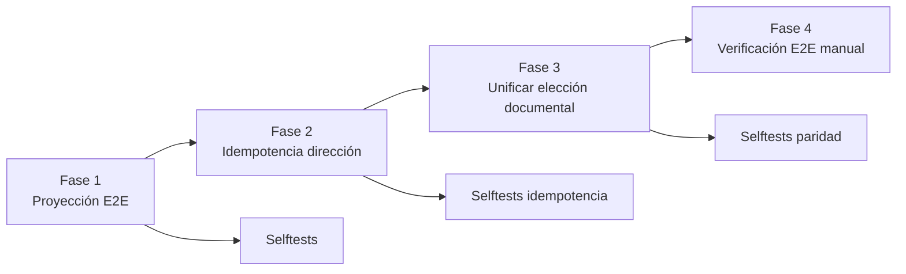

# Plan: observabilidad E2E y consolidación idempotente (property optioning)

> **Estado:** ✅ IMPLEMENTADO — 2026-06-30 (Fases 1–3). Verificación manual E2E (Fase 4) pendiente del usuario.  
> **Contexto:** prueba E2E conversacional caso `4ed72552…` (Las Fuentes).  
> **Principio rector:** el panel debe reflejar la realidad del audit trail; los fixes van en la **fuente** (registro, idempotencia, un solo camino de negocio), no en ocultar síntomas en UI.

## Resumen de implementación

| Fase | Estado | Archivos | Tests |
|------|--------|----------|-------|
| 1 — Proyección E2E por `payload.purpose` | ✅ | `settings-test-flow-progress.ts` | `settings-test-flow-progress.selftest.ts` |
| 2 — Idempotencia de dirección + evento de conflicto | ✅ | `property-optioning-post-agent-invariants.ts`, `operational-case-event-display.ts` | `property-optioning-post-agent-invariants.selftest.ts`, `operational-case-event-display.selftest.ts` |
| 3 — Unificar elección documental Telegram | ✅ | `apps/web/src/app/api/telegram/webhook/route.ts` | `document-request-target.selftest.ts` + suite readiness |
| 4 — Verificación manual E2E | ⏳ usuario | — | guion §Fase 4 |

Suite `test:readiness-test-ui` completa en verde; typecheck del app sin errores nuevos.

---

## 1. Problemas de fondo (confirmados)

### P1 — Recordatorios documentales invisibles en Paso 1 (E2E)

| Hecho | Evidencia |
|-------|-----------|
| Telegram sí ejecutó el flujo interno/externo | Respuesta textual = `buildDocumentRouteConfirmationAck` (Camino B) |
| `applyDocumentRequestTargetChoice` registra `reminder_sent` | `document-request-target.ts` → `recordDocumentFlowReminder(..., internal_upload_instructions)` |
| El panel solo muestra `document_registered` | Paso 1: 6 PDFs, cero checklist/ruteo |

**Causa raíz:** `flowProgressForE2ESummary` filtra eventos pre-`e2eStartedAt` salvo excepciones. `isDocumentRequestReminderEvidence()` compara `item.event_kind` con valores que en producción viven en `payload.purpose`, mientras `parseEventMeta` solo copia `payload.kind` (`"reminder_sent"`).

**No es** que el evento no exista; es un bug de **proyección** del resumen E2E.

### P2 — Consolidación de dirección repetida (eventos + escrituras reales)

| Hecho | Evidencia |
|-------|-----------|
| 1 evento con detalle + 3 genéricos | Panel Paso 2, timestamps 3:26:42 y 3:27:20–21 |
| Detalle solo cuando `payload.adopted` trae calle/número | `operational-case-event-display.ts` |
| Re-ejecuciones reales | `consolidateDocumentContext()` hasta 3× por tick; segundo tick repite |

**Causa raiz:** `mergeDocumentAddressIntoContextPropertyData` marca `changed = true` si `addressConflicts.length > 0` aunque no se añada conflicto nuevo; conflictos previos se re-leen y re-disparan `changed`. Idempotencia de titularidad ya existe; dirección no.

**Importante:** filtrar eventos genéricos en UI **no** es fix válido — ocultaría churn real de BD/version/events.

### P3 — Dos caminos webhook para interno/externo (deuda estructural)

| Camino | Ubicación | Registra `recordDocumentFlowReminder` | Texto de ack |
|--------|-----------|--------------------------------------|--------------|
| **A** External responder | `webhook/route.ts` ~1195–1251 | **No** | "Perfecto: usaré ruta interna…" |
| **B** Conversacional | `webhook/route.ts` ~2652 + `applyDocumentRequestTargetChoice` | **Sí** | `buildDocumentRouteConfirmationAck` |

Paridad web ya usa `applyDocumentRequestTargetChoice` (`chat/route.ts`). Telegram Camino A es legacy inline duplicado.

**Riesgo:** misma acción de usuario → audit trails distintos según routing.

---

## 2. Principios de diseño (no negociables)

1. **Observabilidad = verdad operativa.** Mostrar lo que pasó; no emitir lo que no pasó materialmente.
2. **Idempotencia en merges y side-effects.** Segunda ejecución con mismos inputs → `changed: false`, cero eventos, cero `updateOperationalCase` innecesario.
3. **Un handler de negocio, N adapters.** Elección interno/externo siempre pasa por `applyDocumentRequestTargetChoice` (o wrapper compartido invocado desde ambos adapters).
4. **Contratos de evento estables.** `payload.kind` = tipo semántico; `payload.purpose` = subtipo de `reminder_sent`; tests usan forma de producción.
5. **Cambios incrementales con tests de regresión** antes de refactor grande del webhook completo (§10 future-considerations).

---

## 3. Fases de implementación



---

### Fase 1 — Corregir proyección E2E (P1) — bajo riesgo, alto valor

**Objetivo:** el resumen por paso muestre recordatorios documentales que **ya existen** en BD.

#### 1.1 Extender metadata de evidencia

**Archivo:** `apps/web/src/lib/operational-cases/settings-test-flow-progress.ts`

- Añadir `event_purpose?: string` a `FlowProgressEvidenceItem`.
- En `parseEventMeta` (o al construir `evidenceItems`), mapear `payload.purpose` → `event_purpose`.
- Cambiar `isDocumentRequestReminderEvidence` a:

```ts
item.event_type === "reminder_sent" &&
DOCUMENT_FLOW_REMINDER_PURPOSES.has(item.event_purpose ?? "")
```

Extraer set compartido con `eventBelongsToStep` (DRY).

#### 1.2 Allowlist pre-transición conversacional (complemento)

Incluir en `preTransitionConversationalIntake`:

- `event_kind === "document_request_target_inferred"` (ruta inferida por subida antes de elegir)
- Opcional defensivo: cualquier `reminder_sent` con `event_step_key === "awaiting_documents"`

**Criterio:** no depender solo del fix de `purpose`; cubrir variantes de flujo.

#### 1.3 Selftests con forma de producción

**Archivo:** `settings-test-flow-progress.selftest.ts`

| Caso | Datos |
|------|-------|
| Recordatorio pre-E2E | `event_type: reminder_sent`, `event_kind: reminder_sent`, `event_purpose: internal_upload_instructions` |
| Checklist post-intake | `event_purpose: documents_checklist_post_intake` |
| Inferencia interna | `event_kind: document_request_target_inferred`, antes de `e2eStartedAt` |
| Regresión documentos | `document_registered` sigue visible |

**Anti-patrón a eliminar:** tests con `event_kind: "internal_upload_instructions"` sin `event_purpose`.

#### 1.4 Documentación

Actualizar `testing-framework.md` § registro E2E: aclarar que el filtro usa `payload.purpose`, no `payload.kind`.

#### Criterios de aceptación (Fase 1)

- [ ] Re-ejecutar caso E2E Las Fuentes (o fixture equivalente): Paso 1 muestra al menos «Instrucciones de carga interna» + checklist si existen en BD.
- [ ] Selftests `settings-test-flow-progress.selftest.ts` pasan.
- [ ] Sin cambio en lógica de negocio del agente; solo proyección UI.

#### Riesgos

| Riesgo | Mitigación |
|--------|------------|
| Mostrar demasiados `reminder_sent` genéricos | Mantener filtro `isE2EEvent`; solo ampliar excepciones documentales conocidas |
| Romper conteo de eventos por paso | Tests de regresión existentes + snapshot de conteos en selftest |

---

### Fase 2 — Idempotencia real de consolidación de dirección (P2)

**Objetivo:** una adopción material de dirección → un evento; re-ejecuciones → cero side-effects.

#### 2.1 Refactor `mergeDocumentAddressIntoContextPropertyData`

**Archivo:** `property-optioning-post-agent-invariants.ts`

**Cambios:**

1. **Conflictos:** separar `existingConflicts` vs `newConflicts`.
   - Solo push a `addressConflicts` si el par `(field, existing, incoming, existing_source, incoming_source)` no existe ya.
   - `changed = true` por conflictos **solo si** `newConflicts.length > 0`.

2. **Source-only updates:** alinear con titularidad:
   - `sourceMateriallyChanged = sourceChanges && sourceImproves` (score estricto `>`, no `>=` re-adopción).
   - No marcar `changed` si único delta es re-asignar mismo source o source de score igual.

3. **Adopted vs changed:** devolver `{ changed, adopted, auditKind? }` donde:
   - `changed` implica persistencia de contexto.
   - Evento `document_address_consolidated_to_property_data` **solo si** hay al menos un campo visible en `adopted` (`street`, `exterior_number`, `neighborhood`, `municipality`) **o** conflicto nuevo (ver 2.2).

4. **No tocar labels truncados** en display para titularidad/dirección con detalle — ya acordado con producto.

#### 2.2 Eventos de auditoría diferenciados (opcional pero recomendado)

Si hay conflicto nuevo sin adopción de calle:

- Emitir `document_address_conflict_detected` (nuevo `payload.kind`) con `conflicts: [...]`.
- **No** reutilizar `document_address_consolidated_to_property_data` con label genérico.

Display en `operational-case-event-display.ts`:

- Consolidación: mantiene label actual con detalle.
- Conflicto: «Conflicto de dirección detectado: calle X vs Y (fuente escritura vs predial)».

**Beneficio:** verdad semántica — el operador ve *qué* pasó, no tres «Dirección consolidada» vacías.

#### 2.3 Reducir re-consolidaciones en el mismo tick (opcional Fase 2b)

**Archivo:** `property-optioning-post-agent-invariants.ts`

- Memoizar resultado de `consolidateDocumentContext()` dentro de una invocación de `applyPropertyOptioningPostAgentInvariants` si `workingDocuments` y `workingCase.version` no cambiaron entre llamadas internas.
- Alternativa más simple: eliminar llamadas redundantes (1185 → 1241 → 1473) tras auditar cuáles son estrictamente necesarias post-remediación.

**Preferencia:** primero idempotencia (2.1); medir; luego memoización si aún hay múltiples passes por diseño.

#### 2.4 Selftests

**Archivo:** `property-optioning-post-agent-invariants.selftest.ts`

| Caso | Expectativa |
|------|-------------|
| Primera adopción calle+número | `changed: true`, `adopted.street` presente |
| Segunda pasada mismos `documentFields` | `changed: false`, `adopted` vacío o sin campos nuevos |
| Contexto con `address_conflicts` ya poblado, mismos inputs | `changed: false` |
| Nuevo conflicto de exterior | `changed: true`, evento de conflicto (si 2.2) |
| Source mejora (escritura → predial) sin cambio de calle | Política explícita documentada en test |

#### Criterios de aceptación (Fase 2)

- [ ] Re-ejecutar flujo Paso 2: **una** línea «Dirección consolidada en ficha: …» con detalle; cero genéricas repetidas en el mismo recorrido.
- [ ] Segundo tick manual sin nuevos documentos: cero eventos `document_address_consolidated_*`.
- [ ] Selftests pasan; opcional: assert de no-regresión en conteo de `updateOperationalCase` en test de integración ligero.

#### Riesgos

| Riesgo | Mitigación |
|--------|------------|
| Dejar de persistir conflictos legítimos | Tests con conflicto nuevo; revisar gate de avance |
| Ocultar conflictos reales | Evento dedicado `document_address_conflict_detected`, visible en panel |
| Divergencia con superficies/titularidad | Misma plantilla de idempotencia; revisar si superficies necesitan el mismo patrón de conflictos |

---

### Fase 3 — Unificar elección interno/externo en Telegram (P3)

**Objetivo:** un solo contrato de negocio; audit trail idéntico en web y Telegram.

#### 3.1 Eliminar duplicación inline (Camino A)

**Archivo:** `apps/web/src/app/api/telegram/webhook/route.ts` ~1195–1251

Reemplazar bloque inline por:

```ts
const choice = await applyDocumentRequestTargetChoice({
  db,
  opCase: refreshedCase,
  message: text,
  channel: "telegram",
});
if (choice.handled) {
  await sendTelegramMessage(chatId, choice.responseText);
  // post-choice E2E tick si aplica (paridad con Camino B)
  return NextResponse.json({ ok: true, routed: "operational_case_document_target_set", ... });
}
```

**Nota:** verificar que `refreshedCase` en external-responder block sea el caso correcto (contacto externo vs asesor). Si Camino A solo aplica a chats externos vinculados al caso, confirmar que `shouldPromptCaseDocumentRequestTarget` tenga sentido en ese contexto — si no, Camino A no debería manejar interno/externo del asesor y el bloque puede ser dead code para E2E lab; auditar antes de borrar.

#### 3.2 Matriz de paridad

| Acción | Web | Telegram (post-fix) |
|--------|-----|---------------------|
| Elegir interno | `applyDocumentRequestTargetChoice` | Idem |
| Elegir externo | Idem | Idem |
| `recordDocumentFlowReminder` | Sí | Sí |
| Ack unificado | `buildDocumentRouteConfirmationAck` | Idem |
| Inferencia por subida | `document_request_target_inferred` + reminder opcional | Idem |

#### 3.3 Completar registro en intake LLM (hueco menor)

Cuando intake completa vía agente LLM (no orquestador determinístico), registrar `documents_checklist_post_intake` si aún no existe:

- Hook en webhook post-intake (`intakeCompletedThisTurn`) o en `resolveConversationalIntakeTurn` al completar required.
- Idempotente vía `recordDocumentFlowReminder` (ya lo es).

#### 3.4 Selftests / integración

**Archivo:** `document-request-target.selftest.ts` (existente) + nuevo caso:

- Simular elección interna → assert evento `reminder_sent` + `purpose: internal_upload_instructions`.
- Inferencia + elección explícita → no duplicar purpose (idempotencia por purpose).

#### Criterios de aceptación (Fase 3)

- [ ] Telegram Camino A y B producen mismos eventos para «interno»/«externo».
- [ ] Texto de ack unificado (`buildDocumentRouteConfirmationAck`) en ambos.
- [ ] Web sin regresiones (`chat/route.ts`).

#### Riesgos

| Riesgo | Mitigación |
|--------|------------|
| External responder no es el asesor | Auditar `matchedCase` path; no unificar si el bloque es para otro actor |
| Romper E2E lab post-choice tick | Mantener `shouldRunPostChoiceE2ETick` en un solo lugar |
| Refactor grande del webhook | Alcance acotado a ~50 líneas; no refactor §10 completo en esta fase |

---

### Fase 4 — Verificación manual y cierre

#### Guion E2E (repetir Las Fuentes o fixture)

1. Activar sesión E2E lab.
2. Intake conversacional → checklist + interno/externo.
3. Responder «interno» → verificar Paso 1: checklist + instrucciones + PDFs.
4. «listo» → tick manual → Paso 2: una consolidación de dirección con detalle.
5. Responder características → segundo tick: sin consolidaciones de dirección duplicadas.
6. Continuar hasta price approval (smoke).

#### Checklist de regresión rápida

- [ ] `npm run test` / selftests focalizados de archivos tocados
- [ ] N3/N4 settings de `awaiting_documents` y `documents_received` sin cambio de contrato
- [ ] Pendientes / price approval sin cambio

---

## 4. Secuencia y commits sugeridos

| Orden | Commit | Fase | Archivos principales |
|-------|--------|------|----------------------|
| 1 | `fix(e2e): preserve document reminders by payload.purpose` | 1 | `settings-test-flow-progress.ts`, selftest, docs |
| 2 | `fix(invariants): idempotent address consolidation and conflict events` | 2 | `property-optioning-post-agent-invariants.ts`, `operational-case-event-display.ts`, selftests |
| 3 | `refactor(telegram): unify document target choice via shared handler` | 3 | `webhook/route.ts`, optional intake hook, selftests |

**No mezclar** Fase 2 display de conflictos con Fase 1 en el mismo PR si el review es pesado; Fase 1 puede shippar sola.

---

## 5. Qué NO hacer (anti-patrones)

| Anti-patrón | Por qué |
|-------------|---------|
| Filtrar eventos genéricos de dirección en `flowProgressForE2ESummary` | Oculta re-ejecuciones reales |
| Cambiar labels a texto fijo sin arreglar merges | UX sin verdad |
| Duplicar lógica de purpose en 3 sitios sin constante compartida | Reintroduce el bug |
| Refactor completo del webhook §10 en el mismo PR | Alto blast radius |
| `changed=true` por `addressConflicts.length > 0` sin diff | Causa raíz de P2 |

---

## 6. Métricas de éxito

| Métrica | Antes | Después |
|---------|-------|---------|
| Eventos Paso 1 pre-tick visibles | 0 (reminders) | ≥2 (checklist + internal_upload) |
| `document_address_consolidated` por tick manual (sin docs nuevos) | 2–4 | 0–1 (solo si hay cambio material) |
| Escrituras `updateOperationalCase` por consolidación redundante | N | 0 en re-run |
| Caminos Telegram para interno/externo | 2 | 1 handler |

---

## 7. Relación con roadmap existente

- **§10 future-considerations.md:** este plan **no** sustituye la unificación completa `resolveConversationalCaseForChannel`; solo cierra la divergencia crítica de elección documental y observabilidad E2E.
- **Patrones reutilizables:** tras Fase 2, evaluar extraer `PATTERN_IDEMPOTENT_CONTEXT_MERGE` para merges documentales (dirección, superficies, titularidad).

---

## 8. Estimación de esfuerzo

| Fase | Esfuerzo | Riesgo |
|------|----------|--------|
| 1 | 2–4 h | Bajo |
| 2 | 4–8 h | Medio (lógica de conflictos) |
| 3 | 3–6 h | Medio (auditoría external responder) |
| 4 | 1–2 h manual | — |

**Total:** ~1–2 días de trabajo enfocado con tests.
