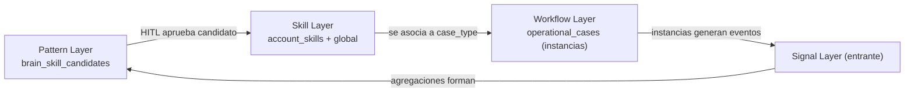

# Casos operacionales — Consideraciones futuras

> Este documento archiva las recomendaciones, umbrales y lecciones que **no** entran en el alcance de la primera versión del subsistema de casos, pero que conviene tener documentadas para evitar discusiones repetitivas más adelante.
>
> Plan de implementación: [`plan.md`](plan.md). Arquitectura: [`architecture.md`](architecture.md).

---

## 1. Cuándo justificar subagentes

**Default:** un solo agente con un único reasoning loop, skills y tools acotados, runtime durable de casos. No multi-agente.

**Cuándo cambia el default:** cuando se cumple **al menos una** de estas condiciones de manera sostenida (no anecdóticamente):

| Condición | Por qué amerita subagente |
|---|---|
| **Paralelismo real necesario** | Ej. analizar 5 PDFs simultáneamente; cada subagente con su contexto. Single-agent serializa esto. |
| **Modelos materialmente distintos** | Ej. un subagente con modelo barato resumiendo, otro con modelo grande razonando. La fachada de modelos por canal cubre parte de esto sin multi-agente. |
| **Contextos aislados por privacidad/permisos** | Subagente que ve datos sensibles que el agente principal no debe ver. |
| **Especialización tan profunda que el prompt no escala** | Cuando se han agotado: progressive disclosure, splitting de skills, references on demand. |

**Antipatrones (no son razón válida para subagentes):**

- "Quiero más calidad" → casi siempre se resuelve con mejores skills, no con más agentes.
- "Quiero que hable con tono distinto" → eso es prompt/skill, no agente nuevo.
- "Quiero modularidad" → eso es composite skills + tools, no agentes.

**Lo que sí conviene tener listo antes de mover a multi-agente:**

- Telemetría de qué % del tiempo el agente principal se "estanca" en cierto tipo de subtarea.
- Eval suite por dominio para medir mejora real al subagentar.
- Modelo de costos: subagentes multiplican llamadas LLM; presupuestar.

---

## 2. Cuándo escalar el selector de skills

Hoy el selector vive en [`packages/agent/src/skills/select.ts`](../../packages/agent/src/skills/select.ts):

- Un modelo lateral barato (`gpt-4o-mini`).
- Recibe descripciones de skills + mensaje del usuario + routing context estructurado.
- Bias hacia `none`.
- 20 skills globales hoy.

**Umbrales para revisar el setup:**

| Umbral | Síntoma | Acción recomendada |
|---|---|---|
| **~30 skills totales (global + account)** | Descripciones empiezan a solaparse. | Pre-filtrado por `scope` + canal antes de pasar al selector. |
| **>5% selección incorrecta en producción** | Reportes de usuarios o tests de eval que fallan. | Implementar embeddings + top-K (ver abajo). |
| **>50 skills totales** | El prompt al selector se vuelve costoso y largo. | Definitivamente embeddings + top-K. |
| **Skills con nombres parecidos** (ej. `lead-momentum-watch` vs `lead-followup-draft`) | El selector confunde. | Editar descripciones para diferenciarlas explícitamente; `Use when ...` claro. |

**Alternativas en orden de complejidad creciente:**

1. **Pre-filtrado por scope/contexto** (gratis): si sé que el usuario está en business, no le paso skills personales. Aprovecha que `account_skills` traen `scope`.
2. **Routing context structured** (ya existe): forzar continuidad cuando el turno es follow-up. Cubrir más patrones de continuidad.
3. **Embeddings + top-K**: precomputar embeddings de descripciones; al turno, embeber el mensaje y sacar top-K (ej. 5) por similitud; pasar solo esos al selector LLM.
4. **Selector multi-stage**: primero clasificar dominio (`business|personal|none`), después seleccionar skill dentro del dominio.
5. **Selector con mejor modelo** (más caro): subir a Haiku o GPT-4o como selector.

**Mejor ROI según el momento:**

- Hoy → cuidar descripciones y bias `none`.
- ~30 skills → pre-filtrado por scope + embeddings + top-K.
- ~50 skills → multi-stage selector.
- Cambiar de modelo es lo último, no lo primero.

---

## 3. Cuándo evaluar motor durable tipo Temporal/Inngest

El subsistema de casos vive sobre **Postgres + cron + LangGraph checkpointer**. Es suficiente para los volúmenes y complejidad esperados a corto-medio plazo.

**Cuándo justifica migrar a Temporal/Inngest/Trigger.dev:**

| Condición | Por qué |
|---|---|
| **Miles de casos concurrentes activos por minuto** | Postgres + cron escala bien hasta cierto punto; un motor durable tiene mejor throughput y observabilidad nativa. |
| **Latencia inter-paso crítica (segundos vs minutos)** | El cron actual es periódico; un motor durable dispara workflow al instante. |
| **Requisitos de cumplimiento que exijan motor con auditoría certificada** | Algunos motores tienen audit trails formalmente probados. |
| **Múltiples idiomas/runtimes** | Si Gu OS expande a Python o Go, un motor durable es lenguaje-agnóstico. |

**Costos de migrar:**

- Otra dependencia operativa (otro servicio que monitorear, escalar, pagar).
- Doble fuente de verdad para state (postgres del subsistema + state del motor).
- Curva de aprendizaje del equipo.

**Antipatrón:** adoptar Temporal solo porque "es lo correcto" sin tener volumen ni necesidad. Aumenta superficie de fallo y costo operativo sin valor inmediato.

**Estrategia recomendada:** mantener interfaces del subsistema (queries, eventos) limpias y abstractas para que una eventual migración no requiera re-escribir las skills ni el agente.

**Antes de saltar a Temporal**, suele pagar agotar las palancas del diseño actual: frecuencia del cron, tamaño de lote leído de Postgres, `OPERATIONAL_CASES_CONCURRENCY`, y métricas de degradación. El comportamiento exacto del cron (cola en memoria, por qué la concurrencia no “tira” casos, qué pasa si hay más vencidos que el límite del lote) y una guía de **señales de degradación / qué hacer** están en [`architecture.md`](architecture.md), en la sección de procesamiento (subsecciones *Detalle: límite de lote…* y *Señales de degradación…*).

---

## 4. Browser automation a portales externos

**Default:** **NO** automatizar portales que no nos pertenezcan. El paquete listo para subida manual por el usuario es la opción correcta para Inmuebles24, Vivanuncios, etc.

**Por qué:**

| Riesgo | Detalle |
|---|---|
| Violación de Términos de Servicio | Casi todos los portales prohíben automatización no autorizada. |
| Suspensión de cuenta del cliente | Inmuebles24 detecta bots y suspende. La inmobiliaria pierde su canal principal de leads. |
| Fragilidad permanente | Cualquier cambio en HTML, captcha, o flujo de auth rompe la integración. |
| Captchas y MFA | Eventualmente los meten; la automatización deja de funcionar. |
| Custodia de credenciales del cliente | Activo crítico que hay que cifrar, rotar, auditar. |
| Imagen del producto | Si Gu OS es asociado con "bot que publica en portales", puede haber rechazo de la industria. |

**Excepciones legítimas:**

- **Sistemas propios** (Ungga): ver POC Ungga CLI/API en [`plan.md`](plan.md) sección 6. Aquí Gu OS es dueño del sistema, no hay terceros.
- **Partnerships oficiales**: si Inmuebles24 ofrece API B2B/partner program, esa es la vía correcta. Buscar antes de automatizar.

**Si en el futuro se decide automatizar (con aprobación explícita y documentada del cliente):**

1. Consentimiento escrito del cliente.
2. Credenciales del cliente almacenadas con cifrado a nivel de aplicación.
3. Account separada por cliente, nunca compartida.
4. Throttling agresivo y `User-Agent` honesto.
5. Eval suite para detectar cambios de UI antes de que rompan.
6. Plan de fallback claro cuando rompa (notificar al cliente, hacer manual).
7. Métricas de éxito por cliente.

**El POC contra Ungga es el lugar correcto para aprender Playwright** sin asumir riesgo legal/operativo.

---

## 5. WhatsApp Cloud API: cuándo y cómo

**Default V1:** Telegram para todo el outbound proactivo. Es trivial sobre lo que ya tenemos.

**Cuándo justifica WhatsApp Cloud API:**

- El cliente piloto (Alebrixe) reporta que sus dueños/leads no usan Telegram en absoluto.
- Hay >10 cuentas demandando outbound automático por WhatsApp.
- El equipo está dispuesto a invertir 5-10x el esfuerzo de Telegram.

**Lo que implica adoptar WhatsApp Cloud API:**

| Requisito | Detalle |
|---|---|
| Cuenta business verificada | Meta Business Manager verificado, número WhatsApp Business dedicado. |
| Plantillas pre-aprobadas | Para mensajes proactivos fuera de la ventana de 24h: templates aprobados por Meta (días-semanas de revisión). |
| Webhooks para inbound | Endpoint nuevo + verificación de firma. |
| Manejo de la "ventana de 24h" | Después de 24h sin interacción del usuario, solo plantillas; no texto libre. |
| Costos | Por conversación (no por mensaje), variable por país. |
| Compliance | Política de uso de Meta, opt-in explícito de cada usuario externo. |

**Roadmap recomendado cuando llegue el momento:**

1. Validar con piloto Telegram primero. Si Telegram no convierte, WhatsApp tampoco va a salvar el caso.
2. Onboarding de Meta Business Manager para Ungga + provisioning del número.
3. Implementar inbound (`/api/whatsapp/webhook`) y validar.
4. Plantillas mínimas: recordatorio_documentos, confirmacion_visita, paquete_listo.
5. Tool `whatsapp_send_message` con dispatch a plantilla cuando aplique.
6. Aislamiento detrás de `notify(user_id, payload, urgency)` y de las tools del agente para que las skills no sepan si el canal final es Telegram o WhatsApp.

---

## 6. Evoluciones futuras de `account_skills`

V1 (este plan) es deliberadamente mínimo: una tabla, runtime que la considera, UI textarea-básica.

**V2 — versionado y publishing flow:**

- `account_skills` con histórico de versiones (tabla separada `account_skill_versions`).
- Estados `draft → review → active → archived` con rollback.
- QA pre-publicación: validar que `allowed_tools` están en el catálogo, que `includes` resuelven, que el frontmatter es válido.
- UI con preview lado a lado del cuerpo y diff vs versión activa.

**V3 — compartir entre cuentas de la misma organización:**

- Cuando exista la tabla `organizations` y `memberships`, permitir que una skill viva a nivel `organization_id`, no solo `user_id`.
- Reglas de visibilidad: skills personales (solo el autor), skills de organización (todos los miembros), skills shared (público dentro de la org).
- Migración desde `account_skills` (user-level) a `organization_skills` con preservación de slug.

**V4 — promoción HITL desde Brain Layer:**

- `brain_skill_candidates` (ver [`docs/brain/gbrain-evaluation-and-plan.md`](../brain/gbrain-evaluation-and-plan.md)) propone una skill nueva basada en patrones observados.
- Humano revisa, edita, aprueba.
- Promoción automatizada a `account_skills` o `organization_skills` según el contexto.

---

## 7. Conexión con Brain Layer (Pattern → Skill → Workflow → Case)

El Brain Layer (en plan separado) introduce capas: Acquisition, Memory, Graph, Signal, Pattern, Skill, Workflow.

Los **casos operacionales** son la materialización concreta de la capa **Workflow**:

Implicaciones:

- Cuando exista la capa Pattern, los **eventos de casos** (recordatorios respondidos, casos completados rápido vs lento, escalaciones frecuentes) alimentan la mineration de patrones.
- Los **patrones aprobados** producen nuevas skills o variantes de skills existentes.
- Las nuevas skills pueden **mejorar el comportamiento de futuras instancias** del mismo `case_type`.

Esto convierte el subsistema de casos en parte de un loop de aprendizaje organizacional, no solo en un motor de ejecución.

---

## 8. Cosas que decididamente NO hacemos en V1

Para evitar scope creep:

- **No subagentes** (ver sección 1).
- **No motor durable externo** (ver sección 3).
- **No browser automation a portales externos** (ver sección 4).
- **No WhatsApp Cloud API** (ver sección 5).
- **No `account_skills` con versionado completo** (V2+).
- **No mining automático de patrones desde casos** (Brain Layer fase posterior).
- **No multi-tenancy a nivel `organizations`** (queda como V3+).
- **No editor visual de skills WYSIWYG** (textarea + validación es suficiente para V1).
- **No selector de skills sofisticado** (el actual basta a esta escala; ver sección 2).

---

## 9. Tools configurables por cuenta

V1 mantiene los adapters en código para las herramientas comunes y críticas. Para tools muy específicas de una cuenta, el diseño recomendado no es agregar código custom por cliente, sino exponer primitives genéricas y configurarlas desde Supabase.

**Principio:** el repo contiene adapters genéricos seguros; la cuenta guarda configuración, secretos, schemas y política HITL.

Primitives reutilizables:

| Tool genérica | Uso |
|---|---|
| `custom_http_request` | Llamar APIs privadas con método, URL base, auth y schema controlado. |
| `custom_query_runner` | Ejecutar queries parametrizadas contra fuentes permitidas por cuenta. |
| `template_renderer` | Renderizar documentos desde templates versionados por cuenta. |
| `webhook_call` | Disparar webhooks simples con payload validado. |

Modelo de datos sugerido:

| Tabla | Campos principales |
|---|---|
| `account_tool_configs` | `id`, `user_id`/`organization_id`, `tool_id`, `display_name`, `primitive`, `status`, `risk`, `requires_hitl`, `input_schema_jsonb`, `response_mapping_jsonb`, `timeouts_jsonb`, `created_at`, `updated_at`. |
| `account_tool_secrets` | `tool_config_id`, `secret_ref` o `encrypted_secret`, `kind`, `rotated_at`. Separada para minimizar exposición accidental. |
| `account_tool_test_runs` | `tool_config_id`, `status`, `input_jsonb`, `result_jsonb`, `error`, `created_at`. Sirve para readiness y auditoría. |

Readiness debería evaluar:

- La configuración existe y está `active`.
- El schema de entrada es válido y tiene límites razonables.
- Secretos requeridos existen y no están vencidos.
- El risk/HITL coincide con la operación: write/send/publish nunca auto-run sin confirmación explícita.
- El último test run fue exitoso o, si no existe, la UI lo marca como “requiere prueba”.

Reglas de seguridad:

- Nunca permitir URL libre generada por el modelo; la base URL y rutas permitidas vienen de configuración revisada.
- Validar payload con `input_schema_jsonb` antes de ejecutar.
- Redactar secretos en logs, eventos, tool calls y errores.
- Rate limits por tool y por cuenta.
- Para `custom_query_runner`, solo queries parametrizadas y allowlist de datasets/tablas.
- Para `custom_http_request`, bloquear redes privadas salvo allowlist explícita.

Estrategia de adopción:

1. Mantener `TOOL_CATALOG` como fuente de verdad para tools globales.
2. Agregar un segundo catálogo runtime para `account_tool_configs`.
3. Hacer que `tool-readiness` combine ambos catálogos.
4. Permitir que `allowed_tools` referencie `account:<tool_id>` o slugs namespaced equivalentes.
5. Añadir UI de configuración/prueba antes de permitir que una skill activa use esa tool.
