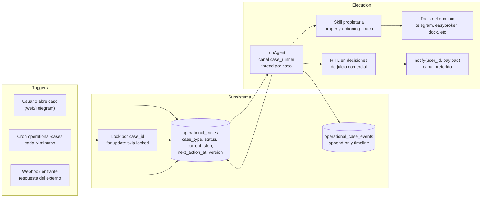

# Subsistema de Casos operacionales — Plan

> **Estado:** v1.0 — propuesta inicial; algunas tools y POCs dependen de información o accesos externos antes de poder pasar a producción. Ver sección 7 (gating).
>
> **Documentos relacionados**
> - [`architecture.md`](architecture.md): explicación técnica del subsistema (sobrevive al plan).
> - [`future-considerations.md`](future-considerations.md): cuándo justificar subagentes, escalar el selector de skills, migrar a un motor durable, etc.
> - [`docs/manuals/architecture-manual.md`](../manuals/architecture-manual.md): manual técnico integrador de Gu OS.
> - [`docs/manuals/gu-os-understanding.md`](../manuals/gu-os-understanding.md): guía narrativa.
> - [`docs/business-brain-evolution-roadmap.md`](../business-brain-evolution-roadmap.md): roadmap de Skills/Heartbeat/Business Brain donde aparece `account_skills` V2.
> - [`docs/brain/gbrain-evaluation-and-plan.md`](../brain/gbrain-evaluation-and-plan.md): plan del Brain Layer (Pattern → Skill).

---

## 1. Alcance y entregables

Este plan cubre tres entregables grandes que se construyen en paralelo donde es posible:

- **Subsistema `operational_cases`**: nueva primitiva persistente para instancias multi-día (esquema, cron, runtime, locking, eventos append-only).
- **Caso piloto end-to-end "opcionar propiedad"**: skill compuesta `property-optioning-coach` + skills atómicas + tools de dominio inmobiliario, llegando hasta "paquete listo para publicar" en portales sin API y publicación con API en EasyBroker/Ungga.
- **Implementación de `account_skills` V1 (Opción B)**: para que el caso de Alebrixe pueda ser propio de su cuenta y no contaminar el catálogo global.

Más:
- **POC contra Ungga**: dos vías paralelas (CLI/Playwright + API interna) para evaluar pros y contras con sistema propio.
- **Documentación complementaria**: documento de consideraciones futuras donde quedan archivadas las recomendaciones de cuándo justificar subagentes, cuándo escalar el selector de skills, cuándo migrar a Temporal/Inngest, etc.

No incluye: implementación de WhatsApp Cloud API outbound, conector a portales como Inmuebles24 (ver `future-considerations.md`), motor durable tipo Temporal, multi-agente.

---

## 2. Decisiones arquitectónicas (cerradas)

| Decisión | Detalle |
|---|---|
| Nombre del campo de tipo | `case_type` (no `playbook_slug`, no `operational_case_slug`). Identifica el tipo de procedimiento (`property_optioning`, etc.). |
| Subsistema separado del Heartbeat | Cron dedicado `/api/cron/operational-cases`, no se mete como item de checklist Heartbeat. |
| Locking | `select ... for update skip locked` por `case_id` para evitar doble procesamiento; `version` para optimistic locking en lecturas/escrituras del agente. |
| Append-only events | `operational_case_events` no se actualiza ni se borra; el estado actual del caso vive en `operational_cases`, la historia en eventos. |
| Comunicación con el inmobiliario | Capa nueva `notify(user_id, payload, urgency)` que elige canal según preferencia del usuario + presencia + urgencia. Hoy: web + Telegram. Default a Telegram cuando el usuario no está activo en web. |
| Comunicación con humano externo (dueño/lead) | Telegram en V1; el conector se aísla detrás de una tool para poder cambiar a WhatsApp más adelante sin tocar las skills. |
| Sincronización antes de actuar | El scanner re-lee la fuente (mensajes recientes del canal) antes de mandar recordatorios; si encuentra desincronización, actualiza el caso primero. |
| Recordatorios configurables | Defaults a nivel de `case_type`, override por usuario en Ajustes, override puntual por instancia. |
| Concurrencia con turnos del usuario | Cada `runAgent` es invocación independiente; el caso se procesa en su propio thread (canal `case_runner`) en paralelo a turnos web/Telegram del usuario; coordinación solo vía Postgres y locks. |
| Account skills Opción B | Implementar `account_skills` mínimo viable antes/durante el piloto para no cementar `property-optioning-coach` como global. |

---

## 3. Arquitectura del subsistema

**Reglas duras:**

- El **scanner es determinístico**: solo decide "este caso vence", invoca `runAgent` con contexto del caso, y libera el lock. Toda cognición vive en el agente.
- El **agente nunca actúa sin contexto del caso**: cuando se invoca con `case_id`, lee `operational_cases` + últimos N eventos antes de razonar.
- **HITL en juicio comercial**: precio mínimo, comparables seleccionados, contrato final. El agente prepara, el humano aprueba.

---

## 4. Esquema de datos

### 4.1 `operational_cases` (instancias)

| Columna | Tipo | Detalle |
|---|---|---|
| `id` | uuid PK | |
| `user_id` | uuid → `profiles.id` ON DELETE CASCADE | RLS por `auth.uid()`. |
| `case_type` | text | Apunta a `operational_case_types.case_type`. |
| `status` | text | `active`, `waiting_external`, `paused`, `completed`, `failed`. |
| `current_step` | text | Identificador semántico del paso actual (definido por la skill). |
| `assigned_to_user_id` | uuid | Por defecto el dueño del caso; se permite re-asignar dentro de la cuenta. |
| `external_contact_jsonb` | jsonb | `{ "channel": "telegram", "chat_id": 123, "display_name": "..." }`. |
| `next_action_at` | timestamptz | Cuándo el cron debe volver a procesar este caso. |
| `due_at` | timestamptz | Deadline duro del paso actual (para escalación). |
| `context_jsonb` | jsonb | Datos del caso (ej. property_id, owner_name, etc.). |
| `version` | int default 0 | Optimistic locking. |
| `created_at`, `updated_at` | timestamptz | |

Índice: `(status, next_action_at)` parcial sobre `status in ('active','waiting_external')` para que el scanner sea barato.

### 4.2 `operational_case_events` (timeline append-only)

| Columna | Tipo | Detalle |
|---|---|---|
| `id` | uuid PK | |
| `case_id` | uuid → `operational_cases.id` ON DELETE CASCADE | |
| `event_type` | text | `step_completed`, `reminder_sent`, `escalated`, `human_decision`, `external_response`, `error`, `state_changed`. |
| `actor` | text | `system`, `agent`, `user`, `external`. |
| `payload_jsonb` | jsonb | Detalles del evento. |
| `created_at` | timestamptz default now() | |

Sin `updated_at`; sin `deleted_at`. Es append-only.

### 4.3 `operational_case_types` (catálogo)

| Columna | Tipo | Detalle |
|---|---|---|
| `case_type` | text PK | Ej. `property_optioning`. |
| `display_name` | text | Visible en UI. |
| `default_skill_slug` | text | Skill compuesta que la implementa (binding directo en runtime). |
| `default_reminder_policy_jsonb` | jsonb | Ej. `{ "remind_after_h": [24, 72], "escalate_after_h": 168 }`. |
| `description` | text | Contexto humano-legible. |
| `created_at`, `updated_at` | timestamptz | |

### 4.4 `account_skills`

| Columna | Tipo | Detalle |
|---|---|---|
| `id` | uuid PK | |
| `user_id` | uuid → `profiles.id` ON DELETE CASCADE | RLS por `auth.uid()`. |
| `slug` | text | Único por `(user_id, slug)`. |
| `body_md` | text | Cuerpo completo del SKILL.md (incluye frontmatter). |
| `metadata_jsonb` | jsonb | Cache parseada del frontmatter (scope, allowed_tools, includes, etc.). |
| `status` | text | `draft`, `active`, `archived`. |
| `version` | int default 1 | Incrementa en cada update activo. |
| `created_at`, `updated_at` | timestamptz | |

### 4.5 `user_notification_preferences`

| Columna | Tipo | Detalle |
|---|---|---|
| `user_id` | uuid PK → `profiles.id` ON DELETE CASCADE | |
| `channels_priority_jsonb` | jsonb | Ej. `["web", "telegram"]`. |
| `case_reminder_overrides_jsonb` | jsonb | Override por `case_type` o por instancia. |
| `created_at`, `updated_at` | timestamptz | |

---

## 5. Componentes a construir

### 5.1 Subsistema (Fase 1A)

- Migraciones 00019/00020/00021 + RLS + tipos en `packages/types`.
- Cliente DB en `packages/db/src/queries/operational-cases.ts` (CRUD + locking).
- Cron `/api/cron/operational-cases/route.ts` con `CRON_SECRET`, lee casos vencidos, lock + invoca `runAgent` canal `case_runner`.
- Adaptación de `runAgent` para aceptar `caseId` y cargar contexto del caso al sistema prompt.
- Webhook generic para que respuestas externas (Telegram primero) se asocien al caso pendiente y disparen procesamiento inmediato.
- `notify(userId, payload, urgency)` como helper compartido (`apps/web/src/lib/notify/index.ts`).

### 5.2 Account skills V1 (Fase 1B, en paralelo)

- Migración + tipos.
- Modificación del runtime de skills (`packages/agent/src/skills/runtime.ts`) para componer registry: `account_skills(user_id, status='active')` ∪ `skills/global/*`.
- Resolver de `includes` debe seguir funcionando con mezcla de orígenes.
- UI mínima en Ajustes para listar/crear/editar account skills (puede ser básica al principio: textarea + frontmatter).
- Validación Zod misma que para globals; rechazar publicar si frontmatter inválido.

### 5.3 Skill `property-optioning-coach` (Fase 1C, en paralelo)

Composite con `includes` de skills atómicas:

- `request-property-documents` (predial, escritura por Telegram).
- `extract-property-characteristics` (preguntas estructuradas).
- `perform-comparable-analysis` (EasyBroker + warehouse propio).
- `prepare-listing-price` (precios salida/ideal/mínimo, HITL fuerte).
- `prepare-commission-contract` (genera DOCX desde plantilla, HITL).
- `coordinate-photo-session` (calendar + recordatorios).
- `publish-listing-package` (sube a EasyBroker y a Ungga; para Inmuebles24 entrega "paquete listo" para subida manual).

Cada atómica vive como SKILL.md con `allowed_tools` acotado. La composite `property-optioning-coach` se publica primero como global durante desarrollo; **se mueve a `account_skills` de Alebrixe antes del piloto real**.

### 5.4 Tools de dominio inmobiliario (Fase 1D)

Orden de prioridad:

1. `telegram_send_message_to_contact` (outbound proactivo a dueño).
2. `easybroker_search_listings` y `easybroker_search_closed_deals` (read). **Implementado (2026-05):** Playwright MLS + provider `easybroker_web`; ver `pocs/easybroker-mls-cli/`.
3. `bigquery_lookup_local_comparables` (sobre warehouse propio).
4. `generate_document_from_template` (DOCX/PDF, basado en patrones de Anthropic skills `docx`/`pdf` portados a Node con `docx` y `pdf-lib`).
5. `image_watermark` (Sharp + asset Alebrixe).
6. `easybroker_create_listing` y `easybroker_upload_images` (write, HITL).
7. `ungga_publish_listing` (vía API interna preferentemente; ver sección 6).

Cada tool va en `packages/agent/src/tools/catalog.ts` con `risk` y `requires_integration`.

---

## 6. POC Ungga: CLI + API en paralelo

Spike de 1-2 semanas, en paralelo a Fase 1, con dos vías:

- **Vía A (CLI/Playwright)**: script Node con Playwright que hace login en `app.ungga.com` (staging), navega y ejecuta una acción simple (ej. crear listing dummy). Mide: latencia, fragilidad ante cambios de UI, manejo de sesión, captchas.
- **Vía B (API interna)**: agregar endpoint de Ungga (en su backend) que reciba la operación equivalente, autenticado con un token específico para Gu OS.

Comparar al final: latencia, mantenibilidad, observabilidad, costo de cambio del front. Decidir cuál usa la tool `ungga_publish_listing` para producción. La vía A queda documentada como referencia para futuros sitios sin API.

Carpetas en este repo (scaffolds iniciales):

- `pocs/ungga-cli/`: script Playwright + README de qué se midió.
- `pocs/ungga-api/`: definición OpenAPI sugerida + cliente de prueba.
- `pocs/easybroker-mls-cli/`: búsqueda en bolsa MLS (implementado en runtime).

Instalación local de browsers: `npm run setup:pocs` (raíz del monorepo). Índice: [`pocs/README.md`](../../pocs/README.md).

---

## 7. Lo que necesito de tu lado (gating)

Para no quedar bloqueado, te listo qué necesito antes de implementar cada bloque:

| Bloque | Qué necesito |
|---|---|
| Subsistema base | Aprobación del esquema final (puedo proponer borrador SQL antes de implementar). |
| `telegram_send_message_to_contact` | Confirmación si los dueños deben iniciar contacto con el bot vía link `t.me/...`, o ya tienes flujo distinto. |
| `easybroker_*` | **Búsqueda (read):** credenciales web `easybroker_web` + POC MLS (listo). **Write (create/upload):** API key `easybroker`; adapters write siguen stub hasta endpoints reales. UI: Ajustes → Conexiones o preparación operativa en Casos de uso. |
| `generate_document_from_template` | Plantilla DOCX actual de Alebrixe + lista de placeholders/campos. |
| `image_watermark` | PNG con transparencia del watermark de Alebrixe + reglas (esquina, opacidad, tamaño). |
| `bigquery_lookup_local_comparables` | Confirmación de qué tablas en warehouse tienen propiedades cerradas con zona/precio/m². |
| Account skills UI | Confirmación de cuán básica es aceptable la primera versión (textarea vs editor con preview). |
| POC Ungga CLI | Acceso a staging de Ungga + credenciales de prueba; permiso explícito para automatizar contra staging. |
| POC Ungga API | Definición conjunta del endpoint y el token. |

---

## 8. Riesgos principales y mitigaciones

| Riesgo | Mitigación |
|---|---|
| Estado del caso desincronizado | Scanner re-lee fuente antes de actuar. |
| Doble ejecución | Lock + version optimista. |
| Recordatorios molestos | Defaults conservadores + override por usuario. |
| Casos zombie | Auto-pausa después de N días sin cambio + dashboard. |
| Skill mal seleccionada cuando hay caso activo | Binding directo (no pasa por selector libre): si hay `case_id` en contexto, se fuerza la skill del `case_type`. |
| Tools faltantes que rompen la skill | Validación de `allowed_tools` contra catálogo en build/CI; fallar si la skill referencia tools que no existen. |
| POC Ungga CLI frágil | Aceptar que es POC, no producción; documentar todo lo aprendido aunque la decisión final sea "no es viable". |

---

## 9. Documentación principal a producir

- `docs/operational-cases/plan.md` (este archivo).
- `docs/operational-cases/architecture.md`: explicación técnica del subsistema (separado del plan para que sobreviva al plan).
- `docs/operational-cases/future-considerations.md`: subagentes, escalado del selector de skills, motor durable, browser automation, WhatsApp Cloud API, evoluciones futuras de `account_skills`, conexión con Brain Layer.
- Actualizar `docs/manuals/architecture-manual.md` con sección "Casos operacionales".
- Actualizar `docs/manuals/gu-os-understanding.md` con sección narrativa "Casos operacionales".
- Actualizar `docs/business-brain-evolution-roadmap.md` para alinear con `account_skills` V1 y subsistema de casos.
- Actualizar `docs/brain/gbrain-evaluation-and-plan.md` solo si hay cambios necesarios al modelo de capas (Workflow Layer ahora cubre casos).
