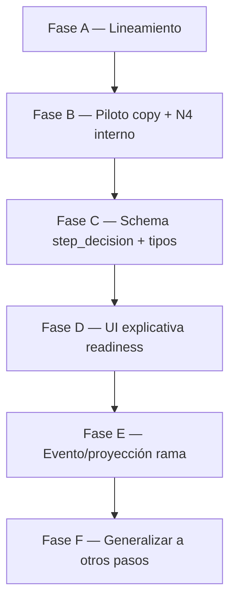

# Plan: claridad de ramas en pasos operacionales (grafo explicativo, no motor)

> **Estado:** FASE F HECHA (documents_received + comparables_in_progress) — 2026-07-09. Epic A–F cerrado; opcional: UI de instancia / `package_ready` metadata.  
> **Contexto:** conversación sobre `property_optioning` paso `awaiting_documents` (decisión interno/externo) y el riesgo de clonar el piloto con sesgo histórico a la ruta externa.  
> **Principio rector:** el panel y el flow **explican y auditan** caminos; el **runtime** sigue en código + estado del caso + skills. No construir un orquestador tipo n8n ejecutable en Settings.

**Documentos relacionados**

- [`authoring-playbook.md`](authoring-playbook.md) — criterios de `step_key` y autoría
- [`testing-framework.md`](testing-framework.md) — N0–N5; escenarios N4 = ramas de QA
- [`operational-case-reusable-patterns.md`](operational-case-reusable-patterns.md) — catálogo `PATTERN_*`
- [`architecture.md`](architecture.md) — `document_request_target`, esperas, notify
- [`e2e-observability-consolidation-plan.md`](e2e-observability-consolidation-plan.md) — precedente de “observabilidad = verdad operativa”
- [`use-case-authoring-vision.md`](use-case-authoring-vision.md) — autoría NL debe heredar este modelo

**Código ancla (hoy)**

| Pieza | Ubicación |
|-------|-----------|
| Decisión documental | `apps/web/src/lib/operational-cases/document-request-target.ts` |
| Tipos flow | `packages/types/src/index.ts` → `OperationalCaseFlowStep` |
| Skill atómica | `skills/global/request-property-documents/SKILL.md` |
| Gate Telegram si interno | `packages/agent/src/tools/realestate-adapters.ts` |
| Escenarios N4 | `apps/web/src/lib/operational-cases/step-test-scenario-registry.ts` |
| UI readiness | `apps/web/src/app/settings/operational-case-types/operational-case-types-client.tsx` |
| Flow BD | `operational_case_types.operational_flow_jsonb` (migraciones `00025+`) |

---

## 1. Problema que resolvemos

Hoy el runtime de `awaiting_documents` **sí** ramifica (`document_request_target` → interno / externo), pero:

1. El panel de Preparación operativa muestra una **lista plana de tools** (orden histórico anclado a Telegram externo).
2. No hay un objeto de primera clase “decisión / rama del paso”.
3. N4 del paso cubre sobre todo la rama externa → el hito “probado” queda sesgado.
4. Copy de skill/flow habla de “pedir al propietario” aunque la rama interna es válida.
5. Al clonar `property_optioning` como plantilla, el equipo puede aprender el anti-patrón: *“el paso = la tool del camino original; las alternativas viven solo en el SKILL.md”*.

**No es un bug de producción del IF.** Es deuda de **modelo mental, observabilidad y lineamiento de plataforma**.

---

## 2. Objetivo de producto

Lograr claridad tipo “grafo de n8n” **sin** que el panel sea el motor:

| Queremos | No queremos |
|----------|-------------|
| Ver qué caminos existen y qué los elige | Drag-and-drop / editor de nodos ejecutable |
| Trazar en timeline “entré a rama X por razón Y” | Segundo orquestador que compita con cron/skill/código |
| Tools y escenarios N4 colgados de cada rama | Duplicar la lógica del IF en JSON del flow |
| Patrón clonable para el 2º case type | Partir `awaiting_documents` en dos `step_key` sin necesidad |
| Metadata **explicativa** alineada al runtime | Metadata que el runtime lea para ramificar (salvo gates ya existentes) |

### Modelo mental canónico

```text
Hito (step_key)           →  objetivo + artefacto durable
  └─ Decisión (opcional)  →  condición en context/estado (código)
        ├─ Rama A         →  status de espera + tools primarias + escenarios QA
        └─ Rama B         →  idem
  └─ Tools compartidas    →  list/extract/persist comunes al hito
  └─ Skill(s)             →  cómo actuar DENTRO de la rama activa
```

**Fuente de verdad de ejecución (orden fijo):**

1. Código + estado del caso (`context_jsonb`, `status`, eventos)
2. Gates de tools (p. ej. bloquear Telegram si `internal_user`)
3. Skill (instrucciones al agente)
4. Flow / panel (mapa humano + contratos de prueba) — **no ejecuta el IF**

---

## 3. Diseño propuesto

### 3.1 Nuevo patrón de plataforma

**ID propuesto:** `PATTERN_STEP_BRANCH_DECISION`  
(alias de dominio documental: audiencia interno/externo; el patrón es genérico)

| | |
|--|--|
| **Capa** | `domain_model` + `test_contract` + `test_ui` + `observability` |
| **Cuándo usar** | Mismo `step_key` / mismo artefacto, pero **2+ caminos** con distinto responsable dominante o distinto `waiting_*` |
| **Cuándo NO usar** | Variantes triviales (recordatorio vs primer mensaje); ahí basta un solo camino + eventos |
| **Runtime** | Persistir la decisión en contexto (o estado derivado); handler determinístico preferido; skill consume el valor |
| **QA** | Un escenario N4 *milestone* por rama de negocio cubierta; N3 puede cubrir la rama principal de la atómica |
| **UI** | Bloque “Decisión del paso” de solo lectura; tools agrupadas por rama + compartidas |
| **Playbook** | Extiende §5.2: ramas del mismo hito se declaran; no se esconden solo en el skill |

Relación con patrones existentes:

- `PATTERN_STEP_TEST_SCENARIO` — ya dice “paso con 2+ ramas”; este patrón nombra la **decisión** y obliga a representarla.
- `PATTERN_STEP_STATUS_N3_VS_N4` — “Paso probado” exige todos los escenarios milestone (incluida cada rama declarada).
- `PATTERN_TOOL_SURFACE_CLASSIFICATION` — sin cambio de semántica; solo agrupación visual.

### 3.2 Schema declarativo (explicativo) en el flow

Extensión **opcional y aditiva** de `OperationalCaseFlowStep`. Pasos sin `step_decision` se comportan exactamente como hoy.

```ts
/** Solo documentación + UI + enlace a escenarios. Nunca leído por el agent graph para ramificar. */
export interface OperationalCaseFlowStepDecisionBranch {
  /** Valor estable; debe coincidir con el valor persistido en contexto cuando aplique. */
  value: string;
  label: string;
  description?: string;
  /** Status típico mientras la rama está activa (informativo). */
  expected_status?: OperationalCaseStatus;
  /** Tools primarias de esta rama (subset de skill_tools / step_tools). */
  primary_tool_ids?: string[];
  /** IDs de escenarios N4 milestone que cubren esta rama. */
  scenario_ids?: string[];
}

export interface OperationalCaseFlowStepDecision {
  /** ID estable de la decisión dentro del paso (ej. document_request_target). */
  id: string;
  label: string;
  description?: string;
  /**
   * Clave en context_jsonb donde vive el valor elegido.
   * Informativo: el runtime ya conoce esta clave en código.
   */
  context_key?: string;
  /** Cómo se decide hoy (copy para autores). */
  decided_by_hint?: string;
  branches: OperationalCaseFlowStepDecisionBranch[];
  /** Tools del hito que aplican a todas las ramas. */
  shared_tool_ids?: string[];
}

export interface OperationalCaseFlowStep {
  step_key: string;
  step_label: string;
  step_description?: string;
  step_skills?: OperationalCaseFlowSkill[];
  step_tools?: OperationalCaseFlowTool[];
  /** Opcional. Metadata explicativa de ramas; no es motor de ejecución. */
  step_decision?: OperationalCaseFlowStepDecision;
}
```

**Ejemplo piloto (`awaiting_documents`):**

```json
{
  "step_key": "awaiting_documents",
  "step_label": "Reunir documentos",
  "step_description": "Obtener el expediente documental (boleta indispensable en copy + ideales). Quién aporta se decide por rama.",
  "step_decision": {
    "id": "document_request_target",
    "label": "¿Quién aporta los documentos?",
    "context_key": "document_request_target",
    "decided_by_hint": "Post-intake: respuesta «interno»/«externo», o inferido si suben archivos antes de elegir.",
    "branches": [
      {
        "value": "internal_user",
        "label": "Equipo interno",
        "expected_status": "waiting_internal",
        "primary_tool_ids": ["notify_user"],
        "scenario_ids": ["awaiting_documents_internal_upload"]
      },
      {
        "value": "external_contact",
        "label": "Contacto externo",
        "expected_status": "waiting_external",
        "primary_tool_ids": ["telegram_send_message_to_contact"],
        "scenario_ids": ["awaiting_documents_outreach"]
      }
    ],
    "shared_tool_ids": ["operational_case_list_documents"]
  }
}
```

**Reglas anti-deuda del schema:**

1. `step_decision` es **opcional**; parsers actuales ignoran campos desconocidos → migración aditiva.
2. El agent **no** lee `step_decision` para elegir tools (sigue skill + contexto).
3. Validación suave en settings (warn): `primary_tool_ids` ⊆ tools declaradas del paso; `scenario_ids` ⊆ registry.
4. No introducir `both` en este plan (sigue en `future-considerations.md`).

### 3.3 Observabilidad / trazabilidad

Hoy ya existen señales parciales:

- `context.document_request_target` + `*_decided_at` / `*_decided_by`
- `reminder_sent` con `purpose` / `audience`
- evento `document_request_target_inferred` (kind en payload de algunos caminos)

**Gap:** no hay un evento de primera clase uniforme “rama elegida” legible en timeline/UI de instancia.

**Propuesta (Fase C, tras metadata):**

| Evento / proyección | Cuándo | Payload mínimo |
|---------------------|--------|----------------|
| `human_decision` o `state_changed` con `kind=step_branch_selected` | Al fijar la decisión (user / inferred / default) | `step_key`, `decision_id`, `branch_value`, `decided_by`, `previous_value?` |
| Proyección en resumen E2E / flow progress | Siempre que exista | Misma metadata; no inventar si no hubo evento |

**Principio (del plan E2E):** no fabricar eventos en UI; emitir en el handler único (`applyDocumentRequestTargetChoice` / `setCaseDocumentRequestTarget` / inferencia).

**Checkpoint:** antes de añadir tipo de evento nuevo al union `OperationalCaseEventType`, preferir reutilizar `human_decision` / `state_changed` con `payload.kind` estable — evita migración de enum si no hace falta.

### 3.4 UI del panel (solo lectura)

En el acordeón del paso, **encima** de habilidades/tools:

```text
┌ Decisión del paso ─────────────────────────────────────────┐
│ ¿Quién aporta los documentos?                              │
│ Condición: document_request_target                         │
│ Se fija: post-intake · «interno»/«externo» · o inferida   │
│                                                            │
│  ┌ Rama · Interno ──────────┐  ┌ Rama · Externo ─────────┐│
│  │ waiting_internal         │  │ waiting_external        ││
│  │ notify_user              │  │ telegram_send…          ││
│  │ N4: …_internal_upload    │  │ N4: …_outreach          ││
│  └──────────────────────────┘  └─────────────────────────┘│
│ Compartidas: operational_case_list_documents               │
└────────────────────────────────────────────────────────────┘
```

Comportamiento:

- No es selector ejecutable en producción; en laboratorio puede ser **filtro visual** (“resaltar tools de esta rama”) sin cambiar runtime.
- Tools siguen siendo probables en N1 como hoy; el bloque solo **agrupa/etiqueta**.
- Si no hay `step_decision`, UI idéntica a la actual (compat).

### 3.5 Pruebas (rebalancear sesgo externo)

| Nivel | Hoy | Objetivo |
|-------|-----|----------|
| N3 `request-property-documents` | Sesgado a outreach externo | **Se mantiene** en rama externa en este epic; N3 interno = follow-up opcional aparte |
| N4 `awaiting_documents_outreach` | Único milestone | Sigue como rama externa |
| N4 interno | **Ausente** | Añadir `awaiting_documents_internal_upload` (milestone): seed `document_request_target=internal_user` → `waiting_internal` + `notify_user`, **sin** Telegram externo |
| Pill “Paso probado” | 1/1 externo | 2/2 ramas milestone |

### 3.5.1 Política de cobertura de escenarios (N4) — acordada

Los escenarios N4 **no** son el inventario exhaustivo de producción. Son las **ramas de negocio que el hito debe demostrar** para «Paso probado».

| Regla | Aplicación |
|-------|------------|
| Toda rama declarada en `step_decision` | ≥1 escenario N4 con `counts_toward_step_milestone !== false` |
| Variantes de recordatorio / copy / reintento | **No** exigen N4 nuevo |
| Guardrails raros | N4 con `counts_toward_step_milestone: false`, o N1/N2 |
| Caminos multi-tick / E2E largo | N5 o N4 v2 — fuera de este epic |
| Auditoría “¿faltan escenarios en todo el case type?” | **Epic aparte** (madurez QA); no bloquea A–E |

**En este plan:**

- **Ahora (Fase B):** solo el hueco de rama de decisión en `awaiting_documents` (N4 interno).
- **Fase F:** al añadir `step_decision` a otro paso, checklist corto *rama ↔ escenario* — añadir N4 solo si falta una rama de decisión; si ya hay 2 escenarios (p. ej. `documents_received`), preferir **mapear** `scenario_ids`, no inventar.
- **Fuera de alcance:** pasada completa del catálogo N4 de `property_optioning`.

### 3.6 Copy / lineamiento (piloto como plantilla)

Sin cambiar comportamiento:

- `step_label` / `step_description`: “Reunir documentos” / expediente, no solo “pide al propietario”.
- Skill `request-property-documents`: descripción neutra al hito; IF interno/externo ya existe — reordenar para que interno no parezca footnote.
- `notify_user` en flow: label distinto por uso (“Solicitar subida al equipo” vs “Escalar por falta de respuesta”) vía `tool_label` en la declaración de tools (puede quedar una sola tool con description que mencione ambos roles, o dos entradas visuales en ramas — **sin** duplicar `tool_id` en `allowed_tools`).

---

## 4. Qué NO hacemos en este plan

| Fuera de alcance | Por qué |
|------------------|---------|
| Motor de grafos ejecutable en panel | Duplicaría orquestación; frágil vs skill/cron |
| Partir `awaiting_documents` en dos `step_key` | Mismo artefacto; playbook §5.2 |
| Modo `both` | Ya acotado en future-considerations |
| `step_test_contract` completo en BD | Pendiente playbook §12; este plan solo enlaza `scenario_ids` al registry TS |
| Refactor grande del webhook Telegram | Ya consolidado en plan E2E; no reabrir |
| Autoría NL automática de ramas | Después: vision doc hereda el patrón |
| Cambiar semántica de `document_request_target` | Runtime estable |
| Auditoría exhaustiva de todos los escenarios N4/N3 del piloto | Epic de madurez QA aparte (§3.5.1); aquí solo huecos de **rama de decisión** |
| N3 interno de `request-property-documents` en el mismo PR que B | Decidido: no; N4 interno basta para el hito |

---

## 5. Fases de implementación



Cada fase termina con: selftests verdes, sin cambio de comportamiento no documentado, y **checkpoint de aprobación** si toca runtime o UI grande.

### Fase A — Lineamiento (docs only) — riesgo muy bajo — **HECHA (2026-07-09)**

**Objetivo:** fijar el patrón antes de clonar case types.

**Entregables (completados):**

1. `PATTERN_STEP_BRANCH_DECISION` en `operational-case-reusable-patterns.md` + `test-patterns-catalog.ts` (incl. mapeo piloto `awaiting_documents` / `documents_received` / `comparables_in_progress`).
2. Extensión en `authoring-playbook.md` §5.2.1 + §7 (decisión de rama; política de cobertura N4).
3. Notas en `testing-framework.md` §5.1 y tabla de escenarios N4 (rama interna pendiente Fase B).
4. Párrafo en `architecture.md` § destino documental → este plan.

**No tocó:** runtime, migraciones, UI.

**Criterio de hecho:** un autor nuevo puede leer el playbook y no asumir “Telegram = el paso”.

---

### Fase B — Rebalanceo del piloto (copy + N4 interno) — riesgo bajo — **HECHA (2026-07-09)**

**Objetivo:** el piloto deja de enseñar solo el camino externo.

**Entregables (completados):**

1. Migración `00058_property_optioning_awaiting_documents_branch_copy.sql` — copy neutro del hito + tool descriptions por rama.
2. Copy en `request-property-documents/SKILL.md` y mapa en `property-optioning-coach`.
3. N4 milestone `awaiting_documents_internal_upload` (+ seed explícito en outreach).
4. Selftest evidencia N4: `awaiting_documents` exige 2 milestones; un solo OK → `partially_tested`.
5. Sin N3 interno (acordado).

**Nota operativa:** tras aplicar la migración y desplegar, «Paso probado» en settings exige correr **ambos** N4 del paso.

---

### Fase C — Schema `step_decision` (tipos + seed piloto) — riesgo bajo–medio — **HECHA (2026-07-09)**

**Objetivo:** el flow puede declarar ramas sin que el runtime las ejecute.

**Entregables (completados):**

1. Tipos `OperationalCaseFlowStepDecision*` en `packages/types`.
2. `normalizeStepDecision` + `collectStepDecisionWarnings` en `step-decision.ts` (API + cliente settings).
3. Migración `00059_property_optioning_awaiting_documents_step_decision.sql`.
4. Selftest `step-decision.selftest.ts` (+ script npm).
5. JSDoc: explicativo; no leído por el agent graph.

---

### Fase D — UI explicativa en Preparación operativa — riesgo medio (solo UI) — **HECHA (2026-07-09)**

**Objetivo:** el configurador ve el mapa de ramas.

**Entregables (completados):**

1. `StepDecisionPanel` en settings (solo lectura; sin `step_decision` → layout previo).
2. Badges de rama en tools (`Equipo interno` / `Contacto externo` / `Compartida`).
3. Badges de rama en selector de escenarios N4.
4. Helpers `step-decision-ui.ts` + selftest.
5. Alcance: **solo Preparación operativa** (no timeline de instancia).

---

### Fase E — Observabilidad de “rama elegida” — riesgo medio (runtime ligero) — **HECHA (2026-07-09)**

**Objetivo:** audit trail uniforme cuando se fija la decisión.

**Entregables (completados):**

1. `recordStepBranchSelected` en `step-branch-selected.ts` (idempotente).
2. Emitido desde `setCaseDocumentRequestTarget` + `verifyExternalContactLink`.
3. `human_decision` + `payload.kind = step_branch_selected` (sin ampliar enum).
4. Display: «Rama documental: equipo interno|contacto externo».
5. Proyección E2E conserva el evento pre-arranque (`isE2EEvent` + filtro pre-transición); atribución a `awaiting_documents`.
6. Selftests; **sin** backfill. Compat: se mantiene `document_request_target_inferred` en webhook.

---

### Fase F — Generalizar a otros pasos del piloto — riesgo bajo si A–E estables — **HECHA (2026-07-09)**

| Paso | Decisión | Acción |
|------|----------|--------|
| `documents_received` | ¿Datos críticos completos? (+ audiencia de faltantes) | **Hecho** — 3 ramas (`complete` / `pending_external` / `pending_internal`) + N4 interno (`00061`) |
| `comparables_in_progress` | ¿Muestra defendible? | **Hecho** — mapear 2 N4 (`defensible_comparables_sample`); declarar `notify_user` en skill_tools si faltaba |
| `package_ready` | preflight / descripción / publish | **Diferido** — varios N4 secuenciales, no un IF binario claro; no inventar |

**Entregables (completados):** migración `00060_…_documents_comparables.sql`; checklist *rama ↔ escenario* (§3.5.1); docs matriz piloto. **Sin** N4 nuevos.

**Checkpoint:** no mezclado con D/E.

---

## 6. Matriz de riesgos

| Riesgo | Probabilidad | Impacto | Mitigación |
|--------|--------------|---------|------------|
| Panel/metadata se interpreta como motor | Media | Alto (deuda) | JSDoc + playbook + tests que el agent no lea `step_decision` |
| N4 interno rompe “Paso probado” hasta pasarlo | Alta (esperado) | Bajo | Comunicar; pill `awaiting_n4` hasta 2/2 |
| Migración JSON mal formada | Baja | Medio | Migración idempotente; selftest de shape |
| Duplicar eventos de rama | Media | Medio | Idempotencia por case_id + decision_id + value |
| Scope creep a editor visual | Media | Alto | Fuera de alcance explícito §4 |
| Desalineación skill vs metadata | Media | Medio | Warn validation; skill sigue siendo guía de ejecución |
| Scope creep a “completar todos los N4” | Media | Medio | Política §3.5.1; F solo mapea ramas de decisión |

---

## 7. Orden de PRs sugerido

| PR | Fase | Contenido | ¿Pedir OK antes? |
|----|------|-----------|------------------|
| 1 | A | Docs + patrón + política de cobertura | No (aprobado) |
| 2 | B | Copy flow/skill + N4 interno (sin N3 interno) | Aviso al empezar |
| 3 | C | Tipos + migración aditiva `step_decision` | Sí (migración BD) |
| 4 | D | UI readiness (solo settings) | Sí (UX) |
| 5 | E | Evento rama (post-D; sin backfill) | **Sí** (runtime; kind de evento) |
| 6 | F | Otros pasos: mapear ramas ↔ escenarios | Sí por paso |

**Secuencia acordada:** `A → B → C → D → E → [UI instancia opcional] → F`.

---

## 8. Criterios de éxito

1. Un configurador entiende en &lt;1 min que el paso 1 tiene **dos caminos** mutuamente excluyentes.
2. “Paso probado” en `awaiting_documents` exige cobertura de **ambas** ramas milestone.
3. Cero cambios en el grafo del agente para ramificar; `document_request_target` sigue siendo la verdad.
4. El playbook documenta el patrón y la política §3.5.1 antes del segundo case type real.
5. Tras E: timeline/E2E puede responder “¿por qué waiting_internal?” con evento/contexto de rama.
6. No existe UI de drag-and-drop ni ejecución de IF desde el panel.
7. No se ha hinchado el catálogo N4 con escenarios que no son ramas de decisión.

---

## 9. Decisiones cerradas (2026-07-09)

| # | Pregunta | Decisión |
|---|----------|----------|
| 1 | ¿Primer PR solo Fase A? | **Sí** |
| 2 | N3 vs N4 rama interna | **N4 milestone sí; N3 interno no en este epic** (follow-up opcional) |
| 3 | Migración BD en C | **Sí, aditiva**, en el PR de C (después de B) |
| 4 | Fase E en el epic | **Sí**, después de D |
| 5 | UI Fase D | **Solo Preparación operativa (settings)**; instancia después / con E |
| — | ¿Auditar todos los escenarios N4 ahora? | **No.** Solo huecos de rama de decisión (§3.5.1); auditoría amplia = epic QA aparte |

Detalle E cerrado: `human_decision` + `payload.kind=step_branch_selected` (sin ampliar enum).

---

## 10. Resumen ejecutivo

Plan aprobado: claridad tipo grafo **explicativo**, runtime híbrido intacto, piloto sin sesgo externo en QA del paso 1, fases pequeñas.

**Epic A–F cerrado** (`awaiting_documents`, `documents_received`, `comparables_in_progress`). Opcional: UI de instancia con rama activa; `package_ready` solo si se define un IF binario claro.
