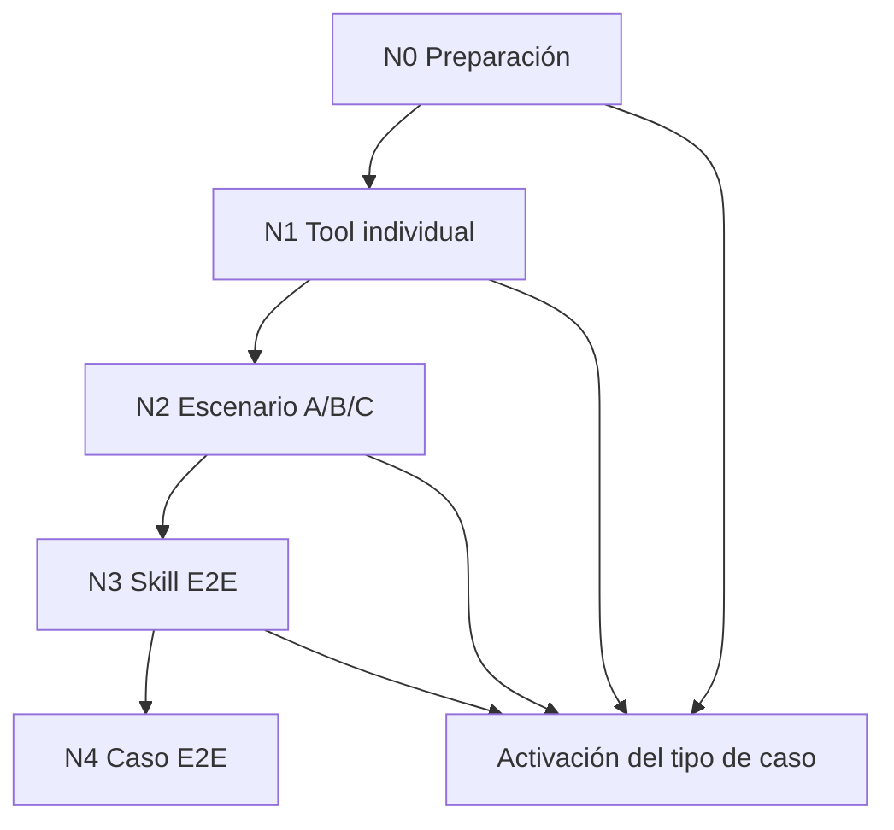

# Marco de pruebas para readiness operacional

> **Estado:** v1.0 — refleja la UI y APIs actuales de Preparación operativa en Casos de uso.
>
> **Documentos relacionados**
> - [`architecture.md`](architecture.md) §10 — tool readiness, provisioning y APIs.
> - [`../skills-tools-architecture.md`](../skills-tools-architecture.md) §11 — resumen ejecutivo de patrones UI.
> - [`use-case-authoring-vision.md`](use-case-authoring-vision.md) — visión de generación NL → propuesta implementable y roadmap.
> - [`conversational-intake-test-script.md`](conversational-intake-test-script.md) — guion de prueba conversacional del intake.

---

## 1. Propósito y alcance

Este marco define **cómo probar** un tipo de caso operacional antes de activarlo en producción. Cubre:

- la UI de **Preparación operativa** en Ajustes → Casos de uso;
- las APIs `GET /api/tool-readiness`, `POST /api/tool-readiness/run-tool`, `POST /api/tool-readiness/run-skill` y el subsistema `operational-case-tests`;
- los patrones visuales y de secuencia (A/B/C) ya implementados en `operational-case-types-client.tsx`.

**No cubre:**

- tests unitarios de adapters o lógica pura en `packages/agent`;
- eval suites de selección de skills;
- pruebas de carga o seguridad;
- el flujo conversacional del chat (ver guion aparte).

**Principio rector:** la readiness operacional valida **contratos de negocio reproducibles**, no sólo que una tool no lance excepción.

---

## 2. Niveles de prueba (N0–N4)

Los niveles son acumulativos: un caso no debería activarse sin N0 completo; N4 es aspiracional hoy.

| Nivel | Nombre | Qué valida | Dónde se ejecuta | Obligatorio antes de activar |
|-------|--------|------------|------------------|------------------------------|
| **N0** | Preparación | Credenciales, activos, caso de prueba aislado | Preparación operativa (bloque superior) | Sí |
| **N1** | Tool individual | Una capacidad atómica sin orden causal | Tarjeta expandida de cada tool | Sí, por tool del flow |
| **N2** | Escenario guiado A/B/C | Secuencia causal con prerequisitos y escrituras controladas | Misma tarjeta, sub-pasos A/B/C | Sí, cuando el patrón aplique |
| **N3** | Skill E2E | Contrato del paso: tool calls, artefactos, estado del caso | Botón «Probar skill» del paso | Recomendado por skill |
| **N4** | Caso E2E | Flujo multi-paso de punta a punta | Tick E2E del caso de prueba | Futuro / piloto manual |



---

## 3. N0 — Preparación operativa

Antes de probar cualquier tool, el operador debe tener:

### 3.1 Credenciales y conexiones

| Recurso | Dónde configurarlo | Bloquea |
|---------|-------------------|---------|
| OAuth / vínculos (Telegram, Google, GitHub) | Ajustes → Conexiones | Tools que dependen del provider |
| Secretos por cuenta (`easybroker`, `easybroker_web`, `ungga`, etc.) | Ajustes → Credenciales por cuenta o inline en readiness | Tools inmobiliarias |
| Estado `active` tras `POST …/test` | Automático al probar conexión | Prueba controlada de escritura |

`GET /api/tool-readiness?case_type_id=…` devuelve por tool: `status`, `test_status`, categoría, si bloquea prueba controlada y acción sugerida.

### 3.2 Activos de prueba

Declarados en `operational_flow_jsonb` (`required_assets`, `test_assets`) o en `TOOL_CATALOG[].asset_profile.test`:

- plantillas DOCX, watermarks, fotos de prueba;
- PDF/imagen de escritura para documentos;
- contacto Telegram de prueba (`chat_id` externo).

Los activos viven en `account_assets` + Supabase Storage.

### 3.3 Caso de prueba aislado

El subsistema `operational-case-tests` mantiene **un caso de prueba por fila de tipo de caso** (regenerar no crea otro registro). Ese caso:

- tiene contexto derivado de `test-context-samples.ts` y activos cargados;
- es el `case_id` que aparece en args de tools durante readiness;
- **no debe ser avanzado por el cron** mientras se usa para pruebas controladas.

**Checklist N0:**

- [ ] Todas las tools del flow muestran estado «Lista» (no «Necesita config»).
- [ ] Activos de prueba cargados y visibles en Preparación operativa.
- [ ] Caso de prueba generado/regenerado con contexto coherente.
- [ ] Contacto externo de prueba identificado (Telegram u otro canal).

---

## 4. N1 — Tool individual

### Cuándo usar N1

Usar **sólo N1** (sin wizard A/B/C) cuando la tool:

- no tiene dependencia de orden con otra tool del mismo paso;
- no realiza escritura externa de alto riesgo que requiera confirmación explícita;
- su contrato se valida en una sola ejecución (consulta, dry-run, listado, cálculo).

Ejemplos típicos en `property_optioning`:

- `bigquery_lookup_local_comparables` — consulta read-only;
- `operational_case_list_documents` — cuando se prueba aisladamente fuera del escenario documental;
- `notify_user` en modo validación/smoke;
- tools de preparación de borrador sin side effects externos.

### Cómo probar

1. Expandir la tool en Preparación operativa.
2. Elegir modo **Smoke test** o **Caso de prueba** según lo que se quiera validar.
3. Revisar args derivados (fuente: recipe por tool / caso).
4. Ejecutar. Opcional: args JSON avanzados.
5. Interpretar el panel de resultado.

### Modos de ejecución

| Modo | Uso |
|------|-----|
| **Smoke test** | Args mínimos del catálogo; no requiere caso aislado. |
| **Caso de prueba** | Args derivados del caso de prueba + activos; contrato operacional real. |

Para tools de **riesgo alto**, el smoke puede devolver `high_risk_requires_hitl` sin ejecutar — eso es éxito de política, no fallo de integración.

### Semántica del resultado (N1)

| Color | Significado |
|-------|-------------|
| **Verde** | Contrato cumplido; ejecución OK o validación OK sin envío. |
| **Ámbar** | Parcial, warning, HITL pendiente, prerequisito faltante no fatal. |
| **Rojo** | Fallo, excepción, estado incompatible con el contrato. |
| **Violeta** | Bloque de acción, preview, metadata interactiva. |
| **Gris/neutro** | Detalle técnico, JSON crudo, pendiente. |

---

## 5. N2 — Escenario guiado A/B/C

### Cuándo usar N2

Usar wizard A/B/C cuando hay **secuencia causal**:

| Sub-paso | Rol típico |
|----------|------------|
| **A** | Validar args, texto, payload, dry-run sin side effect externo |
| **B** | Ejecución controlada real (escritura externa, envío, creación de borrador) |
| **C** | Simular respuesta externa o verificar artefacto persistente del caso |

### Reglas de UX (obligatorias)

1. **Gating:** un sub-paso posterior permanece deshabilitado hasta cumplir el prerequisito visible del anterior.
2. **Invalidación:** re-ejecutar A borra resultados de B y C; re-ejecutar B borra sólo C; A permanece visible.
3. **Estados separados:** A, B y C tienen respuesta UI independiente (`validationResponse`, `controlledSendResponse`, simulación con `resetVersion`).
4. **Confirmación explícita:** tools de alto riesgo exigen texto de confirmación (ej. `ENVIAR PRUEBA`) antes de B.
5. **Prefijo de prueba:** escrituras reales agregan marcadores visibles (`[PRUEBA CONTROLADA]`, `[PRUEBA - BORRAR]`).

### Patrones implementados

#### 5.1 Telegram — solicitud de documentos (paso 2)

**Skill:** `request-property-documents`  
**Tool:** `telegram_send_message_to_contact`

| Sub-paso | Acción |
|----------|--------|
| A | Validar mensaje de solicitud de documentos (`purpose` de checklist) |
| B | Enviar solicitud real al `chat_id` de prueba |

**Prerequisito:** caso de prueba con `case_id` y contacto externo configurado.

#### 5.2 Telegram — características faltantes (paso 3)

**Skill:** `extract-property-characteristics`  
**Tool:** `telegram_send_message_to_contact`

| Sub-paso | Acción |
|----------|--------|
| A | Validar mensaje (`purpose=characteristics_pending`) |
| B | Enviar mensaje real; caso → `waiting_external` |
| C | Simular respuesta del propietario; verificar `property_data` y estado del caso |

**Contrato esperado en C:** datos en `property_data`; caso puede quedar en `waiting_internal` si dispara `notify_user` de revisión del asesor.

#### 5.3 Telegram — genérico (otros pasos)

Cualquier otro uso de `telegram_send_message_to_contact` con caso de prueba sigue **A validar → B enviar**. No incluye C salvo que exista simulador específico.

#### 5.4 EasyBroker — publicar paquete (paso 8)

**Skill:** `publish-listing-package`

| Tool | Sub-paso | Acción |
|------|----------|--------|
| `easybroker_create_listing` | A | Crear borrador `not_published` con prefijo `[PRUEBA - BORRAR]` |
| `easybroker_upload_images` | B | Subir fotos al `listing_id` de A (hidratado en backend si falta en args) |

**Encadenamiento:** el backend (`hydrateEasyBrokerUploadListingId` en `run-tool/route.ts`) busca el `listing_id` del último `easybroker_create_listing` exitoso. La UI también captura el ID en estado local.

#### 5.5 Documentos — registro / extracción / listado

Presentación visual A/B/C en tarjetas individuales (no un solo wizard monolítico):

| Tool | Etiqueta visual | Rol |
|------|-----------------|-----|
| `operational_case_register_document` | A | Registrar PDF/imagen de prueba en el caso |
| `operational_case_extract_document_fields` | B | Extraer campos visibles del documento |
| `operational_case_list_documents` | C | Verificar documentos y estado de extracción |

**Nota:** por naturaleza asíncrona (Telegram real, uploads), el operador puede completar A/B/C en orden lógico aunque no compartan un único componente wizard.

### Matriz: ¿N1 o N2?

| Señal en el flow | Patrón recomendado |
|------------------|-------------------|
| Tool de riesgo `alto` con escritura externa | N2 (A validar + B controlado [+ C simular]) |
| Output de tool A es input obligatorio de tool B | N2 encadenado (EasyBroker) |
| Respuesta externa async cambia estado del caso | N2 con C simulado |
| Consulta, listado, cálculo local | N1 |
| HITL interno (`notify_user`) sin side effect externo | N1 o smoke; validar en N3 |

---

## 6. N3 — Skill E2E

### Qué valida

El contrato de negocio del **paso completo**, no sólo una tool:

- tool calls esperadas u orden razonable;
- artefactos en `context_jsonb` (`property_data`, documentos, comparables, etc.);
- transiciones de `current_step` y `status` del caso;
- eventos en timeline del caso;
- pendientes HITL generados.

### Cómo probar

1. Completar N1/N2 de las tools bloqueantes del paso.
2. Pulsar **Probar skill** en la fila de la skill del paso.
3. Revisar resultado: `tested_ok`, `partial`, `tested_failed`, `blocked_by_tools`.

### Relación con N2

N3 **complementa** N2; no lo reemplaza para tools de alto riesgo. Una skill puede pasar N3 con mocks parciales pero aún requerir prueba controlada Telegram/EasyBroker en N2.

---

## 7. N4 — Caso E2E (futuro cercano)

Validación del **tipo de caso completo** en el caso de prueba aislado:

- tick E2E que invoca el agente en modo `case_runner`;
- avance secuencial por pasos con intervención humana simulada donde aplique;
- verificación de que el cron no corrompe el caso de prueba durante la batería.

Hoy existe infraestructura parcial (`operational-case-tests/run`); N4 formalizado es trabajo pendiente. Ver [`use-case-authoring-vision.md`](use-case-authoring-vision.md) anillo 2–3.

---

## 8. Estados `test_status`

### Por tool

| Valor | Etiqueta UI | Significado actual |
|-------|-------------|-------------------|
| `ready_untested` | (sin «Probada») | Tool lista pero sin ejecución de prueba registrada |
| `tested_ok` | Probada | Al menos una ejecución exitosa registrada en historial de readiness |
| `tested_failed` | Fallida | Última evidencia de fallo |

**Limitación conocida (v1.0):** `tested_ok` se registra **por ejecución individual**, no exige completar todos los sub-pasos A+B+C de un wizard. La UI impone la secuencia; el backend aún no modela «escenario N2 completo».

**Evolución recomendada:** metadata `test_pattern` en flow + evidencia por sub-paso (`scenario_step: "B"`).

### Por skill

| Valor | Significado |
|-------|-------------|
| `blocked_by_tools` | Alguna tool requerida no está lista o probada |
| `ready_to_test` | Tools listas; skill no probada |
| `tested_ok` | Skill E2E exitosa |
| `tested_failed` | Fallo en última prueba E2E |
| `partial` | Éxito parcial o contrato incompleto |

### Por paso del flow

Agregación de skills y tools del paso: `blocked`, `ready_to_test`, `partially_tested`, `tested_ok`, `tested_failed`.

---

## 9. Reglas visuales unificadas

Aplican en N1 y N2:

| Elemento | Estilo | Uso |
|----------|--------|-----|
| Botón / bloque de acción primario | Violeta (`border-violet`, `bg-violet-50`) | Ejecutar prueba, sub-paso A/B/C |
| Botón deshabilitado | Violeta atenuado (`disabled:bg-violet-300`) | Prerequisito no cumplido — coherente con acción, no gris genérico |
| Panel éxito | Verde | Contrato cumplido |
| Panel warning / HITL / parcial | Ámbar | Revisar antes de continuar |
| Panel error | Rojo | Fallo |
| Panel info / siguiente paso | Violeta claro | «Siguiente: B · …» |
| Detalle técnico JSON | Gris / `<details>` | Auditoría, no narrativa principal |

Componente de referencia: `OutcomePanel` en `operational-case-types-client.tsx`.

---

## 10. Guía de prueba — `property_optioning` (referencia)

Orden sugerido para la primera batería manual completa:

| Orden | Paso (índice) | Skill(s) | Tools / patrón | Nivel |
|-------|---------------|----------|----------------|-------|
| 0 | — | — | Preparación + activos + caso de prueba | N0 |
| 1 | 1 | Intake / apertura | Tools de apertura si expuestas | N1 |
| 2 | 2 | `request-property-documents` | `telegram_send_message_to_contact` A→B | N2 |
| 2b | 2 | `request-property-documents` | `operational_case_register_document` A | N2 |
| 2c | 2 | — | `operational_case_list_documents` C | N2 |
| 3 | 3 | `extract-property-characteristics` | `operational_case_extract_document_fields` B | N2 |
| 3b | 3 | `extract-property-characteristics` | `telegram_send_message_to_contact` A→B→C | N2 |
| 3c | 3 | — | `notify_user` validación asesor | N1/N3 |
| 4+ | 4…7 | Comparables, precio, etc. | Según tools del flow | N1/N3 |
| 8 | 8 | `publish-listing-package` | EasyBroker A→B | N2 |
| — | Todos | Cada skill del paso | Probar skill | N3 |

Anotar fallos como: **paso · skill · tool · sub-paso · modo (smoke/case) · observación**.

---

## 11. Plantilla para nuevos casos de uso

Al diseñar un flow nuevo, completar:

### 11.1 Inventario por paso

```markdown
### Paso N — [nombre del paso]
- Skill: [slug]
- Tools: [lista]
- Participantes externos: [ninguno | propietario | portal | …]
- HITL interno: [ninguno | notify_user | business_decision | …]
- Artefactos que deben quedar en context_jsonb: […]
- Patrón de prueba: N1 | N2 (A/B/C) — [patrón concreto]
- Riesgo máximo del paso: [bajo | medio | alto]
```

### 11.2 Checklist de activación

- [ ] N0 completo
- [ ] Cada tool con patrón N1 probada o N2 A/B/C completado según matriz §5
- [ ] Cada skill con N3 `tested_ok` o `partial` documentado
- [ ] Checks de activación en UI sin bloqueos rojos
- [ ] Operador entiende qué borrar manualmente tras pruebas (borradores EasyBroker, mensajes Telegram, etc.)

### 11.3 Criterio de «listo para producción»

Un tipo de caso privado puede activarse cuando:

1. No hay tools en `needs_config` ni `tested_failed` bloqueantes.
2. Todos los patrones N2 de riesgo alto fueron ejecutados al menos una vez en el caso de prueba.
3. N3 pasó para skills críticas del camino feliz.
4. Existe runbook de limpieza post-prueba.

---

## 12. Archivos de referencia en código

| Pieza | Ubicación |
|-------|-----------|
| UI Preparación operativa | `apps/web/src/app/settings/operational-case-types/operational-case-types-client.tsx` |
| Resolución readiness | `apps/web/src/app/api/tool-readiness/route.ts` |
| Ejecución tool | `apps/web/src/app/api/tool-readiness/run-tool/route.ts` |
| Ejecución skill E2E | `apps/web/src/app/api/tool-readiness/run-skill/route.ts` |
| Casos de prueba | `apps/web/src/app/api/operational-case-tests/` |
| Contexto de muestra | `apps/web/src/lib/operational-cases/test-context-samples.ts` |
| Flow piloto | `packages/db/supabase/migrations/00038_property_optioning_document_flow.sql` (y migraciones previas del case type) |

---

## 13. Evolución del marco

Trabajo pendiente alineado con [`use-case-authoring-vision.md`](use-case-authoring-vision.md):

1. Metadata `test_pattern` en `operational_flow_jsonb` (machine-readable).
2. `tested_ok` por escenario completo, no sólo por click suelto.
3. Generación automática del esquema N0–N3 desde un flow propuesto.
4. N4 automatizado con guion E2E por case type.
