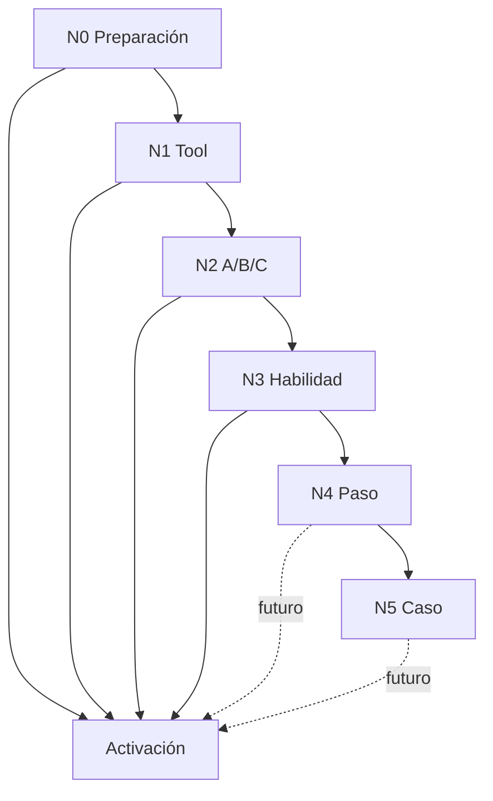

# Marco de pruebas para readiness operacional

> **Estado:** v1.1 — N0–N3 y **N4 v1** implementados (`run-step` + escenarios en código). **N5** caso E2E y **N4 v2** multi-tick pendientes.
>
> **Documentos relacionados**
> - [`authoring-playbook.md`](authoring-playbook.md) — modelo paso / habilidad raíz / `current_step` / autoría de casos (lectura recomendada).
> - [`architecture.md`](architecture.md) §10 — tool readiness, provisioning y APIs.
> - [`../skills-tools-architecture.md`](../skills-tools-architecture.md) §11 — resumen ejecutivo de patrones UI.
> - [`use-case-authoring-vision.md`](use-case-authoring-vision.md) — visión de generación NL → propuesta implementable y roadmap.
> - [`conversational-intake-test-script.md`](conversational-intake-test-script.md) — guion de prueba conversacional del intake.

---

## 1. Propósito y alcance

Este marco define **cómo probar** un tipo de caso operacional antes de activarlo en producción. Cubre:

- la UI de **Preparación operativa** en Ajustes → Casos de uso;
- las APIs `GET /api/tool-readiness`, `POST /api/tool-readiness/run-tool`, `POST /api/tool-readiness/run-skill` (N3), `POST /api/tool-readiness/run-step` (N4 v1) y el subsistema `operational-case-tests` (base para N5);
- el nivel **N5 (caso)** como especificación ampliada; ver [§7](#7-n4--prueba-de-paso-hito) y [§8](#8-n5--prueba-de-caso-e2e).
- los patrones visuales y de secuencia (A/B/C) ya implementados en `operational-case-types-client.tsx`.

**No cubre:**

- tests unitarios de adapters o lógica pura en `packages/agent`;
- eval suites de selección de skills;
- pruebas de carga o seguridad;
- el flujo conversacional del chat (ver guion aparte).

**Principio rector:** la readiness operacional valida **contratos de negocio reproducibles**, no sólo que una tool no lance excepción.

---

## 2. Niveles de prueba (N0–N5)

Los niveles son acumulativos: un tipo de caso no debería activarse sin N0 completo. **N4 v1** está implementado para escenarios declarados en código; **N5** y **N4 v2** siguen pendientes (ver [§14](#14-evolución-del-marco)).

| Nivel | Nombre | Qué valida | Dónde se ejecuta | Implementado | Obligatorio antes de activar |
|-------|--------|------------|------------------|--------------|------------------------------|
| **N0** | Preparación | Credenciales, activos, caso de prueba aislado | Bloque superior Preparación operativa | Sí | Sí |
| **N1** | Tool individual | Una tool sin orden causal | Tarjeta de cada tool | Sí | Sí, por tool del flow |
| **N2** | Escenario A/B/C | Secuencia causal con prerequisitos | Sub-pasos A/B/C en la tarjeta | Sí | Sí, cuando aplique |
| **N3** | **Habilidad** (escenario del paso) | Un tick, **habilidad atómica** forzada; contrato del escenario (`test_contract`) | Botón **«Probar habilidad»** | Sí (`run-skill`) | Recomendado **por habilidad** declarada |
| **N4** | **Paso** (hito) | Cierre del `step_key`: habilidad **raíz**, contexto sembrado, salida del hito | Botón **«Probar paso»** | **v1** (escenarios declarados) | Recomendado si el paso tiene 2+ habilidades o orquestación crítica |
| **N5** | **Caso** (tipo completo) | Multi-paso E2E del `case_type` en caso aislado | Tick E2E / guion manual | Parcial | Aspiracional → obligatorio en madurez |

**Migración v1.0 → v1.1:** el antiguo «N4 Caso E2E» pasó a ser **N5**; el nuevo **N4** es prueba de **paso** (hito). Actualizar checklists y conversaciones internas que citen «N4 = caso completo».

**Aclaración N3 vs N4:** N3 **no** sustituye N4. N3 prueba una **habilidad atómica** en un escenario acotado. N4 prueba que la **habilidad raíz** cumple el **objetivo del paso** (p. ej. avanzar de `compliance_review` a `lease_and_handover`). No debe implementarse N4 como «encadenar todos los N3 del paso» — ver [`authoring-playbook.md`](authoring-playbook.md) §8–§10.



---

## 3. N0 — Preparación operativa

Antes de probar cualquier tool, el operador debe tener:

### 3.1 Credenciales y conexiones

| Recurso | Dónde configurarlo | Bloquea |
|---------|-------------------|---------|
| OAuth / vínculos (Telegram, Google, GitHub) | Ajustes → Conexiones | Tools que dependen del provider |
| Secretos por cuenta (`easybroker`, `easybroker_web`, `ungga`, etc.) | Ajustes → Credenciales por cuenta o inline en readiness | Tools inmobiliarias |
| Estado `active` tras `POST …/test` | Automático al probar conexión | Prueba controlada de escritura |

`GET /api/tool-readiness?case_type_id=…` devuelve por tool: `status`, `test_status`, categoría, si bloquea prueba controlada y acción sugerida.

### 3.2 Activos de prueba

Declarados en `operational_flow_jsonb` (`required_assets`, `test_assets`) o en `TOOL_CATALOG[].asset_profile.test`:

- plantillas DOCX, watermarks, fotos de prueba;
- PDF/imagen de escritura para documentos;
- contacto Telegram de prueba (`chat_id` externo).

Los activos viven en `account_assets` + Supabase Storage.

### 3.3 Caso de prueba aislado

El subsistema `operational-case-tests` mantiene **un caso de prueba por fila de tipo de caso** (regenerar no crea otro registro). Ese caso:

- tiene contexto derivado de `test-context-samples.ts` y activos cargados;
- es el `case_id` que aparece en args de tools durante readiness;
- **no debe ser avanzado por el cron** mientras se usa para pruebas controladas.

**Checklist N0:**

- [ ] Todas las tools del flow muestran estado «Lista» (no «Necesita config»).
- [ ] Activos de prueba cargados y visibles en Preparación operativa.
- [ ] Caso de prueba generado/regenerado con contexto coherente.
- [ ] Contacto externo de prueba identificado (Telegram u otro canal).

---

## 4. N1 — Tool individual

### Cuándo usar N1

Usar **sólo N1** (sin wizard A/B/C) cuando la tool:

- no tiene dependencia de orden con otra tool del mismo paso;
- no realiza escritura externa de alto riesgo que requiera confirmación explícita;
- su contrato se valida en una sola ejecución (consulta, dry-run, listado, cálculo).

Ejemplos típicos en `property_optioning`:

- `bigquery_lookup_local_comparables` — consulta read-only;
- `operational_case_list_documents` — cuando se prueba aisladamente fuera del escenario documental;
- `notify_user` en modo validación/smoke;
- tools de preparación de borrador sin side effects externos.

### Cómo probar

1. Expandir la tool en Preparación operativa.
2. Elegir modo **Smoke test** o **Caso de prueba** según lo que se quiera validar.
3. Revisar args derivados (fuente: recipe por tool / caso).
4. Ejecutar. Opcional: args JSON avanzados.
5. Interpretar el panel de resultado.

### Modos de ejecución

| Modo | Uso |
|------|-----|
| **Smoke test** | Args mínimos del catálogo (o sintéticos por `case_type` para `operational_case_create`); no requiere caso aislado salvo excepciones. La tool recibe **sólo** el JSON resuelto. **Con caso aislado presente**, smoke también enlaza `case_id` (y versión/recipe cuando aplica) para `operational_case_update_state`, `operational_case_list_documents`, `operational_case_extract_document_fields` y `operational_case_register_document`. Sin caso aislado, esas tools pueden mostrar `{}` en vista previa. |
| **Caso de prueba** | Args derivados del `context_jsonb` del caso aislado (+ activos hidratados en args cuando aplica). La tool recibe **sólo** ese JSON; no hay lectura paralela del “formulario” en runtime. |

**Comparar Smoke vs Caso en UI:** la vista previa ordena claves de forma estable (p. ej. alfabético dentro de `context`) sin cambiar valores, para ver diferencias campo a campo.

**Excepción `operational_case_create`:** en ambos modos la ejecución crea una fila **nueva** en `operational_cases` con `created_from=tool_readiness_test`. El caso aislado de Preparación operativa sólo sirve como **fuente al armar args** en modo Caso de prueba; no se reemplaza. Esta tool usa perfil `intake_only`: sólo copia campos declarados en `intake_schema_jsonb` y auxiliares permitidos, no artefactos de readiness ni historial del caso.

**Regenerar datos de prueba:** restablece el `context_jsonb` y el paso del mismo caso aislado, pero conserva eventos de auditoría. Si la UI muestra respuestas externas antiguas después de regenerar, son historial, no datos activos de intake.

**Tools con `case_id`:** además de los args, el adapter puede cargar el caso en BD (p. ej. `telegram_send_message_to_contact` enriquece contexto). Aun así, lo que se muestra como “Args enviados” es el payload explícito de la prueba.

Para tools de **riesgo alto**, el smoke puede devolver `high_risk_requires_hitl` sin ejecutar — eso es éxito de política, no fallo de integración.

### Semántica del resultado (N1)

| Color | Significado |
|-------|-------------|
| **Verde** | Contrato cumplido; ejecución OK o validación OK sin envío. |
| **Ámbar** | Parcial, warning, HITL pendiente, prerequisito faltante no fatal. |
| **Rojo** | Fallo, excepción, estado incompatible con el contrato. |
| **Violeta** | Bloque de acción, preview, metadata interactiva. |
| **Gris/neutro** | Detalle técnico, JSON crudo, pendiente. |

### Herramientas transversales (bloque colapsado al final)

Son tools **permitidas por el grafo de skills** (`property-optioning-coach` + includes) que **no** están listadas en `operational_flow_jsonb` de ningún paso. La UI las agrupa para no mezclar soporte técnico con el relato operativo paso a paso.

| Tool típica | Rol | ¿Obligatoria en readiness? |
|-------------|-----|----------------------------|
| `operational_case_add_event` | Auditoría (recordatorios, decisiones sin cambio de estado) | Opcional; conviene probar una vez |
| `get_user_preferences` | Contexto del usuario | Opcional |
| `read_skill_reference` | Leer SKILL.md en runtime | Opcional |

**No confundir con tools ausentes del grafo:** si una tool no está en `allowed_tools` de ninguna skill del caso (p. ej. `operational_case_register_document` en `property_optioning`), **no aparece** ni en pasos ni en transversales — aunque exista en el catálogo global.

---

## 5. N2 — Escenario guiado A/B/C

### Cuándo usar N2

Usar wizard A/B/C cuando hay **secuencia causal**:

| Sub-paso | Rol típico |
|----------|------------|
| **A** | Validar args, texto, payload, dry-run sin side effect externo |
| **B** | Ejecución controlada real (escritura externa, envío, creación de borrador) |
| **C** | Simular respuesta externa o verificar artefacto persistente del caso |

### Reglas de UX (obligatorias)

1. **Ámbito local de A/B/C:** las letras **sólo** etiquetan sub-pasos **visibles en el mismo wizard** (misma tarjeta expandida), con prerequisito y gating entre ellos. **No** se reutilizan letras globales entre tools distintas ni entre pasos del flow.
2. **Gating:** un sub-paso posterior permanece deshabilitado hasta cumplir el prerequisito visible del anterior.
3. **Invalidación:** re-ejecutar A borra resultados de B y C; re-ejecutar B borra sólo C; A permanece visible.
4. **Estados separados:** A, B y C tienen respuesta UI independiente (`validationResponse`, `controlledSendResponse`, simulación con `resetVersion`).
5. **Confirmación explícita:** tools de alto riesgo exigen texto de confirmación (ej. `ENVIAR PRUEBA`) antes de B.
6. **Prefijo de prueba:** escrituras reales agregan marcadores visibles (`[PRUEBA CONTROLADA]`, `[PRUEBA - BORRAR]`).
7. **Tools N1 sin letra:** consultas, listados y notificaciones de bajo riesgo usan **Prueba individual de tool** (sin prefijo A/B/C), aunque formen parte de una cadena lógica mayor (documentos, comparables, etc.).

### Patrones implementados

#### 5.1 Solicitud de documentos (paso 2 — `awaiting_documents`)

**Skill:** `request-property-documents`  
**Orden en UI** (según `operational_flow_jsonb` tras migración `00038`):

| Orden | Tool / bloque | Patrón | Notas |
|-------|---------------|--------|-------|
| 1 | `telegram_send_message_to_contact` | N2 A→B | Validar texto (`purpose=request_documents`) y envío real con `ENVIAR PRUEBA` |
| 2 | `operational_case_list_documents` | N1 | Lista documentos del caso (puede estar vacío justo después de B; valida contrato de consulta) |
| 3 | `notify_user` | N1 | Escalación al asesor si falta respuesta o decisión humana |
| 4 | **Probar habilidad** | N3 | Un tick de la habilidad atómica `request-property-documents` (escenario del paso) |

**Prerequisito:** caso de prueba con `case_id` y contacto externo configurado (Telegram).

**`operational_case_register_document`:** en `property_optioning` **no está** en `allowed_tools` del coach ni de las sub-skills, por eso **no sale en Preparación operativa** (ni en pasos ni en transversales). Los documentos entran por: (1) **Activos de prueba** + sync al ejecutar tools documentales (`list`/`extract`), (2) **webhook de Telegram** cuando el propietario envía archivos, (3) UI de `/operational-cases`. La tool sigue en el catálogo para otros casos de uso o futuras ampliaciones del flow.

#### 5.2 Telegram — características faltantes (paso 3)

**Skill:** `extract-property-characteristics`  
**Tool:** `telegram_send_message_to_contact`

| Sub-paso | Acción |
|----------|--------|
| A | Validar mensaje (`purpose=characteristics_pending`) |
| B | Enviar mensaje real; caso → `waiting_external` |
| C | Simular respuesta del propietario; verificar `property_data` y estado del caso |

**Contrato esperado en C:** datos en `property_data`; caso puede quedar en `waiting_internal` si dispara `notify_user` de revisión del asesor.

#### 5.3 Telegram — genérico (otros pasos)

Cualquier otro uso de `telegram_send_message_to_contact` con caso de prueba sigue **A validar → B enviar**. No incluye C salvo que exista simulador específico.

#### 5.4 EasyBroker — publicar paquete (paso 8)

**Skill:** `publish-listing-package`

| Tool | Sub-paso | Acción |
|------|----------|--------|
| `easybroker_create_listing` | A | Crear borrador `not_published` con prefijo `[PRUEBA - BORRAR]` |
| `easybroker_upload_images` | B | Subir fotos al `listing_id` de A (hidratado en backend si falta en args) |

**Encadenamiento:** el backend (`hydrateEasyBrokerUploadListingId` en `run-tool/route.ts`) busca el `listing_id` del último `easybroker_create_listing` exitoso. La UI también captura el ID en estado local.

#### 5.5 Documentos — listado y extracción (N1 por tool)

Las tools documentales se prueban como **N1** en su tarjeta del paso (botón **Probar tool**), sin letras A/B/C globales:

| Tool | Paso típico (`property_optioning`) | Patrón | Notas |
|------|-----------------------------------|--------|-------|
| `operational_case_list_documents` | 2 (`awaiting_documents`) y 3 (`documents_received`) | N1 | Consulta; puede listar vacío o con filas tras sync/telegram |
| `operational_case_extract_document_fields` | 3 | N1 | Requiere documento en el caso |
| `operational_case_register_document` | — (no en `allowed_tools` del coach) | — | No aparece en readiness de este caso; registro vía Activos de prueba, webhook o `/operational-cases` |

**Cadena lógica (no es wizard A/B/C en UI):** registrar evidencia → (opcional) extraer → listar/verificar. El orden operativo lo marca el **paso del flow**, no una letra compartida entre tarjetas.

**Activos de prueba:** al ejecutar `list` o `extract`, el backend puede sincronizar el PDF de `test_property_document` al caso antes de la tool.

### Matriz: ¿N1 o N2?

| Señal en el flow | Patrón recomendado |
|------------------|-------------------|
| Tool de riesgo `alto` con escritura externa | N2 (A validar + B controlado [+ C simular]) |
| Output de tool A es input obligatorio de tool B | N2 encadenado (EasyBroker) |
| Respuesta externa async cambia estado del caso | N2 con C simulado |
| Consulta, listado, cálculo local, tools documentales por tarjeta | N1 |
| HITL interno (`notify_user`) sin side effect externo | N1 o smoke; validar en N3 habilidad |

---

## 6. N3 — Prueba de habilidad (en contexto de paso)

### Qué valida

El contrato de negocio del **paso completo**, no sólo una tool:

- cobertura de tools esperadas del paso;
- acciones internas esperadas (p. ej. `operational_case_update_state`, `operational_case_add_event`);
- artefactos en `context_jsonb` (`property_data`, documentos, comparables, etc.);
- transiciones de `current_step` y `status` del caso;
- eventos en timeline del caso;
- pendientes HITL generados.

N3 no debe aprobar una skill sólo porque el modelo respondió texto. Debe existir
evidencia estructurada: tool calls ejecutadas/preparadas, eventos, cambios de
contexto o artefactos según el contrato del paso.

### Contrato default

Si el flow no declara `test_contract`, N3 usa una regla genérica:

- prerequisito: todas las `skill_tools` del paso están listas y probadas en N1/N2;
- ejecución: en el tick de **Probar habilidad**, todas las `skill_tools` no opcionales deben aparecer como `executed` o `pending_confirmation`;
- status: `tested_ok` sólo si también se cumplen eventos/artefactos declarados;
- si falta una tool esperada, evento o artefacto, el resultado es `tested_failed` o `partial`.

### Contratos declarativos por skill

Cuando una skill no debe ejecutar todas sus tools en todos los escenarios, el flow
puede definir `test_contract` en la entrada de `step_skills`:

```json
{
  "expected_context_keys": ["pricing_proposal"],
  "expected_events": ["human_decision:price_proposed"],
  "expected_tool_calls": ["notify_user"],
  "expected_internal_tool_calls": ["operational_case_update_state"],
  "optional_tool_calls": ["telegram_send_message_to_contact"],
  "tool_coverage_policy": "expected_only",
  "required_tools_policy": "all_ready_and_tested"
}
```

Campos:

| Campo | Uso |
|-------|-----|
| `expected_context_keys` | Artefactos que deben existir en `context_jsonb` después del tick |
| `expected_events` | Eventos esperados desde que inició la prueba (`event_type[:payload.kind]`) |
| `expected_tool_calls` | Tools de negocio que deben ejecutarse/prepararse en este tick |
| `expected_internal_tool_calls` | Tools internas esperadas (`update_state`, `add_event`, etc.) |
| `optional_tool_calls` | Tools permitidas pero no obligatorias para este escenario |
| `tool_coverage_policy` | `all_step_tools` (default), `expected_only`, `any_step_tool`, `none` |
| `required_tools_policy` | Si exige N1/N2 previo de todas las tools del paso |

### Cómo probar

1. Completar N1/N2 de las tools bloqueantes de **esa habilidad**.
2. Pulsar **Probar habilidad** en la fila de la habilidad del paso.
3. Revisar resultado: cobertura de tools esperadas, acciones internas, eventos,
   artefactos y estado final (`tested_ok`, `partial`, `tested_failed`,
   `blocked_by_tools`).

### Cuántos N3 por paso

| Habilidades en `step_skills[]` | N3 recomendado |
|-------------------------------|----------------|
| 0 (solo `step_tools`) | N3 no aplica; N1 en tools |
| 1 | Un N3 por esa habilidad (suele cubrir el escenario principal del paso) |
| 2–4 | **Un N3 por habilidad** con `test_contract` distinto; más **N4** del paso cuando exista API |

### Relación con N2

N3 **complementa** N2; no lo reemplaza para tools de alto riesgo. N2 sigue siendo la validación humana explícita del payload/envío externo.

### UI (v1.1)

- Panel N3: resumen acotado; listas de tools en `<details>` «Ver detalle tecnico de tools llamadas».
- Telegram ya no se clasifica como acción interna duplicada (`classifySkillTestToolCalls` en `run-skill`).
- Panel N4: bloque indigo «Probar paso» cuando `stepTestAvailable(case_type, step_key)` — ver `step-test-scenarios.ts`.

---

## 7. N4 — Prueba de paso (hito)

> **Estado:** v1 implementado para escenarios declarados en [`step-test-scenarios.ts`](../../apps/web/src/lib/operational-cases/step-test-scenarios.ts) (hoy: `property_optioning` / `awaiting_documents`). Ampliar escenarios antes de nuevos case types.

### Qué valida

El **objetivo durable del paso** (`step_key` / `current_step`), invocando la **habilidad raíz** (`default_skill_slug`), no encadenando N3 de cada habilidad atómica.

| Pregunta | N3 | N4 |
|----------|----|----|
| ¿Esta habilidad atómica cumple su escenario? | Sí | No (directamente) |
| ¿La raíz, con este contexto, cierra el hito o elige la rama correcta? | No | Sí |
| ¿Varias habilidades en un paso se orquestan bien? | Parcial (N3 cada una) | Sí |

### Cómo registrar un escenario N4 (v1)

1. Añadir entrada en [`step-test-scenarios.ts`](../../apps/web/src/lib/operational-cases/step-test-scenarios.ts) (`STEP_TEST_SCENARIO_INDEX`).
2. Añadir semilla, expect y mensaje en `STEP_TEST_SCENARIO_DETAILS` dentro de [`run-step/route.ts`](../../apps/web/src/app/api/tool-readiness/run-step/route.ts).
3. El botón «Probar paso» aparece automáticamente en Preparación operativa para ese `step_key`.

Ejemplo multi-habilidad (autoría): [`authoring-playbook.md`](authoring-playbook.md) §8 (`tenant_move_in` / `compliance_review`).

### Entrada típica (forma del contrato)

Objetivo en BD: `step_test_contract` en flow — ver [`authoring-playbook.md`](authoring-playbook.md) §13. Resumen:

- **Semilla:** `current_step`, `status`, `context_jsonb` (y opcional eventos previos).
- **Invocación:** `invoke: root_skill` (sin `forcedSkillId` atómico).
- **Expectativa:** `current_step` destino, `status`, claves de `context`, eventos, o flags de sub-progreso.

### Versiones previstas

| Versión | Alcance | Prioridad |
|---------|---------|-----------|
| **N4 v1** | Un tick; raíz; assert salida del escenario | **Implementado** |
| **N4 v2** | Varios ticks; inyección de `external_response` simulado entre ticks | Media |

### Cuándo exigir N4 en autoría

- Paso con **2 o más** habilidades en `step_skills[]`.
- Paso donde la **raíz** tiene ramas críticas (elegir habilidad B vs C según `context`).
- Opcional en `property_optioning` (casi 1 habilidad por paso): N3 suele bastar.

### Alcance v1 y pendientes

**Implementado:** `POST /api/tool-readiness/run-step`, botón «Probar paso», escenarios en código (`step-test-scenarios.ts`).

**Pendiente:**

1. `step_test_contract` en `operational_flow_jsonb` (machine-readable en BD).
2. N4 v2 multi-tick con eventos simulados.
3. Más escenarios por paso / case type (no sólo `awaiting_documents`).

---

## 8. N5 — Prueba de caso (E2E)

Validación del **tipo de caso completo** en el caso de prueba aislado:

- uno o varios ticks en `case_runner` con habilidad raíz;
- avance secuencial por **varios** `step_key` con intervención humana simulada donde aplique;
- verificación de que el cron no corrompe el caso de prueba durante la batería.

**Estado:** infraestructura parcial (`operational-case-tests/run`); guion y UI formalizados son trabajo pendiente. Antes se llamaba «N4» en v1.0 del marco; se renumeró a **N5** al introducir N4 paso. Ver [`use-case-authoring-vision.md`](use-case-authoring-vision.md) anillo 2–3.

**Relación N4 + N5:** N4 valida hitos aislados; N5 valida la cadena de hitos y regresiones entre pasos.

---

## 9. Estados `test_status`

### Por tool

| Valor | Etiqueta UI | Significado actual |
|-------|-------------|-------------------|
| `ready_untested` | (sin «Probada») | Tool lista pero sin ejecución de prueba registrada |
| `tested_ok` | Probada | Al menos una ejecución exitosa registrada en historial de readiness |
| `tested_failed` | Fallida | Última evidencia de fallo |

**Limitación conocida (v1.0):** `tested_ok` se registra **por ejecución individual**, no exige completar todos los sub-pasos A+B+C de un wizard. La UI impone la secuencia; el backend aún no modela «escenario N2 completo».

**Evolución recomendada:** metadata `test_pattern` en flow + evidencia por sub-paso (`scenario_step: "B"`).

### Por skill

| Valor | Significado |
|-------|-------------|
| `blocked_by_tools` | Alguna tool requerida no está lista o probada |
| `ready_to_test` | Tools listas; skill no probada |
| `tested_ok` | Skill E2E exitosa |
| `tested_failed` | Fallo en última prueba E2E |
| `partial` | Éxito parcial o contrato incompleto |

### Por paso del flow

Agregación de skills y tools del paso: `blocked`, `ready_to_test`, `partially_tested`, `tested_ok`, `tested_failed`.

---

## 10. Reglas visuales unificadas

Aplican en N1 y N2:

| Elemento | Estilo | Uso |
|----------|--------|-----|
| Botón / bloque de acción primario | Violeta (`border-violet`, `bg-violet-50`) | Ejecutar prueba, sub-paso A/B/C |
| Botón deshabilitado | Violeta atenuado (`disabled:bg-violet-300`) | Prerequisito no cumplido — coherente con acción, no gris genérico |
| Panel éxito | Verde | Contrato cumplido |
| Panel warning / HITL / parcial | Ámbar | Revisar antes de continuar |
| Panel error | Rojo | Fallo |
| Panel info / siguiente paso | Violeta claro | «Siguiente: B · …» |
| Detalle técnico JSON | Gris / `<details>` | Auditoría, no narrativa principal |

Componente de referencia: `OutcomePanel` en `operational-case-types-client.tsx`.

---

## 11. Guía de prueba — `property_optioning` (referencia)

Orden sugerido para la primera batería manual completa:

| Orden | Paso (índice) | Skill(s) | Tools / patrón | Nivel |
|-------|---------------|----------|----------------|-------|
| 0 | — | — | Preparación + activos + caso de prueba | N0 |
| 1 | 1 | Intake / apertura | `operational_case_create` (N1; crea un caso **adicional** etiquetado `tool_readiness_test`, no reemplaza el caso aislado de Preparación) | N1 |
| 1b | 1 | Intake / apertura | `operational_case_update_state` (N1; puede avanzar el caso de prueba de `intake` → `awaiting_documents` si aún está en intake) | N1 |
| 1c | 1 | Intake / apertura | `notify_user` (N1; notificación al asesor; riesgo bajo) | N1 |
| 2 | 2 | `request-property-documents` | `telegram_send_message_to_contact` A→B | N2 |
| 2b | 2 | `request-property-documents` | `operational_case_list_documents` | N1 |
| 2c | 2 | `request-property-documents` | `notify_user` (escalación al asesor) | N1 |
| 2d | 2 | `request-property-documents` | **Probar habilidad** | N3 |
| 2e | 2 | (paso `awaiting_documents`) | **Probar paso** | N4 |
| — | N0 | — | Activos de prueba (`test_property_document`) — hidrata documentos del caso sin `register_document` en UI | — |
| 3 | 3 | `extract-property-characteristics` | `operational_case_extract_document_fields` B | N2 |
| 3b | 3 | `extract-property-characteristics` | `telegram_send_message_to_contact` A→B→C | N2 |
| 3c | 3 | — | `notify_user` validación asesor | N1/N3 |
| 4+ | 4…7 | Comparables, precio, etc. | Según tools del flow | N1/N3 |
| 8 | 8 | `publish-listing-package` | EasyBroker A→B | N2 |
| — | Todos | Cada habilidad del paso | Probar habilidad | N3 |
| — | Pasos con escenario N4 declarado | Paso completo | Probar paso | N4 |

Anotar fallos como: **paso · habilidad · tool · sub-paso · modo (smoke/case) · observación**.

En `property_optioning`, N3 por habilidad suele equivaler al escenario principal del paso; N4 paso es opcional hasta validar la raíz explícitamente.

---

## 12. Plantilla para nuevos casos de uso

Al diseñar un flow nuevo, completar:

### 12.1 Inventario por paso

```markdown
### Paso N — [nombre del paso]
- step_key: [igual a current_step en runtime]
- Habilidades (step_skills): [slug, …]
- Tools (step_tools / skill_tools): [lista]
- Participantes externos: [ninguno | propietario | portal | …]
- HITL interno: [ninguno | notify_user | business_decision | …]
- Artefactos que deben quedar en context_jsonb: […]
- Patrón de prueba: N1 | N2 (A/B/C) | N3 por habilidad | N4 paso (si 2+ habilidades)
- Riesgo máximo del paso: [bajo | medio | alto]
- ¿N4 paso requerido?: [sí | no — justificación]
```

### 12.2 Checklist de activación

- [ ] N0 completo
- [ ] Cada tool con patrón N1 probada o N2 A/B/C completado según matriz §5
- [ ] Cada **habilidad** con N3 `tested_ok` o `partial` documentado
- [ ] Cada **paso multi-habilidad** con N4 documentado o planificado (cuando exista API)
- [ ] Checks de activación en UI sin bloqueos rojos
- [ ] Operador entiende qué borrar manualmente tras pruebas (borradores EasyBroker, mensajes Telegram, etc.)

### 12.3 Criterio de «listo para producción»

Un tipo de caso privado puede activarse cuando:

1. No hay tools en `needs_config` ni `tested_failed` bloqueantes.
2. Todos los patrones N2 de riesgo alto fueron ejecutados al menos una vez en el caso de prueba.
3. N3 pasó para **habilidades** críticas del camino feliz.
4. N4 pasó para **pasos** con orquestación no trivial (cuando N4 exista).
5. N5 piloto manual o automatizado para el camino feliz end-to-end (según política del equipo).
6. Existe runbook de limpieza post-prueba.

---

## 13. Archivos de referencia en código

| Pieza | Ubicación |
|-------|-----------|
| UI Preparación operativa | `apps/web/src/app/settings/operational-case-types/operational-case-types-client.tsx` |
| Resolución readiness | `apps/web/src/app/api/tool-readiness/route.ts` |
| Ejecución tool | `apps/web/src/app/api/tool-readiness/run-tool/route.ts` |
| Ejecución N3 habilidad | `apps/web/src/app/api/tool-readiness/run-skill/route.ts` |
| Ejecución N4 paso | `apps/web/src/app/api/tool-readiness/run-step/route.ts` |
| Casos de prueba | `apps/web/src/app/api/operational-case-tests/` |
| Contexto de muestra | `apps/web/src/lib/operational-cases/test-context-samples.ts` |
| Flow piloto | `packages/db/supabase/migrations/00038_property_optioning_document_flow.sql` (y migraciones previas del case type) |

| Playbook autoría | [`authoring-playbook.md`](authoring-playbook.md) |
| Escenarios N4 (índice) | `apps/web/src/lib/operational-cases/step-test-scenarios.ts` |

---

## 14. Evolución del marco

Trabajo pendiente alineado con [`use-case-authoring-vision.md`](use-case-authoring-vision.md) y [`authoring-playbook.md`](authoring-playbook.md) §12:

1. ~~**`POST /api/tool-readiness/run-step`** (N4 v1)~~ — hecho.
2. ~~**Botón «Probar paso»**~~ — hecho (escenarios en código).
3. ~~Panel N3 simplificado + clasificación internal/source~~ — hecho.
4. Más escenarios N4 (p. ej. pasos multi-habilidad del §8 del playbook).
5. `step_test_contract` en `operational_flow_jsonb` (machine-readable).
6. Metadata `test_pattern` en `operational_flow_jsonb` (machine-readable).
7. `tested_ok` por escenario N2 completo, no sólo por click suelto.
8. Generación automática del esquema N0–N3 (y borrador N4) desde un flow propuesto.
9. **N4 v2** multi-tick con eventos simulados.
10. **N5** automatizado con guion E2E por `case_type`.
11. Evidencia N4 en `test_status` agregado del paso en `GET /api/tool-readiness`.
