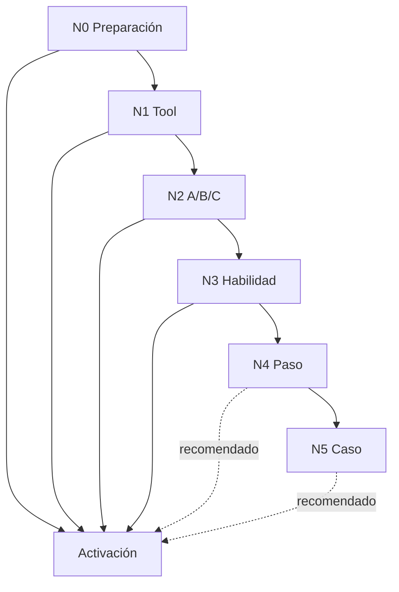

# Marco de pruebas para readiness operacional

> **Estado:** v1.3 — N0–N4 v1 implementados. **N5** laboratorio E2E controlado implementado (`agent_e2e`, sesión E2E lab, Prueba con agente); batería E2E automatizada multi-tick y **N4 v2** siguen pendientes. v1.3 añade `property_data` canónico desde el formulario del laboratorio, campos de superficie separados y metadata de coherencia de artefactos en N1.
>
> **Documentos relacionados**
> - [`authoring-playbook.md`](authoring-playbook.md) — modelo paso / habilidad raíz / `current_step` / autoría de casos (lectura recomendada).
> - [`operational-case-reusable-patterns.md`](operational-case-reusable-patterns.md) — catálogo de patrones (`PATTERN_*`, `n2_*`, matriz Pasos 2–3).
> - [`step-branch-clarity-plan.md`](step-branch-clarity-plan.md) — ramas de decisión (cobertura N4, UI explicativa).
> - [`architecture.md`](architecture.md) §10 — tool readiness, provisioning y APIs.
> - [`../skills-tools-architecture.md`](../skills-tools-architecture.md) §11 — resumen ejecutivo de patrones UI.
> - [`use-case-authoring-vision.md`](use-case-authoring-vision.md) — visión de generación NL → propuesta implementable y roadmap.
> - [`conversational-intake-test-script.md`](conversational-intake-test-script.md) — guion de prueba conversacional del intake.

---

## 1. Propósito y alcance

Este marco define **cómo probar** un tipo de caso operacional antes de activarlo en producción. Cubre:

- la UI de **Preparación operativa** en Ajustes → Casos de uso;
- las APIs `GET /api/tool-readiness`, `POST /api/tool-readiness/run-tool`, `POST /api/tool-readiness/run-skill` (N3), `POST /api/tool-readiness/run-step` (N4 v1) y el subsistema `operational-case-tests` (base para N5);
- el nivel **N5 (caso)** como especificación ampliada; ver [§7](#7-n4--prueba-de-paso-hito) y [§8](#8-n5--prueba-de-caso-e2e).
- los patrones visuales y de secuencia (A/B/C) ya implementados en `operational-case-types-client.tsx`.

**No cubre:**

- tests unitarios de adapters o lógica pura en `packages/agent`;
- eval suites de selección de skills;
- pruebas de carga o seguridad;
- el flujo conversacional del chat (ver guion aparte).

**Principio rector:** la readiness operacional valida **contratos de negocio reproducibles**, no sólo que una tool no lance excepción.

---

## 2. Niveles de prueba (N0–N5)

Los niveles son acumulativos: un tipo de caso no debería activarse sin N0 completo. **N4 v1** está implementado para escenarios declarados en código; **N5** y **N4 v2** siguen pendientes (ver [§14](#14-evolución-del-marco)).

| Nivel | Nombre | Qué valida | Dónde se ejecuta | Implementado | Obligatorio antes de activar |
|-------|--------|------------|------------------|--------------|------------------------------|
| **N0** | Preparación | Credenciales, activos, caso de prueba aislado | Bloque superior Preparación operativa | Sí | Sí |
| **N1** | Tool individual | Una tool sin orden causal | Tarjeta de cada tool | Sí | Sí, por tool del flow |
| **N2** | Escenario A/B/C | Secuencia causal con prerequisitos | Sub-pasos A/B/C en la tarjeta | Sí | Sí, cuando aplique |
| **N3** | **Habilidad** (escenario del paso) | Un tick, **habilidad atómica** forzada; contrato del escenario (`test_contract`) | Botón **«Probar habilidad»** | Sí (`run-skill`) | Recomendado **por habilidad** declarada |
| **N4** | **Paso** (hito) | Cierre del `step_key`: habilidad **raíz**, contexto sembrado, salida del hito | Botón **«Probar paso»** | **v1** (escenarios declarados) | Recomendado si el paso tiene 2+ habilidades o orquestación crítica |
| **N5** | **Caso** (tipo completo) | Multi-paso E2E del `case_type` en laboratorio controlado | Prueba con agente / `agent_e2e` / sesión E2E lab | **Sí (controlado)** | Recomendado camino feliz; batería scriptada → madurez |

**Migración v1.0 → v1.1:** el antiguo «N4 Caso E2E» pasó a ser **N5**; el nuevo **N4** es prueba de **paso** (hito). Actualizar checklists y conversaciones internas que citen «N4 = caso completo».

**Aclaración N3 vs N4:** N3 **no** sustituye N4. N3 prueba una **habilidad atómica** en un escenario acotado. N4 prueba que la **habilidad raíz** cumple el **objetivo del paso** (p. ej. avanzar de `compliance_review` a `lease_and_handover`). No debe implementarse N4 como «encadenar todos los N3 del paso» — ver [`authoring-playbook.md`](authoring-playbook.md) §8–§10.



---

## 3. N0 — Preparación operativa

Antes de probar cualquier tool, el operador debe tener:

### 3.1 Credenciales y conexiones

| Recurso | Dónde configurarlo | Bloquea |
|---------|-------------------|---------|
| OAuth / vínculos (Telegram, Google, GitHub) | Ajustes → Conexiones | Tools que dependen del provider |
| Secretos por cuenta (`easybroker`, `easybroker_web`, `ungga`, etc.) | Ajustes → Credenciales por cuenta o inline en readiness | Tools inmobiliarias |
| Estado `active` tras `POST …/test` | Automático al probar conexión | Prueba controlada de escritura |

`GET /api/tool-readiness?case_type_id=…` devuelve por tool: `status`, `test_status`, categoría, si bloquea prueba controlada y acción sugerida.

### 3.2 Activos de prueba

Declarados en `operational_flow_jsonb` (`required_assets`, `test_assets`) o en `TOOL_CATALOG[].asset_profile.test`:

- plantillas DOCX, watermarks, fotos de prueba;
- PDF/imagen de escritura para documentos;
- contacto Telegram de prueba (`chat_id` externo).

Los activos viven en `account_assets` + Supabase Storage.

### 3.3 Preparar caso de prueba (tarjeta N0 en UI)

El **resumen superior** de Preparación operativa cuenta solo tools *readiness-visible* (integración y acción del flujo, sin internas de plataforma) y desglosa chips en lenguaje operativo: **X de Y configuradas**, **sin probar**, **probadas**, por configurar y pendientes técnicos (sin jerga N0–N5 en el resumen).

En el encabezado de la plantilla: **Descripción** visible; **Formulario de alta** y **Habilidades y herramientas** en `<details>` cerrados; el listado resumido de pasos duplicado («Flujo operativo») se omitió — el detalle vive en **Paso N** abajo. Al pie, **Auditoría del caso de prueba** (colapsada) filtra eventos de prueba controlada y resume tool calls para depuración.

En **Preparación operativa**, la tarjeta expandible **Preparar caso de prueba** (pill de estado de fixture: Sin fixture / Fixture creado / Fixture listo / Pendiente de tools) concentra el fixture de prueba **antes** de los pasos colapsables **Paso N**:

1. Formulario derivado de `intake_schema_jsonb`.
2. **Regenerar y validar registro** (`operational-case-tests`): crea/reusa el caso aislado, regenera datos controlados, fija la ancla del recorrido y ejecuta `safe_check` para avanzar del `start_step` al `success_step` definidos en `activation_policy_jsonb`.
3. Opcional: tick con agente.

El bloque colapsado **Completar registro del caso** documenta el hito runtime `intake`; no duplica el formulario.

**Layout compacto (v1.3):** tras el resumen y N0, cada hito operativo aparece como **Paso N** en `<details>` cerrado por defecto (título, descripción del paso, pill de estado N3/N4, hint de habilidades/tools visibles). Las tools N1 viven dentro del cuerpo expandido; su pill **Probada** / **Sin probar** es independiente del pill del paso. La auditoría global del fixture no sustituye el resultado por paso.

### 3.4 `property_data` canónico desde el formulario (laboratorio)

En **Preparar caso de prueba**, el formulario derivado de `intake_schema_jsonb` no es sólo UI: al **Guardar datos** o **Regenerar y validar registro**, el servidor sincroniza campos operativos a `context_jsonb.property_data` mediante `syncLabFormIntoPropertyData` ([`lab-form-property-data-sync.ts`](../../apps/web/src/lib/operational-cases/lab-form-property-data-sync.ts)).

**Precedencia automática (sin selector manual):**

| Origen | Prioridad | Comportamiento |
|--------|-----------|----------------|
| Documentos (`predial`, `escritura`, etc.) | Mayor | No se sobrescribe con el formulario |
| `lab_form` | Menor | Rellena vacíos o actualiza lo que el propio formulario había escrito antes |
| Semilla N0 (`settingsTestPropertyDataSeed`) | Inicial | Solo si `property_data` está vacío |

Campos sincronizados típicos: `property_type`, `operation`, `area_total_m2`, `area_construida_m2`, recámaras/baños/estacionamientos, `address.*`, `search_zone`. Cada campo adoptado lleva `*_source: "lab_form"` para auditoría.

**Superficies separadas:** migración `00057_property_optioning_intake_split_area.sql` reemplaza el intake ambiguo `area_m2` por `area_total_m2` (terreno/total) y `area_construida_m2` (construcción / `construction_size` en publicación). En UI se agrupan bajo «Superficies».

**Implicación para N1:** recipes y previews de tools downstream (p. ej. `easybroker_create_listing`, `prepare_listing_description_draft`) leen `property_data`, no el formulario plano en runtime. Editar el formulario y guardar alinea el payload antes de probar tools.

Ver `PATTERN_LAB_FORM_PROPERTY_DATA_SYNC` en [`operational-case-reusable-patterns.md`](operational-case-reusable-patterns.md).

### 3.5 Caso de prueba aislado

El subsistema `operational-case-tests` mantiene **un caso de prueba por fila de tipo de caso** (regenerar no crea otro registro). Ese caso:

- tiene contexto derivado de `test-context-samples.ts` y activos cargados;
- es el `case_id` que aparece en args de tools durante readiness;
- **no debe ser avanzado por el cron** mientras se usa para pruebas controladas.

**Checklist N0:**

- [ ] Todas las tools readiness-visible del flujo operativo muestran estado «Lista» (no «Necesita config»).
- [ ] Activos de prueba cargados y visibles en Preparación operativa.
- [ ] Tarjeta **Preparar caso de prueba**: caso generado/regenerado con contexto coherente y registro validado.
- [ ] Contacto externo de prueba identificado (Telegram u otro canal).

---

## 4. N1 — Tool individual

**Alcance N1:** sólo tools *readiness-visible* (`business_integration`, `external_action`, `internal_notification`). Tools de plataforma (`operational_case_update_state`, `operational_case_add_event`, `operational_case_persist_*`) y `scenario_only` (`operational_case_create`) **no** exigen N1 previo a N3/N4 del mismo paso; las internas aparecen en detalle técnico N3/N4. Ver `PATTERN_TOOL_SURFACE_CLASSIFICATION` y [`tool-surface-classification.ts`](../../apps/web/src/lib/operational-cases/tool-surface-classification.ts).

**Intake / registro:** en settings usar la tarjeta **Preparar caso de prueba** (N0: formulario + crear/regenerar fixture + `safe_check`). El hito `intake` del flow (**Completar registro del caso**) es referencia runtime colapsada, no N4 **Probar paso**. Ver `PATTERN_CASE_INTAKE_PRECONDITION`.

### Cuándo usar N1

Usar **sólo N1** (sin wizard A/B/C) cuando la tool:

- no tiene dependencia de orden con otra tool del mismo paso;
- no realiza escritura externa de alto riesgo que requiera confirmación explícita;
- su contrato se valida en una sola ejecución (consulta, dry-run, listado, cálculo).

Ejemplos típicos en `property_optioning`:

- `bigquery_lookup_local_comparables` — consulta read-only;
- `operational_case_list_documents` — cuando se prueba aisladamente fuera del escenario documental;
- `notify_user` en modo validación/smoke;
- tools de preparación de borrador sin side effects externos.

### Cómo probar

1. Expandir la tool en Preparación operativa.
2. Elegir modo **Smoke test** o **Caso de prueba** según lo que se quiera validar.
3. Revisar args derivados (fuente: recipe por tool / caso).
4. Ejecutar. Opcional: args JSON avanzados.
5. Interpretar el panel de resultado.

### Modos de ejecución

| Modo | Uso |
|------|-----|
| **Smoke test** | Args mínimos del catálogo (o sintéticos por `case_type` para `operational_case_create`); no requiere caso aislado salvo excepciones. La tool recibe **sólo** el JSON resuelto. **Con caso aislado presente**, smoke también enlaza `case_id` (y versión/recipe cuando aplica) para `operational_case_update_state`, `operational_case_list_documents`, `operational_case_extract_document_fields` y `operational_case_register_document`. Sin caso aislado, esas tools pueden mostrar `{}` en vista previa. |
| **Caso de prueba** | Args derivados del `context_jsonb` del caso aislado (+ activos hidratados en args cuando aplica). La herramienta recibe **sólo** ese JSON; no hay lectura paralela del “formulario” en runtime. |

**Comparar Smoke vs Caso en UI:** la vista previa ordena claves de forma estable (p. ej. alfabético dentro de `context`) sin cambiar valores, para ver diferencias campo a campo.

### Taxonomía operativa de ejecución (Readiness Lab)

Esta taxonomía clasifica **cómo se ejecuta una prueba**, no cómo está implementada una herramienta.

**Dos etiquetas en la tarjeta N1 (complementarias):**

| Campo (`tool-test-behavior.ts`) | Rol en UI | Ejemplo |
|---------------------------------|-----------|---------|
| `label` | Qué valida **esta** herramienta en el flujo | `Crea instancia de caso`, `Consulta documentos registrados` |
| `user_facing_test_type` | Patrón genérico de ejecución N1 (taxonomía de la tabla siguiente) | `Herramienta autocontenida con caso`, `Herramienta respaldada por caso` |

El `label` debe ser específico por herramienta/escenario; el tipo genérico no debe repetir el mismo texto. La vista previa de args muestra `modo` y `fuente`; el tipo genérico vive en el bloque «Tipo de prueba», no se duplica en el JSON preview.

| Tipo | Usa formulario | Usa herramientas previas | Orden importa | Orquestación |
|------|----------------|--------------------------|---------------|--------------|
| Smoke | No | No | No | Automática (defaults) |
| Herramienta autocontenida con caso | Sí | No | No | Automática |
| Herramienta respaldada por caso | Sí | No | No | Automática |
| Herramienta dependiente con preparación | Sí | Sí | Sí | Automática con dependencias visibles |
| Herramienta con prerequisito previo | Sí | Sí | Sí | Automática |
| N4 (escenario de paso) | Sí | Sí | Sí | Automática por escenario |
| Playthrough secuencial | Sí | Sí | Sí | Flujo secuencial |
| E2E | Sí | Sí | Sí | Flujo secuencial completo |

Notas de producto/UI:

- En panel explicativo y resultados legibles, usar primero lenguaje natural y mostrar el slug técnico como referencia.
- En JSON/debug conservar slugs y payloads sin traducción.
- Si una prueba reutiliza artefactos persistidos del caso (ej. `photo_analysis`, `zone_context`), debe mostrarse de forma explícita.

**Excepción `operational_case_create`:** en ambos modos la ejecución crea una fila **nueva** en `operational_cases` con `created_from=tool_readiness_test`. El caso aislado de Preparación operativa sólo sirve como **fuente al armar args** en modo Caso de prueba; no se reemplaza. Esta herramienta usa perfil `intake_only`: sólo copia campos declarados en `intake_schema_jsonb` y auxiliares permitidos, no artefactos de readiness ni historial del caso.

**Regenerar y validar registro:** restablece el `context_jsonb` y el paso del mismo caso aislado, fija `controlled_test_playthrough_anchor_at` y ejecuta la validación segura del registro. Conserva eventos históricos de auditoría. Si la UI muestra respuestas externas antiguas después de regenerar, son historial, no datos activos de intake.

**Tools con `case_id`:** además de los args, el adapter puede cargar el caso en BD (p. ej. `telegram_send_message_to_contact` enriquece contexto). Aun así, lo que se muestra como “Args enviados” es el payload explícito de la prueba.

Para tools de **riesgo alto**, el smoke puede devolver `high_risk_requires_hitl` sin ejecutar — eso es éxito de política, no fallo de integración.

### Semántica del resultado (N1)

| Color | Significado |
|-------|-------------|
| **Verde** | Contrato cumplido; ejecución OK o validación OK sin envío. |
| **Ámbar** | Parcial, warning, HITL pendiente, prerequisito faltante no fatal. |
| **Rojo** | Fallo, excepción, estado incompatible con el contrato. |
| **Violeta** | Bloque de acción, preview, metadata interactiva. |
| **Gris/neutro** | Detalle técnico, JSON crudo, pendiente. |

### Herramientas transversales (bloque colapsado al final)

Son tools **permitidas por el grafo de skills** (`property-optioning-coach` + includes) que **no** están listadas en `operational_flow_jsonb` de ningún paso. La UI las agrupa para no mezclar soporte técnico con el relato operativo paso a paso.

Las **internas de un hito** (p. ej. `operational_case_persist_comparables_analysis` en comparables) deben declararse en el **paso correspondiente** bajo «Herramientas internas», no dejarse solo en transversales. Las de **infraestructura** (`get_user_preferences`, `read_skill_reference`) viven en transversales con «Probar herramienta» propia.

| Herramienta típica | Rol | ¿Obligatoria en readiness? |
|-------------|-----|----------------------------|
| `get_user_preferences` | Contexto del usuario (`{}` en N1; sin recipe) | Opcional |
| `read_skill_reference` | Leer referencia de la skill activa (`name`, p. ej. `coach-routing` en optioning) | Opcional; N1 arma args y skill raíz del case type |

**Recorrido con agente (N5):** tras cambios grandes del flujo o para un laboratorio limpio, **Regenerar y validar registro** fija `controlled_test_playthrough_anchor_at`. Resumen y auditoría filtran actividad posterior a esa marca; sin ancla se muestra todo el historial del fixture con aviso.

**No confundir con tools ausentes del grafo:** si una tool no está en `allowed_tools` de ninguna skill del caso (p. ej. `operational_case_register_document` en `property_optioning`), **no aparece** ni en pasos ni en transversales — aunque exista en el catálogo global.

---

## 5. N2 — Escenario guiado A/B/C

### Cuándo usar N2

Usar wizard A/B/C cuando hay **secuencia causal**:

| Sub-paso | Rol típico |
|----------|------------|
| **A** | Validar args, texto, payload, dry-run sin side effect externo |
| **B** | Ejecución controlada real (escritura externa, envío, creación de borrador) |
| **C** | Simular respuesta externa o verificar artefacto persistente del caso |

### Reglas de UX (obligatorias)

1. **Ámbito local de A/B/C:** las letras **sólo** etiquetan sub-pasos **visibles en el mismo wizard** (misma tarjeta expandida), con prerequisito y gating entre ellos. **No** se reutilizan letras globales entre tools distintas ni entre pasos del flow.
2. **Gating:** un sub-paso posterior permanece deshabilitado hasta cumplir el prerequisito visible del anterior.
3. **Invalidación:** re-ejecutar A borra resultados de B y C; re-ejecutar B borra sólo C; A permanece visible.
4. **Estados separados:** A, B y C tienen respuesta UI independiente (`validationResponse`, `controlledSendResponse`, simulación con `resetVersion`).
5. **Confirmación explícita:** tools de alto riesgo exigen texto de confirmación (ej. `ENVIAR PRUEBA`) antes de B.
6. **Prefijo de prueba:** escrituras reales agregan marcadores visibles (`[PRUEBA CONTROLADA]`, `[PRUEBA - BORRAR]`).
7. **Tools N1 sin letra:** consultas, listados y notificaciones de bajo riesgo usan **Prueba individual de tool** (sin prefijo A/B/C), aunque formen parte de una cadena lógica mayor (documentos, comparables, etc.).

### Patrones implementados

#### 5.1 Solicitud de documentos (paso operativo 1 — `awaiting_documents`)

**Skill:** `request-property-documents`  
**Patrón de ramas:** `PATTERN_STEP_BRANCH_DECISION` — `document_request_target` ∈ {`internal_user`, `external_contact`}. Mismo hito (expediente); distinto responsable / `waiting_*`. El panel lista tools de **ambas** ramas; no implica secuencia única ni que el IF viva en la UI.

**Orden en UI** (según `operational_flow_jsonb` tras migración `00038`; sesgo histórico a externo — rebalanceo en [`step-branch-clarity-plan.md`](step-branch-clarity-plan.md) Fase B):

| Orden | Tool / bloque | Patrón | Notas |
|-------|---------------|--------|-------|
| 1 | `telegram_send_message_to_contact` | N2 A→B | Rama **externa**: validar texto (`purpose=request_documents`) y envío real con `ENVIAR PRUEBA` |
| 2 | `operational_case_list_documents` | N1 | Compartida: lista documentos del caso |
| 3 | `notify_user` | N1 | Rama **interna** (solicitar subida) y/o escalación; no asumir solo “escalar al dueño” |
| 4 | **Probar habilidad** | N3 | Hoy cubre sobre todo outreach externo |
| 5 | **Probar paso** | N4 | Escenarios milestone: `awaiting_documents_internal_upload` (interna) y `awaiting_documents_outreach` (externa). «Paso probado» exige 2/2. |

**Prerequisito:** caso de prueba con `case_id`; rama externa además requiere contacto Telegram configurado.

**N4 ≠ inventario exhaustivo:** no hace falta un escenario por cada recordatorio o variante de copy; sí por cada **rama de decisión** declarada. Ver plan §3.5.1.

**`operational_case_register_document`:** en `property_optioning` **no está** en `allowed_tools` del coach ni de las sub-skills, por eso **no sale en Preparación operativa** (ni en pasos ni en transversales). Los documentos entran por: (1) **Activos de prueba** + sync al ejecutar tools documentales (`list`/`extract`), (2) **webhook de Telegram** cuando el propietario envía archivos, (3) UI de `/operational-cases`. La tool sigue en el catálogo para otros casos de uso o futuras ampliaciones del flow.

#### 5.2 Telegram — características faltantes (paso 3)

**Skill:** `extract-property-characteristics`  
**Tool:** `telegram_send_message_to_contact`

| Sub-paso | Acción |
|----------|--------|
| A | Validar mensaje (`purpose=characteristics_pending`) |
| B | Enviar mensaje real; caso → `waiting_external` |
| C | Simular respuesta del propietario; verificar `property_data` y estado del caso |

**Contrato esperado en C:** datos en `property_data`; caso puede quedar en `waiting_internal` si dispara `notify_user` de revisión del asesor.

#### 5.3 Telegram — genérico (otros pasos)

Cualquier otro uso de `telegram_send_message_to_contact` con caso de prueba sigue **A validar → B enviar**. No incluye C salvo que exista simulador específico.

#### 5.4 EasyBroker — publicar paquete (paso 8)

**Skill:** `publish-listing-package`

| Tool | Sub-paso | Acción |
|------|----------|--------|
| `easybroker_create_listing` | A | Crear borrador `not_published` con prefijo `[PRUEBA - BORRAR]` |
| `easybroker_upload_images` | B | Subir fotos al `listing_id` de A (hidratado en backend si falta en args) |

**Encadenamiento:** el backend (`hydrateEasyBrokerUploadListingId` en `run-tool/route.ts`) busca el `listing_id` del último `easybroker_create_listing` exitoso. La UI también captura el ID en estado local.

#### 5.5 Documentos — listado y extracción (N1 por tool)

Las herramientas documentales se prueban como **N1** en su tarjeta del paso (botón **Probar herramienta**), sin letras A/B/C globales:

| Tool | Paso típico (`property_optioning`) | Patrón | Notas |
|------|-----------------------------------|--------|-------|
| `operational_case_list_documents` | 2 (`awaiting_documents`) y 3 (`documents_received`) | N1 | Consulta; puede listar vacío o con filas tras sync/telegram |
| `operational_case_extract_document_fields` | 3 | N1 | Requiere documento en el caso |
| `operational_case_register_document` | — (no en `allowed_tools` del coach) | — | No aparece en readiness de este caso; registro vía Activos de prueba, webhook o `/operational-cases` |

**Cadena lógica (no es wizard A/B/C en UI):** registrar evidencia → (opcional) extraer → listar/verificar. El orden operativo lo marca el **paso del flow**, no una letra compartida entre tarjetas.

**Activos de prueba:** al ejecutar `list` o `extract`, el backend puede sincronizar el PDF de `test_property_document` al caso antes de la tool.

### Matriz: ¿N1 o N2?

| Señal en el flow | Patrón recomendado |
|------------------|-------------------|
| Tool de riesgo `alto` con escritura externa | N2 (A validar + B controlado [+ C simular]) |
| Output de tool A es input obligatorio de tool B | N2 encadenado (EasyBroker) |
| Respuesta externa async cambia estado del caso | N2 con C simulado |
| Consulta, listado, cálculo local, tools documentales por tarjeta | N1 |
| HITL interno (`notify_user`) sin side effect externo | N1 o smoke; validar en N3 habilidad |

---

## 6. N3 — Prueba de habilidad (en contexto de paso)

### Qué valida

El contrato de negocio del **paso completo**, no sólo una tool:

- cobertura de tools esperadas del paso;
- acciones internas esperadas (p. ej. `operational_case_update_state`, `operational_case_add_event`);
- artefactos en `context_jsonb` (`property_data`, documentos, comparables, etc.);
- transiciones de `current_step` y `status` del caso;
- eventos en timeline del caso;
- pendientes HITL generados.

N3 no debe aprobar una skill sólo porque el modelo respondió texto. Debe existir
evidencia estructurada: tool calls ejecutadas/preparadas, eventos, cambios de
contexto o artefactos según el contrato del paso.

**Patrones runtime en N3:** dedup Telegram, `notify_user` multi-canal, auditoría con un solo dueño (`PATTERN_TOOL_AUDIT_SINGLE_OWNER`), dedup de `generate_document_from_template` (`PATTERN_GENERATED_DOCUMENT_DEDUP`), retry de `operational_case_update_state`, semilla/repair en casos `case_type_settings_test` —
IDs en [`operational-case-reusable-patterns.md`](operational-case-reusable-patterns.md) y
[`test-patterns-catalog.ts`](../../apps/web/src/lib/operational-cases/test-patterns-catalog.ts).
Detalle de llamadas en UI: [`skill-test-call-details.tsx`](../../apps/web/src/lib/operational-cases/skill-test-call-details.tsx).

### Contrato default

Si el flow no declara `test_contract`, N3 usa una regla genérica:

- prerequisito: todas las `skill_tools` del paso están listas y probadas en N1/N2;
- ejecución: en el tick de **Probar habilidad**, todas las `skill_tools` no opcionales deben aparecer como `executed` o `pending_confirmation`;
- status: `tested_ok` sólo si también se cumplen eventos/artefactos declarados;
- si falta una tool esperada, evento o artefacto, el resultado es `tested_failed` o `partial`.

### Contratos declarativos por skill

Cuando una skill no debe ejecutar todas sus tools en todos los escenarios, el flow
puede definir `test_contract` en la entrada de `step_skills`:

```json
{
  "expected_context_keys": ["pricing_proposal"],
  "expected_events": ["human_decision:price_proposed"],
  "expected_tool_calls": ["notify_user"],
  "expected_internal_tool_calls": ["operational_case_update_state"],
  "optional_tool_calls": ["telegram_send_message_to_contact"],
  "tool_coverage_policy": "expected_only",
  "required_tools_policy": "all_ready_and_tested"
}
```

Campos:

| Campo | Uso |
|-------|-----|
| `expected_context_keys` | Artefactos que deben existir en `context_jsonb` después del tick |
| `expected_events` | Eventos esperados desde que inició la prueba (`event_type[:payload.kind]`) |
| `expected_tool_calls` | Tools de negocio que deben ejecutarse/prepararse en este tick |
| `expected_internal_tool_calls` | Tools internas esperadas (`update_state`, `add_event`, etc.) |
| `optional_tool_calls` | Tools permitidas pero no obligatorias para este escenario |
| `tool_coverage_policy` | `all_step_tools` (default), `expected_only`, `any_step_tool`, `none` |
| `required_tools_policy` | Si exige N1/N2 previo de todas las tools del paso |

### Cómo probar

1. Completar N1/N2 de las tools bloqueantes de **esa habilidad**.
2. Pulsar **Probar habilidad** en la fila de la habilidad del paso.
3. Revisar resultado: cobertura de tools esperadas, acciones internas, eventos,
   artefactos y estado final (`tested_ok`, `partial`, `tested_failed`,
   `blocked_by_tools`).

### Cuántos N3 por paso

| Habilidades en `step_skills[]` | N3 recomendado |
|-------------------------------|----------------|
| 0 (solo `step_tools`) | N3 no aplica; N1 en tools |
| 1 | Un N3 por esa habilidad (suele cubrir el escenario principal del paso) |
| 2–4 | **Un N3 por habilidad** con `test_contract` distinto; más **N4** del paso cuando exista API |

### Relación con N2

N3 **complementa** N2; no lo reemplaza para tools de alto riesgo. N2 sigue siendo la validación humana explícita del payload/envío externo.

### UI (v1.1)

- **Jerarquía visual del laboratorio** ([`readiness-lab-hierarchy-ui.ts`](../../apps/web/src/lib/operational-cases/readiness-lab-hierarchy-ui.ts)): en pantalla **no** se muestran chips N0–N4 (son nomenclatura de documentación). Paso = marco índigo + badge «Paso N»; habilidad = bloque violeta con borde izquierdo y rótulo «HABILIDAD»; tools = sección slate con sangría + tarjetas blancas (acento verde/ámbar en borde izquierdo según estado); «▸ Prueba de herramienta» en slate. Los niveles N1/N3/N4 siguen definidos en este doc y en APIs, no en etiquetas de la UI.
- **Jerarquía dentro de cada paso** (`ReadinessTestSection` + [`readiness-step-section-ui.ts`](../../apps/web/src/lib/operational-cases/readiness-step-section-ui.ts)):
  1. **Encabezado del paso** (`<summary>` del acordeón): pill canónico (**Paso probado**, **Falta probar escenarios…**, etc.). **Prueba de paso** (`ReadinessTestSection`): chevron **▸** en el summary (gira al expandir); segunda línea = progreso N4 o prerequisito (sin «abrir para…»); pill junto al botón solo si el estado no es `tested_ok`.
  2. Por **habilidad**: encabezado de tarjeta con pill (**Habilidad probada**, etc.) → **Prueba de habilidad** (mismo chevron; colapsada si faltan integraciones; summary con progreso N1 o «Completada») → integraciones → internas. Pill junto a **Probar habilidad** solo cuando `test_status !== tested_ok`. Botones alineados a la izquierda (misma convención que tools).
  3. Por **tool** (N1): tarjeta con `tool_id` + pills Estado / Probada. Si la tool **no** está lista y exige `required_assets` de cuenta → botón **Recursos de cuenta** (solo configuración operativa). Si está **lista** → solo **▸ Prueba de herramienta** (dentro: recursos de cuenta + activos de prueba + `ToolTestPanel`; no ejecuta la prueba hasta los botones del panel). Otros botones (Conectar, ENVIAR PRUEBA) no cambian.
  3. Tools directas del paso (si el flow las declara en `step_tools`).
- El orden en pantalla prioriza **proximidad estado–acción**; el orden operativo sigue siendo integraciones → habilidad → escenarios del paso.
- Al desbloquear una sección (`blocked_by_tools` → `ready_to_test`), el `<details>` se abre automáticamente. Si el paso o la habilidad ya están probados con éxito (`tested_ok`), **Prueba de paso** / **Prueba de habilidad** montan **cerrados** (fallo o parcial siguen abiertos por defecto); no se cierran solos al terminar una prueba con la sección ya abierta.
- Panel N3: resumen acotado; listas de tools en `<details>` «Ver detalle tecnico de tools llamadas».
- Telegram ya no se clasifica como acción interna duplicada (`classifySkillTestToolCalls` en `run-skill`).
- Panel N4: bloque indigo «Probar paso» cuando el catálogo de escenarios (`step-test-scenario-registry.ts`) declara ese `step_key`. Si el paso tiene varios escenarios, la UI muestra selector y envía `scenario_id` al API.
- Detalle de tools unificado N3/N4: [`skill-test-call-details.tsx`](../../apps/web/src/lib/operational-cases/skill-test-call-details.tsx) (aviso Telegram envíos reales vs duplicadas, notify interno, hints de texto). La normalización de texto compartida con el agente vive en [`packages/types/src/telegram-send-dedup.ts`](../../packages/types/src/telegram-send-dedup.ts) (sin importar `@agents/agent` en el cliente).

**Telegram al contacto externo en laboratorio:** si el intake no trae `telegram_chat_id` real, N3/N4 asignan `SETTINGS_TEST_TELEGRAM_LAB_CHAT_ID` y **simulan** el envío (`settings_test_simulated`; la UI lo distingue de deduplicación `skipped_send`). **Envío real** al externo: N2 de la tool con confirmación **«ENVIAR PRUEBA»** y `chat_id` válido en datos del caso; también puede salir real en N3/N4 si el caso de prueba ya trae un `telegram_chat_id` real (no sentinel).

**Prerequisito N3 y N4:** todas las tools *readiness-visible* del paso (`readinessToolIdsForSkill` / `readinessToolIdsForStep`) con N1 `tested_ok` antes de habilitar **Probar habilidad** o **Probar paso** (patrón `PATTERN_READINESS_N3_N4_BLOCKED_BY_TOOLS`).

**Pills paso vs tool:** el pill de la **habilidad** viene del último `skill_test_completed` (N3). El pill del **paso** con escenarios N4 exige que **todos** los escenarios *milestone* (`counts_toward_step_milestone`) pasen; el progreso sale de `operational_case_test_runs` por `scenario_id` y en UI se muestra como «X/Y escenarios del hito probados» (y, si hay guardrails opcionales, un sufijo «N escenarios opcionales…» más la checklist agrupada «Opcional: …»). Si la habilidad ya pasó pero faltan escenarios milestone → **Falta probar escenarios del paso**. Sin escenarios N4, el paso puede quedar **Paso probado** cuando todas las habilidades e integraciones están OK. Patrón: `PATTERN_STEP_STATUS_N3_VS_N4`. Las tools **Probada** (N1) son independientes.

**Checklist rápido antes de cerrar un paso en N4**

1. Elegir el escenario correcto en las píldoras (entrada/salida visibles).
2. Tras correr: semilla aplicada y salida esperada coinciden con la rama.
3. Si hay Telegram al contacto: el aviso distingue **envíos reales** vs **duplicadas** (`skipped_send` o mismo texto normalizado); el chat de Telegram es la fuente de verdad del envío.
4. Si hay `notify_user`: detalle con canales (`web`, `telegram`, etc.) — es notificación al asesor interno, no al contacto externo.
5. Eventos y tools esperados en verde (OK) o listados como faltantes.

---

## 7. N4 — Prueba de paso (hito)

> **Estado:** v1 implementado para escenarios declarados en [`step-test-scenario-registry.ts`](../../apps/web/src/lib/operational-cases/step-test-scenario-registry.ts). El catálogo se selecciona explícitamente por habilidad raíz (`property-optioning-coach` → `property_optioning`); `step-test-scenarios.ts` sólo expone metadata para UI.

### Qué valida

El **objetivo durable del paso** (`step_key` / `current_step`), invocando la **habilidad raíz** (`default_skill_slug`), no encadenando N3 de cada habilidad atómica.

Un escenario N4 es una prueba controlada de una rama importante del paso; no pretende ser, por sí solo, la lista exhaustiva de todas las ramas que producción puede ejecutar. El cron sigue invocando la habilidad raíz con el estado real del caso; los escenarios N4 automatizan QA repetible para los caminos de negocio que ya decidimos cubrir.

| Pregunta | N3 | N4 |
|----------|----|----|
| ¿Esta habilidad atómica cumple su escenario? | Sí | No (directamente) |
| ¿La raíz, con este contexto, cierra el hito o elige la rama correcta? | No | Sí |
| ¿Varias habilidades en un paso se orquestan bien? | Parcial (N3 cada una) | Sí |

### Ejecución async y UX

N4 puede tardar minutos porque invoca la **habilidad raíz** y no sólo una skill
atómica. Por eso la UI no debe mantener un request bloqueante hasta el final:
`POST /api/tool-readiness/run-step` crea un registro durable en
`operational_case_test_runs`, preasigna `turn_id`, devuelve `run_id` rápido y
la UI consulta `GET /api/tool-readiness/run-step/:run_id` por polling. El panel
debe mostrar tiempo transcurrido, fase actual, última tool registrada y lista de
`tool_calls` parciales con estado/duración. Al terminar renderiza el resultado
final persistido (`result_jsonb`).

El runner sigue escribiendo eventos append-only en `operational_case_events`
(`step_test_started`, `step_test_completed`) para conservar la línea de tiempo
del caso. Para progreso en vivo, el endpoint de polling lee `tool_calls` por el
`turn_id` guardado en `operational_case_test_runs`; esto permite distinguir
tiempo de razonamiento antes de tools, tool activa y cierre/validación final.
Para calcular el estado del paso en Preparación operativa, la fuente primaria es
`operational_case_test_runs` (`level=n4`, `step_key`, `scenario_id`,
`result_jsonb.status`); eventos antiguos sin `scenario_id` sólo son fallback
legacy y no cierran pasos con varios escenarios.

### Cómo registrar un escenario N4 (v1)

1. Añadir una entrada completa en [`step-test-scenario-registry.ts`](../../apps/web/src/lib/operational-cases/step-test-scenario-registry.ts) (metadata UI, `seed`, `expect`, `message`, `execution`).
2. Si el case type no usa el slug del catálogo, asociar su habilidad raíz en `DEFAULT_STEP_TEST_CATALOG_SLUG_BY_ROOT_SKILL`.
3. El botón «Probar paso» aparece automáticamente en Preparación operativa para ese `step_key`.

**Bloque «Decisión del paso» (solo lectura):** en `property_optioning` hoy sólo en `awaiting_documents`, `documents_received` y `comparables_in_progress` (migraciones `00059`–`00061`). Pasos posteriores (`price_proposal_pending`, `contract_pending`, etc.) tienen escenarios N4 secuenciales/HITL pero no un IF de rama declarado en `step_decision`; ver [`step-branch-clarity-plan.md`](step-branch-clarity-plan.md) §Fase F.

Escenarios N4 actuales en `property_optioning`:

| Paso | Escenario | Rama probada |
|------|-----------|--------------|
| `awaiting_documents` | `awaiting_documents_internal_upload` | Rama **interna**: `waiting_internal` + `notify_user` (sin Telegram externo) |
| `awaiting_documents` | `awaiting_documents_outreach` | Rama **externa**: solicitud inicial al contacto / `waiting_external` (`PATTERN_STEP_BRANCH_DECISION`) |
| `documents_received` | `documents_received_property_data_review` | Datos suficientes → `property_data_review` / `waiting_internal` |
| `documents_received` | `documents_received_characteristics_pending` | Faltantes críticos → Telegram al contacto / `waiting_external` |
| `documents_received` | `documents_received_characteristics_pending_internal` | Faltantes críticos con `document_request_target=internal_user` → `waiting_internal` + `notify_user` (sin Telegram) |
| `comparables_in_progress` | `comparables_in_progress_complete` | Muestra defendible → `price_proposal_pending` con `comparables_analysis_completed`; preparación de precio auditable por `price_proposal_prepared` + `price_approval_requested` |
| `comparables_in_progress` | `comparables_in_progress_insufficient_data` | 0 usables en EB + BQ → permanece en paso + `waiting_internal` + `notify_user` |
| `price_proposal_pending` | `price_proposal_pending_hitl` | `pricing_proposal` pending + `price_approval_requested` + decisión humana de precio (`price_approved`/`price_adjusted_and_approved`) |
| `price_proposal_pending` | `price_proposal_pending_advisor_approves` | Handler HITL «Aprobar» → `contract_pending` + `price_approved`; en E2E conversacional controlado dispara tick para preparar contrato (en settings puro puede quedar `paused`) |
| `price_proposal_pending` | `price_proposal_pending_advisor_adjusts` | Handler HITL ajuste → montos nuevos + `price_adjusted_and_approved` + `contract_pending`; en E2E conversacional controlado dispara tick para preparar contrato |
| `contract_pending` | `contract_pending_draft_review` | Borrador o aviso de plantilla faltante / `waiting_internal` o `paused` (`PATTERN_BUSINESS_DECISION_CONTRACT_REVIEW`) |
| `contract_pending` | `contract_pending_advisor_approves_send` | HITL «enviar por email» → `contract_approved_for_email_send` + envío simulado por email / `paused` |
| `contract_pending` | `contract_pending_advisor_requests_changes` | HITL «subir contrato corregido y enviar» → `contract_revision_upload_requested` / `waiting_internal` |
| `contract_pending` | `contract_pending_owner_signed` | Simulación de firma (opcional/futuro): `photos_requested` / `step_completed:contract_signed`; no bloquea el hito principal mientras la firma esté fuera del flujo |
| `photos_requested` | `photos_requested_request_internal_photos` | Solicitud interna de fotos al asesor / `waiting_internal` + notify_user |
| `package_ready` | `package_ready_preflight_blocked` | Preflight incompleto → `paused` + `notify_user` (sin publicación) |
| `package_ready` | `package_ready_description_review_requested` | Flujo positivo inicial: análisis de imágenes + entorno + borrador + `notify_user(kind=listing_description_review)` |
| `package_ready` | `package_ready_description_approved` | HITL de descripción: aprueba borrador y persiste `listing_description_approved` |
| `package_ready` | `package_ready_easybroker_approval_requested` | Solicita aprobación de negocio por destino (`easybroker_publish_approval`) |
| `package_ready` | `package_ready_easybroker_published` | HITL de destino: `publish_approvals.easybroker=approved` |
| `package_ready` | `package_ready_completed_summary_sent` | Cierre: `published/completed` + `notify_user(kind=listing_published_summary)` idempotente |

**Nota:** la tabla no pretende listar todos los caminos de producción; prioriza ramas de decisión y HITL. Política: [`step-branch-clarity-plan.md`](step-branch-clarity-plan.md) §3.5.1.

Para artefactos críticos como `comparables_analysis`, N3/N4 deben validar la ruta
runtime real: primero se ejecutan las tools de búsqueda, luego una tool de
persistencia determinística construye el artefacto desde `tool_calls.result_json`
(`PATTERN_DETERMINISTIC_ARTIFACT_FROM_TOOL_RESULTS`). Las transiciones críticas
también se bloquean en el adapter de escritura (`PATTERN_OPERATIONAL_WRITE_GATE`),
no sólo en el runner de pruebas.

Ejemplo multi-habilidad (autoría): [`authoring-playbook.md`](authoring-playbook.md) §8 (`tenant_move_in` / `compliance_review`).

### Entrada típica (forma del contrato)

Objetivo en BD: `step_test_contract` en flow — ver [`authoring-playbook.md`](authoring-playbook.md) §13. Resumen:

- **Semilla:** `current_step`, `status`, `context_jsonb` (y opcional eventos previos).
- **Invocación:** `invoke: root_skill` (sin `forcedSkillId` atómico).
- **Expectativa:** `current_step` destino, `status`, claves de `context`, eventos, o flags de sub-progreso.

### Versiones previstas

| Versión | Alcance | Prioridad |
|---------|---------|-----------|
| **N4 v1** | Un tick; raíz; assert salida del escenario | **Implementado** |
| **N4 v2** | Varios ticks; inyección de `external_response` simulado entre ticks | Media |

### Cuándo exigir N4 en autoría

- Paso con **2 o más** habilidades en `step_skills[]`, o ramas críticas de la raíz (aunque haya una sola habilidad declarada — ver Pasos 2–4 del piloto).
- **Prerequisito N1:** igual que N3 — todas las tools *readiness-visible* del paso deben estar probadas antes de habilitar **Probar paso** (UI + `POST /api/tool-readiness/run-step`).
- Orden recomendado: N1 tools → N3 por habilidad → N4 paso.

### Paso 3 — `comparables_in_progress` (`property_optioning`)

Tras expandir **Paso 3 · Análisis de comparables**:

1. **N1** (ya hecho si las tres tools muestran **Probada**): `easybroker_search_listings`, `easybroker_search_closed_deals`, `bigquery_lookup_local_comparables`.
2. **N3** — **Probar habilidad** en `perform-comparable-analysis`, escenario **Análisis completo y avance a precio** (`comparables_in_progress_complete`). Revisa el panel: tools ejecutadas, `operational_case_persist_comparables_analysis`, `usable_count > 0`, avance a `price_proposal_pending`. Si falla, el pill pasa a **Falló N3** aunque N1 siga en verde.
3. **N4** — **Probar paso** con el mismo escenario (raíz del caso) o **Sin comparables usables** para la rama `waiting_internal` + `notify_user`. El pill del paso refleja el último N4.
4. Escenario negativo N3/N4: **Sin comparables usables — no avanzar a precio** (filtros estrechos / 0 usables en todas las fuentes).

Patrones: `PATTERN_COMPARABLE_SEARCH_ZONE_ALIGNMENT`, `PATTERN_COMPARABLES_INSUFFICIENT_NO_ADVANCE`, `PATTERN_DETERMINISTIC_ARTIFACT_FROM_TOOL_RESULTS`. Skill: [`perform-comparable-analysis/SKILL.md`](../../skills/global/perform-comparable-analysis/SKILL.md).

### Alcance v1 y pendientes

**Implementado:** `POST /api/tool-readiness/run-step`, botón «Probar paso», escenarios en código (`step-test-scenario-registry.ts`).

**Pendiente:**

1. `step_test_contract` en `operational_flow_jsonb` (machine-readable en BD).
2. N4 v2 multi-tick con eventos simulados.
3. Más escenarios por paso / case type (p. ej. ramas positivas de `package_ready` con watermark/publicación tras preflight completo).

---

## 8. N5 — Prueba de caso (E2E)

Validación del **tipo de caso completo** mediante recorrido controlado. Hay dos fuentes válidas:

- **Fixture sintético de Settings:** caso aislado creado por Preparar caso de prueba.
- **Caso conversacional controlado:** caso creado desde chat/Telegram con `created_from=agent_conversation`; el recorrido se mantiene mediante `operational_case_conversation_bindings` y el primer tick manual de Prueba con agente lo marca `e2e_controlled=true`.

Pre-flight para caso conversacional: la migración `00044_operational_case_conversation_bindings.sql` debe estar aplicada. Sin esa tabla, el webhook no puede conservar el vínculo durable entre conversación y caso.

Regla de ejecución: **Telegram entrante procesa automáticamente** (usuario/inmobiliario o contacto externo); **cron no procesa casos E2E controlados**. En laboratorio, **Prueba con agente reemplaza al cron** para acciones de fondo.

Para fixture sintético:

1. **Regenerar y validar registro** (N0) — reinicia fixture en `start_step`, fija `controlled_test_playthrough_anchor_at` y ejecuta la validación segura sin agente.
2. **Transición con agente** (una por clic) — tick real en `case_runner`; observar HITL, Pendientes y Telegram.
3. Repetir transiciones hasta fin del flujo o bloqueo explícito.

Para caso conversacional:

1. Iniciar por chat/Telegram (p. ej. “Quiero opcionar una propiedad”).
2. El webhook crea/adopta el caso en `intake` y registra un binding `awaiting_user` por canal/chat.
3. Si faltan required, el agente pregunta por el canal; respuestas futuras pueden llegar horas después.
4. Preguntas intermedias no relacionadas (p. ej. métricas, agenda, CRM) se atienden como conversación general y no cierran el binding.
5. Si un mensaje futuro es ambiguo, el sistema pide aclaración mostrando `case_type`, resumen del caso, estado técnico e ID corto antes de asociarlo.
6. Refrescar Settings; Prueba con agente observa el caso conversacional/binding sin exigir `safe_check`.
7. Cada click ejecuta un tick de fondo controlado; respuestas reales por Telegram siguen disparando procesamiento normal.

**Reinicio del fixture sintético:** **Regenerar y validar registro** (no existe «reiniciar ronda» separado). El contador y la auditoría agrupan actividad desde la ancla del recorrido actual. En un caso conversacional controlado, reiniciar significa crear/continuar otro caso desde el canal real; no se regenera con N0.

**UI:** resumen por paso, auditoría agrupada por transición, diff post-transición (paso/estado antes→después). Atribución de eventos/tools al `current_step` del tick.

**Registro de actividad E2E (`flowProgressForE2ESummary`):** el panel «Ver actividad» filtra eventos anteriores a la primera transición manual (`e2eStartedAt`), **excepto** evidencia conversacional pre-transición que debe seguir visible:

| Tipo | `event_type` / `event_kind` | Por qué se conserva |
|------|-----------------------------|---------------------|
| Intake | `case_created`, `intake_fields_requested`, `operational_case_update_intake` | Paso 0 conversacional |
| Documentos | `document_registered`, `documents_batch_completed` | Subidas antes del primer tick |
| Recordatorios documentales | `reminder_sent` con `purpose` en `documents_checklist_post_intake`, `internal_upload_instructions`, `external_documents_routed`, `initial_request` | Checklist post-intake y ruteo interno/externo no deben desaparecer al refrescar |

La consolidación de titularidad (`property-optioning-post-agent-invariants`) es **idempotente**: re-ejecutar con los mismos valores no genera eventos duplicados de «Titularidad consolidada…».

**Estado (v1.2):** laboratorio E2E controlado **implementado**:

| Pieza | Ubicación | Qué hace |
|-------|-----------|----------|
| Prueba con agente (Settings) | `POST /api/operational-case-tests/run` con `mode: "agent_e2e"` | Un tick real del `case_runner` sobre fixture o caso conversacional |
| Sesión E2E lab | `POST/GET /api/operational-case-tests/e2e-lab-mode` | Ventana temporal (2 h) donde el cron no procesa el caso de prueba |
| Fixture sintético | Tarjeta N0 «Regenerar y validar registro» | Ancla `controlled_test_playthrough_anchor_at` + auditoría por transición |
| Caso conversacional | Webhook + `operational_case_conversation_bindings` | E2E con canal real; `e2e_controlled=true` al primer tick manual |

**Pendiente:** batería automatizada multi-tick (guion que encadena todos los pasos sin clics); evals en CI derivados de N5.

**Relación N4 + N5:** N4 valida hitos aislados con escenarios sembrados; N5 valida la cadena real paso a paso con interfaces de producción (agente, Telegram, HITL).

---

## 9. Estados `test_status`

### Por tool

| Valor | Etiqueta UI | Significado actual |
|-------|-------------|-------------------|
| `ready_untested` | (sin «Probada») | Tool lista pero sin ejecución de prueba registrada |
| `tested_ok` | Probada | Al menos una ejecución exitosa registrada en historial de readiness |
| `tested_failed` | Fallida | Última evidencia de fallo |

**Limitación conocida (v1.0):** `tested_ok` se registra **por ejecución individual**, no exige completar todos los sub-pasos A+B+C de un wizard. La UI impone la secuencia; el backend aún no modela «escenario N2 completo».

**Evolución recomendada:** metadata `test_pattern` en flow + evidencia por sub-paso (`scenario_step: "B"`).

### Por skill

| Valor | Significado |
|-------|-------------|
| `blocked_by_tools` | Alguna tool requerida no está lista o probada |
| `ready_to_test` | Tools listas; skill no probada |
| `tested_ok` | Skill E2E exitosa |
| `tested_failed` | Fallo en última prueba E2E |
| `partial` | Éxito parcial o contrato incompleto |

### Por paso del flow

Agregación de skills, tools y evidencia N4 del paso: `blocked`, `ready_to_test`, `partially_tested`, `awaiting_n4` (N3 OK, falta N4), `tested_ok` (N4 OK o paso sin N4), `tested_failed`.

---

## 10. Reglas visuales unificadas

Aplican en N1, N2, **N3** y **N4** (código: [`readiness-test-ui.ts`](../../apps/web/src/lib/operational-cases/readiness-test-ui.ts)):

| Elemento | Estilo | Uso |
|----------|--------|-----|
| Botón / bloque de acción primario | Violeta (`border-violet`, `bg-violet-50`) | N1/N2 sub-pasos, panel N3 |
| Botón N4 «Probar paso» | Índigo (`bg-indigo-700`, panel índigo) | Hito vía habilidad raíz |
| Botón deshabilitado N3 | Violeta atenuado (`disabled:bg-violet-300`) | Sin caso de prueba o tools N1 pendientes (`blocked_by_tools`) |
| Botón deshabilitado N4 | Índigo atenuado (`disabled:bg-indigo-300`) | Sin caso de prueba o paso/habilidad con tools N1 pendientes |
| Panel éxito | Verde | Contrato cumplido |
| Pills paso / habilidad / tool | Gris / ámbar / verde / rojo | `stepTestStatusLabel`: **Paso listo para probar** = `awaiting_n4` (mismo gris que **Habilidad lista para probar**); **Paso probado** = N4 OK — [`readiness-test-ui.ts`](../../apps/web/src/lib/operational-cases/readiness-test-ui.ts) |
| Panel warning / HITL / parcial | Ámbar | Revisar antes de continuar |
| Panel error | Rojo | Fallo |
| Panel info / siguiente paso | Violeta claro | «Siguiente: B · …» |
| Detalle técnico JSON | Gris / `<details>` | Auditoría, no narrativa principal |

Componente de referencia: `OutcomePanel` en `operational-case-types-client.tsx`.

---

## 11. Guía de prueba — `property_optioning` (referencia)

Orden sugerido para la primera batería manual completa:

| Orden | Paso (índice) | Skill(s) | Tools / patrón | Nivel |
|-------|---------------|----------|----------------|-------|
| 0 | — | — | Preparación + activos + caso de prueba | N0 |
| 1 | 1 | Intake / apertura | `operational_case_create` (N1; crea un caso **adicional** etiquetado `tool_readiness_test`, no reemplaza el caso aislado de Preparación) | N1 |
| 1b | 1 | Intake / apertura | `operational_case_update_intake` (N1 interna; fusiona datos del schema, recalcula `missing_required` y avanza de `intake` → primer paso operativo cuando está completo) | N1 |
| 1c | 1 | Intake / apertura | `notify_user` (N1; notificación al asesor; riesgo bajo) | N1 |
| 2 | 2 | `request-property-documents` | `telegram_send_message_to_contact` A→B | N2 |
| 2b | 2 | `request-property-documents` | `operational_case_list_documents` | N1 |
| 2c | 2 | `request-property-documents` | `notify_user` (escalación al asesor) | N1 |
| 2d | 2 | `request-property-documents` | **Probar habilidad** | N3 |
| 2e | 2 | (paso `awaiting_documents`) | **Probar paso** | N4 |
| — | N0 | — | Activos de prueba (`test_property_document`) — hidrata documentos del caso sin `register_document` en UI | — |
| 3 | 3 | `extract-property-characteristics` | `operational_case_extract_document_fields` B | N2 |
| 3b | 3 | `extract-property-characteristics` | `telegram_send_message_to_contact` A→B→C | N2 |
| 3c | 3 | — | `notify_user` validación asesor | N1/N3 |
| 4 | 4 | `perform-comparable-analysis` | `easybroker_search_*`, `bigquery_lookup_local_comparables` | N1 |
| 4b | 4 | `perform-comparable-analysis` | **Probar habilidad** | N3 |
| 4c | 4 | (paso `comparables_in_progress`) | **Probar paso** | N4 |
| 5+ | 5…7 | Precio, contrato, etc. | Según tools del flow | N1/N3 |
| 8 | 8 | `publish-listing-package` | EasyBroker A→B | N2 |
| — | Todos | Cada habilidad del paso | Probar habilidad | N3 |
| — | Pasos con escenario N4 declarado | Paso completo | Probar paso | N4 |

Anotar fallos como: **paso · habilidad · tool · sub-paso · modo (smoke/case) · observación**.

En `property_optioning`, N3 por habilidad cubre la atómica forzada; N4 valida la raíz en el hito (obligatorio en el piloto cuando hay escenario en `step-test-scenario-registry.ts`).

---

## 12. Plantilla para nuevos casos de uso

Al diseñar un flow nuevo, completar:

### 12.1 Inventario por paso

```markdown
### Paso N — [nombre del paso]
- step_key: [igual a current_step en runtime]
- Habilidades (step_skills): [slug, …]
- Tools (step_tools / skill_tools): [lista]
- Participantes externos: [ninguno | propietario | portal | …]
- HITL interno: [ninguno | notify_user | business_decision | …]
- Artefactos que deben quedar en context_jsonb: […]
- Patrón de prueba: IDs del [catálogo](operational-case-reusable-patterns.md) (`n1_single`, `n2_*`, `PATTERN_*`) — N1 | N2 (A/B/C) | N3 por habilidad | N4 paso (si 2+ habilidades)
- Riesgo máximo del paso: [bajo | medio | alto]
- ¿N4 paso requerido?: [sí | no — justificación]
```

### 12.2 Checklist de activación

- [ ] N0 completo
- [ ] Cada tool con patrón N1 probada o N2 A/B/C completado según matriz §5
- [ ] Cada **habilidad** con N3 `tested_ok` o `partial` documentado
- [ ] Cada **paso multi-habilidad** con N4 documentado (`step-test-scenario-registry.ts`) o planificado
- [ ] IDs de patrón asignados según checklist del [catálogo §8](operational-case-reusable-patterns.md#8-checklist-nuevo-case-type)
- [ ] Checks de activación en UI sin bloqueos rojos
- [ ] Operador entiende qué borrar manualmente tras pruebas (borradores EasyBroker, mensajes Telegram, etc.)

### 12.3 Criterio de «listo para producción»

Un tipo de caso privado puede activarse cuando:

1. No hay tools en `needs_config` ni `tested_failed` bloqueantes.
2. Todos los patrones N2 de riesgo alto fueron ejecutados al menos una vez en el caso de prueba.
3. N3 pasó para **habilidades** críticas del camino feliz.
4. N4 pasó para **pasos** con orquestación no trivial (cuando N4 exista).
5. N5 piloto manual o automatizado para el camino feliz end-to-end (según política del equipo).
6. Existe runbook de limpieza post-prueba.

---

## 13. Quality bar antes de activación amplia

Los ensayos GStack/GBrain (*Skill Development Cycle*) proponen un checklist cualitativo («¿corrió en 3–10 casos reales?», «¿usuario aprobó output?»). En Gu OS ese espíritu **no** es un formulario suelto: se **instrumenta** con tipos de readiness distintos según la forma de la capacidad.

### 13.1 Tres vías de readiness (no todo es caso operacional)

| Forma | Qué es | Laboratorio | Quality bar mínimo antes de activar |
|-------|--------|-------------|--------------------------------------|
| **Caso operacional** | Multi-día, `current_step`, cron, esperas | Preparación operativa N0–N5 | N0–N2 completos; N3 en habilidades críticas; N4 en pasos con escenario; N5 camino feliz en laboratorio controlado |
| **Skill sin esperas** | Un turno o pocos loops; sin `operational_cases` | **Skill Lab** (§ en [`skills-tools-architecture.md`](../skills-tools-architecture.md)) | Rúbrica `skill-authoring` sin FAIL; evals positivos/near-miss; N1 de tools de integración si aplica; 3–10 prompts reales documentados |
| **Heartbeat / tarea programada** | Pulso o cron con checklist | Preview + dry-run + un ciclo real supervisado | Item con path `no_action`; HITL en writes; una semana sin falsos positivos críticos |

**Regla:** no exigir N4/N5 a una skill de un turno. No activar un caso operacional solo con N3 si el paso tiene escenario N4 declarado.

### 13.2 Qué cuenta como evidencia instrumentable

| Pregunta del quality bar | Caso operacional | Skill sin esperas |
|--------------------------|------------------|-------------------|
| ¿Corrió en casos reales? | N5 manual: transiciones documentadas en auditoría del fixture; o caso conversacional E2E | Log de 3–10 prompts en eval sheet o `suggestedEvals` ejecutados |
| ¿Usuario aprobó output? | HITL en N2/N3/N4 (Telegram «ENVIAR PRUEBA», `business_decision`, `notify_user`) | Revisión humana del draft + rúbrica PASS |
| ¿MECE con skills vecinas? | Una raíz por `case_type`; pasos = hitos, no atómicas | Checklist MECE en [`skills-tools-architecture.md`](../skills-tools-architecture.md) §12 |
| ¿Ramas IF cubiertas? | N4 por escenario en `step-test-scenario-registry.ts` | 2+ near-miss evals + escenario negativo en cuerpo de skill |

### 13.3 Tamaños de muestra (pragmáticos)

- **N3/N4 por escenario:** al menos **1 corrida exitosa** por escenario *milestone* antes de activación; ramas opcionales documentadas como «no bloqueantes».
- **N5 camino feliz:** **1 recorrido completo** en laboratorio (fixture o conversacional) con ancla de auditoría; no hace falta automatizar 10 corridas en v1.
- **Skill atómica sin esperas:** **3 prompts positivos + 3 near-miss** en evals; si hay tools de riesgo medio, **1 N1** por tool.
- **Producción amplia (post-activación privada):** observar **3–10 instancias reales** antes de promover a plantilla global — alineado con Pattern→Skill con HITL, no auto-promoción.

### 13.4 `step_key` vs habilidades (autoría)

Un **`step_key` tiene un objetivo durable de negocio**; **no** crear un paso nuevo por cada **habilidad atómica** (sub-skill) que la raíz invoque dentro del mismo hito. La **habilidad raíz/compuesta** (`default_skill_slug`) orquesta; las atómicas son medios, no hitos. Ver [`authoring-playbook.md`](authoring-playbook.md) §1 y §3.2.

### 13.5 Metadata de dependencias en N1 (`run-tool`)

La respuesta de `POST /api/tool-readiness/run-tool` mantiene compatibilidad y expone estado de dependencias en `dependency_status` con semántica explícita:

- `requires_dependencies`: si la tool declara artefactos requeridos.
- `missing_required_artifacts`: artefactos faltantes para la corrida actual.
- `available_required_artifacts`: artefactos ya presentes en el caso/args.

Nota de UX: el laboratorio **no** debe prometer preparación automática de dependencias mientras no exista una acción explícita para orquestarla.

### 13.6 Procedencia efectiva y coherencia de artefactos (N1)

Además de `dependency_status`, la vista previa y el resultado de N1 pueden incluir:

| Campo | Significado |
|-------|-------------|
| `input_resolution_status[]` | **Datos usados por esta prueba:** cada input crítico con `label`, `source` (`property_data`, `artifact`, `test_asset`, `case_context`, `manual_override`, …), `status` (`available` \| `missing` \| `stale`) y `action_hint` opcional |
| `staleness_warnings[]` | Mensajes legibles cuando un artefacto persistido ya no coincide con la identidad actual del inmueble |
| `stale_artifacts[]` | Slugs de artefactos desalineados (para UI/programación) |

**Firma de identidad:** `buildPropertyIdentitySignature` ([`property-identity-signature.ts`](../../apps/web/src/lib/operational-cases/property-identity-signature.ts)) resume atributos core de `property_data` (tipo, operación, zona, superficies, recámaras, baños, estacionamientos). Tras ejecutar una tool productora, la firma vigente se estampa en el artefacto (`property_identity_signature` dentro del objeto, o `watermarked_photos_property_identity_signature` para el array de fotos).

**Evaluación por tool, no por paso:** el mapa `STALENESS_ARTIFACTS_BY_TOOL` declara qué artefactos consume cada tool al validar/publicar. Hoy cubre el flujo de publicación (`photo_analysis`, `zone_context`, `listing_description_draft`, `listing_copy_ingredients`, `watermarked_photos`); extender a otros pasos es **aditivo** (nueva tool productora → estampar; nueva tool consumidora → registrar dependencia).

**Chequeo adicional de fotos:** `detectPhotoAnalysisStaleness` compara el set de `raw_photos` usado al generar `photo_analysis` con el set actual del caso.

**Estado esperado tras regenerar:** un caso recién regenerado muestra inputs/artefactos como **faltantes** hasta correr las tools upstream (p. ej. `analyze_property_images`, `lookup_property_surroundings`). Los **activos de prueba** (`test_property_listing_photos`) hidratan `image_paths` en N1 pero **no** sustituyen `raw_photos` persistido en `context_jsonb` para el contrato de `prepare_listing_description_draft`.

Ver `PATTERN_ARTIFACT_IDENTITY_STALENESS` en [`operational-case-reusable-patterns.md`](operational-case-reusable-patterns.md).

---

## 14. Archivos de referencia en código

| Pieza | Ubicación |
|-------|-----------|
| UI Preparación operativa | `apps/web/src/app/settings/operational-case-types/operational-case-types-client.tsx` |
| Resolución readiness | `apps/web/src/app/api/tool-readiness/route.ts` |
| Ejecución tool | `apps/web/src/app/api/tool-readiness/run-tool/route.ts` |
| Ejecución N3 habilidad | `apps/web/src/app/api/tool-readiness/run-skill/route.ts` |
| Ejecución N4 paso | `apps/web/src/app/api/tool-readiness/run-step/route.ts` |
| Casos de prueba | `apps/web/src/app/api/operational-case-tests/` |
| N5 E2E lab | `apps/web/src/app/api/operational-case-tests/run/route.ts` (`mode: "agent_e2e"`), `e2e-lab-mode/route.ts` |
| Contexto de muestra | `apps/web/src/lib/operational-cases/test-context-samples.ts` |
| Sync formulario → `property_data` | `apps/web/src/lib/operational-cases/lab-form-property-data-sync.ts` |
| Intake split area (hydrate UI) | `apps/web/src/lib/operational-cases/property-optioning-intake-schema.ts` |
| Firma de identidad del inmueble | `apps/web/src/lib/operational-cases/property-identity-signature.ts` |
| Staleness de `photo_analysis` | `apps/web/src/lib/operational-cases/photo-analysis-staleness.ts` |
| Labels/taxonomía N1 | `apps/web/src/lib/tool-readiness/readiness-labels.ts`, `tool-test-behavior.ts` |
| Flow piloto | `packages/db/supabase/migrations/00038_property_optioning_document_flow.sql` (y migraciones previas del case type) |
| Intake split area (DB) | `packages/db/supabase/migrations/00057_property_optioning_intake_split_area.sql` |

| Playbook autoría | [`authoring-playbook.md`](authoring-playbook.md) |
| Catálogo de patrones (doc) | [`operational-case-reusable-patterns.md`](operational-case-reusable-patterns.md) |
| Catálogo de patrones (TS) | `apps/web/src/lib/operational-cases/test-patterns-catalog.ts` |
| Detalle llamadas N3/N4 (UI) | `apps/web/src/lib/operational-cases/skill-test-call-details.tsx` |
| Escenarios N4 (registry) | `apps/web/src/lib/operational-cases/step-test-scenario-registry.ts` |
| Capa compat UI escenarios N4 | `apps/web/src/lib/operational-cases/step-test-scenarios.ts` |
| Dedup Telegram | `packages/types/src/telegram-send-dedup.ts`, `packages/agent/src/tools/realestate-adapters.ts` |
| Auditoría tool (single owner) | `packages/agent/src/tools/tool-audit-ownership.ts`, `packages/agent/src/graph.ts` |
| Dedup documento generado | `packages/types/src/generated-document-dedup.ts`, `packages/agent/src/tools/realestate-adapters.ts` |
| HITL contrato (revisión/envío/firma) | `apps/web/src/lib/business-decisions/contract-review.ts`, `contract-owner-signed.ts` |
| Gating N3/N4 + estilos botón | `apps/web/src/lib/operational-cases/readiness-test-ui.ts` |
| Tools probadas (N1) | `apps/web/src/lib/operational-cases/tested-tools-for-user.ts` |

---

## 15. Evolución del marco

Trabajo pendiente alineado con [`use-case-authoring-vision.md`](use-case-authoring-vision.md) y [`authoring-playbook.md`](authoring-playbook.md) §12:

1. ~~**`POST /api/tool-readiness/run-step`** (N4 v1)~~ — hecho.
2. ~~**Botón «Probar paso»**~~ — hecho (escenarios en código).
3. ~~Panel N3 simplificado + clasificación internal/source~~ — hecho.
4. Más escenarios N4 (p. ej. pasos multi-habilidad del §8 del playbook).
5. `step_test_contract` en `operational_flow_jsonb` (machine-readable).
6. Metadata `test_pattern` en `operational_flow_jsonb` (machine-readable).
7. `tested_ok` por escenario N2 completo, no sólo por click suelto.
8. Generación automática del esquema N0–N3 (y borrador N4) desde un flow propuesto.
9. **N4 v2** multi-tick con eventos simulados.
10. **N5** batería automatizada multi-tick (guion E2E por `case_type`; el laboratorio controlado ya existe).
11. Evidencia N4 en `test_status` agregado del paso en `GET /api/tool-readiness`.
