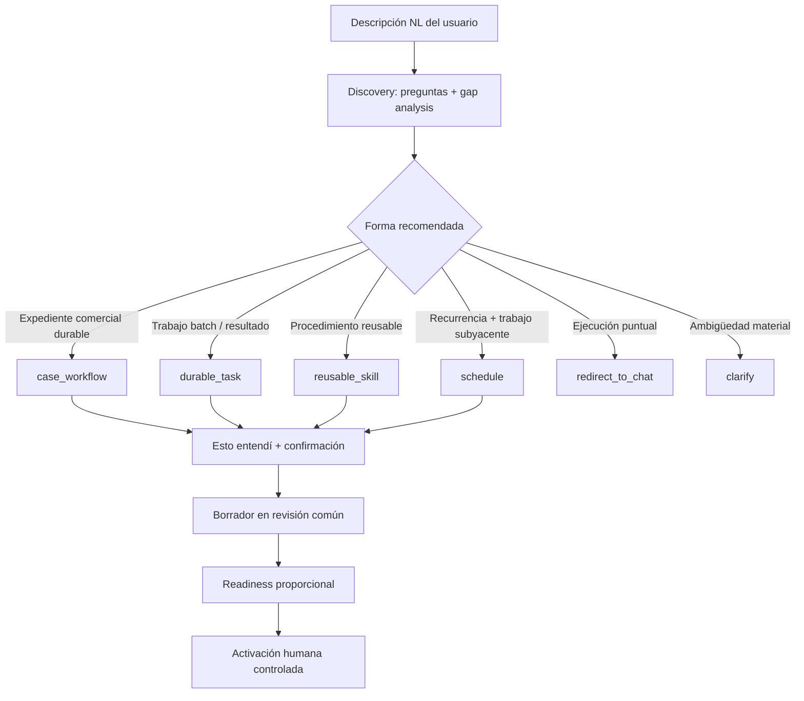
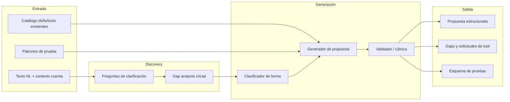

# Visión: autoría de casos de uso y skills desde lenguaje natural

> **Estado:** v1.2 — visión alineada con Studio Slice 5.3.1; N5 laboratorio E2E controlado ya implementado.
>
> **Documentos relacionados**
> - [`authoring-playbook.md`](authoring-playbook.md) — **playbook obligatorio** para diseñar pasos, habilidad raíz, `current_step` y pruebas.
> - [`testing-framework.md`](testing-framework.md) — marco operativo N0–N5 para validar lo que se proponga o implemente.
> - [`operational-case-reusable-patterns.md`](operational-case-reusable-patterns.md) — **catálogo de patrones** reutilizables (runtime, N3/N4, UI).
> - [`architecture.md`](architecture.md) — subsistema de casos operacionales.
> - [`../skills-tools-architecture.md`](../skills-tools-architecture.md) — skills, tools, wrappers, HITL.
> - Skill global `skills/global/skill-authoring/SKILL.md` — contrato del agente de autoría.
> - Código: [`apps/web/src/lib/operational-cases/test-patterns-catalog.ts`](../../apps/web/src/lib/operational-cases/test-patterns-catalog.ts)

---

## 1. Resumen ejecutivo

La meta es que un usuario inmobiliario describa un proceso en **lenguaje natural** y el sistema devuelva una **propuesta implementable** — no activación automática — con:

- **discovery primero:** preguntas de clarificación y análisis de gaps antes de etiquetar la forma;
- clasificación gobernada (`case_workflow | durable_task | reusable_skill |
  schedule`; `clarify | redirect_to_chat` no crean artefacto);
- pasos, skills compuestas y atómicas, tools por paso;
- mecanismos (HITL, esperas externas, recordatorios, deadlines);
- esquema de pruebas alineado al [marco N0–N5](testing-framework.md) o [Skill Lab](../skills-tools-architecture.md#12-skill-lab--readiness-para-skills-sin-caso-operacional);
- gaps explícitos contra el catálogo existente.

**Principio de producto:** discovery → propuesta → revisión humana → pruebas de readiness proporcionales → activación controlada.

**Principio UX:** no presentar al usuario un fork técnico («¿caso operacional o skill?») como primera pantalla. El sistema infiere la forma, explica en lenguaje de negocio y solo pide aclaración cuando hay ambigüedad (esperas, participantes externos, persistencia multi-día).

La superficie primaria es **Studio → Diseño**. Ajustes conserva laboratorios,
editores avanzados y configuración; no mantiene una doctrina de autoría
paralela.

---

## 2. Problema que resuelve

Hoy crear un caso operacional nuevo implica:

1. Conocer el contrato de `operational_case_types` (`operational_flow_jsonb`, `activation_policy_jsonb`, `intake_schema_jsonb`).
2. Escribir o derivar una skill compuesta (`property-optioning-coach` style).
3. Declarar tools por paso y configurar readiness manualmente.
4. Diseñar pruebas ad hoc sin marco común.

La visión reduce la fricción inicial: el usuario describe **qué debe pasar en el negocio**; el sistema propone **cómo encajarlo en Gu OS** y **cómo probarlo**.

---

## 3. Destinos gobernados (no todo es caso operacional)

Un error común en plataformas agenticas es forzar todo flujo a un «caso» multi-día. Gu OS debe clasificar primero:



### 3.1 Caso operacional

**Cuándo aplica:**

- dura horas o días;
- hay participantes humanos externos (propietario, fotógrafo, portal);
- el estado debe persistir entre turnos de chat;
- hay esperas, recordatorios, escalamiento;
- intervienen tools de medio/alto riesgo con HITL;
- el negocio necesita trazabilidad por instancia (`operational_cases`).

**Artefactos:** `operational_case_types`, skill compuesta default, `operational_flow_jsonb`, política de activación, assets requeridos, caso de prueba.

**Ejemplo:** `property_optioning` — opcionar propiedad hasta paquete publicable.

### 3.2 Skill de un turno (sin caso)

**Cuándo aplica:**

- el usuario pide algo que se resuelve en una conversación;
- no hay espera multi-día ni estado de instancia;
- riesgo bajo o medio con HITL inline;
- puede ser skill compuesta pero ejecutable en un solo turno o pocos tool loops.

**Artefactos:** `SKILL.md` (global o `account_skills`), `allowed_tools`, guardrails, evals sugeridos.

**Readiness:** Skill Lab ([`skills-tools-architecture.md`](../skills-tools-architecture.md) §12) — rúbrica, evals, N1 opcional en integraciones; **no** N4/N5.

**Ejemplos:** redactar follow-up a un lead, consultar inventario con `company-data`, preparar borrador de correo, checklist heartbeat item.

### 3.3 Señales para el clasificador

| Señal | Tiende a caso | Tiende a skill |
|-------|---------------|----------------|
| «Esperar respuesta del cliente/propietario» | ✓ | |
| «Recordar en 48h si no responde» | ✓ | |
| «Publicar en portal / enviar Telegram real» | ✓ (con N2) | |
| «Dame un resumen / redacta / busca comparables ahora» | | ✓ |
| «Aprobar antes de enviar» (HITL en turno) | ambos | ambos |
| Múltiples pasos con artefactos acumulados | ✓ | |

El clasificador puede empezar **híbrido**: reglas + LLM con salida estructurada y confianza explícita.

---

## 4. Pipeline de autoría propuesto



### 4.1 Entrada y discovery

- Descripción del proceso en lenguaje natural.
- **Preguntas automáticas** cuando falte: ¿esperas respuesta externa?, ¿cuánto dura?, ¿quién aprueba?, ¿persiste entre días?
- Opcional: lista de campos a capturar, participantes, plazos, integraciones mencionadas.
- Contexto de cuenta: skills/tools ya habilitadas, credenciales, assets.
- Gap analysis contra `TOOL_CATALOG` y registry **antes** de proponer `case_type` o skill slug.

### 4.2 Salida estructurada (contrato objetivo)

```typescript
// Contrato conceptual — no implementado como tipo único aún
interface UseCaseProposal {
  // Discovery
  clarifyingQuestions?: string[];
  discoveryComplete: boolean;

  provisionalKind: "case_workflow" | "durable_task" | "reusable_skill" | "schedule" | "clarify" | "redirect_to_chat";
  finalKind: UseCaseProposal["provisionalKind"];
  skillSubtype?: "simple" | "composite";
  confidence: "high" | "medium" | "low";
  rationale: string;
  recommendedReadiness: "operational_n0_n5" | "skill_lab" | "durable_task_acceptance" | "schedule_readiness";
  coveredDimensions: Array<{
    key: string;
    status: "covered" | "partial" | "missing";
    evidence: Array<{ source: "description" | "answer"; answerIndex?: number; quote: string }>;
  }>;
  understanding: {
    objective: string;
    sources: string[];
    actors: string[];
    decisions: string[];
    effects: string[];
    capabilities: string[];
    acceptanceCriteria: string[];
    assumptions: string[];
    gaps: string[];
  };

  displayName: string;
  caseType?: string;
  defaultSkillSlug?: string;

  intakeSchema?: FieldDefinition[];
  operationalFlow?: FlowStep[];
  activationPolicy?: ActivationPolicy;

  skillDraft?: string; // SKILL.md
  validationRubric: RubricItem[];
  suggestedEvals: Record<string, unknown>;

  // Operational case only
  testPlan?: {
    n0: string[];
    steps: Array<{
      stepKey: string;
      patterns: string[];
      n3Skills?: string[];
      n4Scenarios?: string[];
    }>;
    runtimePatterns?: string[];
    uiPatterns?: string[];
  };

  // Single-turn skill only
  skillLabChecklist?: {
    meceCheck: string;
    evalsRequired: { positive: number; nearMiss: number };
    integrationN1?: string[];
  };

  gaps: {
    missingTools: string[];
    missingSkills: string[];
    missingAssets: string[];
    missingCredentials: string[];
  };

  activationRecommendation: "do_not_activate" | "activate_after_tests" | "skill_only";
}
```

### 4.3 Revisión humana obligatoria

Nada de lo generado se activa sin:

1. Confirmación explícita de `Esto entendí` antes de escribir.
2. Revisión común en Diseño; formulario/JSON/SKILL.md avanzado como acción posterior.
3. Rúbrica sin ítems `FAIL` bloqueantes.
4. Batería de readiness según [`testing-framework.md`](testing-framework.md).

---

## 5. Estado actual vs brecha

### 5.1 Lo que ya existe

| Capacidad | Ubicación | Madurez |
|-----------|-----------|---------|
| Borrador básico heurístico | `generateDraft()` en `operational-case-types-client.tsx` | Baja — plantilla genérica |
| Generación asistida LLM | `POST /api/skill-authoring` + skill `skill-authoring` | Media — skill, flow, rúbrica, evals |
| Propuesta heartbeat NL | `generateHeartbeatChecklistProposal()` en `packages/agent/src/heartbeat/checklist.ts` | Baja — reglas/heurísticas |
| UI readiness N1/N2/N3 | Preparación operativa | Media-alta — patrones concretos |
| Playbook paso / habilidad / estado | [`authoring-playbook.md`](authoring-playbook.md) | v1.0 |
| Marco de prueba documentado | [`testing-framework.md`](testing-framework.md) | v1.2 (N0–N5; N5 lab controlado) |
| Skill Lab documentado | [`skills-tools-architecture.md`](../skills-tools-architecture.md) §12 | v1 |
| Catálogo tools/skills | `TOOL_CATALOG`, registry global + account | Alta |
| Caso piloto referencia | `property_optioning` | Alta — plantilla de realidad |
| Router de artefactos | `authoring-router.ts` | Implementado en Slice 5.3 |
| Discovery + confirmación | `/api/studio-authoring` + `authoring-discovery.ts` | Slice 5.3.1 |
| Revisión común | Studio → Diseño | Slice 5.3.1 |

### 5.2 Brechas principales

| # | Brecha | Impacto |
|---|--------|---------|
| 1 | Clasificador sin discovery semántico | **Cerrada en 5.3.1:** el router es señal; discovery siempre corre antes de confirmar |
| 2 | Patrones N2 sólo en código React | No generables automáticamente desde flow — ver catálogo [`operational-case-reusable-patterns.md`](operational-case-reusable-patterns.md) y `test-patterns-catalog.ts` (v1 documental) |
| 3 | `testPlan` no es salida de skill-authoring | Operador diseña pruebas manualmente — esquema ejemplo en catálogo §9 |
| 4 | `tested_ok` por ejecución suelta | Falsa sensación de cobertura |
| 5 | Sin consumo UI de `test_pattern` en flow | Catálogo TS listo; falta enlazar React (anillo 2b) |
| 6 | Heartbeat NL y case authoring desconectados | Dos heurísticas distintas |

---

## 6. Roadmap por anillos

### Anillo 1 — Fundamentos (actual → completado)

- [x] Patrones UI N1/N2/N3 en `property_optioning`.
- [x] Reglas visuales y invalidación A/B/C.
- [x] Documentación [`testing-framework.md`](testing-framework.md).
- [ ] Batería manual piloto anotada con gaps reales.

**Entregable:** un case type de referencia probado de punta a punta con el marco.

### Anillo 2 — Patrones declarativos

- [x] v1 documental: [`operational-case-reusable-patterns.md`](operational-case-reusable-patterns.md) + [`test-patterns-catalog.ts`](../../apps/web/src/lib/operational-cases/test-patterns-catalog.ts).
- [ ] Referenciar `test_pattern` en `operational_flow_jsonb.skill_tools[]`.
- [ ] UI lee metadata antes de hardcodear `isEasyBrokerCreateScenario`, etc.

**Entregable:** añadir un patrón nuevo actualizando catálogo + TS; luego sin tocar lógica React repetitiva.

### Anillo 3 — Autoría asistida ampliada (implementado en Studio 5.3.1)

- Doctrina compartida entre `/api/skill-authoring` y `/api/studio-authoring`.
- Discovery model-backed con evidencia y gaps contra catálogos reales.
- Confirmación humana antes de materializar.

**Entregable:** NL → propuesta estructurada + plan de prueba en un flujo.

### Anillo 4 — Clasificación y revisión unificadas (implementado; activación sigue gobernada)

- Router de seis destinos con explicación al usuario.
- Materialización separada para workflow, durable task, reusable skill y schedule.
- Revisión común en Diseño; editor/validación/publicación/activación posteriores.
- Métricas: tasa de aceptación de propuestas, tiempo hasta activación, fallos post-activación.

**Entregable:** experiencia unificada «Describe algo nuevo» en Studio → Diseño.

### Anillo 5 — E2E y mejora continua (largo plazo)

- N4 (prueba de paso) ampliado con más escenarios por case type.
- N5 batería automatizada multi-tick (laboratorio controlado manual **ya implementado**).
- Evals en CI derivados de `suggestedEvals`.
- Feedback loop: fallos en producción → actualización de patrones/rúbrica.

---

## 7. Relación con componentes existentes

### 7.1 `skill-authoring`

Skill **proposal-only** y doctrina compartida. Debe seguir evolucionando para:

- consumir catálogo de patrones de prueba;
- emitir `testPlan` anotado;
- clasificar forma con justificación;
- nunca escribir archivos ni activar skills/casos.

Ver guardrails en `skills/global/skill-authoring/SKILL.md`.

### 7.2 Studio Diseño — UI de autoría

Hoy:

- `Revisar solicitud` ejecuta router provisional + discovery model-backed.
- Las respuestas y `Esto entendí` persisten en `studio_authoring_sessions`.
- `Crear borrador` exige confirmación con hash vigente e idempotencia.
- Los cuatro artefactos aterrizan en revisión común; Ajustes es editor avanzado.

Sigue faltando ampliar el render de `testPlan` y enlazar cada ítem del plan a
su readiness específica.

### 7.3 Heartbeat checklist NL

En Ajustes → «Generar propuesta desde lenguaje natural»:

- heurísticas sobre fuentes (`calendar`, `warehouse`, …) y skills candidatos;
- **no** es el mismo pipeline que casos operacionales.

**Convergencia futura:** Heartbeat puede consumir señales de la misma doctrina,
pero sigue siendo mecanismo runtime; no debe reaparecer como artefacto Studio.

### 7.4 Business Brain / GBrain

La visión de [`../brain/gbrain-evaluation-and-plan.md`](../brain/gbrain-evaluation-and-plan.md) (Pattern → Skill) es complementaria:

- GBrain: descubrir patrones repetidos en operación.
- Autoría NL: formalizar patrones nuevos declarados por el usuario.

Ambos deberían converger en el mismo registry de skills y el mismo marco de prueba.

---

## 8. Principios de diseño

1. **Intervención humana específica** — distinguir autorización de acción,
   decisión de negocio, contribución humana y revisión de excepción; nombrar
   quién decide qué y con qué evidencia.
2. **Reutilizar antes de inventar** — wrappers de negocio y tools globales antes de código nuevo.
3. **Prueba proporcional al riesgo y a la forma** — N0–N5 para casos; Skill
   Lab para reusable skills; aceptación/work runs para durable tasks; checks de
   recurrencia y trabajo subyacente para schedules.
4. **Discovery antes de clasificación final** — el router provisional nunca
   sustituye preguntas, evidencia y confirmación.
5. **Propuesta explícita sobre magia** — gaps, confianza y rúbrica visibles.
6. **Un solo lenguaje visual** — mismos colores y niveles en UI generada o manual ([§10 testing-framework](testing-framework.md#10-reglas-visuales-unificadas)).
7. **Global code, account configuration** — ver [`architecture.md`](architecture.md) §10.1.
8. **`step_key` = hito durable** — no un paso por habilidad **atómica**; la raíz orquesta dentro del hito ([`authoring-playbook.md`](authoring-playbook.md) §1).

---

## 9. Ejemplo ilustrativo

**Entrada NL:**

> «Cuando un propietario manda fotos por Telegram, quiero que se guarden, se extraigan datos de la escritura y si falta algo se le pregunte. Luego el asesor valida antes de buscar comparables.»

**Salida propuesta (resumida):**

| Campo | Valor |
|-------|-------|
| Clasificación | `case_workflow` (confianza alta) |
| Case type sugerido | `property_optioning` o variante privada |
| Pasos afectados | documentos + características |
| Tools | `operational_case_register_document`, `operational_case_extract_document_fields`, `telegram_send_message_to_contact`, `notify_user`, … |
| testPlan | N2 `documents_abc` + N2 `telegram_abc` + N3 por skill + N5 lab camino feliz |
| Gaps | verificar asset PDF de prueba, Telegram vinculado |

**Entrada NL alternativa:**

> «Redacta un mensaje de seguimiento amable para un lead que visitó ayer y no ha respondido.»

| Campo | Valor |
|-------|-------|
| Clasificación | `redirect_to_chat` si es puntual; `reusable_skill/simple` si el usuario confirma que debe reutilizarse |
| Skill sugerida | `lead-follow-up-draft` (existente) o variante account |
| testPlan | Skill Lab: rúbrica + 3 evals; sin caso operacional |
| recommendedReadiness | `skill_lab` |

---

## 10. Métricas de éxito (corto plazo)

| Métrica | Objetivo inicial |
|---------|------------------|
| Tiempo desde NL hasta propuesta revisable | < 5 min (asistido) |
| % propuestas aceptadas sin reescritura mayor | > 50% en anillo 3 |
| % tools del flow con patrón de prueba asignado | 100% en case types nuevos |
| Fallos post-activación por tool no probada | → 0 |
| Casos creados que debieron ser solo skill | < 10% (clasificador) |

---

## 11. Qué hacer ahora (secuencia recomendada)

1. Ejecutar las baterías #1/#2 de
   [`gu-os-studio-human-walkthrough.md`](../manuals/gu-os-studio-human-walkthrough.md).
2. Ampliar evals model-backed #1–#10 y pruebas de idempotencia/tenancy.
3. Completar render de `testPlan` y readiness por tipo sin duplicar N0–N5.
4. Continuar la batería general de Studio sólo cuando #1/#2 pasen.

---

## 12. Archivos de referencia

| Tema | Ubicación |
|------|-----------|
| UI primaria de autoría | `apps/web/src/app/operations/workflows/design/compile-form.tsx` |
| API Studio | `apps/web/src/app/api/studio-authoring/route.ts` |
| Discovery | `apps/web/src/lib/workflow-studio/authoring-discovery.ts` |
| Contrato puro | `packages/workflows/src/compiler/authoring-discovery.ts` |
| Laboratorio N0–N5 | `apps/web/src/app/settings/operational-case-types/operational-case-types-client.tsx` |
| API skill-authoring | `apps/web/src/app/api/skill-authoring/route.ts` |
| Skill authoring | `skills/global/skill-authoring/SKILL.md` |
| Heartbeat NL heurístico | `packages/agent/src/heartbeat/checklist.ts` |
| Marco de prueba | [`testing-framework.md`](testing-framework.md) |
| Catálogo de patrones | [`operational-case-reusable-patterns.md`](operational-case-reusable-patterns.md) |
| Patrones (TS) | [`test-patterns-catalog.ts`](../../apps/web/src/lib/operational-cases/test-patterns-catalog.ts) |
| Playbook de autoría | [`authoring-playbook.md`](authoring-playbook.md) |
| Arquitectura casos | [`architecture.md`](architecture.md) |
