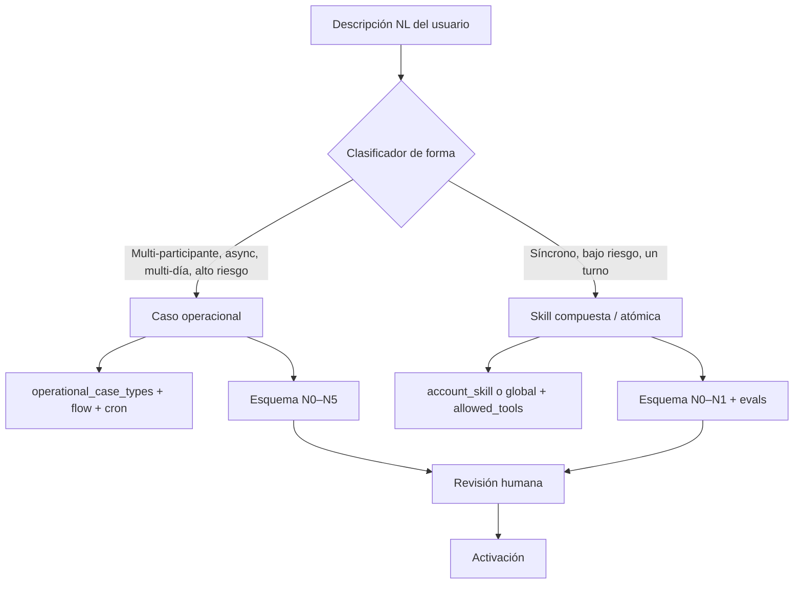
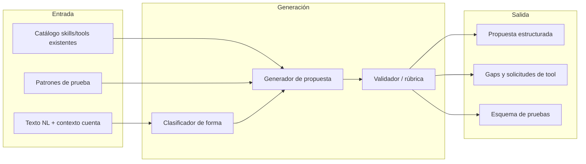

# Visión: autoría de casos de uso y skills desde lenguaje natural

> **Estado:** v1.0 — documento de visión y roadmap; no describe comportamiento ya implementado al 100%.
>
> **Documentos relacionados**
> - [`authoring-playbook.md`](authoring-playbook.md) — **playbook obligatorio** para diseñar pasos, habilidad raíz, `current_step` y pruebas.
> - [`testing-framework.md`](testing-framework.md) — marco operativo N0–N5 para validar lo que se proponga o implemente.
> - [`architecture.md`](architecture.md) — subsistema de casos operacionales.
> - [`../skills-tools-architecture.md`](../skills-tools-architecture.md) — skills, tools, wrappers, HITL.
> - Skill global `skills/global/skill-authoring/SKILL.md` — contrato del agente de autoría.

---

## 1. Resumen ejecutivo

La meta es que un usuario inmobiliario describa un proceso en **lenguaje natural** y el sistema devuelva una **propuesta implementable** — no activación automática — con:

- clasificación de forma (caso operacional vs skill de un turno);
- pasos, skills compuestas y atómicas, tools por paso;
- mecanismos (HITL, esperas externas, recordatorios, deadlines);
- esquema de pruebas alineado al [marco N0–N5](testing-framework.md) y al [playbook de autoría](authoring-playbook.md);
- gaps explícitos contra el catálogo existente.

**Principio de producto:** propuesta → revisión humana → pruebas de readiness → activación controlada.

Esto extiende lo que hoy existe en Ajustes (borrador básico, `skill-authoring`, heartbeat checklist) hacia un pipeline coherente de **autoría asistida**.

---

## 2. Problema que resuelve

Hoy crear un caso operacional nuevo implica:

1. Conocer el contrato de `operational_case_types` (`operational_flow_jsonb`, `activation_policy_jsonb`, `intake_schema_jsonb`).
2. Escribir o derivar una skill compuesta (`property-optioning-coach` style).
3. Declarar tools por paso y configurar readiness manualmente.
4. Diseñar pruebas ad hoc sin marco común.

La visión reduce la fricción inicial: el usuario describe **qué debe pasar en el negocio**; el sistema propone **cómo encajarlo en Gu OS** y **cómo probarlo**.

---

## 3. Dos formas de destino (no todo es caso operacional)

Un error común en plataformas agenticas es forzar todo flujo a un «caso» multi-día. Gu OS debe clasificar primero:



### 3.1 Caso operacional

**Cuándo aplica:**

- dura horas o días;
- hay participantes humanos externos (propietario, fotógrafo, portal);
- el estado debe persistir entre turnos de chat;
- hay esperas, recordatorios, escalamiento;
- intervienen tools de medio/alto riesgo con HITL;
- el negocio necesita trazabilidad por instancia (`operational_cases`).

**Artefactos:** `operational_case_types`, skill compuesta default, `operational_flow_jsonb`, política de activación, assets requeridos, caso de prueba.

**Ejemplo:** `property_optioning` — opcionar propiedad hasta paquete publicable.

### 3.2 Skill de un turno (sin caso)

**Cuándo aplica:**

- el usuario pide algo que se resuelve en una conversación;
- no hay espera multi-día ni estado de instancia;
- riesgo bajo o medio con HITL inline;
- puede ser skill compuesta pero ejecutable en un solo turno o pocos tool loops.

**Artefactos:** `SKILL.md` (global o `account_skills`), `allowed_tools`, guardrails, evals sugeridos.

**Ejemplos:** redactar follow-up a un lead, consultar inventario con `company-data`, preparar borrador de correo, checklist heartbeat item.

### 3.3 Señales para el clasificador

| Señal | Tiende a caso | Tiende a skill |
|-------|---------------|----------------|
| «Esperar respuesta del cliente/propietario» | ✓ | |
| «Recordar en 48h si no responde» | ✓ | |
| «Publicar en portal / enviar Telegram real» | ✓ (con N2) | |
| «Dame un resumen / redacta / busca comparables ahora» | | ✓ |
| «Aprobar antes de enviar» (HITL en turno) | ambos | ambos |
| Múltiples pasos con artefactos acumulados | ✓ | |

El clasificador puede empezar **híbrido**: reglas + LLM con salida estructurada y confianza explícita.

---

## 4. Pipeline de autoría propuesto



### 4.1 Entrada

- Descripción del proceso en lenguaje natural.
- Opcional: lista de campos a capturar, participantes, plazos, integraciones mencionadas.
- Contexto de cuenta: skills/tools ya habilitadas, credenciales, assets.

### 4.2 Salida estructurada (contrato objetivo)

```typescript
// Contrato conceptual — no implementado como tipo único aún
interface UseCaseProposal {
  classification: "operational_case" | "single_turn_skill" | "hybrid_review";
  confidence: number;
  rationale: string;

  displayName: string;
  caseType?: string;
  defaultSkillSlug?: string;

  intakeSchema?: FieldDefinition[];
  operationalFlow?: FlowStep[];
  activationPolicy?: ActivationPolicy;

  skillDraft?: string; // SKILL.md
  validationRubric: RubricItem[];
  suggestedEvals: Record<string, unknown>;

  testPlan: {
    n0: string[];  // prep checklist
    steps: Array<{
      stepKey: string;
      tools: Array<{
        toolId: string;
        pattern: "n1_single" | "n2_abc" | "n2_ab" | "telegram_abc" | "easybroker_ab" | "documents_abc";
        subSteps?: Array<{ key: "A" | "B" | "C"; description: string }>;
      }>;
      skillE2E: boolean;
    }>;
  };

  gaps: {
    missingTools: string[];
    missingSkills: string[];
    missingAssets: string[];
    missingCredentials: string[];
  };

  activationRecommendation: "do_not_activate" | "activate_after_tests" | "skill_only";
}
```

### 4.3 Revisión humana obligatoria

Nada de lo generado se activa sin:

1. Edición en UI (formulario + JSON avanzado + SKILL.md).
2. Rúbrica sin ítems `FAIL` bloqueantes (ya parcialmente implementado en Casos de uso).
3. Batería de readiness según [`testing-framework.md`](testing-framework.md).

---

## 5. Estado actual vs brecha

### 5.1 Lo que ya existe

| Capacidad | Ubicación | Madurez |
|-----------|-----------|---------|
| Borrador básico heurístico | `generateDraft()` en `operational-case-types-client.tsx` | Baja — plantilla genérica |
| Generación asistida LLM | `POST /api/skill-authoring` + skill `skill-authoring` | Media — skill, flow, rúbrica, evals |
| Propuesta heartbeat NL | `generateHeartbeatChecklistProposal()` en `packages/agent/src/heartbeat/checklist.ts` | Baja — reglas/heurísticas |
| UI readiness N1/N2/N3 | Preparación operativa | Media-alta — patrones concretos |
| Playbook paso / habilidad / estado | [`authoring-playbook.md`](authoring-playbook.md) | v1.0 |
| Marco de prueba documentado | [`testing-framework.md`](testing-framework.md) | v1.1 (N0–N5) |
| Catálogo tools/skills | `TOOL_CATALOG`, registry global + account | Alta |
| Caso piloto referencia | `property_optioning` | Alta — plantilla de realidad |

### 5.2 Brechas principales

| # | Brecha | Impacto |
|---|--------|---------|
| 1 | Sin clasificador caso vs skill | Propuestas sobredimensionadas o subdimensionadas |
| 2 | Patrones N2 sólo en código React | No generables automáticamente desde flow |
| 3 | `testPlan` no es salida de skill-authoring | Operador diseña pruebas manualmente |
| 4 | `tested_ok` por ejecución suelta | Falsa sensación de cobertura |
| 5 | Sin catálogo machine-readable de patrones | Duplicación al añadir case types |
| 6 | Heartbeat NL y case authoring desconectados | Dos heurísticas distintas |

---

## 6. Roadmap por anillos

### Anillo 1 — Fundamentos (actual → completado)

- [x] Patrones UI N1/N2/N3 en `property_optioning`.
- [x] Reglas visuales y invalidación A/B/C.
- [x] Documentación [`testing-framework.md`](testing-framework.md).
- [ ] Batería manual piloto anotada con gaps reales.

**Entregable:** un case type de referencia probado de punta a punta con el marco.

### Anillo 2 — Patrones declarativos

- Definir catálogo `TEST_PATTERNS` (JSON/TS) con:
  - `id`, `applies_to_tools`, `sub_steps`, `gating_rules`, `invalidation_rules`, `risk_level`.
- Referenciar `test_pattern` en `operational_flow_jsonb.skill_tools[]`.
- UI lee metadata antes de hardcodear `isEasyBrokerCreateScenario`, etc.

**Entregable:** añadir un patrón nuevo sin tocar lógica React repetitiva.

### Anillo 3 — Autoría asistida ampliada

- Extender `/api/skill-authoring` (o endpoint hermano) para emitir `testPlan` + `classification`.
- Validador de gaps contra `TOOL_CATALOG` y skills registry.
- UI Casos de uso: pestaña «Propuesta» con checklist N0–N5 generado editable (N4/N5 según madurez).

**Entregable:** NL → propuesta estructurada + plan de prueba en un flujo.

### Anillo 4 — Clasificación y activación inteligente

- Clasificador caso vs skill con explicación al usuario.
- Rama «solo skill»: crea/actualiza `account_skill` sin `operational_case_types`.
- Rama «caso»: pipeline completo actual.
- Métricas: tasa de aceptación de propuestas, tiempo hasta activación, fallos post-activación.

**Entregable:** experiencia unificada «Describe tu proceso» en Ajustes.

### Anillo 5 — E2E y mejora continua (largo plazo)

- N4 (prueba de paso) y N5 (caso E2E) automatizados por case type.
- Evals en CI derivados de `suggestedEvals`.
- Feedback loop: fallos en producción → actualización de patrones/rúbrica.

---

## 7. Relación con componentes existentes

### 7.1 `skill-authoring`

Skill **proposal-only**. Debe evolucionar para:

- consumir catálogo de patrones de prueba;
- emitir `testPlan` anotado;
- clasificar forma con justificación;
- nunca escribir archivos ni activar skills/casos.

Ver guardrails en `skills/global/skill-authoring/SKILL.md`.

### 7.2 Casos de uso — UI de autoría

Hoy:

- «Generar borrador básico» — fallback local.
- «Generar borrador optimizado» — stream NDJSON de skill-authoring.
- Texto de ayuda: «Describe el proceso en lenguaje natural…».

Falta:

- render del `testPlan` generado;
- vista de clasificación caso vs skill;
- enlace directo desde cada ítem del plan a la tool en Preparación operativa.

### 7.3 Heartbeat checklist NL

En Ajustes → «Generar propuesta desde lenguaje natural»:

- heurísticas sobre fuentes (`calendar`, `warehouse`, …) y skills candidatos;
- **no** es el mismo pipeline que casos operacionales.

**Convergencia futura:** módulo compartido `inferOperationalIntent(text)` usado por heartbeat y case authoring, con ramas distintas post-clasificación.

### 7.4 Business Brain / GBrain

La visión de [`../brain/gbrain-evaluation-and-plan.md`](../brain/gbrain-evaluation-and-plan.md) (Pattern → Skill) es complementaria:

- GBrain: descubrir patrones repetidos en operación.
- Autoría NL: formalizar patrones nuevos declarados por el usuario.

Ambos deberían converger en el mismo registry de skills y el mismo marco de prueba.

---

## 8. Principios de diseño

1. **Human-in-the-loop siempre** en activación de casos y skills con side effects.
2. **Reutilizar antes de inventar** — wrappers de negocio y tools globales antes de código nuevo.
3. **Prueba proporcional al riesgo** — no exigir wizard A/B/C a una consulta read-only.
4. **Propuesta explícita sobre magia** — gaps, confianza y rúbrica visibles.
5. **Un solo lenguaje visual** — mismos colores y niveles en UI generada o manual ([§9 testing-framework](testing-framework.md#9-reglas-visuales-unificadas)).
6. **Global code, account configuration** — ver [`architecture.md`](architecture.md) §10.1.

---

## 9. Ejemplo ilustrativo

**Entrada NL:**

> «Cuando un propietario manda fotos por Telegram, quiero que se guarden, se extraigan datos de la escritura y si falta algo se le pregunte. Luego el asesor valida antes de buscar comparables.»

**Salida propuesta (resumida):**

| Campo | Valor |
|-------|-------|
| Clasificación | `operational_case` (confianza 0.92) |
| Case type sugerido | `property_optioning` o variante privada |
| Pasos afectados | documentos + características |
| Tools | `operational_case_register_document`, `operational_case_extract_document_fields`, `telegram_send_message_to_contact`, `notify_user`, … |
| testPlan | N2 `documents_abc` + N2 `telegram_abc` + N3 por skill |
| Gaps | verificar asset PDF de prueba, Telegram vinculado |

**Entrada NL alternativa:**

> «Redacta un mensaje de seguimiento amable para un lead que visitó ayer y no ha respondido.»

| Campo | Valor |
|-------|-------|
| Clasificación | `single_turn_skill` |
| Skill sugerida | `lead-follow-up-draft` (existente) o variante account |
| testPlan | N0 opcional + N1 eval de tono; sin caso operacional |

---

## 10. Métricas de éxito (corto plazo)

| Métrica | Objetivo inicial |
|---------|------------------|
| Tiempo desde NL hasta propuesta revisable | < 5 min (asistido) |
| % propuestas aceptadas sin reescritura mayor | > 50% en anillo 3 |
| % tools del flow con patrón de prueba asignado | 100% en case types nuevos |
| Fallos post-activación por tool no probada | → 0 |
| Casos creados que debieron ser solo skill | < 10% (clasificador) |

---

## 11. Qué hacer ahora (secuencia recomendada)

1. Ejecutar batería manual de `property_optioning` con [`testing-framework.md`](testing-framework.md).
2. Registrar gaps en issues o en §13 de ese documento.
3. Diseñar esquema `test_pattern` en JSON (anillo 2) a partir de patrones ya codificados.
4. Extender skill-authoring para emitir `testPlan` (anillo 3).
5. Solo entonces unificar entrada NL «Describe tu proceso» con clasificador (anillo 4).

---

## 12. Archivos de referencia

| Tema | Ubicación |
|------|-----------|
| UI autoría + readiness | `apps/web/src/app/settings/operational-case-types/operational-case-types-client.tsx` |
| API skill-authoring | `apps/web/src/app/api/skill-authoring/route.ts` |
| Skill authoring | `skills/global/skill-authoring/SKILL.md` |
| Heartbeat NL heurístico | `packages/agent/src/heartbeat/checklist.ts` |
| Marco de prueba | [`testing-framework.md`](testing-framework.md) |
| Playbook de autoría | [`authoring-playbook.md`](authoring-playbook.md) |
| Arquitectura casos | [`architecture.md`](architecture.md) |
