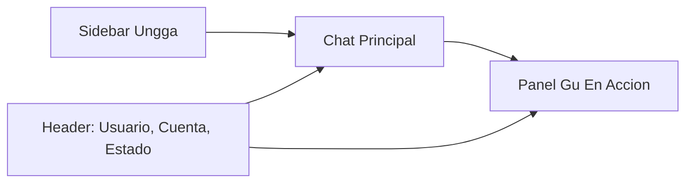

# Plan De Consola Gu

## Objetivo

Convertir la web actual de chat, ajustes y memoria en una experiencia de escritorio tipo consola de Gu: mas moderna, mas alineada a Ungga y capaz de mostrar progresivamente que hace el agente.

## Enfoque Recomendado

El rediseño se trabajara por fases para no bloquear la mejora visual con la instrumentacion avanzada.

### Fase 1: UI Shell Y Chat Mejorado — entregado

- Crear una estructura visual consistente para la app web: sidebar, header, fondo, cards y lenguaje visual Ungga.
- Redisenar `/chat` como pantalla principal de consola.
- Resolver el auto-scroll inicial en `apps/web/src/app/chat/chat-interface.tsx`.
- Integrar mejor el avatar o imagen de Gu que ya viene de `business_brain.agent_identity`.
- Mantener el backend actual request/response para reducir riesgo.

### Fase 2: Panel "Gu En Accion" Con Datos Existentes — entregado (con refinamientos futuros)

- Agregar un panel derecho en chat con estado del agente, confirmaciones pendientes, herramientas recientes y memorias relevantes.
- Usar datos ya existentes de `agent_messages`, `tool_calls` y `memories`.
- No mostrar razonamiento interno crudo; mostrar estados operativos curados.
- Refuerzo por turno: correlacion `turn_id` en mensajes y tool calls; respuesta de `/api/chat` con `memoryUsed` (corto/largo plazo y previews legibles) y secciones de Flujo, Habilidades, Herramientas, Aprendizajes recientes.
- La caja expandible de contexto base debe separar lo pre-turno de la evidencia del turno: Business Brain cargado, habilidades disponibles para seleccion y herramientas configuradas van en "Contexto preparado"; skill elegida, tools ejecutadas y memoria aplicada van en las tarjetas del turno. El modelo canonico esta documentado en `docs/business-brain-evolution-roadmap.md` ("Skill selection and tool availability model").
- Evaluar una API dedicada "activity snapshot" agregada (hoy: datos de sesion + payload del turno en el propio flujo de chat); sin streaming todavia.
- Preparar el panel para mostrar presencia del colaborador: voz, adjuntos, actividad proactiva y estado de heartbeat (Fase 4 / paralelo).

### Fase 3: Eventos En Vivo / Streaming Operativo

- Disenar una tabla o canal de eventos tipo `agent_turn_events` para registrar pasos del turno.
- Exponer eventos por SSE o stream HTTP desde `/api/chat` o una ruta paralela.
- Emitir eventos como memoria cargada, herramienta iniciada, herramienta completada, confirmacion requerida y turno terminado.
- Evaluar Langfuse como observabilidad tecnica complementaria, no como UI final para el usuario.

### Fase 4: Interaccion Multimodal Y Presencia

- Agregar voz en tiempo real para hablar con el colaborador como una persona disponible.
- Agregar mensajes de voz asincronos estilo WhatsApp.
- Permitir adjuntar files, imagenes y videos para dar contexto al agente.
- Representar el heartbeat del colaborador: actividad proactiva, ciclos programados, revisiones pendientes y avisos autonomos.
- Diferenciar claramente entre actividad iniciada por el usuario y actividad iniciada por el colaborador.

## Layout Propuesto Para Desktop

- **Sidebar:** Chat, Actividad, Memoria, Herramientas, Integraciones, Ajustes.
- **Chat central:** conversacion, input fijo, confirmaciones HITL integradas.
- **Input multimodal:** texto, adjuntos, mensaje de voz y futura voz en tiempo real.
- **Panel derecho:** Gu visual, estado, tools recientes, memoria, checklist de trabajo, heartbeat y presencia.
- **Admin futuro:** selector de usuario/cuenta arriba cuando `is_ungga_admin` aplique.

## Archivos Clave

- `apps/web/src/app/chat/page.tsx`: carga inicial del chat, perfil, sesion y mensajes.
- `apps/web/src/app/chat/chat-interface.tsx`: UI del chat, scroll, input y confirmaciones.
- `apps/web/src/app/settings/page.tsx`: pantalla actual de ajustes.
- `apps/web/src/app/settings/settings-form.tsx`: configuracion de perfil, IA, tools, skills e integraciones.
- `apps/web/src/app/memory/page.tsx`: entrada a memorias.
- `apps/web/src/app/globals.css`: tokens visuales globales.
- `apps/web/src/app/api/chat/route.ts`: endpoint actual request/response.

## Decisiones De Producto

- La consola normal sera por usuario/cuenta autenticada.
- La vista admin sera una fase separada con selector de cuenta y controles de auditoria.
- La UI no expondra chain-of-thought; expondra actividad operativa comprensible.
- La UI no debe insinuar que todas las habilidades o herramientas estan cargadas en el prompt antes de una solicitud. Debe distinguir: contexto base persistente, habilidades candidatas, herramientas configuradas, habilidad seleccionada del turno, herramientas ejecutadas y memoria aplicada.
- La UI de producto debe leer de datos persistidos y seguros (`agent_messages`, `tool_calls`, `memories` o futuras tablas de eventos). Los logs (`turn_summary.log`, `memory.log`, `compaction.log`) son para debug/desarrollo, no para la experiencia normal del usuario.
- Langfuse se considerara para trazas internas y debugging, no como reemplazo del panel de producto.
- El logo de la cuenta/inmobiliaria aparecera como identificador de marca; mientras no exista logo propio, se usara Ungga como default.
- El colaborador podra tener actividad proactiva via heartbeat, que debe mostrarse como presencia/actividad autonoma y no como mensaje manual del usuario.

## Estado Actual

- Completado (Fase 1): shell visual de `/chat`, header de marca/cuenta, avatar de colaborador, input con iconos de adjuntos/voz/envio, scroll independiente del chat y panel derecho; auto-scroll inicial del chat alineado al comportamiento esperado.
- Completado (Fase 2 en producto): panel derecho con Flujo, Contexto preparado expandible (Business Brain, habilidades disponibles para seleccion y herramientas configuradas), Memoria del turno (corto/largo plazo, previews expandibles cuando el backend los envia), Habilidades del turno, Herramientas del turno, Aprendizajes recientes (ultimas memorias activas por cuenta); correlacion por `turn_id` en mensajes y `tool_calls`; UI sin exponer chain-of-thought.
- Plan Cursor export emparejado: `.cursor/plans/gu_console_ui_3b083b6d.plan.md` (misma vision por fases; YAML de todos alineado a entregado vs Fase 3 pendiente).
- Pendiente Fase 2 (refinamiento): confirmaciones HITL mas ricas en panel, timeline de actividad de sesion mas alla del ultimo turno, mensajes anteriores/paginacion si el producto lo pide.
- Pendiente Fase 3: eventos en vivo/streaming operativo (`agent_turn_events` o equivalente, SSE/stream desde API).
- Pendiente Fase 4 / paralelo: presencia multimodal (voz, adjuntos, heartbeat visible) y vista admin Ungga con selector de cuenta/usuario.

## Historico — Primer Incremento

El primer entregable fue Fase 1 (shell + chat + panel basico + scroll). Esa base ya esta desplegada; las fases siguientes se documentan arriba.
